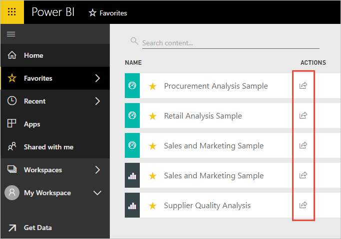
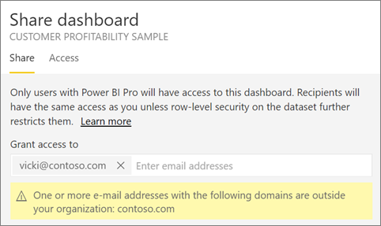
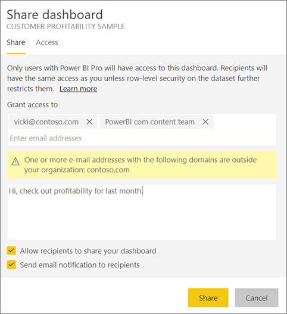
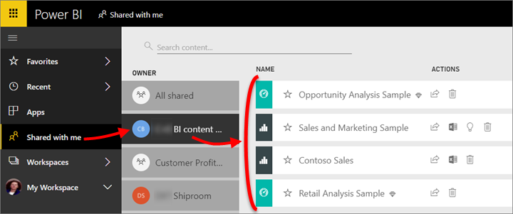
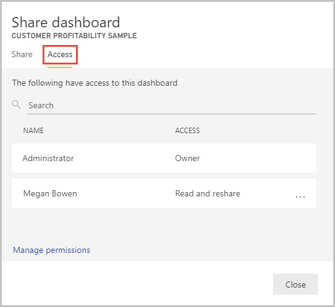
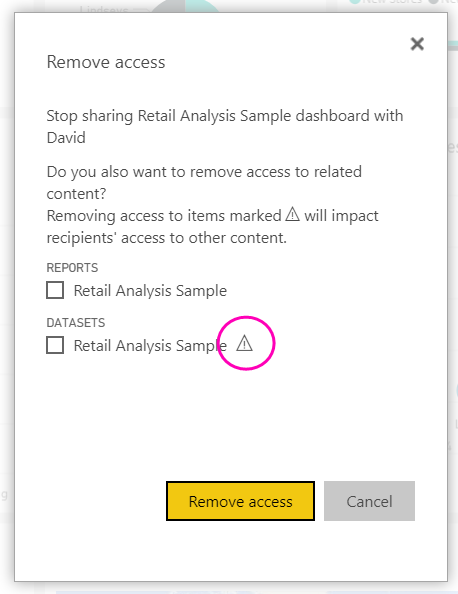
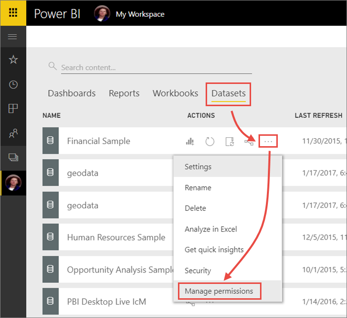
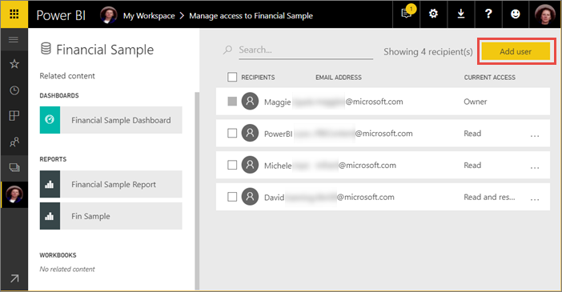
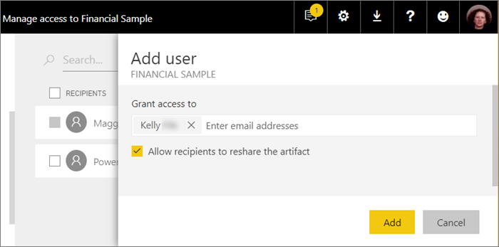
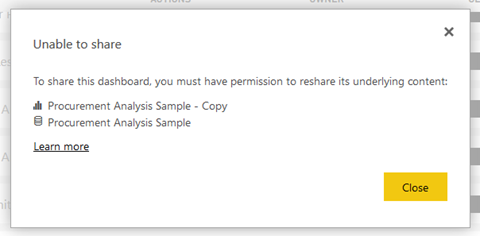

# Share your Power BI dashboards and reports with coworkers and others
*Sharing* is a good way to give a few people access to your dashboards and reports. Power BI also offers [several other ways to collaborate and distribute dashboards and reports](service-how-to-collaborate-distribute-dashboards-reports.md).

With sharing, whether you share content inside or outside your organization, you need a [Power BI Pro license](service-features-license-type.md). Your recipients also need Power BI Pro licenses, or the content needs to be in a [Premium capacity](service-premium.md). 

You can share dashboards and reports from most places in the Power BI service: your Favorites, Recent, Shared with me (if the owner allows it), My Workspace, or other workspaces. When you share a dashboard or report, those you share it with can view it and interact with it, but can't edit it. They see the same data that you see in the dashboard or report, unless [row-level security (RLS)](service-admin-rls.md) is applied. The coworkers you share with can also share with their coworkers, if you allow them to. The people outside your organization can view and interact with the dashboard or report too, but can't share it. 

You can also [share a dashboard from any of the Power BI mobile apps](consumer/mobile/mobile-share-dashboard-from-the-mobile-apps.md). You can share dashboards from the Power BI service and the Power BI mobile apps, but not from Power BI Desktop.

## Video: Share a dashboard
Watch Amanda share her dashboard with colleagues inside and outside her company. Then follow the step-by-step instructions below the video to try it out yourself.

<iframe width="560" height="315" src="https://www.youtube.com/embed/0tUwn8DHo3s?list=PL1N57mwBHtN0JFoKSR0n-tBkUJHeMP2cP" frameborder="0" allowfullscreen></iframe>

## Share a dashboard or report

1. In a list of dashboards or reports, or in an open dashboard or report, select **Share** .

1. In the top box, enter the full email addresses for individuals, distribution groups, or security groups. You can't share with dynamic distribution lists. 
   
   You can share with people whose addresses are outside your organization, but you'll see a warning.
   
    
 
3. Add a message if you want. It's optional.
4. To let your coworkers share your content with others, check **Allow recipients to share your dashboard/report**.
   
   Allowing others to share is called *resharing*. If you let them, they can reshare from the Power BI service and the mobile apps, or forward the email invitation to others in your organization. The invitation expires after one month. People outside your organization can't reshare. As the owner of the content, you can turn off resharing, or revoke resharing on an individual basis. See [Stop sharing or stop others from sharing](service-share-dashboards.md#stop-sharing-or-stop-others-from-sharing), below.

5. Select **Share.**
   
     
   
   Power BI sends an email invitation to the individuals but not to groups, with a link to the shared content. You see a **Success** notification. 
   
   When recipients in your organization click the link, Power BI adds the dashboard or report to their **Shared with me** list page. They can select your name to see all the content you've shared with them. 
   
   
   
   When recipients outside your organization click the link, they see the dashboard or report, but not in the usual Power BI portal. See [Share with people outside your organization](service-share-dashboards.md#share-a-dashboard-with-people-outside-your-organization) below for details.

## Who has access to a dashboard or report you shared?
Sometimes you need to see the people you've shared with, and see who they've shared it with.

1. In the list of dashboards and report, or in the dashboard or report itself, select **Share** . 
2. In the **Share dashboard/report** dialog box, select **Access**.
   
    
   
    People outside your organization are listed as **Guest**.

## Stop sharing or stop others from sharing
Only the dashboard or report owner can turn resharing on and off.

### If you haven't sent the sharing invitation yet
* Clear the **Allow recipients to share your dashboard/report** check box at the bottom of the invitation before you send it.

### If you've already shared the dashboard or report
1. In the list of dashboards and reports, or in the dashboard or report itself, select **Share** . 
2. In the **Share dashboard/report** dialog box, select **Access**.
   
    
3. Select the ellipsis (**...**) next to **Read and reshare** and select:
   
   
   
   * **Read** to keep that person from sharing with anyone else.
   * **Remove access** to keep that person from seeing the shared content at all.

4. In the **Remove access** dialog box, decide if you want to remove access to related content, too, such as reports and datasets. If you remove items with a warning icon , it's best to remove related content because it won't display properly.

    

## Share a dashboard or report with people outside your organization
When you share with people outside your organization, they get an email with a link to the shared dashboard or report, and they have to sign in to Power BI to see it. If they don't have a Power BI Pro license, they can sign up for a license after clicking the link.

After they sign in, they see the shared dashboard or report in its own browser window without the left navigation pane, not in their usual Power BI portal. They have to bookmark the link to access this dashboard or report in the future.

They can't edit any content in this dashboard or report. They can interact with the charts and change filters or slicers in the report, but can't save their changes.

Only your direct recipients can see the shared dashboard or report. For example, if you sent the email to Vicki@contoso.com, only Vicki can see the dashboard. No-one else can see that dashboard, even if they have the link, and Vicki has to use the same email address to access that dashboard. If she signs up with any other email address, she won't have access to the dashboard either.

People outside your organization can't see any data at all if role- or row-level security is implemented on on-premises Analysis Services tabular models.

If you send a link from a Power BI mobile app to people outside your organization, when they click the link the dashboard opens in a browser, not in the Power BI mobile app.

## Limitations and considerations
Things to keep in mind about sharing dashboards and reports:

* In general, you and your colleagues see the same data in the dashboard or report. Thus, if you have permissions to see more data than they do, they'll be able to see all your data in the dashboard or report. However, if [row-level security (RLS)](service-admin-rls.md) is applied to the dataset underlying a dashboard or report, then the credentials of every person are used to determine which data they can access.
* Everyone you share your dashboard with can see it and interact with the related reports in [Reading View](consumer/end-user-reading-view.md). They can't create reports or save changes to existing reports.
* No one can see or download the dataset, but they can access the dataset directly using the Analyze in Excel feature. An admin can restrict people’s ability to use Analyze in Excel by restricting the ability for everyone in a group. However, the restriction is for everyone in that group for every workspace the group belongs to.
* Everyone can manually [refresh the data](refresh-data.md).
* If you use Office 365 for email, you can share with members of a distribution group by entering the email address associated with the distribution group.
* Coworkers who have the same email domain as you, and coworkers whose domain is different but registered within the same tenant, can share the dashboard with others. For example, say the domains contoso.com and contoso2.com are registered in the same tenant. If your email address is konrads@contoso.com, then both ravali@contoso.com and gustav@contoso2.com can share, as long as you gave them permission to share.
* If your coworkers already have access to a specific dashboard or report, you can send a direct link just by copying the URL when you're on the dashboard or report. For example: `https://powerbi.com/dashboards/g12466b5-a452-4e55-8634-xxxxxxxxxxxx`
* Likewise if your coworkers already have access to a specific dashboard, you can [send a direct link to the underlying report](service-share-reports.md). 

## Troubleshoot sharing

### My dashboard recipients see a lock icon in a tile or a "Permission required" message

The people you share with may see a locked tile in a dashboard, or a "Permission required" message when they try to view a report.

If so, you need to grant them permission to the underlying dataset. Here's how.

1. Go to the **Datasets** tab in your content list.

1. Select the ellipsis (**...**) next to the dataset > **Manage permissions**.

    

3. Select **Add user**.

    

1. Enter the full email addresses for individuals, distribution groups, or security groups. You can't share with dynamic distribution lists.

    

5. Select **Add**.

### I can't share a dashboard or report

To share a dashboard or report, you need permission to reshare the underlying content -- any related reports and datasets. If you see a message saying you can't share, ask the report author to give you re-share permission for those reports and datasets.

## Next steps
* Have feedback? Go to the [Power BI Community site](https://community.powerbi.com/) with your suggestions.
* [How should I collaborate on and share dashboards and reports?](service-how-to-collaborate-distribute-dashboards-reports.md)
* [Share a filtered Power BI report](service-share-reports.md)
* Questions? [Try the Power BI Community](http://community.powerbi.com/).

