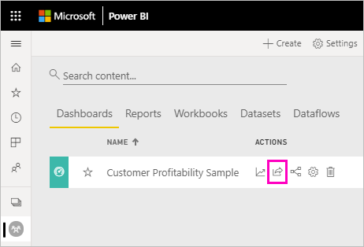
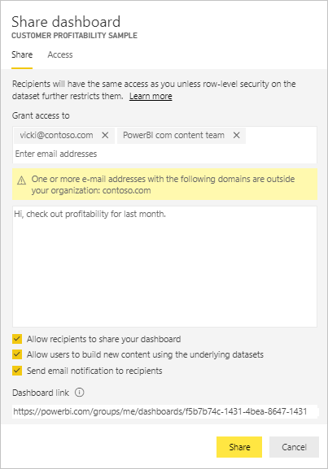
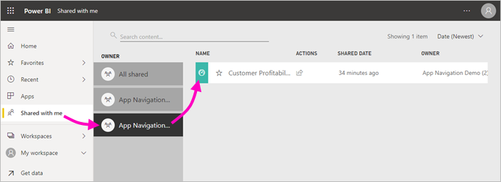
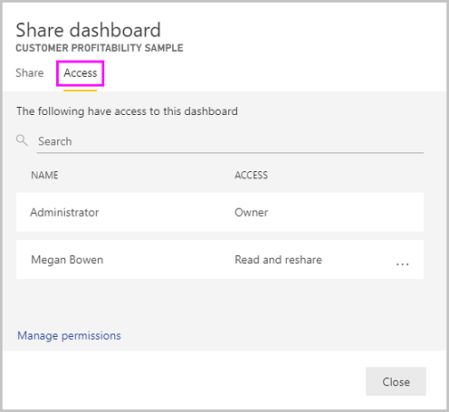
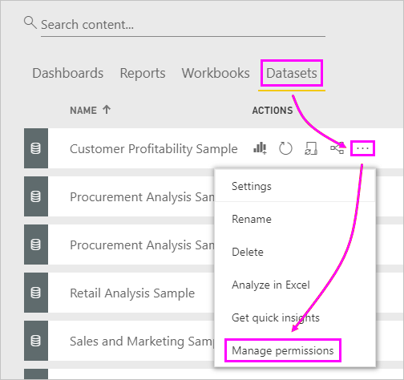
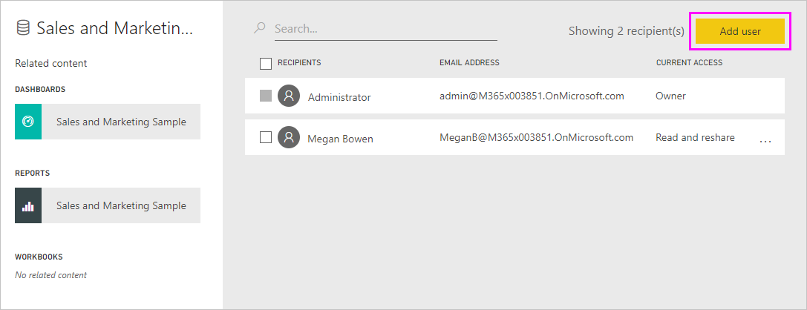

# Share Power BI dashboards and reports with coworkers and others
*Sharing* is a good way to give a few people access to your dashboards and reports. Power BI also offers [several other ways to collaborate and distribute dashboards and reports](service-how-to-collaborate-distribute-dashboards-reports.md).

With sharing, whether you share content inside or outside your organization, you need a [Power BI Pro license](service-features-license-type.md). Your recipients also need Power BI Pro licenses, unless the content is in a [Premium capacity](service-premium-what-is.md). 

You can share dashboards and reports from most places in the Power BI service: Favorites, Recent, My Workspace, and Shared with me, if the owner allows it. You can share from other workspaces, too, if you have the [Admin, Member, or Contributor role](service-new-workspaces.md#roles-in-the-new-workspaces) in the workspace. 

When you share a dashboard or report, the people you share it with can view it and interact with it, but can't edit it. They see the same data that you see in the dashboard or report, unless [row-level security (RLS)](service-admin-rls.md) is applied. The coworkers you share with can also share with their coworkers, if you allow them to. The people outside your organization can view and interact with the dashboard or report, but can't share it. 

You can't *share* directly from Power BI Desktop. You [publish reports from Power BI Desktop](desktop-upload-desktop-files.md) to the Power BI service. However, you can [share a dashboard from the Power BI mobile apps](consumer/mobile/mobile-share-dashboard-from-the-mobile-apps.md).  

## Video: Share a dashboard
Watch Amanda share the dashboard with colleagues inside and outside Amanda's company. Then follow the step-by-step instructions below the video to try it out yourself.

<iframe width="560" height="315" src="https://www.youtube.com/embed/0tUwn8DHo3s?list=PL1N57mwBHtN0JFoKSR0n-tBkUJHeMP2cP" frameborder="0" allowfullscreen></iframe>

## Share a dashboard or report

1. In a list of dashboards or reports, or in an open dashboard or report, select **Share** .

2. In the top box, enter the full email addresses for individuals, distribution groups, or security groups. You can't share with dynamic distribution lists. 
   
   You can share with people whose addresses are outside your organization, but you'll see a warning. Read more about [sharing outside your organization](#share-a-dashboard-or-report-outside-your-organization) in this article.
   
    
 
   >[!NOTE]
   >The input box supports, at most, 100 separate users or groups. See [Share with more than 100 users](#share-with-more-than-100-separate-users) in this article for ways to share with more people.

3. Add a message if you want. It's optional.
4. To let your coworkers share your content with others, check **Allow recipients to share your dashboard (or report)**.
   
   Allowing others to share is called *resharing*. If you let them, they can reshare from the Power BI service and the mobile apps, or forward the email invitation to others in your organization. The invitation expires after one month. People outside your organization can't reshare. As the owner of the content, you can turn off resharing, or revoke resharing on an individual basis. See [Stop or change sharing](#stop-or-change-sharing) in this article.

5. If you select **Allow users to build new content using the underlying datasets**, they can create their own reports in other workspaces based on the dataset for this dashboard. Read more about [creating reports based on datasets from different workspaces](service-datasets-discover-across-workspaces.md).

1. Select **Share.**
   
     
   
   Power BI sends an email invitation to the individuals, but not to groups, with a link to the shared content. You see a **Success** notification. 
   
   When recipients in your organization click the link, Power BI adds the dashboard or report to their **Shared with me** list page. They can select your name to see all the content you've shared with them. 
   
   
   
   When recipients outside your organization click the link, they see the dashboard or report, but not in the usual Power BI portal. Read more about [sharing with people outside your organization](#share-a-dashboard-or-report-outside-your-organization) in this article.

## See who has access to a dashboard or report
Sometimes you need to see the people you've shared with, and see who they've shared it with.

1. In the list of dashboards and reports, or in the dashboard or report itself, select **Share** . 
2. In the **Share dashboard** or **Share report** dialog box, select **Access**.
   
    

    People outside your organization are listed as **Guest**.

    In this view, you can [stop or change sharing permissions](#stop-or-change-sharing) in this article. 

## Share a dashboard or report outside your organization
When you share with people outside your organization, they receive an email with a link to the shared dashboard or report. They must sign in to Power BI to see what you shared. If they don't have a Power BI Pro license, they can sign up for a license when they click the link.

After they sign in, they see the shared dashboard or report in its own browser window, not in the usual Power BI portal. To access this dashboard or report later, they must bookmark the link.

They can't edit any content in this dashboard or report. They can interact with the charts and change filters or slicers, but can't save their changes. 

Only your direct recipients see the shared dashboard or report. For example, if you sent the email to Vicki@contoso.com, only Vicki sees the dashboard. No one else can see the dashboard, even if Vicki forwards them the link. Vicki must use the same email address to access it; if Vicki signs in with any other email address, Vicki won't have access to the dashboard.

People outside your organization don't see any data at all if role- or row-level security is implemented on on-premises Analysis Services tabular models.

If you want to share with a group that includes people with external email addresses, use a security group, not a distribution group. People with external emails in a distribution group can't see the content you share, unless they are Azure Active Directory (Azure AD) B2B guest users. Learn more about [Azure AD B2B guest users](service-admin-azure-ad-b2b.md).

If you send a link from a Power BI mobile app to people outside your organization, clicking the link opens the dashboard in a browser, not in the Power BI mobile app.

### Allow external users to edit content

Your Power BI admin can allow external guest users to edit and manage content in your organization. If so, your external users won't have that consumption-only experience. They can edit and manage content within your organization. Learn more about [distributing Power BI content to external guest users with Azure AD B2B](service-admin-azure-ad-b2b.md).

## Stop or change sharing
Only the dashboard or report owner can turn resharing on and off.

### If you haven't sent the sharing invitation yet
* Clear the **Allow recipients to share your dashboard (or report)** check box at the bottom of the invitation before you send it.

### If you've already shared the dashboard or report
1. In the list of dashboards and reports, or in the dashboard or report itself, select **Share** . 
2. In the **Share dashboard** or **Share report** dialog box, select **Access**.
   
    
3. Select the ellipsis (**...**) next to **Read and reshare** and select:
   
   
   
   * **Read** to keep that person from sharing with anyone else.
   * **Remove access** to keep that person from seeing the shared content at all.

4. In the **Remove access** dialog box, decide if you also want to remove access to related content, such as reports and datasets. If you remove items with a warning icon , it's best to also remove related content. Otherwise, it won't display properly.

    

## Limitations and considerations
Things to keep in mind about sharing dashboards and reports:

* In general, you and your colleagues see the same data in the dashboard or report. Thus, if you have permissions to see more data than they do, they see all your data in the dashboard or report. However, if [row-level security (RLS)](service-admin-rls.md) is applied to the dataset underlying a dashboard or report, then each person's credentials determine which data they can access.
* Everyone you share your dashboard with can see it and interact with the related reports in [Reading view](consumer/end-user-reading-view.md#reading-view). In general, they can't create reports or save changes to existing reports. However, if you select **Allow users to build new content using the underlying datasets**, they can create their own reports in other workspaces based on the dataset for this dashboard or report.
* Although no one can see or download the dataset, they can access the dataset directly by using the Analyze in Excel feature. An admin can restrict the ability to use Analyze in Excel for everyone in a group. However, the restriction is for everyone in that group and for every workspace the group belongs to.
* Everyone can manually [refresh the data](refresh-data.md).
* If you use Office 365 for email, you can share with members of a distribution group by entering the email address associated with the distribution group.
* Coworkers who share your email domain, and coworkers whose domain is different but registered within the same tenant, can share the dashboard with others. For example, say the domains contoso.com and contoso2.com are registered in the same tenant and your email address is konrads@contoso.com. Both ravali@contoso.com and gustav@contoso2.com can share your dashboard, as long as you give them permission to share.
* If your coworkers already have access to a specific dashboard or report, you can send a direct link by copying the URL when you're on the dashboard or report. For example: `https://powerbi.com/dashboards/g12466b5-a452-4e55-8634-xxxxxxxxxxxx`.
* Likewise, if your coworkers already have access to a specific dashboard, you can [send a direct link to the underlying report](service-share-reports.md). 

### Share with more than 100 separate users

At most, you can share with 100 users or groups in a single share action. However, you can give more than 500 users access to an item. Here are some suggestions:

- Share multiple times by specifying the users individually.
- Share with a user group that contains all the users. 
- Create the report or dashboard in a workspace, then create an app from the workspace. You can share the app with many more people. Read more about [publishing apps in Power BI](service-create-distribute-apps.md).

## Troubleshoot sharing

### My dashboard recipients see a lock icon in a tile or a "Permission required" message

The people you share with may see a locked tile in a dashboard, or a "Permission required" message when they try to view a report.

If so, you need to grant them permission to the underlying dataset.

1. Go to the **Datasets** tab in your content list.

1. Select the ellipsis (**...**) next to the dataset, then select **Manage permissions**.

    

1. Select **Add user**.

    

1. Enter the full email addresses for individuals, distribution groups, or security groups. You can't share with dynamic distribution lists.

    

1. Select **Add**.

### I can't share a dashboard or report

To share a dashboard or report, you need permission to reshare the underlying content; that is, any related reports and datasets. If you see a message saying you can't share, ask the report author to give you reshare permission for those reports and datasets.

## Next steps

* [How should I collaborate on and share dashboards and reports?](service-how-to-collaborate-distribute-dashboards-reports.md)
* [Share a filtered Power BI report](service-share-reports.md)
* Questions? [Try the Power BI Community](https://community.powerbi.com/)

