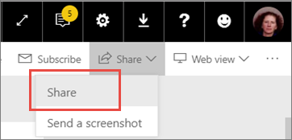

# Share a filtered Power BI report with your coworkers
*Sharing* is a good way to give a few people access to your dashboards and reports. Power BI offers [several ways to collaborate and distribute your reports](service-how-to-collaborate-distribute-dashboards-reports.md), and sharing is just one.

With sharing, you and your recipients need a [Power BI Pro license](service-free-vs-pro.md), or the content needs to be in a [Premium capacity](service-premium.md). Suggestions? The Power BI team is always interested in your feedback, so go to the [Power BI Community site](https://community.powerbi.com/).

You can share a report with coworkers in the same email domain as you, from your own My Workspace or from an app workspace. When you share a report, those you share it with can view it and interact with it, but can't edit it. They see the same data that you see in the report, unless [row-level security (RLS)](service-admin-rls.md) is applied. 

## Share a Power BI report
1. In the Power BI service, [create a dashboard](service-dashboard-create.md) with at least one tile that links to the report you want to share. 
   
    Even if you only want to share the report, you need to create a dashboard that links to the report first and share it. 

1. In the upper-right corner of the dashboard,  select **Share**.

     
  
2. Address it to your intended recipients. If you don't want to send them mail about the dashboard, clear the **Send email notificaton to recipients** check box.

     

4. Select **Share**.

      The people you share the dashboard with now have permission to see the underlying report. 

1. Open the report in the Power BI service, copy the report page URL, and send it to your coworkers. 
   
    When they select the link, Power BI opens a read-only version of the report.

## Share a filtered version of a report
What if you want to share a filtered version of a report? Maybe a report that only shows data for a specific city or salesperson or year. You do this by creating a custom URL.

1. Open the report in [Editing view](service-reading-view-and-editing-view.md), apply the filter, and save the report.
   
   In this example we're filtering the [Retail Analysis sample](sample-tutorial-connect-to-the-samples.md) to show only values where **Territory** equals **NC**.
   
   
2. Add the following to the end of the report page URL:
   
   ?filter=*tablename*/*fieldname* eq *value*
   
    The field must be of type **string** and neither *tablename* or *fieldname* can contain spaces.
   
   In our example, the name of the table is **Store**, the name of the field is **Territory**, and the value we want to filter on is **NC**:
   
    ?filter=Store/Territory eq 'NC'
   
   
   
   Your browser adds special characters to represent slashes, spaces, and apostrophes, so you end up with:
   
   app.powerbi.com/groups/me/reports/010ae9ad-a9ab-4904-a7a1-10a61f70f2f5/ReportSection2?filter=Store%252FTerritory%20eq%20%27NC%27

3. Send this URL to your coworkers. 
   
   When they select the link, Power BI opens a read-only version of the filtered report.

## Next steps
* Have feedback? Go to the [Power BI Community site](https://community.powerbi.com/) with your suggestions.
* [How should I collaborate on and share dashboards and reports?](service-how-to-collaborate-distribute-dashboards-reports.md)
* [Share a dashboard](service-share-dashboards.md)
* More questions? [Try the Power BI Community](http://community.powerbi.com/).

