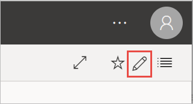

# Filter and share a Power BI report
*Sharing* is a good way to give a few people access to your dashboards and reports. What if you want to share a filtered version of a report? Maybe you want the report to show only data for a specific city or salesperson or year. This article explains how to filter a report and share the filtered version of the report. Another way to share a filtered report is to [add query parameters to the report URL](service-url-filters.md). In both cases, the report is filtered when recipients first open it. They can clear the filter selections in the report.

Power BI also offers [other ways to collaborate and distribute your reports](service-how-to-collaborate-distribute-dashboards-reports.md). With sharing, you and your recipients need a [Power BI Pro license](service-features-license-type.md), or the content needs to be in a [Premium capacity](service-premium-what-is.md). 

## Follow along with sample data

This article uses the Marketing and Sales sample template app. Want to try it? 

1. Install the [Marketing and Sales sample template app](https://appsource.microsoft.com/product/power-bi/microsoft-retail-analysis-sample.salesandmarketingsample?tab=Overview).
2. Select the app and select **Explore app**.

   

3. Select the pencil icon to open the workspace that you installed with the app.

    

4. In the workspace content list, select **Reports**, then select the report **Sales and Marketing Sample PBIX**.

    

    Now you're ready to follow along.

## Set a filter in the report

Open a report in [Editing view](consumer/end-user-reading-view.md) and apply a filter.

In this example, we're filtering the YTD Category page of the Marketing and Sales sample template app to show only values where **Region** equals **Central**. 
 

Save the report.

## Share the filtered report

1. Select **Share** 

   

2. Clear **Send email notification to recipients**, so you can send a filtered link instead, and select **Share report with current filters and slicers**.

    

3. Select **Share**.

4. Select **Share**  again.

5. Select the **Access** tab, then select **Manage shared report views**.

    

6. Right-click the URL you want, and select **Copy link**.

    

7. When you share this link, recipients will see your filtered report. 

## Next steps
* [Ways to share your work in Power BI](service-how-to-collaborate-distribute-dashboards-reports.md)
* [Share a dashboard](service-share-dashboards.md)
* More questions? [Try the Power BI Community](https://community.powerbi.com/).
* Have feedback? Go to the [Power BI Community site](https://community.powerbi.com/) with your suggestions.

