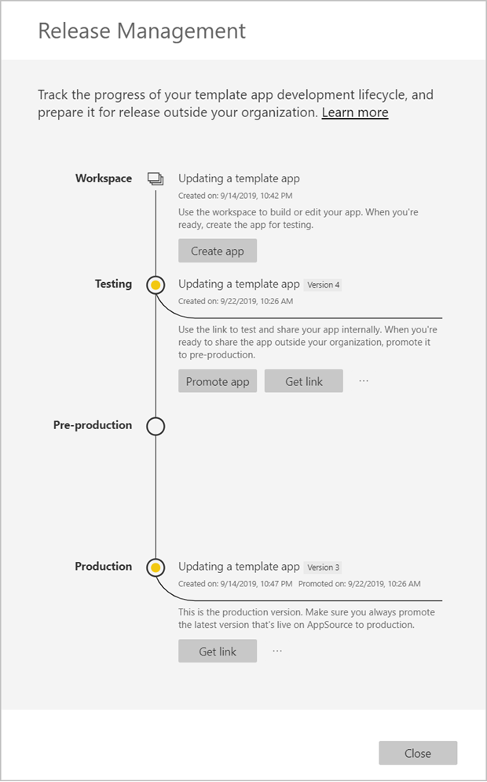
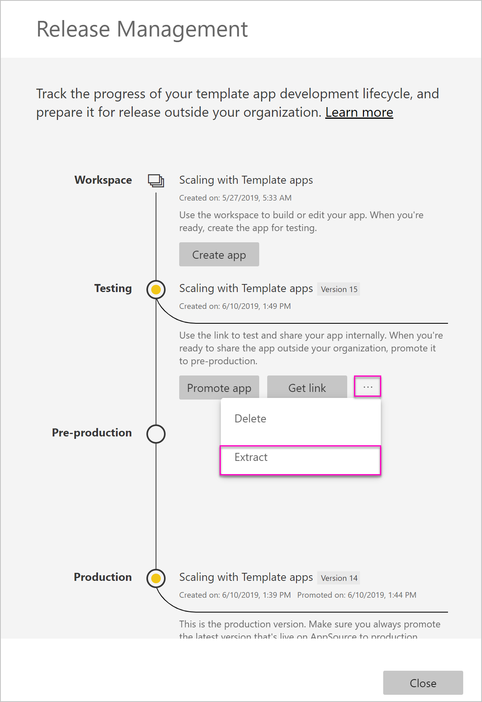
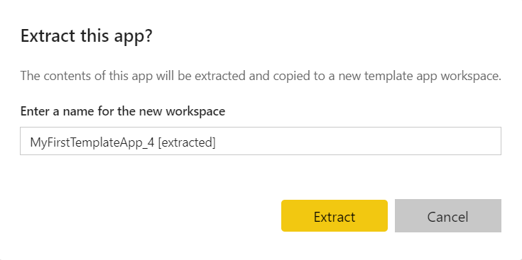
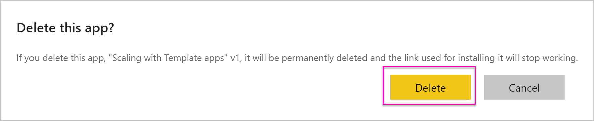

# Update, delete and extract template app

The new Power BI *template apps* enable Power BI partners to build Power BI apps with little or no coding, and deploy them to any Power BI customer.  This article contains step-by-step instructions to create a Power BI template app.

If you can create Power BI reports and dashboards, you can become a *template app builder* and builds and packages analytical content into an *app*. You may deploy your app to other Power BI tenants through any available platform, such as AppSource, or by using it in your own web service. As a builder you have the possibility to create a protected analytics package for distribution.

Power BI tenant admins govern and control who in their organization can create template apps, and who can install them. Those users who are authorized can install your template app, then modify it and distribute it to the Power BI consumers in their organization.

## Update your app

Now that your app is in production, you can start over in the test phase, without disrupting the app in production.

1. In the **Release management** pane, select **Create app**.
2. Go back through the app creation process.
3. After you've set **Branding**, **Content**, **Control**, and **Access**, you again select **Create app**.
4. Select **Close** and go back to **Release management**.

   You see you have two versions now: The version in production, plus a new version in testing.

    

5. When you're ready to promote your app to pre-production for further testing outside your tenant, go back to the Release Management pane and select **Promote app** next to **Testing**.
6. Your link is now live, submit it again to the Cloud Partner Portal by following the steps at [Power BI App offer update](https://docs.microsoft.com/azure/marketplace/cloud-partner-portal/power-bi/cpp-update-existing-offer).
7. In CPP you must **publish** your offer again as well as to have it validated again. 

>[!NOTE]
>Promote your app to production stage only after your app is approved by Cloud Partner Portal and you published it.

## Extract workspace
Rolling back to the previous version of a template app is now easier than ever with the extract capability. The following steps will extracts a specific app version from various release stages into a new workspace:

1. In the release management pane press more **(...)** and then **Extract**.

    
    
2. In dialog box enter the name for extracted workspace. a new workspace will be added.

Note that your new workspace versioning resets and you can continue to develop and destribute the template app from the newly extracted workspace.

## Delete template app version
A template app workspace is the source of an active distributed template app. To protect the template app users it's not possible to delete a workspace without first removing all the created app versions in the workspace.
Deleting an app version also deletes the app url which will no longer work.

1. In the release management pane press more **(...)** and then **Delete**.
 
 

>[!NOTE]
>Make sure not to delete app version which are being used by customers or **AppSource** or they will no longer work.

## Next steps

See how your customers interact with your template app in [Install, customize, and distribute template apps in your organization](service-template-apps-install-distribute.md).

See the [Power BI Application offer](https://docs.microsoft.com/azure/marketplace/cloud-partner-portal/power-bi/cpp-power-bi-offer) for details on distributing your app.
