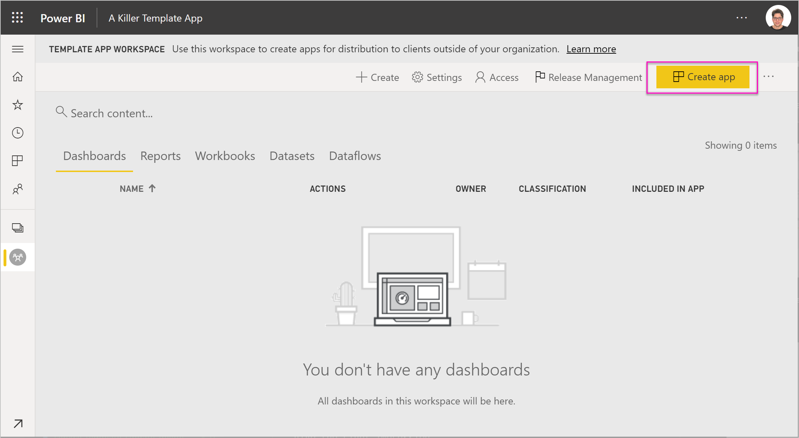
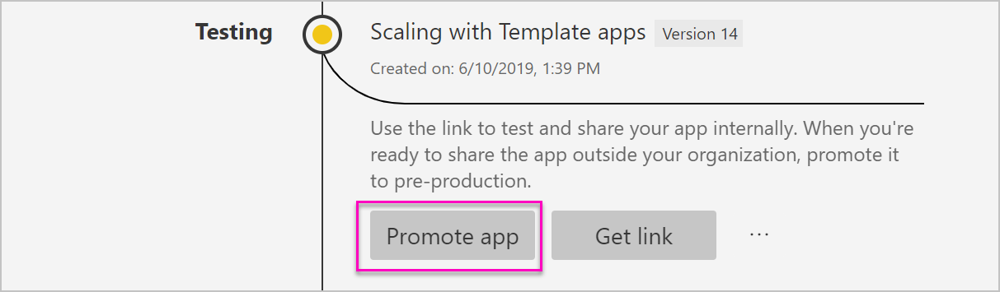
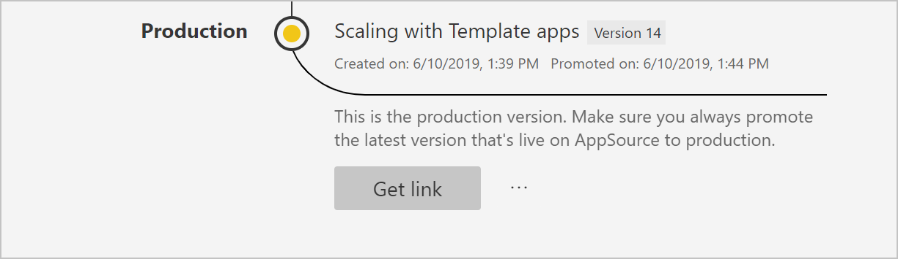

# Create a template app in Power BI

The new Power BI *template apps* enable Power BI partners to build Power BI apps with little or no coding, and deploy them to any Power BI customer.  This article contains step-by-step instructions to create a Power BI template app.

If you can create Power BI reports and dashboards, you can become a *template app builder* and builds and packages analytical content into an *app*. You may deploy your app to other Power BI tenants through any available platform, such as AppSource, or by using it in your own web service. As a builder you have the possibility to create a protected analytics package for distribution.

Power BI tenant admins govern and control who in their organization can create template apps, and who can install them. Those users who are authorized can install your template app, then modify it and distribute it to the Power BI consumers in their organization.

## Prerequisites

Here are the requirements for building a template app:  

- A [Power BI pro license](service-self-service-signup-for-power-bi.md)
- An [installation of Power BI Desktop](desktop-get-the-desktop.md) (optional)
- Familiarity with the [basic concepts of Power BI](service-basic-concepts.md)
- Permissions to share template app publicly. See the Power BI [admin portal, Template app settings](service-admin-portal.md#template-apps-settings-preview) for details.

## Create the template app workspace

To create a template app you can distribute to other Power BI tenants, you need to create it in one of the new app workspaces.

1. In the Power BI service, select **Workspaces** > **Create app workspace**.

    

2. In **Create an app workspace**, in **Preview improved workspaces**, select **Try now**.

    

3. Enter a name, description (optional), and logo image (optional) for your app workspace.

4. Select **Develop a template app**.

    

5. Select **Save**.
>[!NOTE]
>You need permissions from your Power BI admin to promote template apps.

## Create the content in your template app

As with a regular Power BI app workspace, your next step is to create the contents in the workspace.  In this preview version of template apps, we support only up to one of each type: one dataset, one report, and one dashboard.

- [Create your Power BI content](power-bi-creator-landing.md) in your app workspace.

If you're using parameters in Power Query, make sure they have well-defined type (for example, Text). The types Any and Binary aren't supported.

[Tips for authoring template apps in Power BI](service-template-apps-tips.md) has suggestions to consider when creating reports and dashboards for your template app.

## Create the test template app

Now that you have content in your workspace, you're ready to package it in a template app. The first step is to create a test template app, accessible only from within your organization on your tenant.

1. In the template app workspace, select **Create app**.

    

    Here, you fill in additional building options for your template app, in five categories:

    **Branding**

    
    - App name
    - Description
    - Support site (link is presented under app info after redistributing template app as org app)
    - App logo (45K file size limit, 1:1 aspect ratio, .png .jpg .jpeg formats)
    - App theme color

    **Content**

    **App landing page:** Define a report or dashboard to be the landing page of your app, use a landing page that will give the right impression:

    

    **Control**

    Set limits and restrictions that your application users will have with the content of your application. You can use this control to protect intellectual property in your app.

    

    >[!NOTE]
    >Exporting to .pbix format is always blocked for users installing the app.

    **Parameters**

    Use this category to manage parameter behavior when connecting to data sources. Learn more about [creating query parameters](https://powerbi.microsoft.com/blog/deep-dive-into-query-parameters-and-power-bi-templates/).

    
    - **Value**: default parameter value.
    - **Required**: use this to require the installer to input a user-specific parameter.
    - **Lock**: Locking prevents the installer from updating a parameter.
    - **Static**: Enable in case the app contains *only* sample data. When you select **Static**, the installation wizard doesn't ask users to connect a data source.

    **Access**
    In the test phase, decide which others in your organization can install and test your app. Don't worry, you can always come back and change these settings later (Setting doesn't affect access of the distributed Template app).

2. Select **Create app**.

    You see a message that the test app is ready, with a link to copy and share with your app testers.

    

    You've also done the first step of the release management process, which follows.

## Manage the template app release

Before you release this template app publicly, you want to make sure it's ready to go. Power BI has created the release management pane, where you can follow and inspect the full app release path. You can also trigger the transition from stage to stage. The common stages are:

- Generate test app: for testing only in your organization.
- Promote the test package to pre-production stage: test outside of your organization.
- Promote pre-production package to Production: production version.
- Delete any package or start over from previous stage.

The URL doesn't change as you move between release stages. Promotion doesn't affect the URL itself.

Let's go through the stages:

1. In the template app workspace, select **Release Management**.

    

2. Select **Create app**.

    If you created the test app in **Create the test template app** above, the yellow dot next to **Testing** is already filled and you don't need to select **Create app** here. If you do select it, you go back into the template app creation process.

3. Select **Get link**.

    

4. To test the app installation experience, copy the link in the notification window and paste it in a new browser window.

    From here, you're following the same procedure your customers will follow. See [Install and distribute template apps in your organization](service-template-apps-install-distribute.md) for their version.

5. In the dialog box, select **Install**.

    When installation succeeds, you see a notification that the new app is ready.

6. Select **Go to app**.
7. In **Get started with your new app**, you see your app as your customers will see it.

    
8. Select **Explore App** to verify the test app with the sample data.
9. To make any changes, go back to the app in the original workspace. Update the test app until you're satisfied.
10. When you're ready to promote your app to pre-production for further testing outside your tenant, go back to the **Release Management** pane and select **Promote app**. 

    
    >[!NOTE]
    > When the app is promoted it becomes publicly available outside your organization.

    If you don't see that option, contact your Power BI admin to grant you [permissions for template app development](service-admin-portal.md#template-apps-settings-preview) in the admin portal.
11. Select **Promote** to confirm your choice.
12. Copy this new URL to share outside your tenant for testing. This link is also the one you submit to begin the process of distributing your app on AppSource by creating a [new Cloud Partner Portal offer](https://docs.microsoft.com/azure/marketplace/cloud-partner-portal/power-bi/cpp-publish-offer). Submit only pre-production links to the Cloud Partner Portal. Only after the app is approved and you get notification that it is published in AppSource, then you can promote this package to production in Power BI.
13. When your app is ready for production or sharing via AppSource, go back to the **Release Management** pane and select **Promote app** next to **Pre-production**.
14. Select **Promote** to confirm your choice.

    Now your app is in production, and ready for distribution.

    

To make your app widely available to thousands of Power BI users in the world, we encourage you to submit it to AppSource. See the [Power BI Application offer](https://docs.microsoft.com/azure/marketplace/cloud-partner-portal/power-bi/cpp-power-bi-offer) for details.

## Next steps

See how your customers interact with your template app in [Install, customize, and distribute template apps in your organization](service-template-apps-install-distribute.md).

See the [Power BI Application offer](https://docs.microsoft.com/azure/marketplace/cloud-partner-portal/power-bi/cpp-power-bi-offer) for details on distributing your app.
