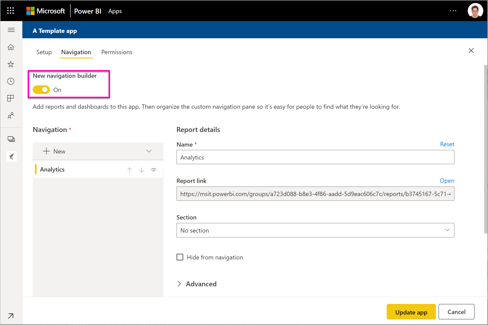

# Install and distribute template apps in your organization - Power BI (preview)

Are you a Power BI analyst? If so, this article explains how you install *template apps* to connect to many of the services you use to run your business, such as Salesforce, Microsoft Dynamics, and Google Analytics. You can modify the dashboard and reports to meet the needs of your organization, and then distribute them to your colleagues as an *app*. 

If you're interested in creating template apps to distribute yourself, see [Create a template app in Power BI](service-template-apps-create.md). Power BI partners can build Power BI apps with little or no coding, and deploy them to Power BI customers. 

## Prerequisites  

Here are the requirements for installing, customizing, and distributing a template app: 

- A [Power BI pro license](service-self-service-signup-for-power-bi.md)
- Familiarity with the [basic concepts of Power BI ](service-basic-concepts.md)
- Valid installation link from the template app creator or AppSource. 
- Permissions to install template apps. 

## Install a template app

You may receive a link to a template app. Otherwise, you can search AppSource for one that interests you. Either way, after you install it, you can modify it and distribute it to your own organization.

### Search AppSource from a browser

In a browser, select this link to open AppSource filtered to Power BI apps:

- https://appsource.microsoft.com/marketplace/apps?product=power-bi

### Search AppSource from the Power BI service

1. In the left navigation pane in the Power BI service, select **Apps** > **Get apps**.

    

2. In AppSource, select **Apps**.

    

3. Browse or search for the app, then select **Get it now**.

2. In the dialog box, select **Install**.

    If you have a Power BI Pro license, the app is installed with its associated app workspace. You customize the app in the associated workspace.

    When installation succeeds, you see a notification that your new app is ready. 

3. Select **Go to app**.
4. In **Get started with your new app**, select one of three options:

    

    - **Explore app**: Basic sample data exploration. Start here to get the look and feel of the app. 
    - **Connect data**: Change the data source from the sample data to your own data source. You can redefine dataset parameters and data source credentials. See [Known limitations](service-template-apps-tips.md#known-limitations) in the template apps tips article. 
    - **Go to workspace** (most advanced option): you can make any changes allowed by the app builder.

    Or skip this dialog box and access the associated workspace directly via **Workspaces** in the left navigation pane.   
 
5. Before you share it with your coworkers, you'll want to connect to your own data. You may also want to modify the report or dashboard to make it work for your organization. You can also add other reports or dashboards at this point.

## Update and distribute the app

After you've updated the app for your organization, you're ready to publish it. The steps are the same as for publishing any other app. 

1. When you've finished customizing, in the workspace list view select **Update app** in the upper-right corner.  

    

2. In **Details**, you can modify the description and background color.

   

3. In **Content**, you can select a landing page, either the dashboard or the report.

   

4. In **Access**, you give access either to selected users or to your whole organization.  

   

5. Select **Update app**. 

6. After it's successfully published, you can copy the link and share it with whomever you've given access to. If you've shared it with them, they also see it on the **My organization** tab in AppSource.

## Next steps 

[Create workspaces with your colleagues in Power BI](service-create-workspaces.md)

 

 
