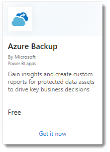
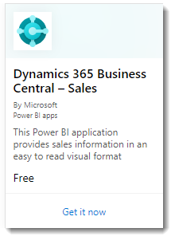
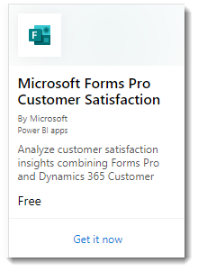

# What are Power BI template apps?

The new Power BI *template apps* enable Power BI partners to build Power BI apps with little or no coding, and deploy them to any Power BI customer.  This article is an overview of the Power BI template app program.

Template apps are a replacement for the current service content packs. As a Power BI partner, you create a set of out-of-the-box content for your customers and publish it yourself.  

You build template apps that allow your customers to connect and instantiate within their own accounts. As domain experts, they can unlock the data in a way that's easy for their business users to consume.  

You submit your template apps to the Cloud Partner Portal. The apps then become publicly available in the [Power BI Apps marketplace](https://app.powerbi.com/getdata/services) and on [Microsoft AppSource](https://appsource.microsoft.com/?product=power-bi). Here's a high-level look at the public template app creation experience.

## Power BI Apps marketplace

Power BI Template Apps allow Power BI Pro or Power BI Premium users to gain immediate insights through prepackaged dashboards and reports that can be connected to live data sources. Many Power BI Apps are already available in the [Power BI Apps marketplace](https://app.powerbi.com/getdata/services).

|  |
|     :---:      |
|     |
|  |

## Process
The general process to develop and submit a template app involves several stages. Some stages can include more than one activity at the same time.

| Stage | Power BI Desktop |  |Power BI service  |  |Cloud Partner Portal  |
|---|--------|--|---------|---------|---------|
| **One** | Build a data model and report in a .pbix file |  | Create a workspace. Import .pbix file. Create a complementary dashboard  |  | Register as a partner |
| **Two** |  |  | Create a test package and run internal validation        |  | |
| **Three** | |  | Promote the test package to preproduction for validation outside your Power BI tenant, and submit it to AppSource  |  | With your preproduction package, create a Power BI template app offer and start the validation process |
| **Four** | |  | Promote the preproduction package to production |  | Go live |

## Before you begin

To create the template app, you need permissions to create one. See the Power BI admin portal, Template app settings for details. 

To publish a template app to the Power BI service and AppSource, you must meet the requirements for [becoming a Cloud Marketplace Publisher](https://docs.microsoft.com/azure/marketplace/become-publisher).
 
## High-level steps

Here are the high-level steps. 

1. [Review the requirements](#requirements) to make sure you meet them. 

2. Build a report in Power BI Desktop. Use parameters so you can save it as a file other people can use. 

3. Create a workspace for your template app in your tenant on the Power BI service (app.powerbi.com). 

4. Import your .pbix file and add content such as a dashboard to your app. 

5. Create a test package to test the template app yourself within your organization. 

6. Promote the test app to pre-production to submit the app for validation in AppSource, and to test outside your own tenant. 

7. Submit the content to Cloud Partner Platform for publishing. 

8. Make your offer go 'Live' in AppSource, and move your app to production in Power BI.

9. Now you can start developing the next version in the same workspace, in preproduction. 

## Requirements

To create the template app, you need permissions to create one. See the Power BI [admin portal, Template app settings](service-admin-portal.md#template-apps-settings) for details. 

To publish a template app to the Power BI service and AppSource, you must meet the requirements for [becoming a Cloud Marketplace Publisher](https://docs.microsoft.com/azure/marketplace/become-publisher).
 > [!NOTE] 
 > Template apps submissions are managed in [Cloud Partner Portal](https://cloudpartner.azure.com). Use the same Microsoft Developer Center registration account to sign in. You should have only one Microsoft account for your AppSource offerings. Accounts shouldn't be specific to individual services or offers.

## Tips 

- Make sure your app includes sample data to get everyone started in a click. 
- Carefully examine your application by installing it in your tenant and in a secondary tenant. Make sure customers only see what you want them to see. 
- Use AppSource as your online store to host your application. This way everyone using Power BI can find your app. 
- Consider offering more than one template app for separate unique scenarios. 
- Enable data customization; for example, support custom connection and parameters configuration by the installer.

See [Tips for authoring template apps in Power BI](service-template-apps-tips.md) for more suggestions.

## Known limitations

| Feature | Known Limitation |
|---------|---------|
|Contents:  Datasets   | Exactly one dataset should be present. Only datasets built in Power BI Desktop (.pbix files) are allowed.  Not supported: Datasets from other template apps, cross-workspace datasets, paginated reports (.rdl files), Excel workbooks |
|Contents: Dashboards | Real-time tiles aren’t allowed (in other words, no support for push or streaming datasets) |
|Contents: Dataflows | Not supported: Dataflows |
|Contents from files | Only PBIX files are allowed.  Not supported: .rdl files (paginated reports), Excel workbooks   |
| Data sources | Data sources supported for cloud Scheduled Data refresh are allowed.  Not supported: <li> DirectQuery</li><li>Live connections (no Azure AS)</li> <li>On-premises data sources (personal and enterprise gateways aren't supported)</li> <li>Real time (no support for push dataset)</li> <li>Composite models</li></ul> |
| Dataset: cross-workspace | No cross-workspace datasets are allowed  |
| Query parameters | Not supported: Parameters of type "Any" or "Binary" type block refresh operation for dataset |
| Custom visuals | Only publicly available custom visuals are supported. [Organizational custom visuals](developer/power-bi-custom-visuals-organization.md) not supported |

## Support
For support during development, use [https://powerbi.microsoft.com/support](https://powerbi.microsoft.com/support). We actively monitor and manage this site. Customer incidents quickly find their way to the appropriate team.

## Next steps

[Create a template app](service-template-apps-create.md)
