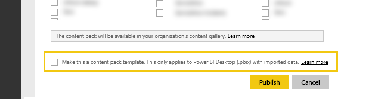

# Test your service apps in Power BI

Learn several ways to test your service apps in Power BI before you publish them on AppSource.

## Testing Scheduled Data Refresh
Template apps leverage Refresh in PowerBI.com to instantiate a template app with the customer's data when they connect. Prior to the template app being publicly available, you can test this flow with the Power BI Desktop file you've created.

After uploading the file, select the ellipsis (...) next to the dataset and select Schedule Refresh. Configure credentials for the source. Make sure that your dataset refreshes successfully, try both "Refresh Now" and "Scheduled Refresh". If your refresh hits any failures, check the error message and validate your queries and your end system.

### Additional refresh tips
* Only one data source should be detected when you try to schedule refresh  
* Test connection should indicate that your user will be able to load the template app. If that's not the case, ensure your queries handle the additional error cases.  
* Refresh should complete in a reasonable time, ~5 minutes is suggested  

## Testing Templates
A template app is similar to existing solutions except that it does not include the actual data in the dataset. Instead, when a user consumes or instantiates a template, they are prompted for parameters and credentials in order to connect. Once connected, they'll see their own data in the dashboard, report and datasets. 

After a user instantiates the template app they have access to the dataset settings including scheduled refresh, any RLS settings on the dataset are **not** published with the template app.  

> [!NOTE]
> Template apps can only include 1 dashboard, 1 report and 1 dataset. Please see the list of restrictions in the [authoring](template-content-pack-authoring.md#restrictions)  page. 
> 
> 

To enable template creation for your tenant, please work with your Power BI admin to enable the feature switch below. 

Once enabled, you'll see a checkbox at the bottom of ["Create template app"](https://app.powerbi.com/groups/me/publish-content/), allowing you to publish a template app to your organization. 

### Naming
We suggest naming your dashboard, report and dataset consistently across your template app. These names are hardcoded and will be the same for all users, so using your product/scenario name can make it easier for your customers to locate.

### Additional template tips
* Ensure the parameters you specified in the queries are meaningful to your end users
* Consider how long your end user will be waiting for scheduled refresh to complete

## Submission
The submission process through [Microsoft AppSource](https://appsource.microsoft.com/en-us/partners/list-an-app) will allow you to publish your template app in the service template apps gallery in PowerBI.com as well as list your template app in [Microsoft AppSource](http://appsource.microsoft.com).

### Before submission
* Review the authoring tips for each of the artifacts within the template app
* Test and connect with various accounts and data conditions. (Skip this step if you developed your own custom [Data Connector](https://aka.ms/DataConnectors))
* Review all visuals, look carefully for misspelled items
* Ensure the template app responds well to Q&A, we suggest testing at least 30 varied questions across the data model. (Skip this step if you developed your own custom [Data Connector](https://aka.ms/DataConnectors))

### Submission
Once ready to submit, visit the [Apps submission page](https://appsource.microsoft.com/en-us/partners/list-an-app) on AppSource and submit your information. Please make sure to select Power BI from the available list of products

The Power BI team will review your submission and will reach out to you to ensure all the artifacts meets the submission requirements. In addition to being complete, we'll also validate the quality of the dashboard and reports provided ensuring they meet the business scenario described in the application.

### Updates
Updating your template app follows a similar flow to the original submission. 

