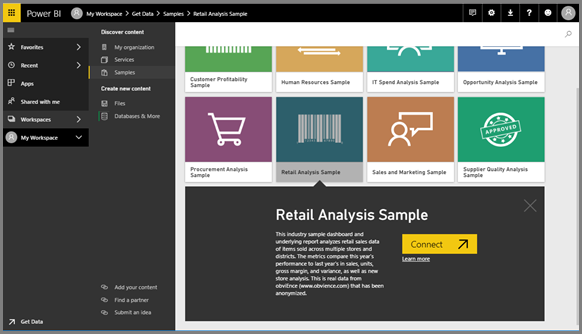
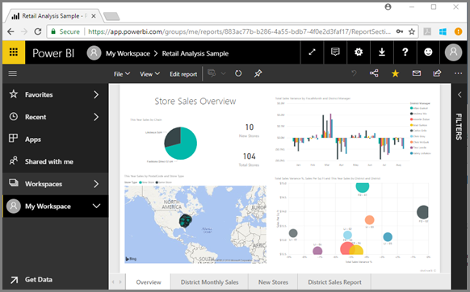

# Quickstart - Getting around in Power BI service

Now that you know the basics of Power BI, let's take a look around **Power BI service**. As mentioned earlier, someone on your team might spend all of her time in **Power BI Desktop**, combining data and creating reports for others. But you, on the other hand, might spend all of your time in Power BI service, viewing and interacting with content created by others (**consuming** experience) or getting data and creating your own reports and dashboards (**creating** experience). In this quickstart you'll be importing sample data and using that data to learn your way around Power BI service. 
 
## Prerequisites

- If you're not signed up for Power BI, [sign up for a free trial](https://app.powerbi.com/signupredirect?pbi_source=web) before you begin.

- Read [Power BI service basic concepts](service-basic-concepts.md)

## Open Power BI service and get some data
We'll grab some sample data to use for our tour of Power BI service. There are all types of sample data we provide for you to explore, and this time we'll use the data about retail stores.    
1. Open app.powerbi.com and select the link for **Samples**. 

    

2. Select **Retail Analysis Sample > Connect**.

    

    Power BI service imports the sample and displays the dashboard. Dashboards are something that differentiate Power BI service from Power BI Desktop. The sample also includes a report and a dataset, which we'll visit later.  

    

Watch Amanda take you on a tour of the Power BI service navigation experience.  Then follow the step-by-step instructions below the video to explore for yourself.

<iframe width="560" height="315" src="https://www.youtube.com/embed/G26dr2PsEpk" frameborder="0" allowfullscreen></iframe>

## View content (dashboards, reports, workbooks, datasets, workspaces, apps)
Let's start by looking at how the basic content (dashboards, reports, datasets, workbooks) is organized. Content is displayed within the context of a workspace. At this point, you only have one workspace and it is called **My Workspace**. My Workspace stores all the content that you own. Think of it as your personal sandbox or work area for your own content. You can share content from My Workspace with colleagues. Within My Workspace, your content is organized into 4 tabs: Dashboards, Reports, Workbooks, and Datasets.

Select a workspace from the left navigation pane (left navpane) and the tabs for the associated content (dashboards, reports, workbooks, datasets) fill the Power BI canvas to the right.

If you are a new user, you'll only see one workspace -- **My Workspace**.

Within those tabs (aka *content views*), you'll see information about the content as well as actions you can take with that content.  For example, from the Dashboards tab you can open a dashboard, share, delete, search, create new content, sort, and much more.

Open the dashboard by selecting the dashboard name.

## Favorite a dashboard and a report
**Favorites** lets you quickly access content that is most important to you.  

1. With the dashboard open, select **Favorite** from the upper right corner.
   
   
   
   **Favorite** changes to **Unfavorite** and the star icon becomes yellow.
   
   

2. To display a list of all the content that you have added as favorites, in the left navpane, select the arrow to the right of **Favorites**. Because the left navpane is a permanent feature of Power BI service, you have access to this list from anywhere in Power BI service.
   
    
   
    We have only one favorite so far. Favorites can be dashboards, reports, or apps.  

1. Another way to mark either a dashboard or report as a favorite is from the **Dashboards** or **Reports** workspace tab.  Open the **Reports** tab, and select the star icon to the left of the report name.
   
   

3. Open the **Favorites** *pane*, by selecting **Favorites** from the left navpane or by selecting the star icon .
   
   
   
   You now have two favorites, one a dashboard and one a report. From here you can open, search, unfavorite, or share content with colleagues.

4. Select the report name to open it in the report editor.

    

To learn more, see [Favorites](service-dashboard-favorite.md)

## Locate your most recent content

1. Similar to Favorites, quickly see your most recently accessed content from anywhere in Power BI service by selecting the arrow next to **Recent** in the left navpane.

   

    From the flyout, select content to open it.

2. Sometimes you don't want to open recent content, but want to view information or take other action, such as sharing, running Insights, or exporting to Excel. In cases like thes, open the **Recents** pane by selecting **Recent** or its icon from the left navpane. If you had more than one workspace, this list would include content from across all of your workspaces.

   

To learn more, see [Recents in Power BI](service-recent.md)

### Search and sort content
The content view makes it easier to search, filter and sort your content. To search for a dashboard, report or workbook, type in the search area. Power BI filters to only the content that has your search string as part of the name.

Since you only have one sample, searching and sorting isn't necessary.  But when you have long lists of dashboards, reports, workbooks, and datasets, you'll find searching and sorting extremely helpful.

You can also sort the content by name or owner.  

To learn more, see [Power BI navigation: search, sort, filter](service-navigation-search-filter-sort.md)

## Next steps

> [!div class="nextstepaction"]
> [Reading view and Editing view in Power BI service](./service-reading-view-and-editing-view.md)