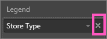

# Tour the report editor in Power BI

The *report editor* in the Power BI service and the report editor in Power BI Desktop are similar. Typically you start by creating reports in Power BI Desktop. Then you publish them to the Power BI service, where you can continue modifying them. The Power BI service is also where you create the dashboards based on your reports.

After you create your dashboards and reports, you distribute them to your report consumers. Depending on how you share them, your end users may be able to interact with them in Reading view in the Power BI service, but not edit them. Read more about [what report consumers can do in the Power BI service](consumer/end-user-reading-view.md). 

This video shows the report editor in Power BI Desktop. This article shows the report editor in the Power BI service. 

<iframe width="560" height="315" src="https://www.youtube.com/embed/IkJda4O7oGs" frameborder="0" allowfullscreen></iframe>

In the Power BI service, the report editor is only available in Editing View. To open a report in Editing view, you must be a report owner or creator, or be a contributor to the app workspace that houses the report.

The Power BI report editor has three sections:  

1. **Fields**, **Visualizations**, and **Filters** panes
2. top navigation bars    
3. report canvas     

## 1. The report editor panes

Three panes are visible when you first open a report: Visualizations, Filters, and Fields. The panes on the left side, Visualizations and Filters, control what your visualizations look like -- type, colors, filtering, formatting.  And the pane on the right side, Fields, manages the underlying data being used in the visualizations. 

The content displayed in the report editor varies by selections you make in the report canvas.  For example, when you select an individual visual:

|  |  |
| --- | --- |
|  |<ul><li>The top of the Visualization pane identifies the type of visual in use; in this example, a Clustered column chart.  </li> <li>The bottom of the Visualization pane (you may have to scroll down) displays the fields being used in the visual. This chart is using FiscalMonth, DistrictManager, and Total Sales Variance.   </li><li>The Filters pane (you may have to scroll down) displays any filters that have been applied.   </li><li>The Fields pane lists the tables available and, if you expand a table's name, the fields that make up that table. Yellow font lets you know  that at least one field from that table is being used in the visualization.  </li><li> To display the formatting pane, for the selected visualization, select the paint roller icon.  </li><li> To display the Analytics pane, select the magnifying glass icon.</ul> |

## The Visualizations pane

Here is where you select a visualization type. The small pictures are called *templates*. In the image above, the Clustered bar chart is selected. If you don't select a visualization type first, but instead start building a visualization by selecting fields, Power BI will pick the visualization type for you. You can keep Power BI's selection, or change the type by selecting a different template. Switch as many times as you need to find the visualization type that best represents your data.

### Manage the fields in your visual

The buckets (sometimes called *wells*) shown in this pane vary depending on what type of visualization you have selected.  For example, if you've selected a bar chart, you'll see buckets for: Values, Axis, and Legend. When you select a field, or drag it onto the canvas, Power BI adds that field to one of the buckets.  You can also drag fields from the Fields list directly into the buckets.  Some buckets are limited to certain types of data.  For example, **Values** won't accept non-numeric fields. So if you drag an **employeename** field into the **Values** bucket, Power BI changes it to **count of employeename**.

### Remove a field
To remove a field from the visualization, select the **X** to the right of the field name.

For more information, see [Add visualizations to a Power BI report](visuals/power-bi-report-add-visualizations-i.md)

### Format your visuals
Select the paint roller icon to display the Format pane. The options available depend on the type of visualization selected.

The formatting possibilities are almost endless.  To learn more, explore on your own, or visit these articles:

* [Customizing  visualization title, background, and legend](visuals/power-bi-visualization-customize-title-background-and-legend.md)
* [Color formatting](visuals/service-getting-started-with-color-formatting-and-axis-properties.md)
* [Customizing X-axis and Y-axis properties](visuals/power-bi-visualization-customize-x-axis-and-y-axis.md)

### Add analytics to your visualizations
Select the magnifying glass icon to display the Analytics pane. The options available depend on the type of visualization selected.

    
With the Analytics pane in the Power BI service, you can add dynamic reference lines to visualizations, and provide focus for important trends or insights. To learn more, see [Analytics pane in the Power BI service](service-analytics-pane.md) or [Analytics pane in Power BI Desktop](desktop-analytics-pane.md).

- - -
## The Filters pane
Use the Filters pane to view, set, and modify persistent filters to your reports at the page, report, drillthrough, and visual-level. Yes, you can do ad-hoc filtering on report pages and visuals by selecting elements of the visuals or by using tools like slicers, but by using the Filters pane the state of the filters is saved with the report. 

The Filters pane has one other powerful feature - the ability to filter using a field ***that is not already being used in one of the visuals in your report***. Let me explain. When you create a report page, Power BI automatically adds all the fields you use in your visualizations to the Visual level filters area of the Filters pane.  But, if you want to set a visual, page, drillthrough, or report filter using a field that is not currently used in a visualization, just drag it to one of the Filters buckets.   

For more information, see [Add a filter to a report](power-bi-report-add-filter.md).

A new filter experience is currently in preview. In the new filters, you can format them to look like the report itself. You can also lock filters or hide them from your report consumers. 

Read more about the [new filter experience](power-bi-report-filter-preview.md).

- - -
## The Fields pane
The Fields pane displays the tables and fields that exist in your data and are available for you to use to create visualizations.

|  |  |
| --- | --- |
|  |<ul><li>Drag a field onto the page to start a new visualization.  You can also drag a field onto an existing visualization to add the field to that visualization.  </li> <li>When you add a checkmark next to a field, Power BI adds that field to the active (or new) visualization. And it also decides which bucket to place that field into.  For example, should the field be used a legend, axis, or value? Power BI makes a best-guess and you can move it from that bucket to another if necessary.   </li><li>Either way, each selected field is added to the Visualizations pane in the report editor.</li></ul> |

**NOTE**: If you're using Power BI Desktop, you'll also have options to show/hide fields, add calculations etc.

### What do the field icons mean?
**∑ Aggregates**
An aggregate is a numeric value that will be summed or averaged, for example. Aggregates are imported with the data (defined in the data model your report is based on).
  For more information, see [Aggregates in Power BI reports](service-aggregates.md).

 **Calculated measures (also called calculated fields)**  
Each calculated field has its own hard-coded formula. You can’t change the calculation, for example, if it’s a sum, it can only be a sum. For more information, [read Understanding measures](desktop-measures.md)

 **Unique fields**  
Fields with this icon were imported from Excel and are set to show all values, even if they have duplicates. For example, your data might have two records for people named 'John Smith', and each will be treated as unique -- they won't be summed.  

** Geography fields**  
Location fields can be used to create map visualizations. 

** Hierarchy**  
Select the arrow to reveal the fields that make up the hierarchy. 

## 2. The top navigation bar
The actions available from the top navigation bar are numerous; with new actions being added all the time. For information about a particular action, use the Power BI Documentation Table of Contents or Search box.

## 3. The report canvas
The report canvas is where your work displays. When you use the Fields, Filters, and Visualizations panes to create visuals, they are built and displayed on your report canvas. Each tab at the bottom of the canvas represents a page in the report. Select a tab to open that page. 

## Next steps
[Create a report](service-report-create-new.md)

More about reports in the [Power BI service](service-report-create-new.md), [Power BI Desktop](desktop-report-view.md), and [Power BI mobile apps](consumer/mobile/mobile-apps-view-phone-report.md).

[Basic concepts for Power BI designers](service-basic-concepts.md)

More questions? [Try the Power BI Community](http://community.powerbi.com/)

