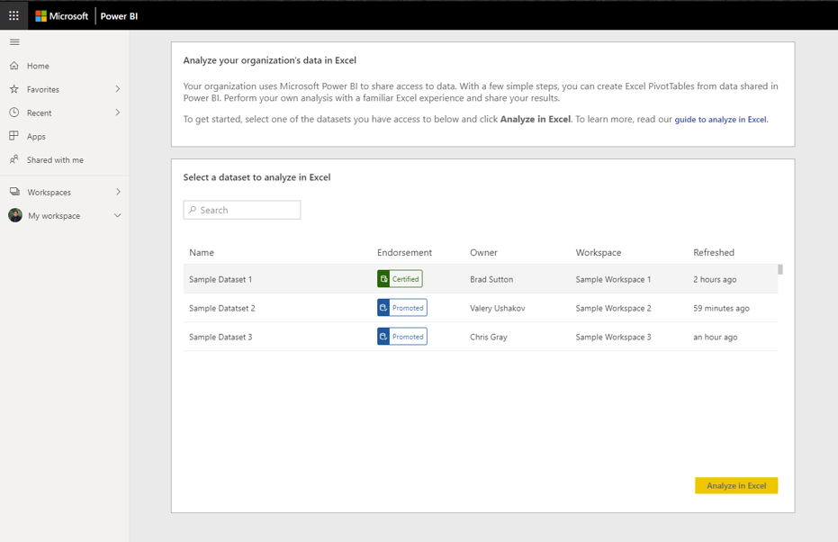
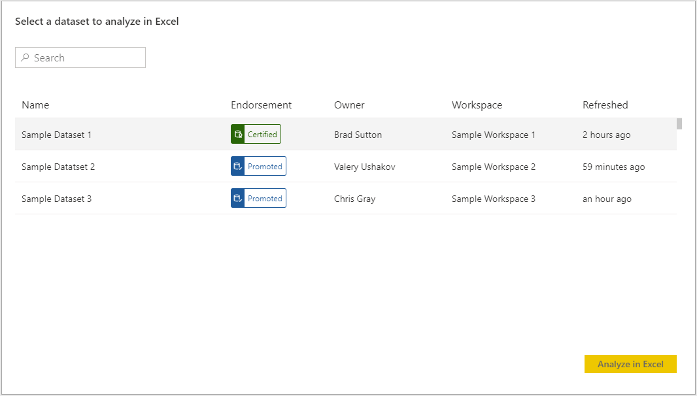
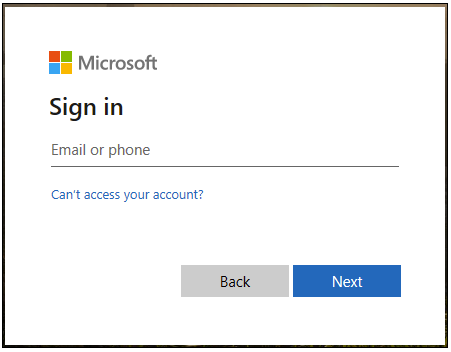

# Tutorial: Use Analyze in Excel

Your organization makes use of Power BI to share access to data. Use the Analyze in Excel feature to create PivotTable and PivotCharts to bring additional context to your analytics or reduce the time taken to find and import relevant datasets.

To get started to select a dataset, select 'Analyze in Excel'. You'll be guided to creating a PivotTable that uses the data.  

You can find additional datasets shared by your organization by returning to powerbi.com/datasets.

If you encounter issues at any point, select No at the appropriate step in the flow below and provide feedback in the linked form.  

In this tutorial, you learn how to:

> [!div class="checklist"]
> * Download an ODC file from the Power BI Datasets page.
> * Enable access to your dataset from Excel.
> * Begin to use the dataset to create PivotTables, charts and worksheets

## Prerequisites

To complete this tutorial, you need:

* A Power BI account. If you're not signed up for Power BI, [sign up for a free trial](https://app.powerbi.com/signupredirect?pbi_source=web) before you begin.

* Ensure you are comfortable with all the steps listed in the [Get started with the Power BI service](https://docs.microsoft.com/en-us/power-bi/service-get-started) tutorial.

* You will need a Power BI Premium dataset and a Power BI Pro license, visit [What is Power BI Premium?](https://docs.microsoft.com/en-us/power-bi/service-premium-what-is) for more information.

* A full list of prerequisites may be found in the comprehensive [Analyze in Excel](https://docs.microsoft.com/en-us/power-bi/service-analyze-in-excel#requirements) document.

Begin by navigating to the [Datasets](https://powerbi.com/datasets) page, and ensure you have a valid dataset to use.

While using the Analyze in Excel workflow, you will see several prompts to guide you; indicate if you have completed each step to progress. If you encounter issues at any step select **No** and kindly provide your feedback on the corresponding form.

## Download and Open the ODC File

Choose your dataset from the corresponding list and associated workspace and then click Analyze in Excel. Power BI will create an ODC file and download it from the browser to your computer.

When you open the file in Excel, an empty PivotTable and Fields list appears with the tables, fields, and measures from the Power BI dataset. You can create PivotTables, charts, and analyze that dataset just as you would work with a local dataset in Excel.

## Enable Data Connections

In order to analyze Power BI data in Excel, you may be prompted to trust the connection. Note that administrators can disable the use of Analyze in Excel with on-premises datasets on Analysis Services Databases from the Power BI Admin Portal.

## Install Updates and Authenticate

You may also be required to authenticate with your Power BI account the first time you open a new ODC file.  If you have issues, visit the comprehensive [Analyze in Excel](https://docs.microsoft.com/en-us/power-bi/service-analyze-in-excel#sign-in-to-power-bi ) document for more information or click No during the workflow.

## Analyze Away

Similar to other local workbooks, Analyze in Excel allows you to create PivotTables, charts, add data, and create different worksheets with views into your data. Note that Analyze in Excel exposes all detail-level data to any users with permission to the dataset. You can save this workbook, but cannot publish or import it back into Power BI or share it with other users in your organization. For more information and other use cases, visit [Analyze in Excel](https://docs.microsoft.com/en-us/power-bi/service-analyze-in-excel#analyze-away).

## Clean Up Resources

Interactions with the Power BI Service and Datasets page should be limited to downloading the ODC file and clicking through the workflow. If you have trouble with any of these steps, indicate **No** on the appropriate step and provide feedback in the linked form. The form will also contain a link to more information about the issue. Revisit the Datasets page to retry the process or select another dataset.

## Next Steps

You might also be interested in the following articles:

* [Use cross-report drillthrough in Power BI Desktop](https://docs.microsoft.com/en-us/power-bi/desktop-cross-report-drill-through)

* [Using slicers Power BI Desktop](https://docs.microsoft.com/en-us/power-bi/visuals/power-bi-visualization-slicers)
