# Tutorial: Build a Machine Learning model in Power BI (Preview)

In this tutorial article, you use **Automated Machine Learning** to create and apply a binary prediction model in Power BI. The tutorial includes guidance for creating a Power BI dataflow, and using the entities defined in the dataflow to train and validate a machine learning model directly in Power BI. We then use that model for scoring to generate predictions.

First, you'll create a Binary Prediction machine learning model, to predict the purchase intent of online shoppers based on a set of their online session attributes. A benchmark machine learning dataset is used for this exercise. Once a model is trained, Power BI will automatically generate a validation report explaining the model results. You can then review the validation report and apply the model to your data for scoring.

This tutorial consists of following steps:

> [!div class="checklist"]
> * Create a dataflow with the input data
> * Create and train a machine learning model
> * Review the model validation report
> * Apply the model to a dataflow entity
> * Using the scored output from the model in a Power BI report

## Create a dataflow with the input data

The first part of this tutorial is to create a dataflow with input data. That process takes a few steps, as shown in the following sections, beginning with getting data.

### Get data

The first step in creating a dataflow is to have your data sources ready. In our case, we use a machine learning dataset from a set of online sessions, some of which culminated in a purchase. The dataset contains a set of attributes about these sessions, which we'll use for training our model.

You can download the dataset from the UC Irvine website.  We also have this available, for the purpose of this tutorial, from the following link: [online_shoppers_intention.csv](https://raw.githubusercontent.com/santoshc1/PowerBI-AI-samples/master/Tutorial_AutomatedML/online_shoppers_intention.csv).

### Create the entities

To create the entities in your dataflow, sign in to the Power BI service and navigate to a workspace on your dedicated capacity that has the AI preview enabled.

If you don't already have a workspace, you can create one by selecting **Workspaces** in the left navigation menu in the Power BI service, and select **Create app workspace** at the bottom of the panel that appears. This opens a panel on the right to enter the workspace details. Enter a workspace name and select **Advanced**. Confirm that the workspace uses Dedicated Capacity using the radio button, and that it's assigned to a dedicated capacity instance that has the AI preview turned on. Then select **Save**.

Once the workspace is created, you can select **Skip** in the bottom right of the Welcome screen, as shown in the following image.

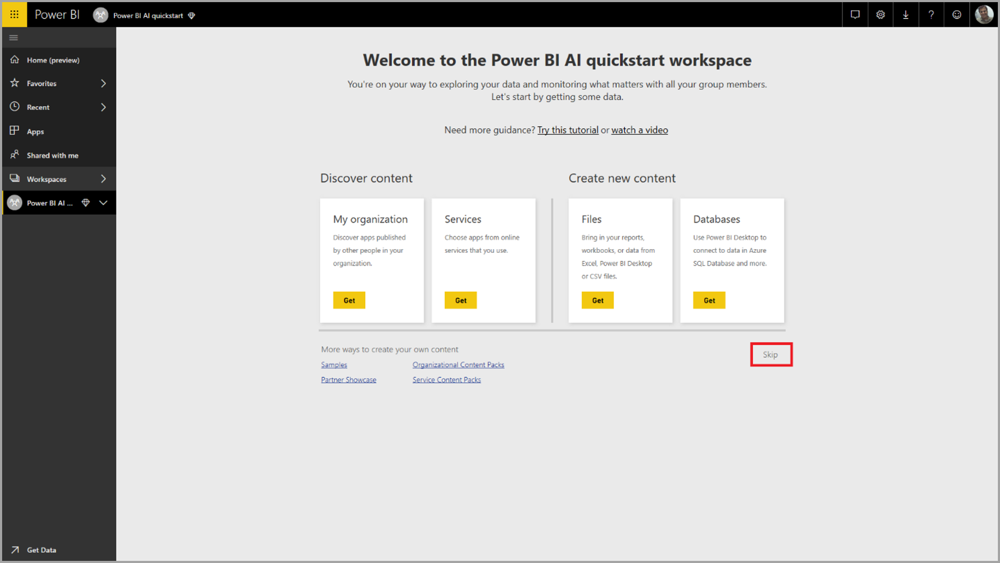

Select the **Dataflows (preview)** tab. Select the **Create** button at the top right of the workspace, and then select **Dataflow**.

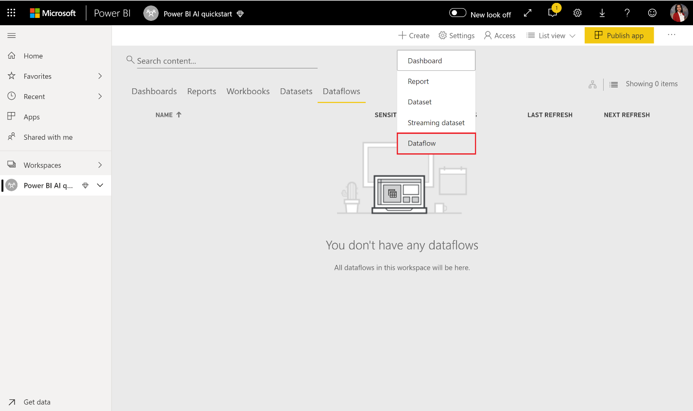

Select **Add new entities**. This launches a **Power Query** editor in the browser.

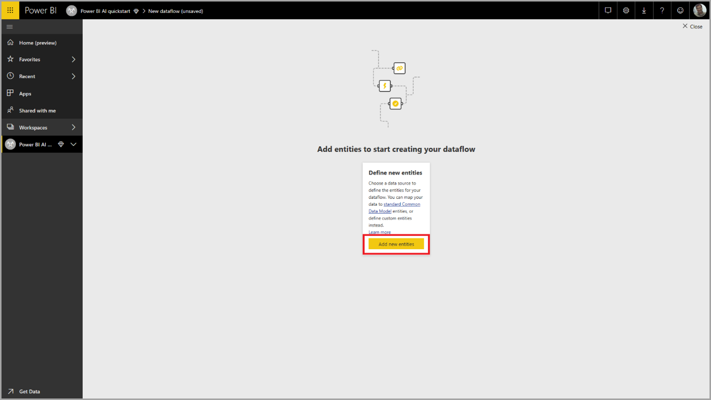

Select **Text/CSV File** as a data source, shown in the following image.

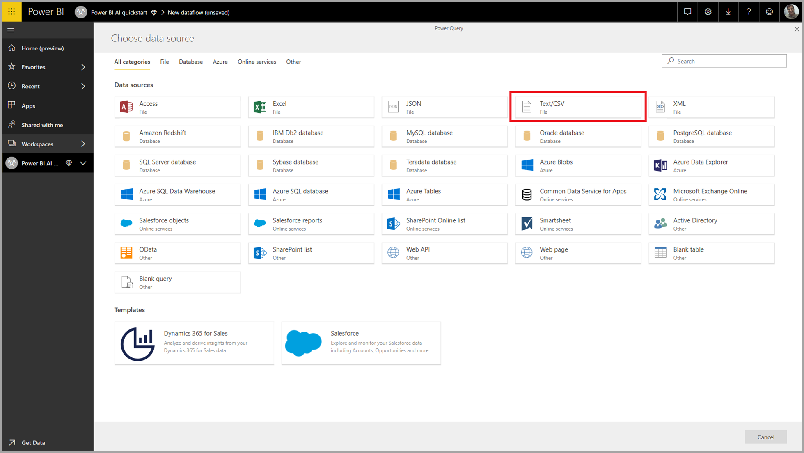

In the **Connect to a data source** that appears next, paste the following link to the *online_shoppers_intention.csv* into the **File path or URL** box, and then select **Next**.

`https://raw.githubusercontent.com/santoshc1/PowerBI-AI-samples/master/Tutorial_AutomatedML/online_shoppers_intention.csv`

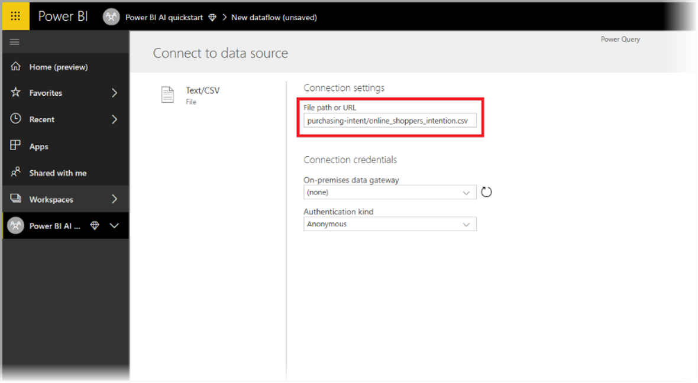

The Power Query Editor shows a preview of the data from the CSV file. Select **Transform Table** in the command ribbon and then select **Use first row as headers** from the menu that appears. This adds the _Promoted headers_ query step into the **Applied steps** section on the right of the screen. You can rename the query to a friendlier name by changing the value in the **Name** box found in the right pane. For example, you could change the Query name to _Online Visitor_.

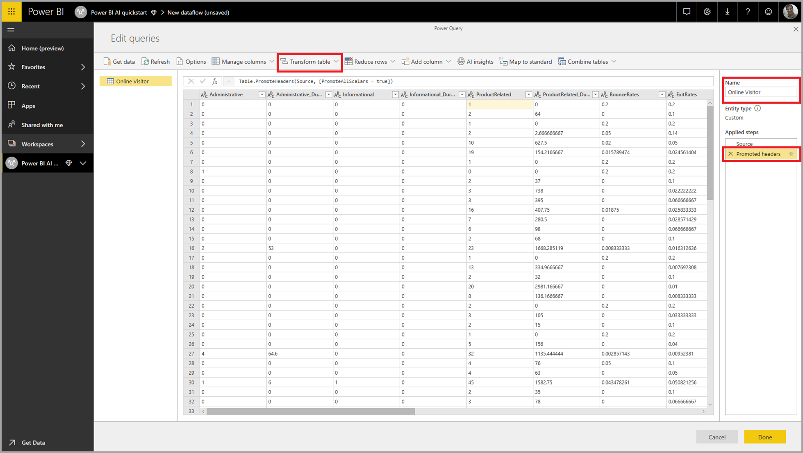

Some of the attribute data types in this dataset are _numeric_ or _Boolean_, though these may be interpreted as strings by **Power Query**. Select the attribute type icon at the top of each column header to change the columns listed below to the following types:

* **Decimal number:** Administrative_Duration; Informational_Duration; ProductRelated_Duration; BounceRates; ExitRates; PageValues; SpecialDay
* **True/False:** Weekend; Revenue

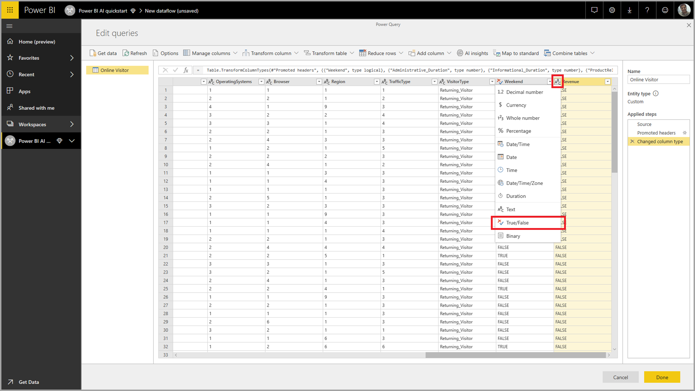

The **Binary Prediction** model we will train requires a Boolean field as a label identifying the outcomes from the past observations. In this dataset, the _Revenue_ attribute indicates purchase, and this attribute is already available as a Boolean. So, we don't need to add a calculated column for the label. In other datasets, you may have to transform existing label attributes into a Boolean column.

Select the **Done** button to close Power Query Editor. This shows the entities list with the _Online Visitors_ data we added. Select **Save** in the top-right corner, provide a name for the dataflow, and then select **Save** on the dialog, as shown in the following image.

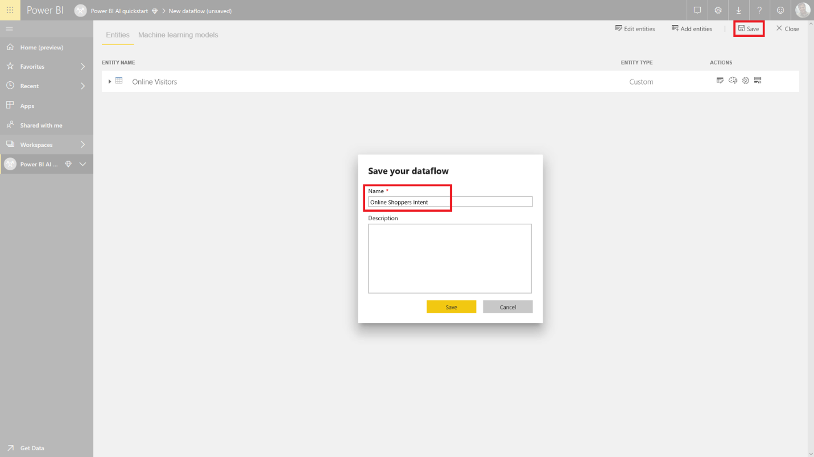

### Refresh the dataflow

Saving the dataflow results in a notification being displayed, stating that your dataflow has been saved. Select **Refresh now** to ingest the data from the source into the dataflow.

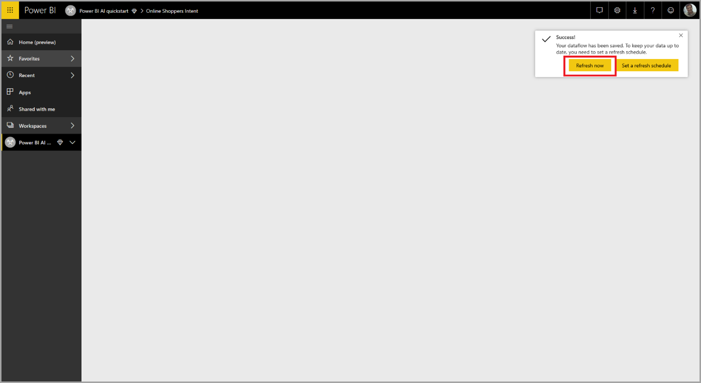

Select **Close** in the upper right corner and wait for the dataflow refresh to complete.

You can also refresh your dataflow by using the **Actions** commands. The dataflow shows the timestamp when the refresh has been completed.

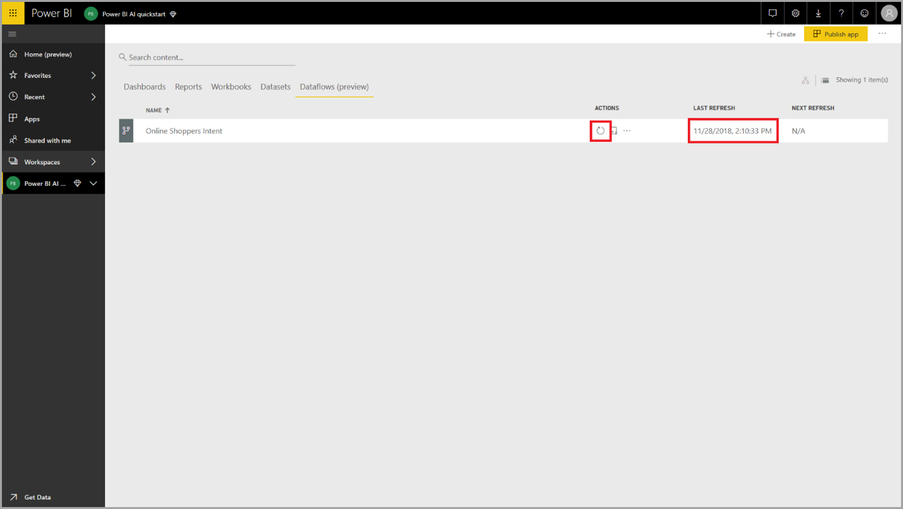

## Create and train a machine learning model

Select the dataflow after the refresh has been completed. To add a machine learning model, Select the **Apply ML model** button in the **Actions** list for the base entity that contains your training data and label information, and then select **Add a machine learning model**.

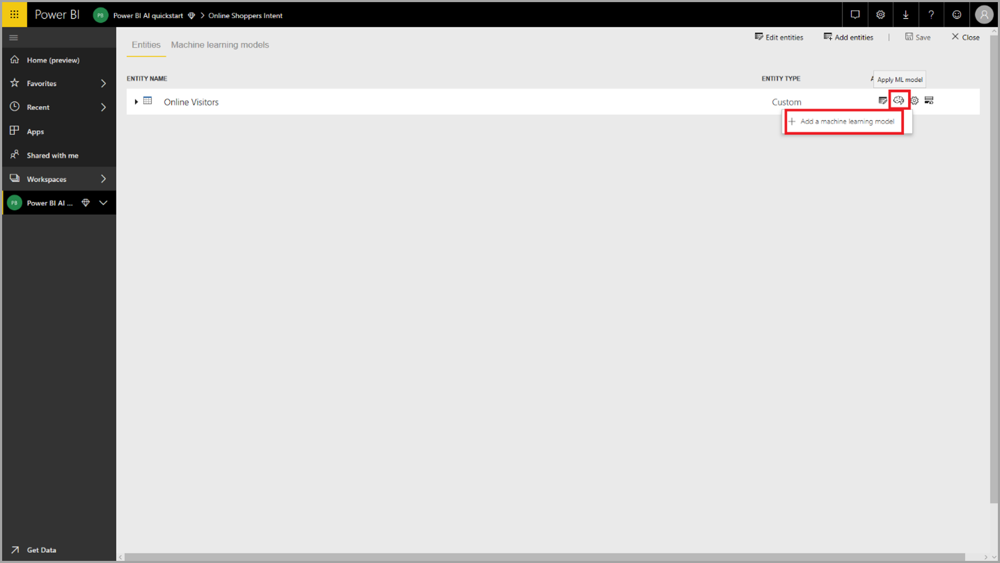

The first step for creating our machine learning model is to identify the historical data including the label field that you want to predict. The model will be created by learning from this data.

In the case of the dataset we're using, this is the **Revenue** field. Select **Revenue** as the 'Historical outcome field' value and then select **Next**.

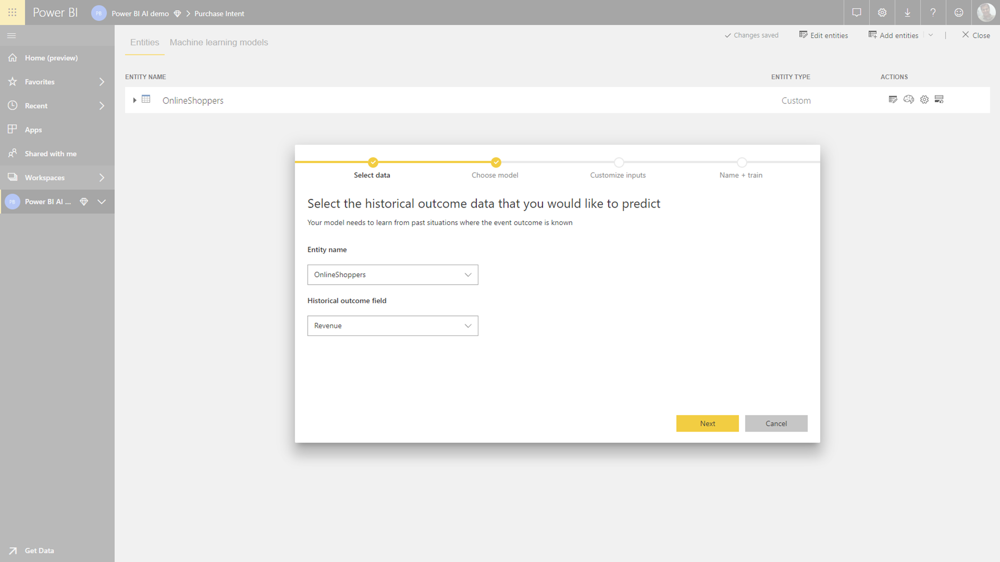

Next, we must select the type of machine learning model to create. Power BI analyzes the values in the historical outcome field that you've identified and suggests the types of machine learning models that can be created to predict that field.

In this case, since we're predicting a binary outcome of whether a user will make a purchase or not, select **Binary Prediction** for the model type, and then select Next.

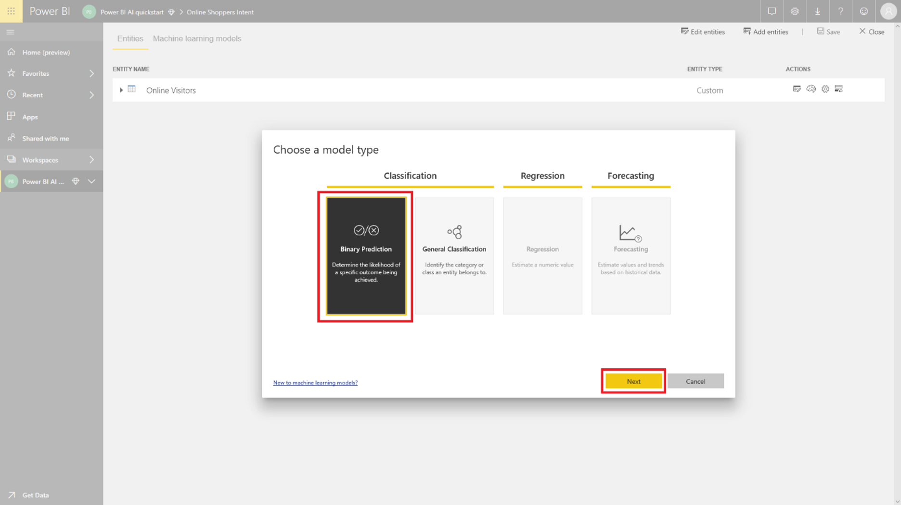

Next, Power BI does a preliminary scan of the data and suggests the inputs that the model could use. You have the option to customize the input fields used for the model. In our curated dataset, to select all the fields, select the checkbox next to the entity name. Select **Next** to accept the inputs.

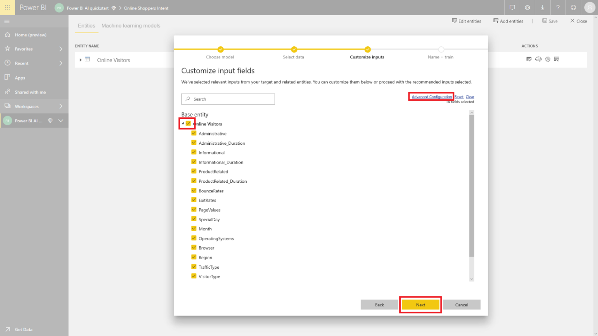

In the final step, we must provide a name for our model, as well as the friendly labels for the outcomes to be used in the automatically generated report that will summarize the results of the model validation. Next we have to name the model _Purchase Intent Prediction_, and the true and false labels as _Purchase_ and _No-Purchase_. Then select **Save**.

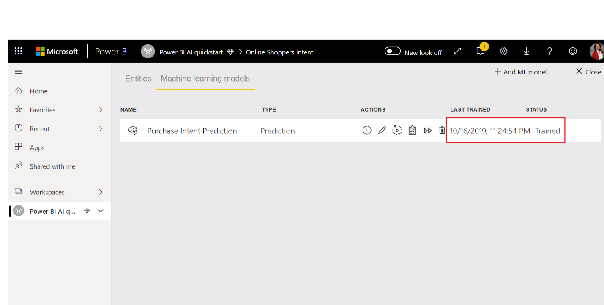

Our machine learning model is now ready for training. Select **Refresh Now** to start training the model.

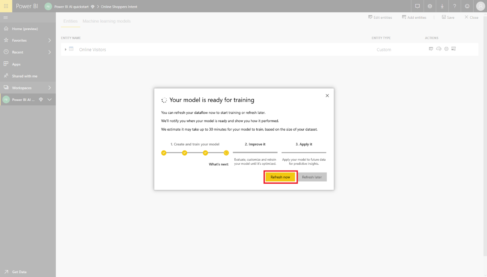

The training process will begin by sampling and normalizing your historical data and splitting your dataset into two new entities *Purchase Intent Prediction Training Data* and *Purchase Intent Prediction Testing Data*.

Depending on the size of the dataset, the training process can take anywhere from a few minutes to a couple of hours. At this point, you can see the model in the **Machine learning models** tab of the dataflow. The _Ready_ status indicates that the model has been queued for training or is under training.

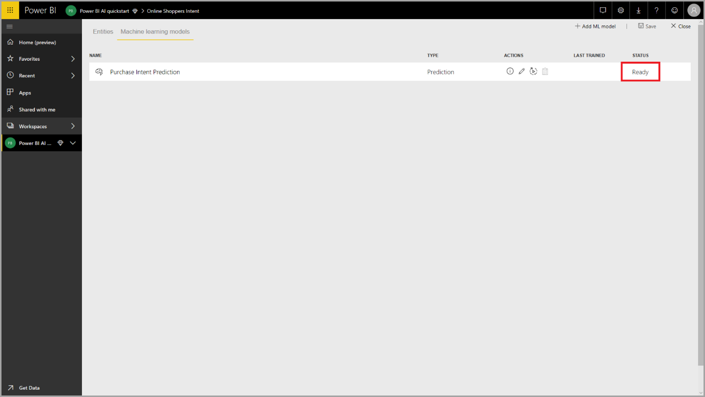

While the model is training, you won't be able to view or edit the dataflow. You can confirm that the model is being trained and validated through the status of the dataflow. This appears as a data refresh in progress in the **Dataflows** tab of the workspace.

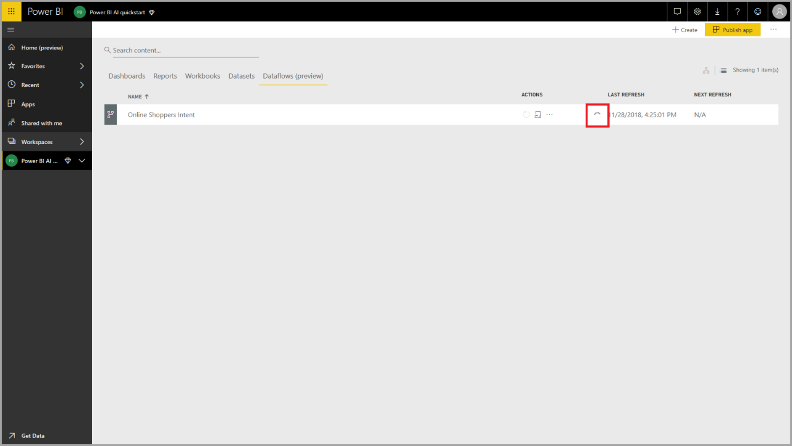

Once the model training is completed, the dataflow displays an updated refresh time. You can confirm that the model is trained, by navigating to the **Machine learning models** tab in the dataflow. The model you created should show status as **Trained** and the **Last Trained** time should now be updated.

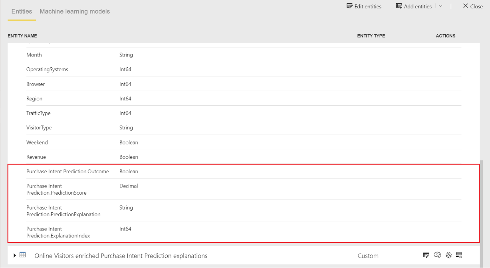

## Review the model validation report

To review the model validation report, in the **Machine learning models, s** elect the **View performance report and apply model** button in the **Actions** column for the model. This report describes how your machine learning model is likely to perform.

In the **Model Performance** page of the report, select **Key Influencers** to view the top predictors for your model. You can select one of the predictors to see how the outcome distribution associated with that predictor.

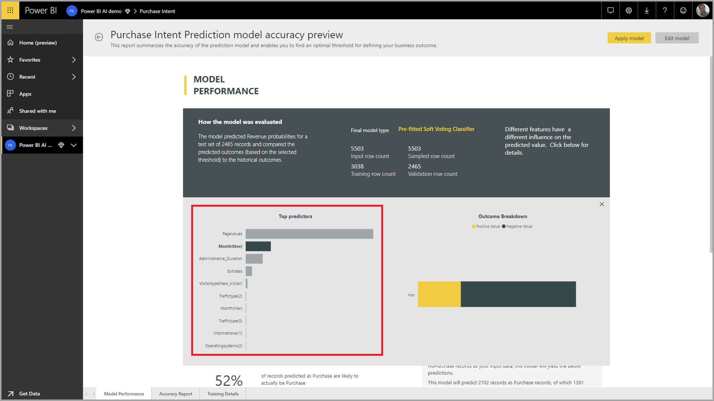

You can use the **Probability Threshold** slicer on the Model Performance page to examine its influence on the Precision and Recall for the model.

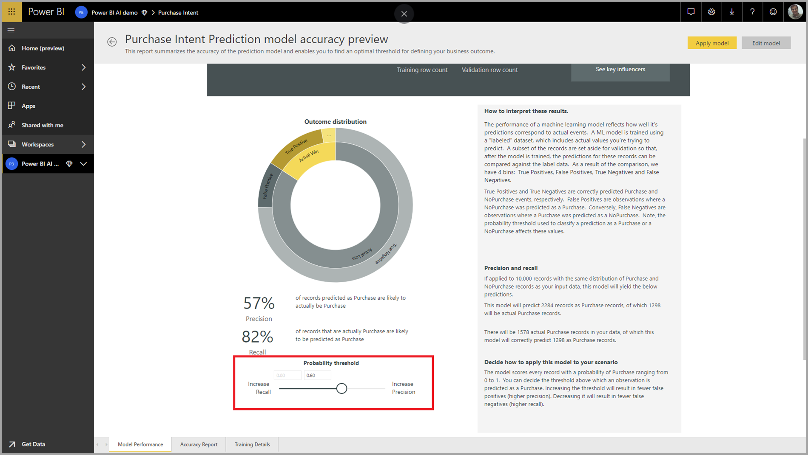

The other pages of the report describe the statistical performance metrics for the model.

The report also includes a Training Details page that describes the different iterations that were run, how features were extracted from the inputs, and the hyperparameters for the final model used.

## Apply the model to a dataflow entity

Select the **Apply model** button at the top of the report to invoke this model when the dataflow is refreshed. In the **Apply** dialog, you can specify the target entity that has the source data to which the model should be applied.

When prompted, you must **Refresh** the dataflow to preview the results of your model.

Applying the model will create a new entity, with the suffix **enriched <model_name>** appended to the entity to which you applied the model. In our case, applying the model to the **OnlineShoppers** entity will create **OnlineShoppers enriched Purchase Intent Prediction**, which includes the predicted output from the model.

Applying a Binary Prediction model adds three columns with predicted outcome, probability score, and the top record-specific influencers for the prediction, each prefixed with the column name specified.

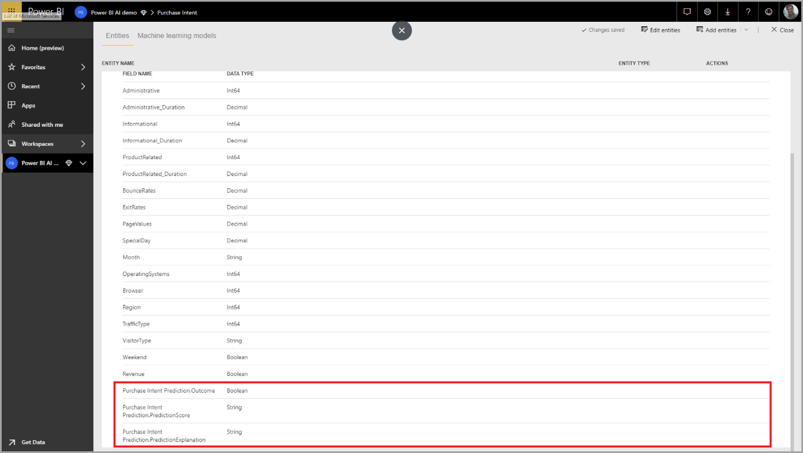

Due to a known issue, the scored output columns in the enriched entity are only accessible from Power BI Desktop. To preview these in the service, you must use a special preview entity.

Once the dataflow refresh is completed, you can select the **OnlineShoppers enriched Purchase Intent Prediction Preview** entity to view the results.

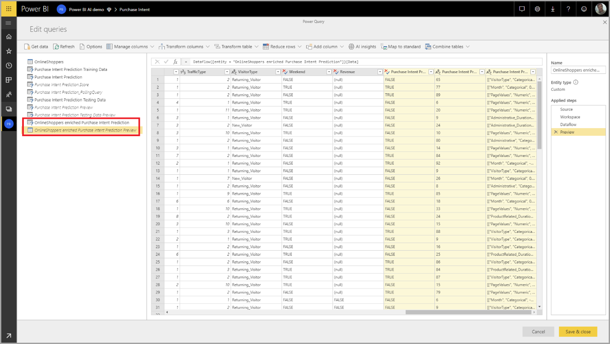

## Using the scored output from the model in a Power BI report

To use the scored output from your machine learning model, you can connect to your dataflow from the Power BI desktop, using the Dataflows connector. The **OnlineShoppers enriched Purchase Intent Prediction** entity can now be used to incorporate the predictions from your model in Power BI reports.

## Next steps

In this tutorial, you created and applied a binary prediction model in Power BI using these steps:

* Create a dataflow with the input data
* Create and train a machine learning model
* Review the model validation report
* Apply the model to a dataflow entity
* Using the scored output from the model in a Power BI report

For more information about Machine Learning automation in Power BI, see [Automated Machine Learning in Power BI (Preview)](service-machine-learning-automated.md).
