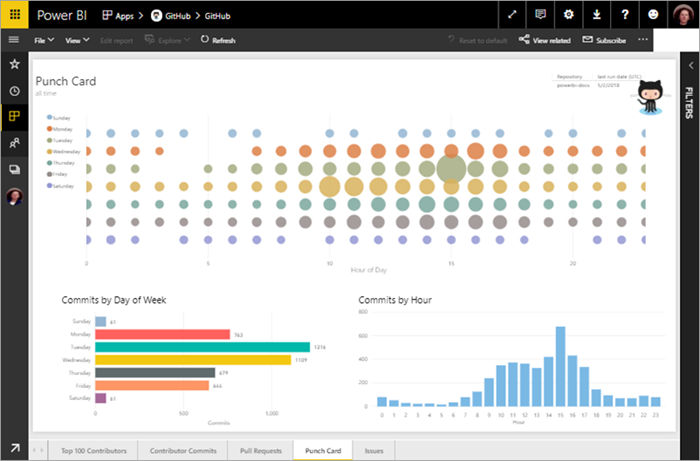
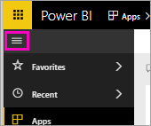
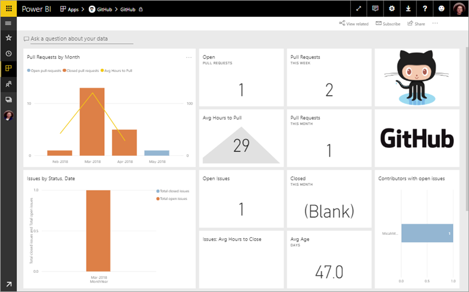
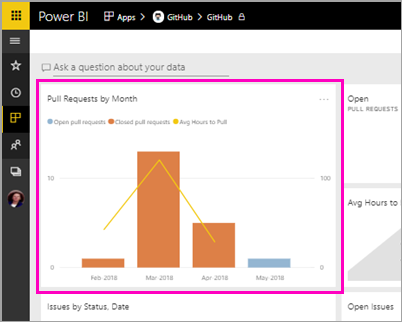
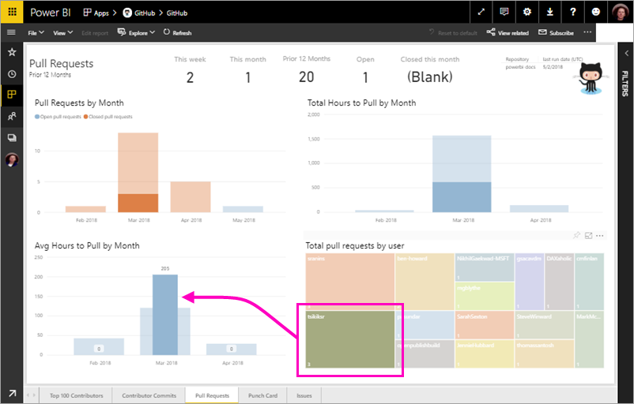
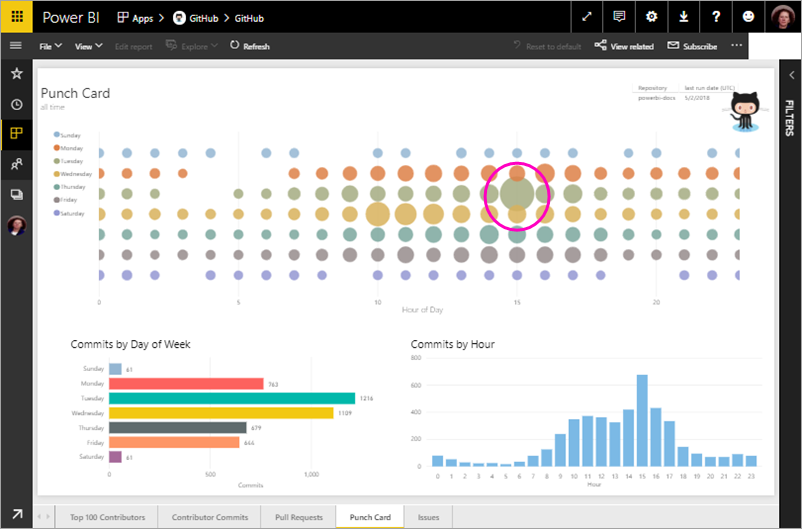
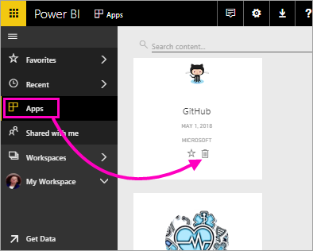

# Tutorial: Connect to a GitHub sample with Power BI
In this tutorial, you connect to real data in the GitHub service with Power BI, and Power BI automatically creates dashboards and reports. You connect to the Power BI content public repository (also known as a *repo*) and see information: How many people contribute to the Power BI public content? Who contributes the most? Which day of the week has the most contributions? And answers to other questions. 

In this tutorial, you complete the following steps:

> [!div class="checklist"]
> * Sign up for a GitHub account, if you don't have one yet 
> * Sign in to your Power BI account, or sign up, if you don't have one yet
> * Open the Power BI service
> * Find the GitHub app
> * Enter the information for the Power BI public GitHub repo
> * View the dashboard and report with GitHub data
> * Clean up resources by deleting the app

If you're not signed up for Power BI, [sign up for a free trial](https://app.powerbi.com/signupredirect?pbi_source=web) before you begin.

## Prerequisites

To complete this tutorial, you need a GitHub account, if you don't already have one. 

- Sign up for a [GitHub account](https://docs.microsoft.com/contribute/get-started-setup-github)

## How to connect
1. Sign in to the Power BI service (http://powerbi.com). 
2. In the left navigation pane, select **Apps**, then **Get apps**.
   
    

3. Select **Apps**, type **github** in the search box > **Get it now**.
   
    

4. Enter the repository name and repository owner of the repo. The URL for this repo is https://github.com/MicrosoftDocs/powerbi-docs, so **Repository Owner** is **MicrosoftDocs**, and **Repository** is **powerbi-docs**. 
   
    

5. Enter the GitHub credentials you created. Power BI might skip this step if you're already signed in to GitHub in your browser. 

6. For **Authentication Method**, select **oAuth2** \> **Sign In**.

7. Follow the Github authentication screens. Grant Power BI permission to the GitHub data.
   
   Now Power BI can connect with GitHub and connect to the data.  The data is refreshed once a day.

8. After Power BI imports the data, you see the new GitHub tile. 
 
    

8. Select the global navigation icon to minimize the left navigation, so you have more room.

    

10. Select the GitHub tile from step 8. 
    
    The GitHub dashboard opens. This is live data, so the values you see may be different.

    

    

## Ask a question

11. Put your cursor in **Ask a question about your data**, then select **pull requests**. 

    

12. Type **by month**.
 
    

     Power BI creates a bar chart showing the number of pull requests per month.

13. Select **Exit Q&A**.

## View the GitHub report 

1. In the GitHub dashboard, select the  combo column-and-line chart **Pull Requests by Month** to open the related report.

    

2. Select a user name in the **Total pull requests by user** chart, and see, as in this example, that they had more average hours than the total average for March.

    

3. Select the **Punch Card** tab to view the next page in the report. 
 
    

    Apparently Tuesdays at 3 pm is the most common time and day of the week for *commits*, when people check in their work.

## Clean up resources

Now that you've finished the tutorial, you can delete the GitHub app. 

1. In the left navigation bar, select **Apps**.
2. Hover over the GitHub tile and select the **Delete** garbage can.

    

## Next steps

In this tutorial, you've connected to a GitHub public repo and gotten data, which Power BI has formatted in a dashboard and report. You've answered some questions about the data by exploring the dashboard and report. Now you can learn more about connecting to other services, such as Salesforce, Microsoft Dynamics, and Google Analytics. 
 
> [!div class="nextstepaction"]
> [Connect to the online services you use](service-connect-to-services.md)

