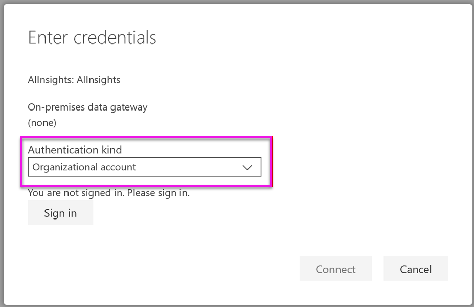

# Tutorial: Use Cognitive Services in Power BI

Power BI provides access to a set of functions from Azure Cognitive Services to enrich your data in the self-service data prep for Dataflows. The services that are supported today are [Sentiment Analysis](https://docs.microsoft.com/azure/cognitive-services/text-analytics/how-tos/text-analytics-how-to-sentiment-analysis), [Key Phrase Extraction](https://docs.microsoft.com/azure/cognitive-services/text-analytics/how-tos/text-analytics-how-to-keyword-extraction), [Language Detection](https://docs.microsoft.com/azure/cognitive-services/text-analytics/how-tos/text-analytics-how-to-language-detection), and [Image Tagging](https://docs.microsoft.com/azure/cognitive-services/computer-vision/concept-tagging-images). The transformations are executed on the Power BI service and do not require an Azure Cognitive Services subscription. This feature requires Power BI Premium.

Cognitive Services transforms are supported in the [Self-Service Data Prep for Dataflows](https://powerbi.microsoft.com/blog/introducing-power-bi-data-prep-wtih-dataflows/). Use the step-by-step examples for text analytics and image tagging below to get started.

In this tutorial, you learn how to:

> [!div class="checklist"]
> * Import data into a dataflow
> * Score sentiment and extract key phrases of a text column in a dataflow
> * Connect to the results from Power BI Desktop


## Prerequisites

To complete this tutorial, you need the following: 

- A Power BI account. If you're not signed up for Power BI, [sign up for a free trial](https://app.powerbi.com/signupredirect?pbi_source=web) before you begin.
- Access to a Power BI Premium capacity with the AI workload enabled. This workload will be turned off by default during preview. If you are in on a Premium capacity and AI Insights are not showing up, contact your Premium capacity admin to enable the AI workload in the admin portal.

## Text analytics

Follow the steps in this section to complete the text analytics portion of the tutorial.

### Step 1: Apply sentiment scoring in Power BI Service

To get started, navigate to a Power BI workspace with Premium capacity and create a new dataflow using the **Create** button in the upper right of the screen.


The dataflow dialog shows you the options for creating a new dataflow, select **Add new entities.** Next, choose **Text/CSV** from the menu of data sources.


Paste this URL into the URL field: [https://pbiaitutorials.blob.core.windows.net/textanalytics/FabrikamComments.csv](https://pbiaitutorials.blob.core.windows.net/textanalytics/FabrikamComments.csv) and click **Next.**


In the upper ribbon, select **Transform Table** and then choose **Use first row as headers.** The data is now ready to use for text analytics, and we can use Sentiment Scoring and Key Phrase Extraction on the customer comments column.

In Power Query Editor, select **AI Insights**


Expand the **Cognitive Services** folder and select the function you would like to use. This example is scoring the sentiment of the comment column, but you can follow the same steps to try out Language Detection and Key Phrase Extraction.


Once a function is selected, the required and optional fields will show. To score the sentiment of the example reviews, select the reviews column as text input. Culture info is an optional input and requires an ISO format. For example, enter 'en' if you want the text to be treated as English. When the field is left blank, Power BI will first detect the language of the input value before scoring the sentiment.


Now select **Invoke** to run the function. A new column with the sentiment score for each row is added to the table. You can go back to **AI insights** to extract key phrases of the review text in the same way.

Once you are finished with the transformations, change the query name to 'Customer comments' and select **Done.**


Next, **Save** the dataflow and name it Fabrikam. Select the **Refresh Now** button that pops up after saving the dataflow.


Once the dataflow is saved and refreshed, you can use it in a Power BI report.

### Step 2: Connect from Power BI Desktop

Open Power BI Desktop. In the Home ribbon, select **Get Data.**

Navigate to the **Power BI dataflows (Beta**) in the Power BI section and select **Connect.**


As this is a preview feature, the connector will ask you to accept the preview conditions. After accepting these, sign in with your organization account.


Select the dataflow you have just created. Navigate to the Customer comments table and click **Load.**


Now the data is loaded you can start building a report.

## Image tagging

Navigate to a Power BI workspace with Premium capacity. Create a new dataflow using the **Create** button in the upper right of the screen.


Select **Add new entities**.


Once you are asked to choose a data source, select **Blank query.**


Copy the query below in the query editor and click next. You can replace the URL paths below with other images or add more rows. The *Web.Contents* function imports the image URL as binary. If you have a data source with images stored as binary, you can also use that directly.


```python
let
  Source = Table.FromRows({
  { Web.Contents("https://images.pexels.com/photos/87452/flowers-background-butterflies-beautiful-87452.jpeg") },
  { Web.Contents("https://upload.wikimedia.org/wikipedia/commons/5/53/Colosseum_in_Rome%2C_Italy_-_April_2007.jpg") }}, { "Image" })
in
  Source
```


When prompted for credentials, select *anonymous*.


You see the following image.


You're prompted for credentials for each individual web page.

Select **AI Insights** in the query editor.


Next, sign in with your **organizational account**.



Select the Tag Images function, enter _[Binary]_ in the column field and _en_ in the culture info field. 

> [!NOTE]
> You currently cannot pick a column using a dropdown, which will be resolved as soon as possible during the private preview.


In the function editor, remove the quotation marks around the column name. 

> [!NOTE]
> Removing the quotation marks is a temporary workaround, which will be resolved as soon as possible during preview.


The function returns a record with both the tags in comma-separated format and as a json record. Select the expand-button to add one or both as columns to the table.


Select **Done** and save the dataflow. Once you have refreshed the dataflow one, you can connect to it from Power BI Desktop using the Dataflows connectors. (See steps on page 5 of this document).

## Clean up resources

When no longer needed, delete the query by right-clicking the query name in the Power Query editor and selecting **Delete**.

## Next steps

In this tutorial, you applied sentiment scoring and image tagging functions on a Power BI dataflow. To learn more about Cognitive Services in Power BI, read the following articles.

* [Cognitive Services in Azure](https://docs.microsoft.com/azure/cognitive-services/)
* Get started [with self-service data prep on dataflows](service-dataflows-overview.md)
* Learn more about [Power BI Premium](https://powerbi.microsoft.com/power-bi-premium/)

You might also be interested in the following articles.

* [Tutorial: Invoke a Machine Learning Studio model in Power BI (Preview)](service-tutorial-invoke-machine-learning-model.md)
* [Azure Machine Learning integration in Power BI (Preview)](service-machine-learning-integration.md)
* [Cognitive Services in Power BI (Preview)](service-cognitive-services.md)