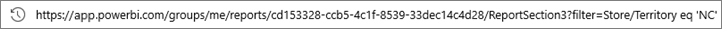
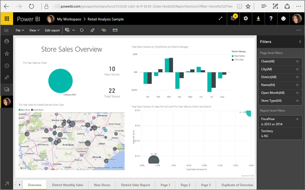

# Filter a report using query string parameters in the URL

When you open a report in Power BI service, each page of the report has its own unique URL. To filter that report page, you could use the Filters pane on the report canvas.  Or you could add query string parameters to the URL to pre-filter the report. Perhaps you have a report you'd like to show colleagues and you want to pre-filter it for them. One way to filter it is to start with the default URL for the report, add the filter parameters to the URL, and then email them the entire new URL.


## Uses for query string parameters

Say you're working in Power BI Desktop. You want to create a report that has links to other Power BI reports, but you want to show only some of the information in the other reports. First, filter the reports using query string parameters and save the URLs. Next, create a table in Desktop with these new report URLs.  Then publish and share the report.

Another use for query string parameters is for someone creating an advanced Power BI solution.  Using DAX, she creates a report that generates a filtered report URL dynamically based on the selection her customer makes in the current report. When customers select the URL, they see only the intended information. 

## Query string parameter syntax for filtering

With parameters, you can filter the report for one or more values, even if those values contain spaces or special characters. The basic syntax is fairly straightforward; start with the report URL, add a question mark, and then add your filter syntax.

URL?filter=***Table***/***Field*** eq '***value***'


* **Table** and **Field** names are case-sensitive, **value** isn't.
* Fields that are hidden from report view can still be filtered.

### Reports in apps

If you want to add a URL filter to a report in an app, the formatting is a little different. Links to reports in an app have a query parameter (ctid) that gets added to the URL. Separate the query parameters with an ampersand (&). Keep “?filter=” and move the ctid parameter to the end of the URL, preceded by an ampersand (&). 

Like this example:

app.powerbi.com/groups/me/apps/*app-id*/reports/*report-id*/ReportSection?filter=*Table*/*Field* eq '*value*&'ctid=*ctid*

### Field types

Field type can be a number, datetime, or string and the type used must match the type set in the dataset.  For example, specifying a table column of type "string" won't work if you're looking for a datetime or numeric value in a dataset column set as a date, such as Table/StringColumn eq 1.

* **Strings** must be enclosed with single quotes - 'manager name'.
* **Numbers** require no special formatting
* **Dates and times** must be enclosed with single quotes. In OData v3 they must be preceded by the word datetime, but datetime isn’t needed in OData v4.

If it's still confusing, continue reading and we'll break it down.  

## Filter on a field

Let’s assume that the URL to our report is the following.


And we see in our map visualization (above) that we have stores in North Carolina.

>[!NOTE]
>This example is based on the [Retail Analysis sample](sample-datasets.md).
> 

To filter the report to show data only for stores in "NC" (North Carolina), append the URL with the following;

?filter=Store/Territory eq 'NC'



>[!NOTE]
>*NC* is a value stored in the **Territory** field of the **Store** table.
> 

Our report is filtered for North Carolina; all the visualizations on the report page show data for only North Carolina.



## Filter on multiple fields

You can also filter on multiple fields by adding additional parameters to your URL. Let's go back to our original filter parameter.

```
?filter=Store/Territory eq 'NC'
```

To filter on additional fields, add an '**and**' and another field in the same format as above. Here is an example.

```
?filter=Store/Territory eq 'NC' and Store/Chain eq 'Fashions Direct'
```

<iframe width="640" height="360" src="https://www.youtube.com/embed/0sDGKxOaC8w?showinfo=0" frameborder="0" allowfullscreen></iframe>

## Operators

Power BI supports many operators in addition to '**and**'. The table below lists those operators along with the content type they support.

|operator  | definition | string  | number | Date |  Example|
|---------|---------|---------|---------|---------|---------|
|**and**     | and |  yes      | yes |  yes|  product/price le 200 and price gt 3.5 |
|**eq**     | equals |  yes      | yes   |  yes       | Address/City eq 'Redmond' |
|**ne**     | not equal |   yes      | yes  | yes        |  Address/City ne 'London' |
|**ge**     |  greater than or equal       | no | yes |yes |  product/price ge 10
|**gt**     | greater than        |no | yes | yes  | product/price gt 20
|**le**     |   less than or equal      | no | yes | yes  | product/price le 100
|**lt**     |  less than       | no | yes | yes |  product/price lt 20
|**in\*\***     |  including       | yes | yes |  yes | Student/Age in (27, 29)


\*\* When using **in**, the values to the right of **in** can be a comma-separated list enclosed in parentheses, or a single expression that returns a collection.

### Numeric data types

A Power BI URL filter can include numbers in the following formats.

|Number type  |Example  |
|---------|---------|
|**integer**     |   5      |
|**long**     |   5 L or 5 l      |
|**double**     |   5.5 or 55e-1 or 0.55e+1 or 5D or 5d or 0.5e1D or 0.5e1d or 5.5D or 5.5d or 55e-1D or 55e-1d     |
|**decimal**     |   5 M or 5 m or 5.5 M or 5.5 m      |
|**float**     | 5 F or 5 f or 0.5e1 F or 0.5e-1 d        |

### Date data types

Power BI supports both OData V3 and V4 for **Date** and **DateTimeOffset** data types.  Dates are represented using the EDM format (2019-02-12T00:00:00), so when you specify a date as YYYY-MM-DD, Power BI interprets it as YYYY-MM-DDT00:00:00.

Why does this distinction matter? Let's say you create a query string parameter **Table/Date gt 2018-08-03**.  Will the results include August 3, 2018 or start with August 4, 2018? Since Power BI translates your query to **Table/Date gt 2018-08-03T00:00:00**, your results include any dates that have a non-zero time part since those dates would be greater than **2018-08-03T00:00:00**.

## Special characters in URL filters

Special characters and spaces require some additional formatting. When your query contains spaces, dashes, or other non-ASCII characters, prefix those special characters with an *escape code* starting with an underscore and an X (**_x**), then the four-digit **Unicode**, then another underscore. If the Unicode is fewer than four characters, you need to pad it with zeroes. Here are some examples.

|Identifier  |Unicode  | Coding for Power BI  |
|---------|---------|---------|
|**Table Name**     | Space is 0x20        |  Table_x0020_Name       |
|**Column**@**Number**     |   @ is 0x40     |  Column_x0040_Number       |
|**[Column]**     |  [ is 0x0058 ] is 0x0050       |  _x0058_Column_x0050_       |
|**Column+Plus**     | + is 0x2B        |  Column_x002B_Plus       |

Table_x0020_Name/Column_x002B_Plus eq 3


Table_x0020_Special/_x005B_Column_x0020_Brackets_x005D_ eq '[C]'


## Use DAX to filter on multiple values

Another way to filter on multiple fields is by creating a calculated column that concatenates two fields to a single value. Then you can filter on that value.

For example, we have two fields: Territory and Chain. In Power BI Desktop, [create a new Calculated column](desktop-tutorial-create-calculated-columns.md) (Field) called TerritoryChain. Remember that the **Field** name can't have any spaces. Here is the DAX formula for that column.

TerritoryChain = [Territory] & " - " & [Chain]

Publish the report to Power BI service and then use the URL query string to filter to display data for only Lindseys stores in NC.

    https://app.powerbi.com/groups/me/reports/8d6e300b-696f-498e-b611-41ae03366851/ReportSection3?filter=Store/TerritoryChain eq 'NC – Lindseys'

## Pin a tile from a filtered report

Once you've filtered the report using query string parameters, you can pin visualizations from that report to your dashboard.  The tile on the dashboard displays the filtered data and selecting that dashboard tile opens the report that was used to create it.  However, the filtering you did using the URL isn't saved with the report. When you select the dashboard tile, the report opens in its unfiltered state.  Thus, the data displayed in the dashboard tile doesn't match the data displayed in the report visualization.

This discrepancy is helpful when you want to see different results; filtered on the dashboard and unfiltered in the report.

## Considerations and troubleshooting

There are a couple of things to be aware of when using the query string parameters.

* When using the *in* operator, the values to the right of *in* must be a comma-separated list enclosed in parentheses.    
* In Power BI Report Server, you can [pass report parameters](https://docs.microsoft.com/sql/reporting-services/pass-a-report-parameter-within-a-url?view=sql-server-2017.md) by including them in a report URL. These URL parameters aren't prefixed because they're passed directly to the report processing engine.
* Query string filtering doesn't work with [Publish to web](service-publish-to-web.md) or [Export to PDF](consumer/end-user-pdf.md).
* [Embed with report web part in SharePoint Online](service-embed-report-spo.md) doesn't support URL filters.
* The long data type is (2^53-1) due to Javascript limitations.
* Report URL filters have a 10-expression limit (10 filters connected by AND).

## Next steps

[Pin a visualization to a dashboard](service-dashboard-pin-tile-from-report.md)  
[Sign up for a free trial](https://powerbi.microsoft.com/get-started/)

More questions? [Try asking the Power BI Community](http://community.powerbi.com/)
