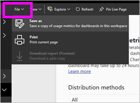

# Usage metrics for dashboards and reports

If you create dashboards and reports, usage metrics help you understand their impact. When you run either dashboard usage metrics or report usage metrics, you discover how those dashboards and reports are being used throughout your organization; what is being used, by whom, and for what purpose.  

> [!NOTE]
> Usage metrics will track usage of reports that are embedded in SharePoint Online. However, usage metrics will not track embedding of dashboards and reports via the “user owns credentials” or “app owns credentials” flow. Usage metrics will also not track usage of reports embedding via [publish to web](service-publish-to-web.md).

These usage metrics reports are read-only. However, you can personalize a usage metrics report by using "Save as." This creates a brand new dataset and converts the read-only report to a full-featured Power BI report that you can edit. Not only does the personalized report contain metrics for the selected dashboard or report, but by removing the default filter, you now have access to usage metrics for all dashboards or all reports in the selected workspace. And you can even see the names of your end users.

## Why are usage metrics important to me?

Knowing how your content is being used helps you demonstrate your impact and prioritize your efforts. Your usage metrics may show that one of your reports is used daily by a huge segment of the organization and it may show that a dashboard you created isn't being viewed at all. This type of feedback is invaluable in guiding your work efforts.

Running usage metrics reports is only available in Power BI service.  However, if you save a usage metrics report or pin it to a dashboard, you will be able to open and interact with that report on mobile devices.

### Prerequisites

- The usage metrics feature captures usage information from all users, regardless of the license they're assigned. However, a Power BI Pro license is required to run and access the usage metrics data.
- Usage metrics are provided on dashboards or reports in the selected workspace. To  access usage metrics for a particular dashboard or report, you must:    
    • Have edit access to that dashboard or report
    • Have a Pro license

## About the Usage Metrics report

When you select **Usage metrics** or the icon , Power BI generates a pre-built report with usage metrics for that content for the last 90 days.  The report looks similar to the Power BI reports you're already familiar with, but it's designed to be informational -- not interactive. You’ll be able to slice based on how your end users received access, whether they were accessing via the web or mobile app, etc. As your dashboards and reports evolve, so too will the usage metrics report, which updates every day with new data.  

Usage metrics reports won't show up in **Recent**, **Workspaces**, **Favorites**, or other content lists. They cannot be added to an app. If you pin a tile from a usage metrics report to a dashboard, that dashboard cannot be added to an app or content pack.

To dig down into the report data, or to build your own reports against the dataset, use **Save as** (see [Save the Usage Metrics report as a full-featured Power BI report](#Save-the-Usage-Metrics-report-as-a-full-featured-Power-BI-report-(personalize)).

## Open a Usage Metrics report for a dashboard or report

1. Start in the workspace that contains the dashboard or report.
2. From either the workspace content list or from the dashboard or report itself, select the icon for **Usage metrics**  .

    

    
3. The first time you do this, Power BI creates the usage metrics report and lets you know when it's ready.

    
4. To open the results, select **View usage metrics**.

    Usage metrics will be a powerful ally as you work to deploy and maintain Power BI dashboards and reports. Wondering which pages of your report are most useful, and which ones you should phase out? Slice by **Report page** to find out. Wondering if you should build a mobile layout for your dashboard? Slice by **Platforms** to discover how many users are accessing your content via the mobile apps vs. via web browser.

5. Optionally, hover over a visualization and select the pin icon to add the visualization to a dashboard. Or, from the top menubar, select **Pin Live Page** to add the entire page to a dashboard. From the dashboard you can monitor the usage metrics more-easily or share them with others.

    > [!NOTE]
    > If you pin a tile from a usage metrics report to a dashboard, that dashboard cannot be added to an app or content pack.

## Which metrics are reported?

| Metric | Dashboard | Report | Description |
| --- | --- | --- | --- |
| Distribution method slicer |yes |yes |How users got access to the content. There are 3 possible methods: users can access the dashboard or report by being members of an [app workspace](consumer/end-user-experience.md), by having the content [shared with them](service-share-dashboards.md), or by installing a content pack/app.  Note that views through an app are counted as "content pack." |
| Platforms slicer |yes |yes |Was the dashboard or report accessed via the Power BI service (powerbi.com) or a mobile device? Mobile includes all our iOS, Android, and Windows apps. |
| Report page slicer |no |yes |If the report has more than 1 page, slice the report by the page(s) that was viewed. If you see a list option for "Blank," that means a report page was recently added (within 24 hours the actual name of the new page will appear in the slicer list) and/or report pages have been deleted. "Blank" captures these types of situations. |
| Views per day |yes |yes |Total number of views per day - a view is defined as a user loading a report page or dashboard. |
| Unique viewers per day |yes |yes |Number of *different* users who viewed the dashboard or report (based on the AAD user account). |
| Views per user |yes |yes |Number of views in the past 90 days, broken down by individual users. |
| Shares per day |yes |no |Number of times the dashboard was shared with another user or group. |
| Total views |yes |yes |Number of views in the past 90 days. |
| Total viewers |yes |yes |Number of unique viewers in the past 90 days. |
| Total shares |yes |no |Number of times the dashboard or report was shared in the past 90 days. |
| Total in organization |yes |yes |Count of all dashboards or reports in the entire organization which had at least one view in the past 90 days.  Used to calculate rank. |
| Rank: Total views |yes |yes |For total views of all dashboards or reports in the organization over the past 90 days, where does this dashboard or report rank. |
| Rank: Total shares |yes |no |For total shares of all dashboards in the organization over the past 90 days, where does this dashboard or report rank. |

### Dashboard Usage Metrics report

### Report Usage Metrics report

## Save the Usage Metrics report as a full featured Power BI report (personalize)

Use **Save as** to convert the usage metrics report to a full-featured Power BI report that can be customized and shared. Once you’ve created a personalized copy, you’ll get full access to the underlying dataset, allowing you to customize the usage metrics report to your specific needs. You can even use Power BI Desktop to build custom usage metrics reports using the [live connection to Power BI service feature](https://powerbi.microsoft.com/blog/connecting-to-datasets-in-the-power-bi-service-from-desktop).

Better yet, the underlying dataset includes the usage details for all dashboards or reports in the workspace. This opens up yet another world of possibilities. You could, for example, create a report which compares all dashboards in your workspace based on usage. Or, you could create a usage metrics dashboard for your Power BI app by aggregating usage across all the content distributed within that app.  See [remove the Page level filter](#remove-the-filter-to-see-all-the-usage-metrics-data-in-the-workspace) below.

### What is created when using "Save as"?

When Power BI creates the full-featured report, it also creates a new dataset **made up of all the dashboards or all the reports contained in the current workspace** that have been accessed in the last 90 days. For example, say you have a workspace named "Sales" and it contains three dashboards and two reports, and you create a usage metrics report on the "Northeast" dashboard. And then you use **Save as** to personalize and convert it to a full-featured report. The dataset for that new report contains the usage metrics *not only for that one dashboard named "Northeast"* but for all three dashboards in the "Sales" workspace. By default, the report will display data for the "Northeast" dashboard and you'll need to [remove a filter](#remove-the-filter-to-see-all-the-usage-metrics-data-in-the-workspace) (single click) to display data for all three dashboards.

### Create a copy of the usage report using "Save as"

When you create a copy using "Save as" (personalize), Power BI converts the read-only pre-built report to a full-featured report.  At first glance, it looks exactly the same. However, you can now open the report in Editing view, add new visualizations, filters, and pages, modify or delete existing visualizations, and so much more. Power BI saves the brand new report and dataset in the current workspace. In the example below, the current workspace is **mihart**.

1. From the pre-built usage metrics report, select **File > Save As**. Power BI converts the usage metrics report into a full-featured Power BI report. This is called a *personalized* usage metrics report. The personalized usage report and dataset are saved in the current workspace which is named **mihart*.

    
2. Open the report in Editing view and [interact with it as you would with any other Power BI report](service-interact-with-a-report-in-editing-view.md). For example, add new pages and build new visualizations, add filters, format the fonts and colors, etc.

    
3. Alternately, start with the new dataset and build a report from scratch.

    
4. The new report is saved in the current workspace (mihart) and also added to the **Recent** content list.

    

### Remove the filter to see ***all*** the usage metrics data in the workspace

To see the metrics for all the dashboards or for all the reports in the workspace, you'll have to remove a filter. By default, the personalized report is filtered to display metrics for only the dashboard or report that was used to create it.

If, for example, you used the dashboard named "European sales" to create this new personalized report, only usage data from the "European sales" dashboard will display. To remove the filter, and enable data from all the dashboards in that workspace:

1. Open the personalized report in Editing view.

    
2. In the Filters pane, locate the **Report level filters** bucket and remove the filter by selecting the "x".

    

    Now your personalized report displays metrics for the entire workspace.

## Admin controls for usage metrics - for Power BI administrators

Usage metrics reports are a feature that the Power BI or Office 365 administrator can turn on or off. Administrators have granular control over which users have access to usage metrics; they are On by default for all users in the organization.

1. Open the Admin portal by selecting the gear icon in the top-right-corner of Power BI service and choosing **Admin portal**.

    
2. From the Admin portal, select **Tenant settings** and choose **Usage metrics for content creators**.

    
3. Enable (or disable) usage metrics and select **Apply**.

    

By default, per-user data is enabled for usage metrics, and content creator account information is included in the metrics report. If you don’t want to include this information for some or all users, disable the feature for specified security groups or for an entire organization. Account information will then show in the report as *Unnamed*.

When disabling usage metrics for their entire organization, admins can use the **delete all existing usage metrics content** option to delete all existing reports and dashboard tiles that were built using the usage metrics reports and datasets. This option removes all access to usage metrics data for all users in the organization who may already be using it. Be careful, because deleting existing usage metrics content is irreversible.

## Usage metrics in national clouds

Power BI is available in separate national clouds. These clouds offer the same levels of security, privacy, compliance and transparency as the global version of Power BI, combined with a unique model for local regulations on service delivery, data residency, access, and control. Due to this unique model for local regulations, usage metrics are not available in national clouds. For more information, see [national clouds](https://powerbi.microsoft.com/en-us/clouds/).

## Considerations and limitations

It's important to understand that differences that can occur when comparing usage metrics and audit logs, and why. *Audit logs* are collected using data from the Power BI service, and *Usage metrics* are collected on the client. Because of that difference, aggregate counts of activities in audit logs may not always match usage metrics, because of the following:

* Usage metrics may sometimes undercount activities due to inconsistent network connections, ad blockers, or other issues that can disrupt sending the events from the client.
* Certain types of views are not included in usage metrics, as described earlier in this article.
* Usage metrics may sometimes overcount activities, in situations where the client refreshes without the need for a request being sent back to the Power BI service.

In addition to potential differences between usage metrics and audit logs, the following questions and answers about usage metrics may be helpful for users and administrators:

Q:    I can't run usage metrics on a dashboard or report
A:    You can only see usage metrics for content you own or have permissions to edit.

Q:    Will usage metrics capture views from embedded dashboards and reports?
A:    Usage metrics currently does not support capturing usage for embedded dashboards, reports, and the [publish to web](service-publish-to-web.md) flow.          In those cases, we recommend using existing web analytics platforms to track usage for the hosting app or portal.

Q:    I can't run usage metrics on any content at all.
A1:    Admins can turn off this feature for their organization.  Contact your Admin to see if this is the case.
A2:    Usage metrics is a Power BI Pro feature.

Q:    The data doesn't seem up-to-date. For example, distribution methods don't show up, report pages are missing, etc.
A:    It can take up to 24 hours for data to update.

Q:    There are four reports in the workspace but the usage metrics report only displays 3.
A:    The usage metrics report only includes reports (or dashboards) that have been accessed in the past 90 days.  If a report (or dashboard) does not show up, likely it hasn't been used in more than 90 days.

## Next steps

[Favorite a dashboard](consumer/end-user-favorite.md)

More questions? [Try the Power BI Community](http://community.powerbi.com/)
