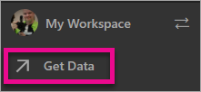
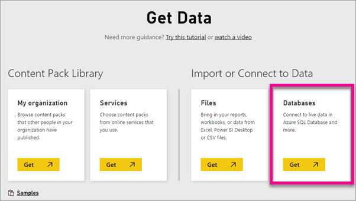
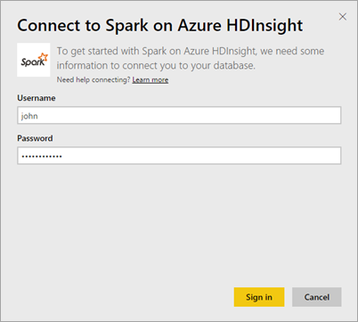
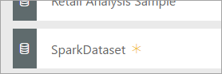

# Spark on HDInsight with DirectQuery

Spark on Azure HDInsight with DirectQuery allows you to create dynamic reports based on data and metric you already have in your Spark cluster. With DirectQuery, queries are sent back to your Azure HDInsight Spark cluster as you explore the data in the report view. This experience is suggested for users who are familiar with the entities they connect to.

> [!WARNING]
> Automatic tile refresh has been disabled for dashboard tiles built on Spark based datasets. You can select **Refresh Dashboard Tiles** to refresh manually. Reports are not impacted and should remain up-to-date. 

You can use the following steps to connect to your Spark on Azure HDInsight data source using DirectQuery within the Power BI service.

> [!Important]
> We have been improving our connectivity to Spark.  For the best experience to connect to your Spark data source, use Power BI Desktop.  Once you've built your model and report, you can publish it to the Power BI service.  The direct connector for Spark in the Power BI service is now deprecated.

1. Select **Get Data** at the bottom of the left navigation pane.

     
2. Select **Databases & More**.

     
3. Select the **Spark on HDInsight** connector and choose **Connect**.

     
4. Enter the name of the **server** you want to connect to, as well as your **username** and **password**. The server is always in the form \<clustername\>.azurehdinsight.net, see more details about finding these values below.

     

     
5. Once connected, you'll see a new dataset with named “SparkDataset”. You can also access the dataset through the placeholder tile that is created.

     
6. Drilling into the dataset, you can explore all of the tables and columns in your database. Selecting a column will send a query back to the source, dynamically creating your visual. These visuals can be saved in a new report, and pinned back to your dashboard.

## Finding your Spark on HDInsight parameters

The server is always in the form \<clustername\>.azurehdinsight.net, and can be found in the Azure portal.

The username and password can also be found in the Azure portal.

## Limitations

These restrictions and notes may change as we continue to improve the experiences. Additional documentation can be found at [Use BI tools with Apache Spark on Azure HDInsight](/azure/hdinsight/spark/apache-spark-use-bi-tools/)

* The Power BI service only supports a configuration of Spark 2.0 and HDInsight 3.5.
* Every action such as selecting a column or adding a filter will send a query back to the database – before selecting very large fields, consider choosing an appropriate visual type.
* Q&A is not available for DirectQuery datasets.
* Schema changes are not picked up automatically.
* Power BI supports 16,000 columns **across all tables** within a dataset. Power BI also includes an internal row number column per table. This means if you have 100 tables in the dataset, the available number of columns would be 15,900. Depending on the amount of data you are working with from your Spark data source, you may encounter this limitation.

## Troubleshooting

If you're hitting issues executing queries against your cluster, verify the application is still running and restart if necessary.

You can also allocate additional resources within the Azure portal under **Configuration** > **Scale Cluster**:

## Next steps

[Get started: Create Apache Spark cluster on HDInsight Linux and run interactive queries using Spark SQL](/azure/hdinsight/spark/apache-spark-jupyter-spark-sql/)  
[What is Power BI?](power-bi-overview.md)  
[Get Data for Power BI](service-get-data.md)
[Use Kerberos on the On-premises gateway for SSO](service-gateway-sso-kerberos.md)

More questions? [Try the Power BI Community](http://community.powerbi.com/)