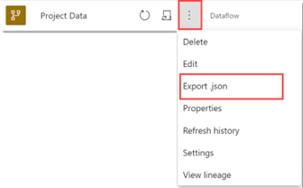

# Best practices when creating a support ticket

The specific information Microsoft requires to troubleshoot your case depends on the issue you're experiencing. This article provides tips and best practices for gathering necessary information for support requests. **Note,not all of these are applicable to every case**.  

## Information to provide to Microsoft

Depending on your specific issue, you may be asked to provide the following information.

1. The URL for the browser page where you're experiencing the issue.
    The URL provides information about where (workspace) you experience the issue and the item or feature type and ID.

2. Location of issue (Power BI Desktop/ Power BI service/ both)
    This information is always relevant for a service request. If a process fails on the Power BI service but succeeds on Desktop, or vice versa, this provides useful information to Microsoft as to the possible cause of the issue. Another example would be where the same M code works in a dataset but fails in a dataflow. Beyond these two examples there are many scenarios where it's possible to troubleshoot the issue by identifying exactly where it occurs and where it doesn't.

3. Error Codes

    If an error code is generated when something goes wrong, make a copy of that error code. Microsoft saves detailed information about all error codes and uses this information to dignose your issue. The error code is unlikely to resolve the issue on its own, but it significantly speeds up the troubleshooting process.

    > [!Tip]
    > Use the **Copy** button to retrieve the code. Don't send a screenshot. Error codes are long (typically 30 characters long), and manually transcribing from a screenshot increases the possibility of getting it wrong.  

4. Data sources and storage mode being used
    Data source information is always relevant for a service request. Each data source has certain issues only relevant to itself. Where multiple sources are used, use trial and error to identify which source(s) are contributing to the issue. 
    
    Power BI also behaves differently when different storage modes are used. The three main storage mode options are:

    -   [Import](../connect-data/service-dataset-modes-understand.md#import-mode)

    -   [Direct Query](../connect-data/service-dataset-modes-understand.md#directquery-mode)

    -   [Live connection](../connect-data/service-live-connect-dq-datasets.md)

    There are also two special cases:

    - [Mixed modes storage (composite models)](../transform-model/desktop-composite-models.md)
    - [Direct Query for PBI Datasets and Analysis Services](../connect-data/desktop-directquery-datasets-azure-analysis-services.md)

    To identify data sources being used in the Power BI Desktop, select **Data source settings** > **Data sources** in the current file. In the Power BI service, navigate to the settings page under Data source credentials or via the lineage view. You can access this by selecting '**View lineage**' or changing the workspace view from list to lineage. 

   > [!Tip]
   >To understand the storage mode being used, contact the report developer or review the PBIX file.

5. Capacity ID

     The capacity ID lets Microsoft know the type of capacity being used (e.g., Premium). Only the Capacity administrator can look up the capacity ID. If you are the capacity admin, open the Admin portal and select **Capacity settings** > **Power BI Premium** and select the name of the capacity. The capacity ID is the last part of the URL. 

    `https://app.powerbi.com/admin-portal/capacities/`**XXXXXXXX-XXXX-XXXX-XXXX-XXXXXXXXXXXX**

    Alternatively, the Capacity administrator can use this [REST API](/rest/api/power-bi/capacities/get-capacities) to retrieve the capacity ID. 

6. Dataset ID

    If your issue is impacting a dataset, the ID helps Microsoft identify the correct dataset and then investigate the processes running on that dataset. To find the dataset ID, navigate to the workspace that contains the dataset and open the **Dataset settings**. The dataset ID is the last part of the URL (datasets/dataset-id).

    `https://app.powerbi.com/groups/XXXXXXXX-XXXX-XXXX-XXXX-XXXXXXXXXXXX/settings/datasets/`**XXXXXXXX-XXXX-XXXX-XXXX-XXXXXXXXXXXX**

7. A copy of the PBIX file (import queries only)

    When experiencing an issue with an import model, having the PBIX file helps the support engineer reproduce the issue and expedite the troubleshooting. If the PBIX contains confidential information, be sure to share an anonymized version. 

    > [!IMPORTANT]
    > Be sure to confirm with the relevant parties within your organization before sharing potentially confidential information.

8. Gateway logs

    Gateways logs are required when troubleshooting any Gateway or network issue. To analyze the gateway performance yourself, use the [Gateway performance monitoring template](/data-integration/gateway/service-gateway-performance). For more information, see [export logs for a support ticket](../connect-data/service-gateway-onprem-tshoot.md#export-logs-for-a-support-ticket).

9. Diagnostic Information

    Follow the steps in [Power BI Desktop diagnostics collection](../fundamentals/desktop-diagnostics.md) to view and collect diagnostic information. 

10. Dataflow JSON

    This can be useful when a dataflow is in use. To export the JSON and share with your support endingeer, navigate to the workspace, select the dataflow item, and choose **Export.json**.

    

## Additional Considerations

Beyond the standard information described above, the following information, if available, helps your support engineer troubleshoot your issue.  

### Does the issue only occur in a certain capacity?

Does switching to another capacity or shared capacity resolve the issue? Sometimes issues are specific to certain environments.

### Does the issue impact all users?

Is the issue company-wide, impacting only a set number of people, or only one individual.  

### Is this a new issue for something that was previously working?

Did the error begin without any changes being made on the user side, or was it triggered by some kind of change or a new implementation. Identifying the break point helps narrow down the potential root cause.

### Is the issue narrower or wider than initially experienced?

Is the issue impacting all, some, or just one "thing". For instance, if the issue relates to APIs, are other APIs working? If it's an export issue, are all reports impacted? If it's a capacity issue, are all capacities behaving the same way? If a report isn't refreshing and it contains multiple data sources, has each source been tested separately? 

### Have any troubleshooting steps already been attempted?

This speeds up resolution of your issue by avoiding repetition. However, in certain circumstances, your support engineer may still want to repeat the steps you've taken.

### Can the issue be replicated in a simpler form?

Sometimes confidential information can't be shared with Microsoft. Try to replicate the issue using a simplified version of the issue and provide reliable repro steps to your support engineer.

