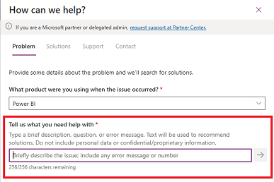
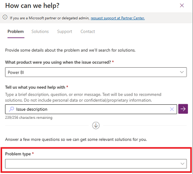
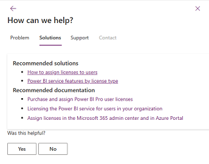
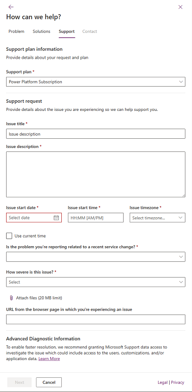
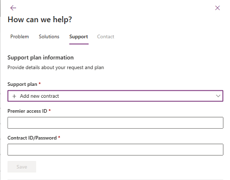
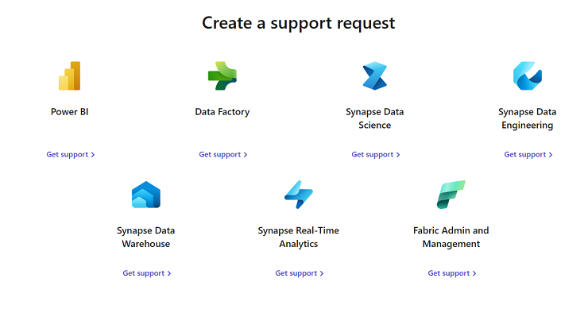
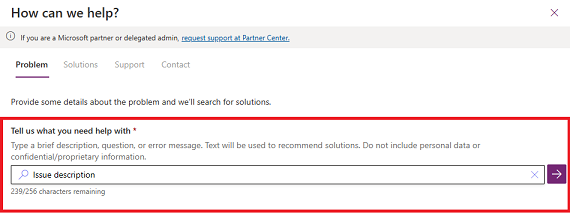
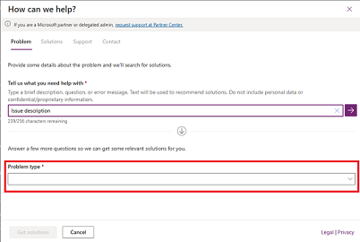
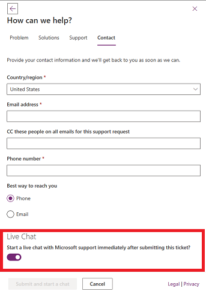

---
# Required metadata
		# For more information, see https://review.learn.microsoft.com/en-us/help/platform/learn-editor-add-metadata?branch=main
		# For valid values of ms.service, ms.prod, and ms.topic, see https://review.learn.microsoft.com/en-us/help/platform/metadata-taxonomies?branch=main

title:       How to create a Fabric and Power BI Support ticket
description: Creating a support ticket for Fabric and Power BI
author:      royrubinstein
ms.author:    mihart
ms.service:  powerbi
# ms.prod:   # To use ms.prod, uncomment it and delete ms.service
ms.topic:    troubleshooting 
ms.date:     06/14/2023
---

# Create a support ticket

Before creating a support ticket, get real-time help by using the [Power Platform Admin Center](https://admin.powerplatform.microsoft.com/support) (admin roles only) or the [Fabric Support Page](https://support.fabric.microsoft.com/en-US/support). If the issue can't be resolved through self-help, create a support ticket.

## Prerequisites

Support tickets can be created by users with one of the following security roles or licenses.  

- Azure AD role administrator

- Environment administrator (or system administrator role in Dataverse)

- Company administrator

- Billing administrator

- Service administrator

- CRM service administrator

- CRM organization administrator

- Security administrator

- Partner delegated administrator

- SharePoint administrator

- Teams administrator

- Exchange administrator

- Fabric administrator

- Compliance administrator

- Helpdesk administrator

- Power BI Pro users can create support tickets for Power BI.

- Fabric users can create support tickets for Fabric products.

## Steps for creating a support ticket
The steps you take to create a support ticket vary, depending on your role. 

### For administrators

1. Sign in to the [Power Platform admin center](https://admin.powerplatform.microsoft.com/) with your admin credentials.

2. Select **Help + support** > **Get Help + support**

   
      
3. Select the product you're experiencing an issue with.

   > [!TIP]
   > You can type the product name to quickly find the requested product.

4. Fill in the description of the issue and select the arrow to the right. Solutions matching the issue's description are presented.

   

5. If no solution is found, select the problem type and subtype and then choose **See solutions**. For some problem type and subtype selections, you're asked to provide additional information.

   

6. Based on the information you provide, PPAC presents you with a list of possible solutions to your issue. Select the relevant solution and determine if the content can successfully guide you to a fix.

   

7. If the guidance doesn't resolve your issue, scroll down and select **Contact Support**, and fill in the fields in the following pages.

   

8. If you have a **Unified or Premier** support plan that isn't listed, select **Add new contract** and fill in the fields. If you don't know your access or contract ID, contact your service admin, Incident Manager or Customer Success Account Manager (CSAM).

   

   > [!TIP]
   > 
   >- For **Contract ID/Password**, enter your Unified or Premier contract ID.
   >- The **Contract ID/Password** defaults to the Unified or Premier contract ID. If you've changed the password when registering online in the Unified/Premier portal, you should use the updated password instead of the contract ID.

### For Fabric users and Power BI Pro users

1. On the [Fabric Support page](https://support.fabric.microsoft.com/en-US/support), review the status dashboard, outage/degradation and **Awareness** fields, and **Known issues** to ensure that your issue is not already known. Then, scroll down to **Create a support request** and select the product you're experiencing an issue with.

   

2. Fill in the description of the issue and select the arrow to the right. Solutions matching the issue's description are presented.

   

3. If no solution is found, select the problem type and subtype and then choose **Get solutions**. For some problem type and subtype selections, you're asked to provide additional information.

   

4. Based on the information you provide, you see a list of possible solutions to your issue. Select the relevant solution and see if the content can successfully guide you to a fix.

   

5. If the guidance doesn't resolve your issue, scroll down and select **Contact Support**, and fill in the fields in the following pages.

   

6. If you have a **Unified or Premier** support plan that isn't listed, select **Add new contract** and fill in the fields. If you don't know your access or contract ID, contact your service admin or Incident Manager or Customer Success Account Manager (CSAM).

   

   > [!TIP]
   > 
   >- For **Contract ID/Password**, enter your Unified or Premier contract ID.
   >- The **Contract ID/Password** defaults to the Unified or Premier contract ID. If you have changed the password when registering online in the Unified/Premier portal, you should use the updated password instead of the contract ID.
      
### Live Chat
1. For some of the combinations of problem type and subtype, users might see the option to start a live chat session with a Microsoft Support representative. The option to start a live chat session appears on the **Contact** page. 

   

        

