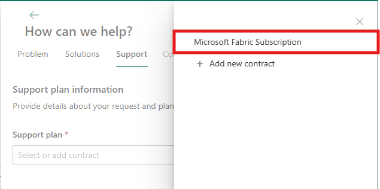

---
# Required metadata
		# For more information, see https://review.learn.microsoft.com/en-us/help/platform/learn-editor-add-metadata?branch=main
		# For valid values of ms.service, ms.prod, and ms.topic, see https://review.learn.microsoft.com/en-us/help/platform/metadata-taxonomies?branch=main

title: How to create a Fabric and Power BI Support ticket
description: Learn how to create a support ticket for Fabric and Power BI, depending on your role (administrator versus user).
author: royrubinstein
ms.author: mihart
ms.service: powerbi
ms.subservice: powerbi-admin
# ms.prod: # To use ms.prod, uncomment it and delete ms.service
ms.topic: troubleshooting 
ms.date: 08/13/2024
---

# Create a support ticket

Before creating a support ticket, you can search for Fabric content by using the [Help Pane in Fabric](https://msit.powerbi.com/home?experience=fabric-developer&pane=help).  On the [Microsoft Fabric support](https://support.fabric.microsoft.com/support) page, review the **Product status dashboard** list, the **Service Outage/Degradation** status, the **Awareness** status, and the current [Known issues](https://support.fabric.microsoft.com/known-issues).

## Prerequisites

Users can create support tickets if they have one of the following security roles or licenses:

- Microsoft Entra role administrator

- Environment administrator (or system administrator role in Dataverse)

- Company administrator

- Billing administrator

- Service administrator

- CRM service administrator

- CRM organization administrator

- Security administrator

- Partner delegated administrator

- SharePoint administrator

- Teams administrator

- Exchange administrator

- Fabric administrator

- Compliance administrator

- Helpdesk administrator

- Power BI Pro users can create support tickets for Power BI

- Fabric users can create support tickets for Fabric products

## Steps for creating a support ticket

The steps you take to create a support ticket vary, depending on your role.

1. From the top menu bar, select the question mark (**?**) to open the Fabric Help Pane. In the Help Pane, you can search for content from Microsoft Learn and the different Fabric workloads communities. 

   > [!NOTE]
   > Administrators can also navigate to the [Power Platform admin center (PPAC)](https://admin.powerplatform.microsoft.com/) with their admin credentials to create a support ticket.
   
   
1. In the "Other resources" card, select **Get Microsoft help.** 

   :::image type="content" source="media/create-support-ticket/Help_pane_other_resources.png" alt-text="Screenshot of Other Resouces card with link to Get Microsoft Help.":::
   
   > [!NOTE]
   > If the admin sets a link to an internal Help Desk, [as described here](/fabric/admin/service-admin-portal-help-support), a link to **Help Desk** will be shown. However, admins will always be redirected to the **Help + Support** section in the **Admin Portal.**
   
   
   
   
1. In the **Admin Portal**, navigate to **Help + Support** and click on **New support request.** 

1. Select the product you're experiencing an issue with.

1. Fill in the description of the issue and select the arrow to the right of the text box. Solutions matching the issue's description appear.

   :::image type="content" source="media/create-support-ticket/provide-issue-description.png" alt-text="Screenshot of the How can we help screen, showing where to find the issue description field.":::
   
1. If you don't find the correct solution, answer a few additional questions to see possible solutions to your issue. Select the relevant solution and see if the content can successfully guide you to a fix.

   :::image type="content" source="media/create-support-ticket/solutions-and-contact-support.png" alt-text="Screenshot of the Solutions tab, showing the Recommended solutions and Recommended documentation lists.":::
   
1. If the guidance doesn't resolve your issue, scroll down, select **Next**, and then select your support plan. You can select either using the "Microsoft Fabric Subscription" or your Unified or Premier support plan. 

1. If you have a **Unified or Premier** support plan that doesn't appear under **Support plan**, select **Add new contract** and fill in the fields. If you don't know your access or contract ID or are interested in purchasing a [Unified support contract](/power-bi/support/service-support-options), contact your service admin or Customer Success Account Manager (CSAM).

   :::image type="content" source="media/create-support-ticket/new-support-contract.png" alt-text="Screenshot of the Support tab, showing where to select Add new contract.":::
   
   > [!TIP]
   > - For **Contract ID/Password**, enter your Unified or Premier contract ID.
   > - The **Contract ID/Password** defaults to the Unified or Premier contract ID. If you have changed the password when registering online in the Unified/Premier portal, you should use the updated password instead of the contract ID.
   
   
1. If the guidance doesn't resolve your issue, scroll down, select **Next**, and then fill in the fields on the Support tab.

   :::image type="content" source="media/create-support-ticket/support-tab.png" alt-text="Screenshot of the Support tab, showing the required fields.":::
   
### Live Chat

Users who open support cases through PPAC might see the option to start a live chat session with a Microsoft Support representative. The option to start a live chat session appears on the **Contact** page.

   :::image type="content" source="media/create-support-ticket/livechat.png" alt-text="Screenshot of the Contact tab, showing where to select Live Chat.":::
