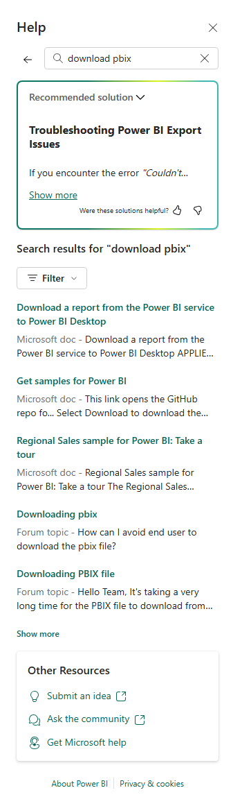
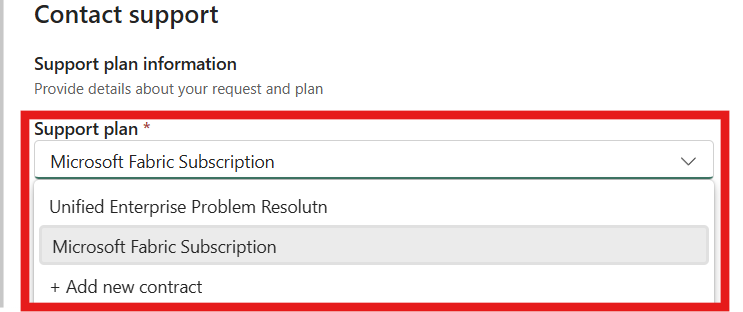
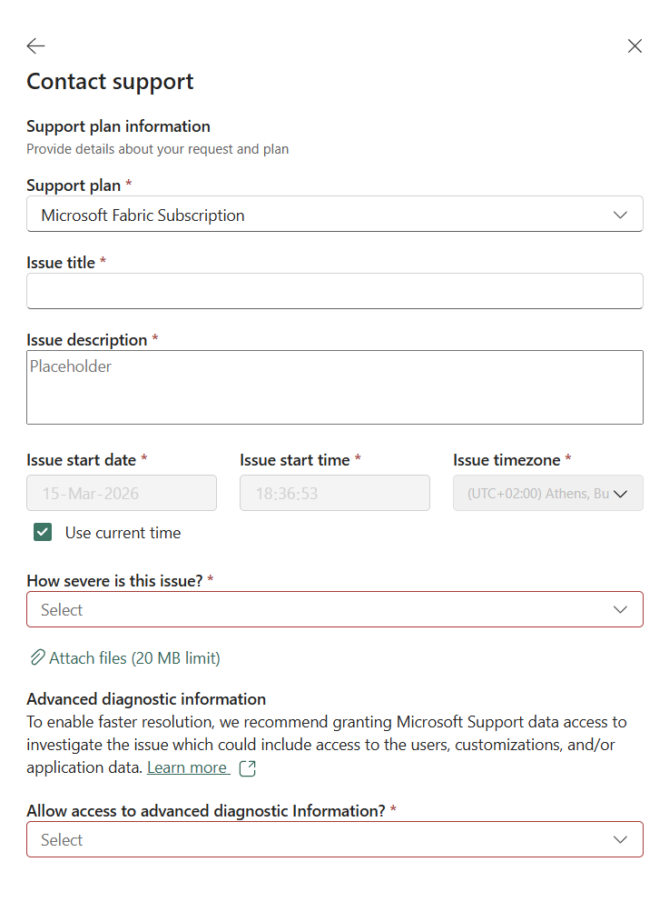

# Create a Fabric and Power BI support ticket

Learn how to create a support ticket for Microsoft Fabric and Power BI. Before submitting a ticket, search for solutions using the Help Pane in Fabric or check the Microsoft Fabric support page for product status, service outages, and known issues. This guide walks you through the process based on your role as an administrator or user.

## Prerequisites

You can create support tickets if you have one of the following security roles or licenses:

- Microsoft Entra role administrator
- Environment administrator (or system administrator role in Dataverse)
- Company administrator
- Billing administrator
- Service administrator
- CRM service administrator
- CRM organization administrator
- Security administrator
- Partner delegated administrator
- SharePoint administrator
- Teams administrator
- Exchange administrator
- Fabric administrator
- Compliance administrator
- Helpdesk administrator
- Power BI Pro users can create support tickets for Power BI
- Fabric users can create support tickets for Fabric products

## Create a support ticket

The steps you take to create a support ticket vary, depending on your role.

1. From the top menu bar, select the question mark (**?**) to open the Fabric Help Pane. In the Help pane, enter a keyword to find a recommended solution and relevant information and resources from Microsoft documentation and community forum topics. Use the dropdown to filter the results.

   
   
      > [!NOTE]
   > - **For GCC and other national/regional cloud customers:** The standard Fabric support page workflow might redirect you to the commercial Power BI page, which prevents you from submitting your support ticket. If you're a GCC, GCC High, DoD, or China cloud customer, you must use the dedicated [National Cloud Support](https://www.microsoft.com/power-platform/products/power-bi/clouds#Support) portal to create your support case based on your specific environment.
   > - If the admin sets a link to an internal Help Desk, [as described here](/fabric/admin/service-admin-portal-help-support), a link to **Help Desk** is shown. 
   
   
   
   
1. If you don't find the correct solution, answer a few more questions to see possible solutions to your issue. Select the relevant solution and see if the content can successfully guide you to a fix.

1. If the guidance doesn't resolve your issue, scroll down, select **Contact Support**, then select your support plan. You can select either using the **Microsoft Fabric Subscription** or your Unified or Premier support plan.

   
   
1. If you have a *Unified* or *Premier* support plan that doesn't appear under **Support plan**, select **Add new contract** and fill in the fields. If you don't know your access or contract ID or are interested in purchasing a [Unified support contract](/power-bi/support/service-support-options), contact your service admin or Customer Success Account Manager (CSAM).

   > [!TIP]
   > - For **Contract ID/Password**, enter your Unified or Premier contract ID.
   > - The **Contract ID/Password** defaults to the Unified or Premier contract ID. If you changed the password when registering online in the Unified/Premier portal, you should use the updated password instead of the contract ID.
   
   
   
1. If the guidance doesn't resolve your issue, scroll down, select **Next**, and then fill in the fields on the Support tab.

   
   
## Related content

- [Best practices when creating a support ticket](best-practices-creating-support-ticket.md)
