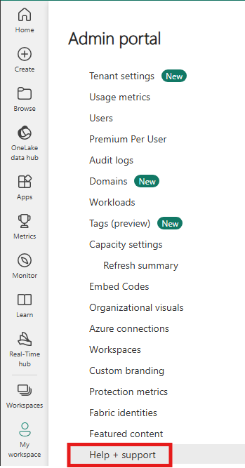
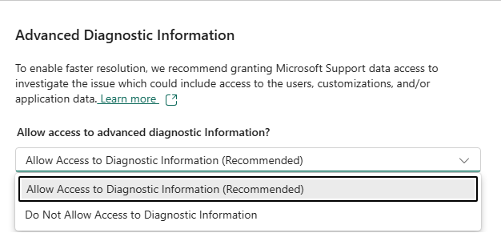

---
# Required metadata
# For more information, see https://review.learn.microsoft.com/en-us/help/platform/learn-editor-add-metadata?branch=main
# For valid values of ms.service, ms.prod, and ms.topic, see https://review.learn.microsoft.com/en-us/help/platform/metadata-taxonomies?branch=main

title: Manage support case
description: How to manage Fabric and Power BI support tickets
author:      royrubinstein # GitHub alias
ms.author:   rrubinstein # Microsoft alias
ms.service: powerbi
ms.topic: troubleshooting
ms.date:     03/03/2025
---

# Manage a support ticket in Fabric

After you [create a Power BI or a Fabric support ticket](/power-bi/support/create-support-ticket), you can manage it in [Fabric](https://app.powerbi.com/admin-portal/supportCenter).

### View support tickets

View the details and status of support tickets by going to Help+Support in the Fabric Admin Portal. You're able to review all the support tickets you either created or listed as secondary owner on.

You can search, filter, and sort support tickets. By default, you see only tickets created by you. Change the filter options to review support tickets that you're secondary owner on. You can also filter cases by the owner of the pending response, Microsoft, or you. 

To view a support ticket's details, including its severity, contacts, and the last messages associated with the ticket, select it from the list. 

Admins are able to review all the support cases in their organization. 

> [!NOTE]
> Closed support requests can generally be viewed for 13 months. After that time, they may be removed, making them unavailable to view.

### Send a message

1. Select the support ticket and click on "Details"

1. Select "Communication history" in the support ticket details view

1. Enter your message and select "Send message"

### Allow collection of advanced diagnostic information

When you create a support ticket, you can select to **Allow** or to **Not Allow** access to your advanced diagnostic information. This option determines whether Microsoft support can access advanced telemetry information that can potentially help resolve your issue.

To change your **Advanced diagnostic information** selection after the request is created:

1. Select the support ticket and click on "Edit"

1. Select consent option and select "Save"

Review [Consent to access customer data](/power-bi/support/access-customer-data) page for more information.

### Updating support case contact information

1. Select the support ticket and click on "Edit"

1. Update the contact information details

1. Add or remove secondary owners on the support ticket

1. Select "Save"

Only the case owner and the admin can update the support ticket owner's contact information. Any owner can update the secondary owners' list.

### Close a support case

To close a support case, select the support case and click "Details". Scroll down either in "Details" or "Communication History" tabs and select the "Close support case". When prompted to confirm, select **Close**. You receive a confirmation email when your ticket is closed. 

Only the case owner and the admin can close the support ticket.