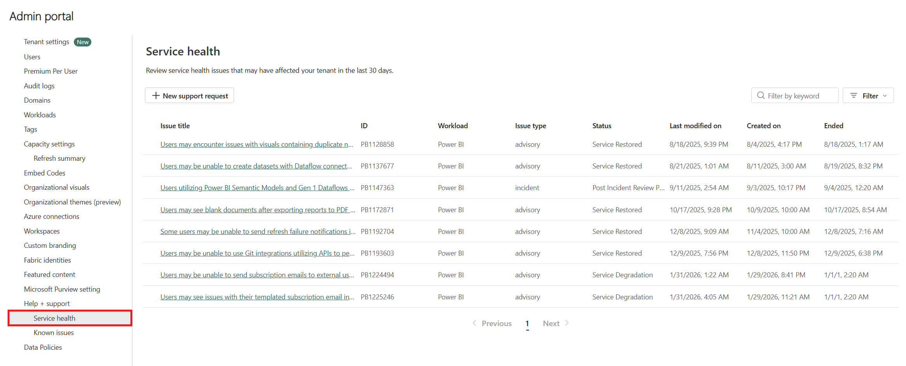

# Track Fabric Service Health and Known Issues
 
Track Fabric service health using either the Fabric Admin Portal or the Microsoft 365 admin center to monitor current issues and view historical service data. You can also review known issues that might affect your environment. Fabric admins can access these health monitoring tools to quickly identify and troubleshoot service problems.

## Service Health

### Fabric Admin Portal

> [!NOTE]
> If your Fabric admin has [configured an internal Help-Desk](/fabric/admin/service-admin-portal-help-support), only users who are permitted to create support requests with Microsoft will be able to view service health updates in Fabric.

1. Navigate to the **Fabric Admin Portal** > **Help + Support** > **[Service Health](https://app.powerbi.com/admin-portal/serviceHealth)**.

   
   
1. To see more information, select an item.

1. To see all updates on an incident, select **All updates**. Scroll down to see more information, then close the pane when you're finished.

### Microsoft 365 admin center

In the Microsoft 365 admin center, Fabric service health is listed under the Power BI service. 

To access service health information, you must have the Fabric administrator role. For more information about roles, see [Administrator roles related to Power BI](../admin/service-admin-administering-power-bi-in-your-organization.md#administrator-roles-related-to-power-bi).

1. Sign in to the [Microsoft 365 admin center](https://portal.office.com/adminportal).
1. From the nav pane, select **Show all** > **Health** > **Service health**. The Service health page appears. Active issues are listed on this overview page:

   :::image type="content" source="media/service-admin-health/service-health-2022.png" alt-text="Screenshot of the Microsoft 365 admin center with the Health and Service health options called out." lightbox="media/service-admin-health/service-health-2022.png":::
   
1. To see more information, select an item.

   :::image type="content" source="media/service-admin-health/service-health-active-issues.png" alt-text="Screenshot of the Service health page with an active issue selected. The issue details pane for the selected item is on the right side of the screen." lightbox="media/service-admin-health/service-health-active-issues.png":::
   
    Scroll down to see more information, then close the pane when you're finished.
   
1. To see historical information across all services, select  **Issue history**, and then select **Past 7 days** or **Past 30 days**.
1. To return to current service health, select **Overview**.
## Known Issues

You can review the Fabric Known Issues either in the [Fabric Admin Portal](https://app.powerbi.com/admin-portal/knownIssues) or on the [Fabric Support page](https://support.fabric.microsoft.com/known-issues/).

Select a known issue to view its details.

