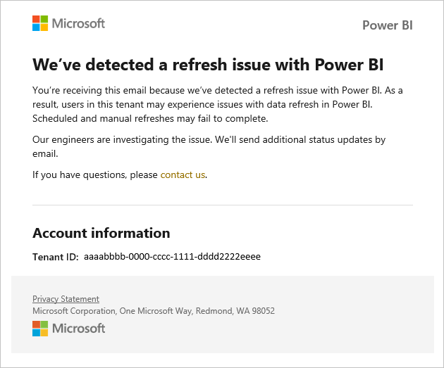
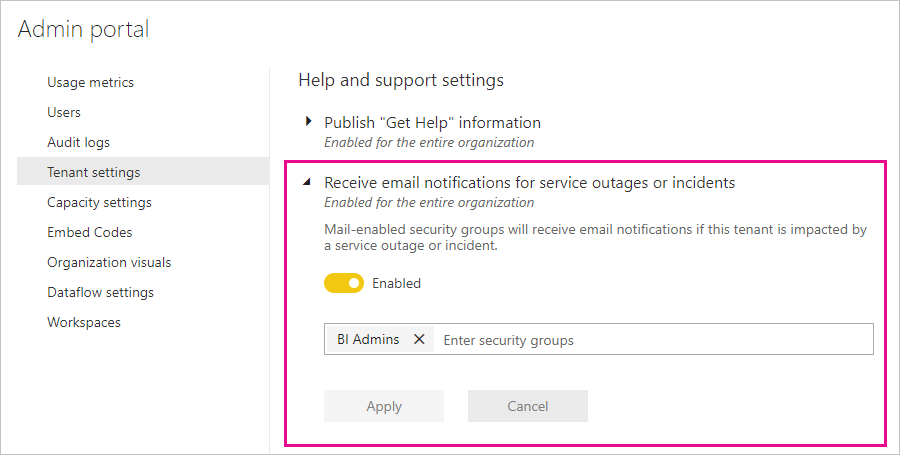

# Service interruption notifications

It's important to have insight into the availability of your mission-critical business applications. Power BI provides incident notification so you can optionally receive emails if there's a service disruption or degradation. While the Power BI 99.9% service level agreement (SLA) makes these occurrences rare, it's still possible for disruptions to occur. The following screenshot shows the type of email you'll receive if you enable notifications:

At this time, emails are sent for the following _reliability scenarios_:

- Open report reliability
- Model refresh reliability
- Query refresh reliability

Notifications are sent when there's an _extended delay_ in operations like opening reports, semantic model refresh, or query executions. After an incident is resolved, you receive a follow-up email.

> [!NOTE]
> This feature is currently available only for capacities in Power BI Premium. It's not available for shared or embedded capacity.

## Enable notifications for service outages or incidents

A Power BI admin can enable notifications for service outages or incidents in the admin portal:

1. Identify or create an email-enabled security group that should receive notifications.

1. In the admin portal, select **Tenant settings**. Under **Help and support settings**, expand **Receive email notifications for service outages or incidents**.

1. Enable notifications, enter a security group, and select **Apply**.

    

> [!NOTE]
> Power BI sends notifications from the account no-reply-powerbi@microsoft.com. Ensure that this account is added to your safe sender list so that notifications don't end up in a junk email folder.

## Service health in Microsoft 365

This article describes how to receive service notifications through Power BI. You can also monitor Power BI service health through Microsoft 365. Opt in to receive email notifications about service health from Microsoft 365. Learn more in [How to check Microsoft 365 service health](/microsoft-365/enterprise/view-service-health).

## Related content

- [Power BI Pro and Power BI Premium support options](service-support-options.md)
