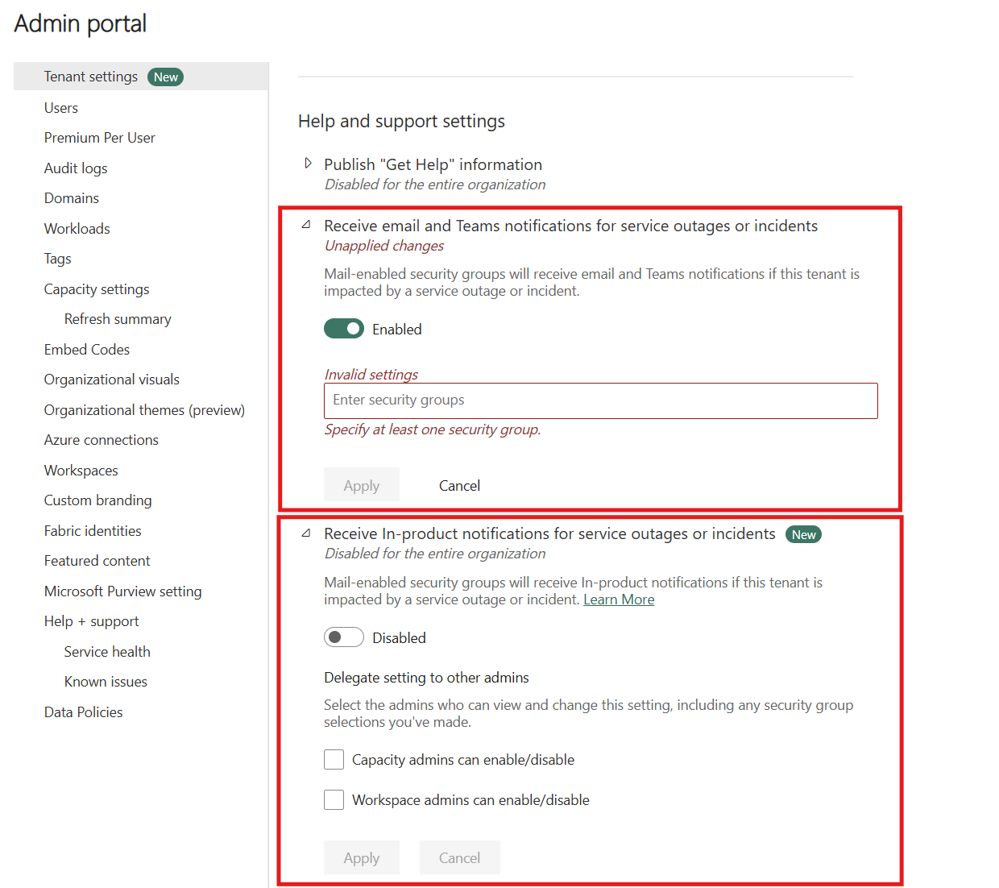

# Fabric service interruption notifications

It's important to have insight into the availability of your mission-critical business applications. Fabric provides incident notification so you can optionally receive in-produc massages and/or emails and Teams notification if there's a service disruption or degradation. While the Fabric 99.9% service-level agreement (SLA) makes these occurrences rare, it's still possible for disruptions to occur. The following screenshots shows the type of messages you'll receive if you enable notifications:

1. In-product messages

1. Teams notifications

1. Email messages

:::image type="content" source="media/service-interruption-notifications/power-bi-service-interruption-email-notification.png" alt-text="Screenshot of a Power BI service interruption notification email showing refresh issue details.":::

At this time, emails are sent for the following *reliability scenarios*:

- Power BI -

  - Open report reliability
  
  - Model refresh reliability
  - Query refresh reliability
    
Notifications are sent when there's an _extended delay_ in operations. After an incident is resolved, you receive a follow-up email.

> [!NOTE]
> This feature is currently available only for capacities in Power BI Premium or Microsoft Fabric. It's not available for shared or embedded capacity.

## Enable notifications for service interruptions 

A Fabric admin can enable notifications for service interruptions in the admin portal:

1. Identify or create an email-enabled security group that should receive notifications.
1. In the admin portal, select **Tenant settings**. Under **Help and support settings**, expand 

   1. For emails and Teams - expend **Receive email and Teams notifications for service outages or incidents** 
      
   1. For in-product messages - expend **Receive in-product notifications for service outages or incidents**
      
1. Enable notifications, enter a security group, and select **Apply**.

   
   
> [!NOTE]
> Fabric admin can delegate the option to receive in-product messages to capacity and workspace admins.
   
    
   
> [!NOTE]
> Fabric sends notifications from the account `no-reply-powerbi@microsoft.com`. Ensure that this account is added to your safe sender list so that notifications don't end up in a junk email folder.

## Service health in Microsoft 365

This article describes how to receive service notifications through Fabric. You can also monitor Fabric service health through Microsoft 365. Opt in to receive email notifications about service health from Microsoft 365. Learn more in [How to check Microsoft 365 service health](/microsoft-365/enterprise/view-service-health).

