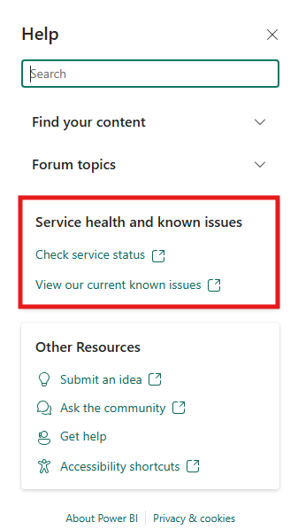
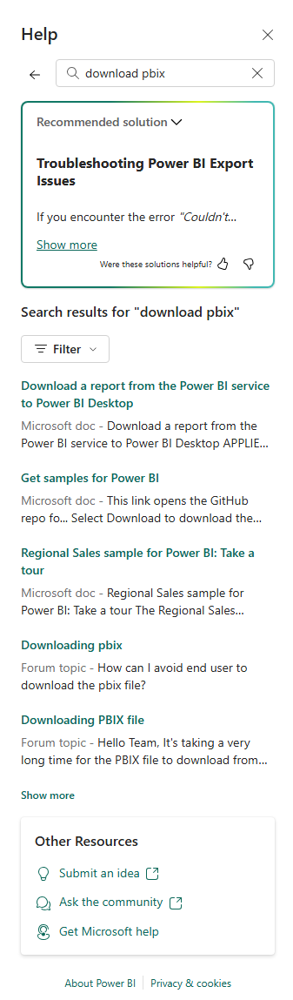
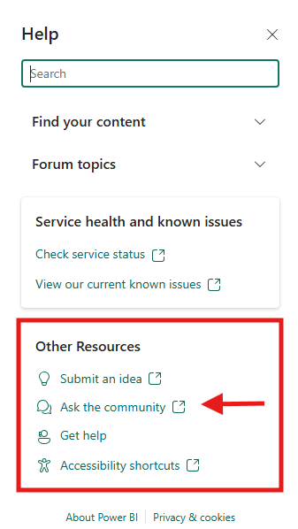
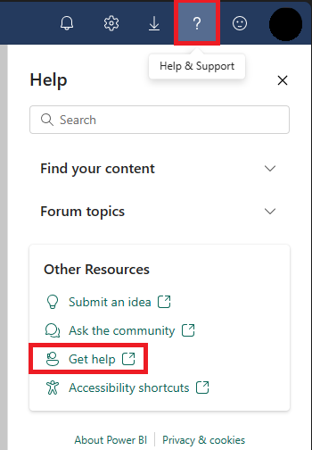

# Fabric and Power BI support overview

This article describes how to find self-help resources and the support options that are available to  users who purchase Microsoft Fabric or Power BI. Fabric administrators and other admins in your organization have access to expanded support options. Read [Commonly used Microsoft 365 admin center roles](/microsoft-365/admin/add-users/about-admin-roles#commonly-used-microsoft-365-admin-center-roles) to learn more about who can manage service requests for your organization. To learn about Microsoft Fabric for administrators, see [Microsoft Fabric admin](/fabric/admin/microsoft-fabric-admin).

## Finding self-help resources

Many resources are available to help you identify, research, and solve issues. From the top menu bar, select the question mark (**?**) to open the Fabric Help Pane. In the Help Pane, search for content from Microsoft Learn and the different Fabric workloads. 

### Checking for service health and known issues

From the Help pane, you can navigate to the Fabric Support page to check [Fabric service status](https://support.fabric.microsoft.com/support) or to view [Fabric current known issues](https://support.fabric.microsoft.com/known-issues).

### Searching for content in the Help Pane

In the Help pane, enter a keyword to find recommended solution and relevant information and resources from Microsoft documentation and community forum topics. Use the dropdown to filter the results.

### Search for help in Fabric communities

Clicking on "Ask the community" in the Help Pane takes you to the Fabric Community site where you can post questions and seek help from other users.

## About Support

### For which languages does Microsoft provide support?

Microsoft provides support in English globally and in other languages (Japanese, Spanish, French, German, Italian, Portuguese, Traditional Chinese, and Simplified Chinese) within certain regions.  

|English *  |Japanese **  |Spanish, French, German, Italian, Portuguese ** |Traditional Chinese, Simplified Chinese **  |
|---------|---------|---------|---------|
|Provided globally all day, every day   |Available to customers in Japan region during that region's business hours.        |Available to customers in Europe/Middle East/Africa regions during those regions' business hours.  Spanish/Portuguese available to customers in South America during that region's business hours.   | Available to customers in Asia/Pacific region during that region's business hours.        |

* Around the clock (all day, every day) support is available based on issue severity and your support offering. ** Support in languages other than English may be available during local business hours subject to availability.

> [!NOTE]
> Translation services might be available to assist with other languages outside normal business hours.

### Do I get around the clock support? 

- Microsoft provides all day, everyday support in English for all **Severity A** issues and might provide all day, everyday assistance for issues of other severity based on your support offering. 

- For those issues that don't qualify for all day, everyday support, Microsoft provides assistance during local business hours only.

### What hours are considered local business hours for support?

For **most countries**, business hours are from 9:00 AM to 5:00 PM during weekdays (weekends and holidays excluded). For **North America**, business hours are 6:00 AM to 6:00 PM Pacific time, Monday through Friday excluding holidays. In **Japan**, business hours are from 9:00 AM to 5:30 PM weekdays.

### What's the difference between technical support and advisory services?

- Technical support break-fix issues are technical problems you experience while using services. "Break-fix" is an industry term that refers to "work involved in supporting a technology when it fails in the normal course of its function. Break-fixes require intervention by a support organization to be restored to working order."
- How functionality works isn't considered a break-fix issue but is more closely related to training. These "how-to" questions, or Advisory services, involve a transfer of knowledge and can often be answered in other ways. We recommend reviewing product documentation, raising a question in online community forums, or contacting a knowledgeable individual such as a partner. While there might be some elements of knowledge transfer involved in solving a break-fix issue, in general, assisted training isn't included in support plans.

### What is a preview (beta) service or feature?

Microsoft may provide access to Fabric workloads, artifacts, or features that are still in preview to obtain feedback and for evaluation purposes. There are different kinds of preview services and features, with service availability and access being the biggest differentiators:

- **Public Preview**: Made available to all Fabric or Power BI users. Some preview experiences or features have to be enabled or disabled by Fabric admins in the Admin Portal. The public preview experience is intended to give users an early look into what is coming and a chance to test upcoming features.

- **Private Preview**: Provided only to a small subset of customers, in direct contact with product engineering teams who are building the features, focused on direct and continual feedback during the development phase of a service.

When Microsoft offers you early access to a Fabric workload and/or features, these preview services and features are subject to reduced or different service terms as described in your service agreement and the preview supplemental terms. Preview services and features are provided "as-is," "with all faults," and "as available," and are excluded from any Limited Warranties provided by Microsoft for services released to general availability (GA), and are made available to you on the condition that you agree to these terms of use, which supplement your agreement governing use of customer engagement apps.

### Does Fabric support cover preview (beta) services or features?

- Support for Fabric workloads and features is provided for "Public Preview" and "Generally Available" programs.

- Any technical support for a public preview service or feature is limited to break-fix scenarios. 

- Users might find more support for Public Preview features through our [Community forums](https://community.fabric.microsoft.com/) or other channels.

## Before you contact support

Verify whether Microsoft support is your admin's preferred option when you need help. To check, select (**?**) from the page header in the Power BI service, then choose **Get Help**. If this selection takes you to Power BI support, you might use the following listed support options. Otherwise, you're  directed to the preferred support option for your organization. If your product doesn't have a support contract, you receive a message that "This product isn't supported."

If Microsoft support is your admin's preferred option:

1. Check for service outages or degradation at [Power BI and Fabric Support](https://support.fabric.microsoft.com).
2. Check for [known issues with Power BI or Fabric features](https://support.fabric.microsoft.com/known-issues). 
1. See if your issue has been addressed by the [Community](https://community.fabric.microsoft.com).

1. Review the [Fabric troubleshooting documentation ](/fabric/get-started/)or the [Power BI troubleshooting documentation](/power-bi/troubleshoot/).

5. Open your Account manager to find out which license you have. Select your profile picture from the page header to open your Account manager. For Power BI, if **Pro account** or **Premium Per User account** displays, you might use the following listed support options. For Fabric, all users might use the following listed support options.

   :::image type="content" source="media/service-support-options/license-type.png" alt-text="Screen capture showing license type displayed with account profile.":::  

## Using Support

### How do I contact Support?

Access Support through either the Fabric [Admin Portal](https://app.powerbi.com/admin-portal/supportCenter), [Fabric Support page](https://support.fabric.microsoft.com/support), or the [Power Platform admin center](https://admin.powerplatform.microsoft.com/support). Microsoft partners should use the [Partner Center portal](https://partner.microsoft.com/support). For detailed instructions on how to create a support ticket, review [How to contact support ](/power-bi/support/create-support-ticket)document. Make sure also to review our [best practices when creating a support ticket](/power-bi/support/best-practices-creating-sr) document.

| **Support option** |**Break-fix technical support** |**Billing support** |**Consulting and training** |**Service level  (time to initial engagement)** |**Support channel** |
| --- | --- | --- | --- | --- | --- |
|**Community support**: Web forums for users to get peer-to-peer support, guidance, and share solutions. Answers are provided by a global community of Power BI experts and Microsoft employees. | X |   |   |None, engagement is provided on a best-effort basis. |[Fabric & Power BI Community](https://community.fabric.microsoft.com/) |
|**Power BI Pro and Premium Per User end-user support**: Technical and billing support for end users creating and consuming content in Power BI. | X |   |   |One business day. |[Fabric support](https://support.fabric.microsoft.com) OR [Fabric Support Center](https://app.powerbi.com/admin-portal/supportCenter)|
|**Fabric user**: Technical and billing support for users creating in Fabric in Fabric capacities.|X|X | |One business day |[Fabric support](https://support.fabric.microsoft.com) OR [Fabric Support Center](https://app.powerbi.com/admin-portal/supportCenter)|
|**Fabric or Power BI Premium admin support**: Technical support for administrators deploying and operating Power BI Premium capacities. | X |   |   |One business day or one hour, depending on severity of case.\* |[Fabric support](https://support.fabric.microsoft.com) OR [Fabric Support Center](https://app.powerbi.com/admin-portal/supportCenter) |
|**Fabric or** **Power BI admin support**: Technical and billing support for administrators of Power BI deployments at their organizations. To use this option, you must be a Power BI Administrator or be assigned a Microsoft 365 admin role that can manage service requests. | X | X |   |One business day or one hour, depending on severity of case.\* |[Fabric Support Center](https://app.powerbi.com/admin-portal/supportCenter) |
|**Microsoft Premier support**: An enterprise-grade approach to support, with account management, the option for on-site support, and services such as training and data model performance optimization. | X | X | X |Various, depending on offering and severity of case.\* |Customer Success Account Manager  OR  [Fabric Support Center](https://app.powerbi.com/admin-portal/supportCenter) |

\* A one-hour SLA is available only through _Sev A cases_, which require justification of immediate, direct business impact from work stoppage in existing production reporting.

### Why is submitting a request online the preferred method of contacting Support?

Submitting support requests online allows us to deliver fast and deep technical expertise in the most effective and efficient manner possible. Due to the detailed nature of the requests, it's easier to provide relevant information online, compared to reading this information over the phone. This model also eliminates unproductive hold time and provides instead a simple, intuitive online process. As a result, customer problems are routed more quickly, to the most qualified engineer.

### Is there a phone number I can call to contact Support?

Contacting Support over the phone doesn't speed up the processing of your request, and you actually get a better and faster experience by contacting support via the correct support portals listed earlier in this article. If you can't submit a request online, you can find a local support number from our list of regional [Global customer service centers](/microsoft-365/admin/contact-support-for-business-products).

### How do I submit a support request if I can't sign in?

If you can't submit a support request online, you can find a local support phone number from our list of regional [Global customer service centers](/microsoft-365/admin/contact-support-for-business-products).

### Who can submit a support request for Fabric or Power BI?

- Any users with the Fabric admin role on the tenant can submit a support request. 

- Users with appropriate admin roles as listed in [the support role article](/power-bi/support/create-support-ticket). 

- Users with a Fabric license or a paid version of Power BI.

> [!NOTE]
> If you got your Power BI Pro or Premium-per-user (PPU) license through a guest affiliation with another organization, you can't contact support. Your license must be assigned directly by the organization that manages your work or school account to enable support options.
> 
### What is Initial Response Time, and how quickly can I expect to hear back from someone after submitting my support request? 

Initial Response Time is the period from when you submit your support request to when a Microsoft Support Engineer contacts you and starts working on your support request. The Initial Response Time varies with both the support plan and the business impact of the request (also known as Severity). Initial Response Times are calculated using business-hours support for subscription-based support. Elevated support plans contain non–business hours response times.

|Severity level  |Customer's situation  |Initial Response Time  |
|---------|---------|---------|
|**Critical**     |**Critical business impact**  Customer's business has significant loss or degradation of services and requires immediate attention.   |Unified Core/Advanced: < 1 hour, around the clock  Unified Performance: < 30 minutes, around the clock    |
|**Severity A**    |**Critical business impact**  Customer's business has significant loss or degradation of services and requires immediate attention.        |Subscription: < 1 hour, around the clock  Premier: < 1 hour, around the clock   |
|**Severity B**    |**Moderate business impact**  Customer's business has moderate loss or degradation of services, but work can reasonably continue in an impaired manner.  |Subscription: < 4 hours  Premier: < 2 hours, around the clock   |
|**Standard**     |**Standard business impact**  Customer's business has moderate loss or degradation of services, but work can reasonably continue in an impaired manner. |Unified Core: < 8 hours, around the clock  Unified Advanced/Performance: < 4 hours, around the clock    |
|**Severity C**     |**Minimum business impact**  Customer's business is functioning with minor impediments of services.      |Subscription: < 8 hours  Premier: < 4 hours    |

### How quickly can you resolve my support request?

Microsoft is committed to assisting you in resolving your issue as soon as possible. Sometimes that means focusing efforts on reducing the business impact and mitigating any negative impact to your operation, before moving to a full solution. Therefore, we make a commitment to Initial Response Time and working with you until the impact of your issue is mitigated, having no direct SLA for support request resolution. The time it takes to troubleshoot and resolve a support request varies greatly based on the specifics of the issue. We work with you to get the issue resolved as quickly as possible. This commitment applies to all levels of support.

### I'm running a non-Microsoft technology with Fabric. What support do I get? 

- Microsoft offers customers the ability to run non-Microsoft technologies along with Fabric. For all scenarios that are eligible for support, Microsoft Support investigates the issue to find its root cause. This helps in isolating the issue between the environment and your custom application.

- Full technical support is provided if the issue is caused by Fabric. Commercially reasonable support is provided to all other scenarios. When an adequate solution to your issue isn't achieved, you might be referred to other support channels that are available for the non-Microsoft software.

### How do I get support during an outage or Service Interruption Event (SIE)?

- View the service health updates we post on the [Fabric Support page](https://support.fabric.microsoft.com/support). 
- View the service health in Microsoft 365 at a glance. You can also check out more details and the service health history. 
- Use Message center in Microsoft 365 to keep track of upcoming changes to features and services. 

- Finally, if service health and Message center don't show any active or recent service issues, contact support.

### How is support provided for Performance issues?

Microsoft Fabric subscription support primarily covers break-fix issues, which are technical problems that you experience while using Microsoft Fabric. "Break-fix" is an industry term, which refers to "work involved in supporting a technology when it fails in the normal course of its function. Break-fixes require intervention by a support organization to be restored to working order."

Microsoft Fabric subscription support doesn't cover the following issues:

- Customer proposals for product features (you can submit requests through [Fabric Ideas](https://ideas.fabric.microsoft.com/))

- Onsite support

- Data recovery

- Write, review, or debug customer code

If you want this level of support, you can evaluate [Unified Support](https://www.microsoft.com/unifiedsupport).

### Does Microsoft provide support for Data Corruption?

Data may become corrupt due to many reasons (malfunctioning software, custom code, partner or ISV software, power outages, etc.). Microsoft doesn't provide assistance for correcting damaged data. Note that per the Service Provider License Agreement (SPLA), Microsoft doesn't have a legal obligation to change or correct data being corrupted due to malfunctioning software. Microsoft may execute scripts provided by partners/customers in the production environment if the script was tested in the UAT environment by the partner/customer prior.

## Get started with support for administrators

> [!TIP]
> Need help getting started with Power BI? Take advantage of the [one-hour workshops offered by our partners and get a free consultation](https://appsource.microsoft.com/marketplace/consulting-services?search=Onehourfreeconsultingoffer).

Admins can use the **Help + support** experience in the [Power Platform Admin Center](https://admin.powerplatform.microsoft.com) to get self-help solutions and to create a new service request. Before you contact Microsoft support, follow these steps:

* Check for service outages or degradation at [Fabric Support](https://support.fabric.microsoft.com).
* Check for [known issues with Power BI or Fabric features](https://blog.fabric.microsoft.com/known-issues).
* Look for any notifications about Power BI or Fabric in the [Microsoft 365 service health dashboard](https://admin.microsoft.com/#/servicehealth).
* Check [Microsoft 365 message center](https://admin.microsoft.com/#/MessageCenter) to make sure there are no planned maintenance activities affecting your experience.

* [Capture diagnostic information from the Power BI or Fabric service](service-admin-capturing-additional-diagnostic-information-for-power-bi.md) or Fabric service that you can attach to your service request.

Learn more about how admins can [contact support for help with Microsoft 365 business products](/microsoft-365/admin/contact-support-for-business-products).

## Power BI and Fabric benefits for Microsoft Unified support contracts

With Microsoft Unified contract support, you also get the following benefits:

* Account management
* Option for on-site support
* Health check, risk assessments, and reviews
* Training and workshops
* Developer support

As a Power BI or Fabric customer, you can also take advantage of the following offerings for proactive support hours:

* **Power BI Assessment**. A Microsoft-accredited Customer Engineer diagnoses potential issues and performance with your Power BI environment. The engineer provides valuable guidance on recommended practices to improve the health and performance of your Power BI environment. At the end of this assessment, you receive a comprehensive Power BI report of results, a detailed best practice guidance deck, and a summary report tailored to your environment.

* **Activate Business Analytics with Power BI**. This offering is designed to help you to implement a real-life scenario and enable Power BI for your organization. Work side-by-side with an expert over three days, developing a proof-of-concept in Power BI, with the objective of improving one of the following scenarios:
  * Scenario 1: Power BI Solution Development. Your organization already has a data warehouse or data marts in place, or your department wants to explore data that isn't in the corporate store yet. The support expert can prototype a Power BI solution that connects to your data and extracts meaningful insights using Power BI models and reports. Common data sources include Azure SQL Database, Azure SQL Data Warehouse (DW), or on-premises data using Enterprise Data Gateway.
  * Scenario 2: Adoption, Governance, and Administration. The focus here's on establishing a framework for Power BI governance and operational processes. We'll review your infrastructure, discuss key components in typical Power BI deployments, and recommend practices for governance, administration, and management of Power BI.
  * Scenario 3: Enterprise Scale Data Analytics. The focus in this scenario is on developing Power BI Premium models or migrating existing AAS/SSAS models to Power BI. We consider key components, advantages, and limitations of Power BI Premium capacity management and migrations to Power BI Premium from existing enterprise analytics infrastructure.

* **WorkshopPLUS - Data AI: Business Analytics with Power BI**. This workshop is a great introduction to Power BI, making it an excellent starting point for adoption or for ramping up your users. It provides you with a complete overview of Power BI functionality and capabilities and covers both Power BI Desktop and the Power BI service. You learn in detail how to build calculations and reports, transform data, and build a model. You also learn best practices around sharing and governing that content in the Power BI service. You can also expect many demonstrations and labs, so you can experiment and see the technology in action.

* **WorkshopPLUS - Data AI: Advanced Data Analytics with Power BI**. This offering presents how you can implement the key principles of data modeling in Power BI, using tools such as Power BI Desktop and the accompanying cloud service for the publishing and consumption of Power BI assets. You develop reports, including DAX, and use premium capacities in Power BI. You also deal with advanced analytics involving AI components, Premium, and Data flows.

* **Power BI Clinic**. This offering presents how you can optimize your Power BI workload. Use this clinic as a proactive service to help optimize performance before deploying Power BI, or as a reactive service to alleviate existing bottlenecks. You have an opportunity to work with a Microsoft SME (subject matter expert) on performance tuning and optimization of slow running Power BI reports, with a focus on report models and DAX. You also have an opportunity to work on slow semantic model refresh with a focus on refresh performance in the Power BI cloud service or Power BI Report Server.
  
Contact your Microsoft Customer Account Manager for details. If you don't already have a Microsoft Premier or Unified support contract, learn more at [Premier and Unified support](https://www.microsoft.com/en-us/unifiedsupport).

## Related content

* [Help and support tenant settings](/fabric/admin/service-admin-portal-help-support)
* [Find the right Power BI training for you](/training/powerplatform/power-bi?WT.mc_id=powerbi_docs-link)
