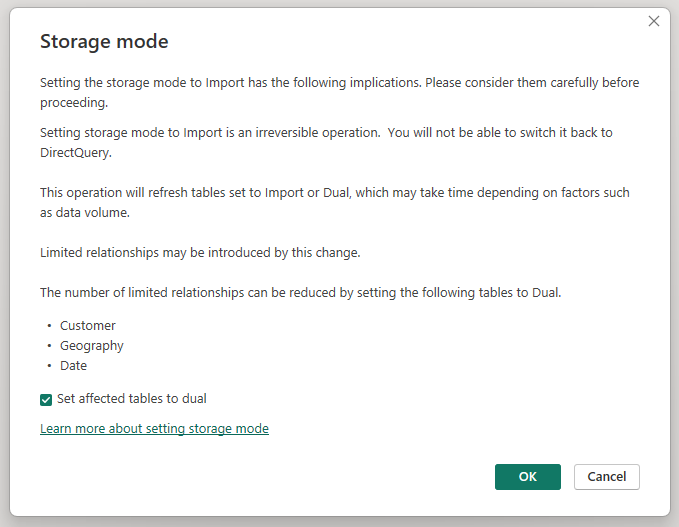

# User-defined aggregations

Aggregations in Power BI can improve query performance over very large DirectQuery semantic models. By using aggregations, you cache data at the aggregated level in-memory. Aggregations in Power BI can be manually configured in the data model, as described in this article, or for Premium subscriptions, automatically by enabling the [Automatic aggregations](../enterprise/aggregations-auto.md) feature in model Settings.

## Creating aggregation tables

Depending on the data source type, an aggregations table can be created at the data source as a table or view, as a native query, or for the greatest performance, as an import table created in Power Query. You then use the Manage aggregations dialog in Power BI Desktop to define aggregations for aggregation columns with summarization, detail table, and detail column properties.

Dimensional data sources, like data warehouses and data marts, can use [relationship-based aggregations](#aggregation-based-on-relationships). Hadoop-based big-data sources often [base aggregations on GroupBy columns](#aggregation-based-on-groupby-columns). This article describes typical Power BI data modeling differences for each type of data source.

### Manage aggregations

In the **Data** pane of any Power BI Desktop view, right-click the aggregations table, and then select **Manage aggregations**.

:::image type="content" source="media/aggregations-advanced/aggregations-06-2.png" alt-text="Select Manage aggregations" :::

The **Manage aggregations** dialog shows a row for each column in the table, where you can specify the aggregation behavior. In the following example, queries to the **Sales** detail table are internally redirected to the **Sales Agg** aggregation table. 

In this relationship-based aggregation example, the GroupBy entries are optional. Except for DISTINCTCOUNT, they don't affect aggregation behavior and are primarily for readability. Without the GroupBy entries, the aggregations would still get hit, based on the relationships. This is different from the [big data example](#aggregation-based-on-groupby-columns) later in this article, where the GroupBy entries are required.

### Validations

The **Manage aggregations** dialog enforces validations:

- The **Detail Column** must have the same datatype as the **Aggregation Column**, except for the Count and Count table rows **Summarization** functions. Count and Count table rows are only available for integer aggregation columns, and don't require a matching datatype.
- Chained aggregations covering three or more tables aren't allowed. For example, aggregations on **Table A** can't refer to a **Table B** that has aggregations referring to a **Table C**.
- Duplicate aggregations, where two entries use the same **Summarization** function and refer to the same **Detail Table** and **Detail Column**, aren't allowed.
- The **Detail Table** must use DirectQuery storage mode, not Import.
- Grouping by a foreign key column used by an inactive relationship, and relying on the USERELATIONSHIP function for aggregation hits, isn't supported.
- Aggregations based on GroupBy columns can leverage relationships between aggregation tables but authoring relationships between aggregation tables is not supported in Power BI Desktop. If necessary, you can create relationships between aggregation tables by using a third-party tool or a scripting solution through XMLA endpoints.

Most validations are enforced by disabling dropdown values and showing explanatory text in the tooltip.

### Aggregation tables are hidden

Users with read-only access to the model can't query aggregation tables. This avoids security concerns when used with *row-level security (RLS)*. Consumers and queries refer to the detail table, not the aggregation table, and don't need to know about the aggregation table.

For this reason, aggregation tables are hidden from **Report** view. If the table isn't already hidden, the **Manage aggregations** dialog will set it to hidden when you select **Apply all**.

### Storage modes

The aggregation feature interacts with table-level storage modes. Power BI tables can use *DirectQuery*, *Import*, or *Dual* storage modes. DirectQuery queries the backend directly, while Import caches data in memory and sends queries to the cached data. All Power BI Import and non-multidimensional DirectQuery data sources can work with aggregations. 

To set the storage mode of an aggregated table to Import to speed up queries, select the aggregated table in Power BI Desktop **Model** view. In the **Properties** pane, expand **Advanced**, drop down the selection under **Storage mode**, and select **Import**. Note that this action is irreversible. 

:::image type="content" source="media/aggregations-advanced/aggregations-04-2.png" alt-text="Select the storage mode" :::

To learn more about table storage modes, see [Manage storage mode in Power BI Desktop](desktop-storage-mode.md).

### RLS for aggregations

To work correctly for aggregations, RLS expressions should filter both the aggregation table and the detail table.

In the following example, the RLS expression on the **Geography** table works for aggregations, because Geography is on the filtering side of relationships to both the **Sales** table and the **Sales Agg** table. Queries that hit the aggregation table and those that don't will both have RLS successfully applied.

An RLS expression on the **Product** table filters only the detail **Sales** table, not the aggregated **Sales Agg** table. Since the aggregation table is another representation of the data in the detail table, it would be insecure to answer queries from the aggregation table if the RLS filter can't be applied. Filtering only the detail table isn't recommended, because user queries from this role won't benefit from aggregation hits. 

An RLS expression that filters only the **Sales Agg** aggregation table and not the **Sales** detail table isn't allowed.

For [aggregations based on GroupBy columns](#aggregation-based-on-groupby-columns), an RLS expression applied to the detail table can be used to filter the aggregation table, because all the GroupBy columns in the aggregation table are covered by the detail table. On the other hand, an RLS filter on the aggregation table can't be applied to the detail table, so is disallowed.

## Aggregation based on relationships

Dimensional models typically use *aggregations based on relationships*. Power BI models from data warehouses and data marts resemble star/snowflake schemas, with relationships between dimension tables and fact tables.

In the following example, the model gets data from a single data source. Tables are using DirectQuery storage mode. The **Sales** fact table contains billions of rows. Setting the storage mode of **Sales** to Import for caching would consume considerable memory and resources overhead.

Instead, create the **Sales Agg** aggregation table. In the **Sales Agg** table, the number of rows equals the sum of **SalesAmount** grouped by **CustomerKey**, **DateKey**, and **ProductSubcategoryKey**. The **Sales Agg** table is at a higher granularity than **Sales**, so instead of billions, it might contain millions of rows, which are much easier to manage.

If the following dimension tables are the most commonly used for the queries with high business value, they can filter **Sales Agg**, using *one-to-many* or *many-to-one* relationships.

- Geography
- Customer
- Date
- Product Subcategory
- Product Category

The following image shows this model.

The following table shows the aggregations for the **Sales Agg** table.

> [!NOTE]
> The **Sales Agg** table, like any table, has the flexibility of being loaded in a variety of ways. The aggregation can be performed in the source database using ETL/ELT processes, or by the [M expression](/powerquery-m/power-query-m-function-reference) for the table. The aggregated table can use Import storage mode, with or without [Incremental refresh for semantic models](../connect-data/incremental-refresh-overview.md), or it can use DirectQuery and be optimized for fast queries using [columnstore indexes](/sql/relational-databases/indexes/columnstore-indexes-overview). This flexibility enables balanced architectures that can spread query load to avoid bottlenecks.

Changing the storage mode of the aggregated **Sales Agg** table to **Import** opens a dialog box saying that the related dimension tables can be set to storage mode *Dual*. 

Setting the related dimension tables to Dual lets them act as either Import or DirectQuery, depending on the subquery. In the example:

- Queries that aggregate metrics from the Import-mode **Sales Agg** table, and group by attribute(s) from the related Dual tables, can be returned from the in-memory cache.
- Queries that aggregate metrics from the DirectQuery **Sales** table, and group by attribute(s) from the related Dual tables, can be returned in DirectQuery mode. The query logic, including the GroupBy operation, is passed down to the source database.

For more information about Dual storage mode, see [Manage storage mode in Power BI Desktop](desktop-storage-mode.md).

### Regular vs. limited relationships

Aggregation hits based on relationships require regular relationships.

Regular relationships include the following storage mode combinations, where both tables are from a single source:

| Table on the *many* sides | Table on the *1* side |
| ------------- |----------------------| 
| Dual          | Dual                 | 
| Import        | Import or Dual       | 
| DirectQuery   | DirectQuery or Dual  | 

The only case where a *cross-source* relationship is considered regular is if both tables are set to Import. Many-to-many relationships are always considered limited.

For *cross-source* aggregation hits that don't depend on relationships, see [Aggregations based on GroupBy columns](#aggregation-based-on-groupby-columns). 

### Relationship-based aggregation query examples

The following query hits the aggregation, because columns in the **Date** table are at the granularity that can hit the aggregation. The **SalesAmount** column uses the **Sum** aggregation.

The following query doesn't hit the aggregation. Despite requesting the sum of **SalesAmount**, the query is performing a GroupBy operation on a column in the **Product** table, which isn't at the granularity that can hit the aggregation. If you observe the relationships in the model, a product subcategory can have multiple **Product** rows. The query wouldn't be able to determine which product to aggregate to. In this case, the query reverts to DirectQuery and submits a SQL query to the data source.

Aggregations aren't just for simple calculations that perform a straightforward sum. Complex calculations can also benefit. Conceptually, a complex calculation is broken down into subqueries for each SUM, MIN, MAX, and COUNT, and each subquery is evaluated to determine if it can hit the aggregation. This logic doesn't hold true in all cases due to query-plan optimization, but in general it should apply. The following example hits the aggregation:

The COUNTROWS function can benefit from aggregations. The following query hits the aggregation because there is a **Count table rows** aggregation defined for the **Sales** table.

The AVERAGE function can benefit from aggregations. The following query hits the aggregation because AVERAGE internally gets folded to a SUM divided by a COUNT. Since the **UnitPrice** column has aggregations defined for both SUM and COUNT, the aggregation is hit.

In some cases, the DISTINCTCOUNT function can benefit from aggregations. The following query hits the aggregation because there is a GroupBy entry for **CustomerKey**, which maintains the distinctness of **CustomerKey** in the aggregation table. This technique might still hit the performance threshold where more than two to five million distinct values can affect query performance. However, it can be useful in scenarios where there are billions of rows in the detail table, but two to five million distinct values in the column. In this case, the DISTINCTCOUNT can perform faster than scanning the table with billions of rows, even if it were cached into memory.

DAX time-intelligence functions are aggregation aware. The following query hits the aggregation because the DATESYTD function generates a table of **CalendarDay** values, and the aggregation table is at a granularity that is covered for group-by columns in the **Date** table. This is an example of a table-valued filter to the CALCULATE function, which can work with aggregations.

## Aggregation based on GroupBy columns 

Hadoop-based big data models have different characteristics than dimensional models. To avoid joins between large tables, big data models often don't use relationships, but denormalize dimension attributes to fact tables. You can unlock such big data models for interactive analysis by using *aggregations based on GroupBy columns*.

The following table contains the **Movement** numeric column to be aggregated. All the other columns are attributes to group by. The table contains IoT data and a massive number of rows. The storage mode is DirectQuery. Queries on the data source that aggregate across the whole model are slow because of the sheer volume. 

To enable interactive analysis on this model, you can add an aggregation table that groups by most of the attributes, but excludes the high-cardinality attributes like longitude and latitude. This dramatically reduces the number of rows, and is small enough to comfortably fit into an in-memory cache. 

You define the aggregation mappings for the **Driver Activity Agg** table in the **Manage aggregations** dialog. 

In aggregations based on GroupBy columns, the **GroupBy** entries aren't optional. Without them, the aggregations won't get hit. This is different from using aggregations based on relationships, where the GroupBy entries are optional.

The following table shows the aggregations for the **Driver Activity Agg** table.

You can set the storage mode of the aggregated **Driver Activity Agg** table to Import.

### GroupBy aggregation query example

The following query hits the aggregation, because the **Activity Date** column is covered by the aggregation table. The COUNTROWS function uses the **Count table rows** aggregation.

Especially for models that contain filter attributes in fact tables, it's a good idea to use **Count table rows** aggregations. Power BI may submit queries to the model using COUNTROWS in cases where it is not explicitly requested by the user. For example, the filter dialog shows the count of rows for each value.

## Combined aggregation techniques

You can combine the relationships and GroupBy columns techniques for aggregations. Aggregations based on relationships may require the denormalized dimension tables to be split into multiple tables. If this is costly or impractical for certain dimension tables, you can replicate the necessary attributes in the aggregation table for those dimensions, and use relationships for others.

For example, the following model replicates **Month**, **Quarter**, **Semester**, and **Year** in the **Sales Agg** table. There is no relationship between **Sales Agg** and the **Date** table, but there are relationships to **Customer** and **Product Subcategory**. The storage mode of **Sales Agg** is Import.

The following table shows the entries set in the **Manage aggregations** dialog for the **Sales Agg** table. The GroupBy entries where **Date** is the detail table are mandatory, to hit aggregations for queries that group by the **Date** attributes. As in the previous example, the **GroupBy** entries for **CustomerKey** and **ProductSubcategoryKey** don't affect aggregation hits, except for DISTINCTCOUNT, because of the presence of relationships.

### Combined aggregation query examples

The following query hits the aggregation, because the aggregation table covers **CalendarMonth**, and **CategoryName** is accessible via one-to-many relationships. **SalesAmount** uses the **SUM** aggregation.

The following query doesn't hit the aggregation, because the aggregation table doesn't cover **CalendarDay**.

The following time-intelligence query doesn't hit the aggregation, because the DATESYTD function generates a table of **CalendarDay** values, and the aggregation table doesn't cover **CalendarDay**.

## Aggregation precedence

Aggregation precedence allows multiple aggregation tables to be considered by a single subquery.

The following example is a [composite model](desktop-composite-models.md) containing multiple sources:

- The **Driver Activity** DirectQuery table contains over a trillion rows of IoT data sourced from a big-data system. It serves drillthrough queries to view individual IoT readings in controlled filter contexts.
- The **Driver Activity Agg** table is an intermediate aggregation table in DirectQuery mode. It contains over a billion rows in Azure Synapse Analytics (formerly SQL Data Warehouse) and is optimized at the source using columnstore indexes.
- The **Driver Activity Agg2** Import table is at a high granularity, because the group-by attributes are few and low cardinality. The number of rows could be as low as thousands, so it can easily fit into an in-memory cache. These attributes happen to be used by a high-profile executive dashboard, so queries referring to them should be as fast as possible.

> [!NOTE]
> DirectQuery aggregation tables that use a different data source from the detail table are only supported if the aggregation table is from a SQL Server, Azure SQL, or Azure Synapse Analytics (formerly SQL Data Warehouse) source.

The memory footprint of this model is relatively small, but it unlocks a huge model. It represents a balanced architecture because it spreads the query load across components of the architecture, utilizing them based on their strengths.

The **Manage aggregations** dialog for **Driver Activity Agg2** sets the **Precedence** field to *10*, which is higher than for **Driver Activity Agg**. The higher precedence setting means queries that use aggregations will consider **Driver Activity Agg2** first. Subqueries that aren't at the granularity that can be answered by **Driver Activity Agg2** will consider **Driver Activity Agg** instead. Detail queries that cannot be answered by either aggregation table will be directed to **Driver Activity**.

The table specified in the **Detail Table** column is **Driver Activity**, not **Driver Activity Agg**, because chained aggregations are not allowed.

The following table shows the aggregations for the **Driver Activity Agg2** table.

## Detect whether queries hit or miss aggregations

SQL Profiler can detect whether queries are returned from the in-memory cache storage engine, or pushed to the data source by DirectQuery. You can use the same process to detect whether aggregations are being hit. For more information, see [Queries that hit or miss the cache](desktop-storage-mode.md#queries-that-hit-or-miss-the-cache). 

SQL Profiler also provides the `Query Processing\Aggregate Table Rewrite Query` extended event.

The following JSON snippet shows an example of the output of the event when an aggregation is used.

- **matchingResult** shows that the subquery used an aggregation.
- **dataRequest** shows the GroupBy column(s) and aggregated column(s) the subquery used.
- **mapping** shows the columns in the aggregation table that were mapped to.

## Keep caches in sync

Aggregations that combine DirectQuery, Import, and/or Dual storage modes may return different data unless the in-memory cache is kept in sync with the source data. For example, query execution won't attempt to mask data issues by filtering DirectQuery results to match cached values. There are established techniques to handle such issues at the source, if necessary. Performance optimizations should be used only in ways that don't compromise your ability to meet business requirements. It's your responsibility to know your data flows and design accordingly.

## Considerations and limitations

- Aggregations do not support [Dynamic M Query Parameters](../connect-data/desktop-dynamic-m-query-parameters.md).

- Beginning August 2022, due to changes in functionality, Power BI will ignore import mode aggregation tables with SSO-enabled data sources because of potential security risks. To ensure optimal query performance with aggregations, it’s recommended you disable SSO for these data sources.

## Community

Power BI has a vibrant community where MVPs, BI pros, and peers share expertise in discussion groups, videos, blogs and more. When learning about aggregations, be sure to check out these additional resources:

- [Power BI Community](https://community.powerbi.com/)  
- [Search "Power BI aggregations" on Bing](https://www.bing.com/search?q=power+bi+aggregations)

## Related content

- [Automatic aggregations](../enterprise/aggregations-auto.md)  
- [Composite models](desktop-composite-models.md)  
