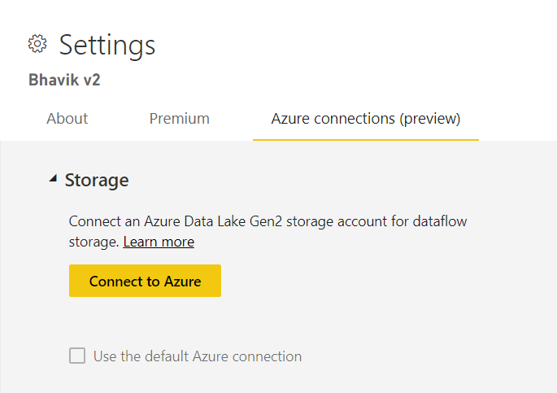
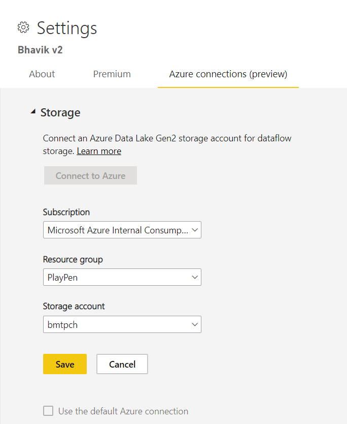

# Configuring Dataflow storage to use Azure Data Lake Gen 2 

By default, data used with Power BI is stored in internal storage provided by Power BI. With the integration of dataflows and Azure Data Lake Storage Gen2 (ADLS Gen2), you can store your dataflows in your organization's Azure Data Lake Storage Gen2 account.
There are two ways to configure which ADLS Gen 2 store to use. Either you can use a tenant assigned ADLS gen 2 account or bring your own at a workspace level. 

## Pre-requisites

In order to bring your own ADLS gen 2 account, you will need to ensure you have owner permissions at either the storage account, resource Group or subscription layer. If you happen to be an administrator, you will still need to assign yourself owner permission. 

Also, the ADLS Gen 2 account must be deployed in the same region as your Power BI tenant. You will receive an error if the locations of the resource does not match.
Finally, If you are in the admin portal, you can connect to any ADLS gen 2. However, if you happen to connect directly to a workspace, you must first ensure there is no dataflows in the workspace before connecting.

## Connecting to an Azure Data Lake Gen 2 at a workspace
Head toward a workspace which has no dataflows Click on Workspace settings and you will see a new tab called Azure Connections. Click on this tab and click the Storage section.

 
The “Use default Azure connection” option will be visible if the tenant has already configured ADLS Gen 2. You have two options, either use the tenant configured ADLS gen 2 by ticking the box “use the default Azure connection” or by clicking connect to azure to point to a new Azure Storage account. 
Click ‘Connect to Azure’ and Power BI will retrieve a list of Azure subscriptions you have access to. Fill in the dropdowns and select a valid Azure subscription, resource group and storage account which has hierarchical namespace option enabled (this is the ADLS Gen2 flag).

 
Once selected, click Save and you now have successfully attached the workspace to your own ADLS Gen2 account. You will notice that Power BI will automatically configure the storage account with the required permissions and set up the PBI filesystem where the data will be written to. Now every dataflow’s data inside this workspace will write directly to this filesystem. This can then be used with other Azure services creating a single source for all of your organizational or departmental data.

## Detaching Azure Data Lake Gen 2 from a workspace or tenant

In order to remove a connection at a workspace level you must first ensure all the dataflows in the workspace are deleted. Once all the dataflows have been removed, you can click disconnect in the workspace settings. The same applies for a tenant but you must first ensure all workspaces have also been disconnected from the tenant storage account before you are able to disconnect at a tenant level.

## Disabling Azure Data Lake Gen 2

In the admin portal, under dataflows, you have the ability of disabling access for users to either use this feature or not allow workspace admins to bring their own Azure Storage. These options can be found in the admin portal
