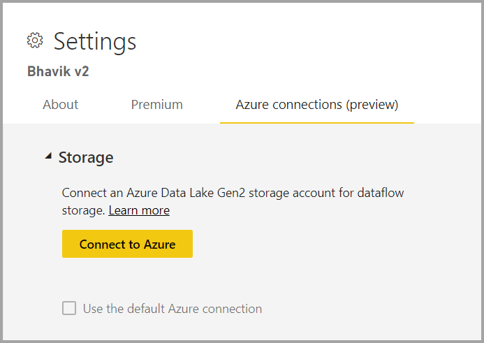
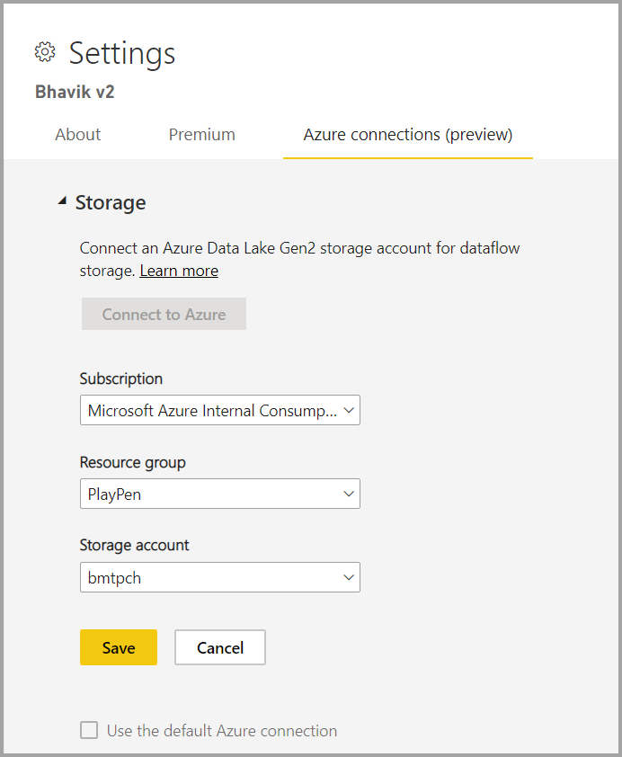
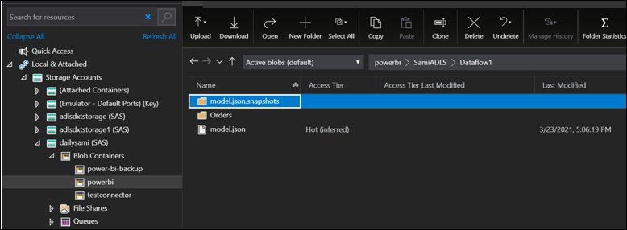

# Configuring dataflow storage to use Azure Data Lake Gen 2 

Data used with Power BI is stored in internal storage provided by Power BI by default. With the integration of dataflows and Azure Data Lake Storage Gen 2 (ADLS Gen2), you can store your dataflows in your organization's Azure Data Lake Storage Gen2 account. This essentially allows you to "bring your own storage" to Power BI dataflows, and establish a connection at the tenant or workspace level.

## Reasons to use the ADLS Gen 2 workspace or tenant connection

After you attach your dataflow, Power BI configures and saves a reference so that you can now read and write data to your own ADLS Gen 2. Power BI stores the data in the CDM format, which captures metadata about your data in addition to the actual data generated by the dataflow itself. This unlocks many powerful capabilities and enables your data and the associated metadata in CDM format to now serve extensibility, automation, monitoring, and backup scenarios. By making this data available and widely accessible in your own environment, it enables you to democratize the insights and data created within the organization. It also unlocks the ability for you to create further solutions that are either CDM aware (such as custom applications and solutions in Power Platform, Azure, and those available through partner and ISV ecosystems) or simply able to read a CSV. Your data engineers, data scientists, and analysts can now work with, use, and reuse a common set of data that is curated in ADLS Gen 2.

There are two ways to configure which ADLS Gen 2 store to use: you can use a tenant-assigned ADLS Gen 2 account, or you can bring your own ADLS Gen 2 store at a workspace level.

## Prerequisites

- To bring your own ADLS Gen 2 account, you must have owner permissions at the storage account layer. Permissions at the resource group or subscription level will *not* work. If you are an administrator, you still must assign yourself owner permission.  **Currently not supporting ADLS Gen2 Storage Accounts behind a firewall**.

- The storage account must be created with the [Hierarchical Namespace (HNS)](/azure/storage/blobs/create-data-lake-storage-account) enabled.

- The storage account must be created in the same Azure Active Directory tenant as the Power BI tenant.

- The user must have Azure Blob Data Contributor role, and an owner role at the storage account level.

- The Power BI workspace tenant region should be the same as the storage account region.

- TLS (Transport Layer Security) version 1.2 (or higher) is required to secure your endpoints. Web browsers and other client applications that use TLS versions earlier than TLS 1.2 won't be able to connect.

- Attaching a dataflow with ADLS Gen 2 behind multi-factor authentication (MFA) is not supported.

- Finally, you can connect to any ADLS Gen 2 from the admin portal, but if you connect directly to a workspace, you must first ensure there are no dataflows in the workspace before connecting.

The following table describes the permissions for ADLS and for Power BI required for ADLS Gen 2 and Power BI:

|Action  |ADLS permissions  |Minimum Power BI permissions  |
|---------|---------|---------|
|Connect ADLS Gen 2 to Power BI tenant     | Owner        | Power BI administrator |
|Connect ADLS Gen 2 to Workspace     | Owner        | Workspace Admin        |
|Create Power BI dataflows writing back to connected ADLS account     | Not applicable        | Workspace contributor         |
|Consume Power BI dataflow     | Not applicable        | Workspace viewer        |

## Connecting to an Azure Data Lake Gen 2 at a workspace level

Navigate to a workspace that has no dataflows. Select **Workspace settings**. Select the **Azure Connections** tab and then select the **Storage** section.

 
The **Use default Azure connection** option is visible if admin has already configured a tenant-assigned ADLS Gen 2 account. You have two options: 

- Use the tenant configured ADLS Gen 2 account by selecting the box called **Use the default Azure connection**, or
- Select **Connect to Azure** to point to a new Azure Storage account. 

When you select **Connect to Azure**, Power BI retrieves a list of Azure subscriptions to which you have access. Fill in the dropdowns and select a valid Azure subscription, resource group, and storage account that has the hierarchical namespace option enabled, which is the ADLS Gen2 flag.

 
Once selected, select **Save** and you now have successfully connected the workspace to your own ADLS Gen2 account. Power BI automatically configures the storage account with the required permissions, and sets up the Power BI filesystem where the data will be written. At this point, every dataflow’s data inside this workspace will write directly to this filesystem, which can be used with other Azure services, creating a single source for all of your organizational or departmental data.

## Understanding configuration

Configuring Azure connections is an optional setting with additional properties that can optionally be set: 

- Tenant Level storage, which lets you set a default, and/or 
- Workspace-level storage, which lets you specify the connection per workspace

You can optionally configure tenant-level storage if you want to use a centralized data lake only, or want this to be the default option. We don’t automatically start using the default to allow flexibility in your configuration, so you have flexibility to configure the workspaces that use this connection as you see fit. If you configure a tenant-assigned ADLS Gen 2 account, you still have to configure each workspace to use this default option.

You can optionally, or additionally, configure workspace-level storage permissions as a separate option, which provides complete flexibility to set a specific ADLS Gen 2 account on a workspace by workspace basis.  

To summarize, if tenant-level storage and workspace-level storage permissions are allowed, then workspace admins can optionally use the default ADLS connection, or opt to configure another storage account separate from the default. If tenant storage is not set, then workspace Admins can optionally configure ADLS accounts on a workspace by workspace basis. Finally, if tenant-level storage is selected and workspace-level storage is disallowed, then workspace admins can optionally configure their dataflows to use this connection.

## Understanding the structure and format for ADLS Gen 2 workspace connections  

In the ADLS Gen 2 storage account, all dataflows are stored in the **powerbi** container of the filesystem. 
 
The structure of the **powerbi** container looks like this:
`<workspace name>/<dataflow name>/model.json     
<workspace name>/<dataflow name>/model.json.snapshots/<all snapshots>` 
 
The location where dataflows store data in the folder hierarchy for ADLS Gen 2 is determined by whether the workspace is located in shared capacity or Premium capacity. The file structure after refresh for each capacity type is shown in the table below.

| Premium capacity | Shared capacity |
|---|---|
| `<workspace name>/<dataflow name>/<table name>/<tablesnapshots>` | `<workspace name>/<dataflow name>/<table name>/<tablesnapshots>` |

Below is an example using the Orders table of the Northwind Odata sample.

In the image above:
- The model.json is the most recent version of the dataflow.
- The model.json.snapshots are all previous versions of the dataflow. This is useful if you need a previous version of mashup, or incremental settings.
- The table.snapshots.csv is the data you got from a refresh. This is useful for incremental refreshes, and also for shared refreshes where a user is running into a refresh timeout issue because of data size. They can look at the most recent snapshot to see how much data is in the csv file.

We only write to this storage account and do not currently delete data. This means that even after detach, we don’t delete from the ADLS account, so all of the above files are still stored. 
 
> [!NOTE]
> A model.json file can refer to another model.json that is another dataflow in the same workspace, or in a dataflow in another workspace. The only time where a model.json would refer to a table.snapshot.csv is for incremental refresh. 
 
## Extensibility for ADLS Gen 2 workspace connections 

If you are connecting ADLS Gen 2 to Power BI, you can do this at the workspace or tenant level. Make sure you have the right access level. Learn more in [Prerequisites](dataflows-azure-data-lake-storage-integration.md#prerequisites).
 
The storage structure adheres to the Common Data Model format. Learn more about the storage structure and CDM by visiting [What is the storage structure for analytical dataflows](/power-query/dataflows/what-is-the-cdm-storage-structure-for-analytical-dataflows) and [Common Data Model and Azure Data Lake Storage Gen2](/common-data-model/data-lake).
 
Once properly configured, the data and metadata is in your control. A number of applications are aware of the CDM and the data can be extended using Azure, PowerApps, and PowerAutomate, as well as third-party ecosystems either by conforming to the format or by reading the raw data.

## Detaching Azure Data Lake Gen 2 from a workspace or tenant

To remove a connection at a workspace level, you must first ensure all dataflows in the workspace are deleted. Once all the dataflows have been removed, select **Disconnect** in the workspace settings. The same applies for a tenant, but you must first ensure all workspaces have also been disconnected from the tenant storage account before you are able to disconnect at a tenant level.

## Disabling Azure Data Lake Gen 2

In the **Admin portal**, under **dataflows**, you can disable access for users to either use this feature, and can disallow workspace admins to bring their own Azure Storage.

## Reverting from Azure Data Lake Gen 2
Once the dataflow storage has been configured to use Azure Data Lake Gen 2, there is no way to automatically revert. The process to return to Power BI-managed storage is manual. 

To revert the migration that you made to Gen 2, you will need to delete your dataflows and recreate them in the same workspace. Then, since we don’t delete data from ADLS Gen 2, go to the resource itself and clean up data. This would involve the following steps.

1. Export a copy of the dataflow from Power BI. Or, copy the model.json file. The model.json file is stored in ADLS.

2. Delete the dataflows.

3. Detach ADLS. 

4. Recreate the dataflows using import. Note that incremental refresh data (if applicable) will need to be deleted prior to import. This can be done by deleting the relevant partitions in the model.json file.

5. Configure refresh / recreate incremental refresh policies.  

## Connecting to the data using the ADLS Gen 2 connector  
 
The scope of this document describes ADLS Gen 2 dataflows connections and not the Power BI ADLS Gen 2 connector. Working with the ADLS Gen 2 connector is a separate, possibly additive, scenario. The ADLS connector simply uses ADLS as a datasource. This means that using PQO to query against that data doesn’t have to be in CDM format, it can be whatever data format the customer wants. Learn more about this scenario by visiting [Analyze data in Azure Data Lake Storage Gen2 by using Power BI](/power-query/connectors/datalakestorage).

## Next steps
The following articles provide more information about dataflows and Power BI:

* [Introduction to dataflows and self-service data prep](dataflows-introduction-self-service.md)
* [Creating a dataflow](dataflows-create.md)
* [Configure and consume a dataflow](dataflows-configure-consume.md)
* [Premium features of dataflows](dataflows-premium-features.md)
* [AI with dataflows](dataflows-machine-learning-integration.md)
* [Dataflows considerations and limitations](dataflows-features-limitations.md)
* [Dataflows best practices](dataflows-best-practices.md)
