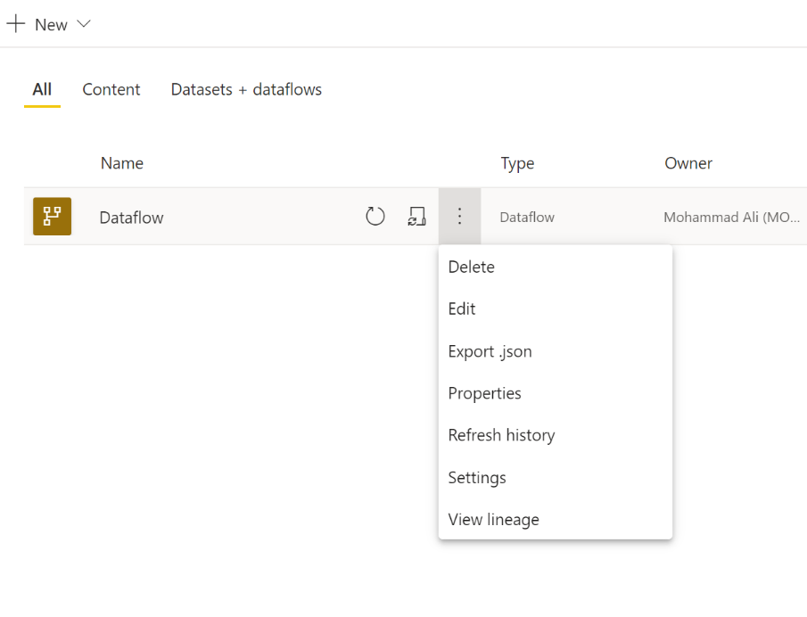
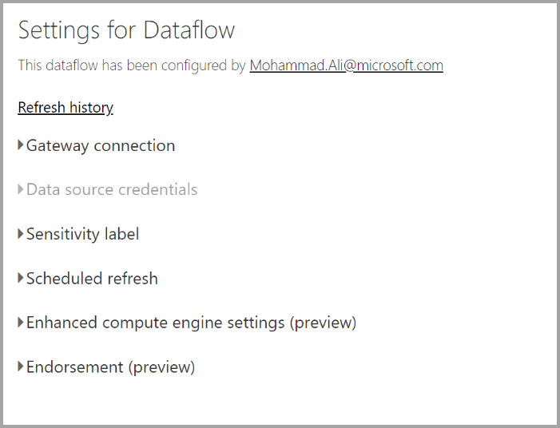
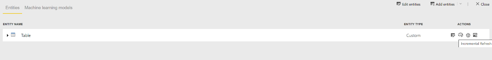
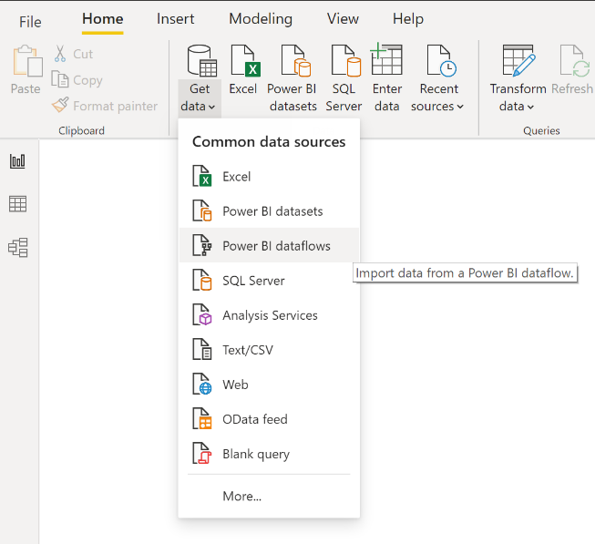
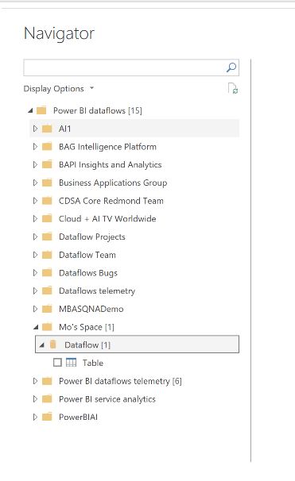

# Configuring and consuming a dataflow

Once you have created a dataflow, you will be prompted to refresh the data for the dataflow. This is required before the dataflow can be consumed in a dataset inside Power BI Desktop or referenced as a linked or computed entity.

## Configuring a dataflow

To configure the refresh of a dataflow, head over to the dataflow settings which can be found under the dataflow you created and clicking on the ellipsis and finding settings.

In the settings options you can do a range of things to the dataflow

**Take ownership**
If you are not the owner of the dataflow, a lot of these settings will be disabled. If you wish to take over the dataflow, click take over to take control. You will be asked to provide credentials again to ensure you have the right access level.

**Gateway Connection**
In this section, you can choose if the dataflow uses a gateway and choose which gateway is being used. 

**Data Source Credentials**
In this section, you can choose which credentials are being used and change how you authenticate to the data source.

**Sensitivity Label**
In this section, you can define the sensitivity of the data in the dataflow. To learn more about sensitivity labels click [here](https://docs.microsoft.com/en-us/power-bi/admin/service-security-apply-data-sensitivity-labels)

**Scheduled Refresh**
In this section, you can define the times of day this dataflow will refresh. A dataflow can be refreshed just as many times as a dataset (see limits section for more details).

**Enhanced Compute Engine settings**
In this section, you can define if the dataflow is stored inside the compute engine. The compute engine allows subsequent dataflows which references this dataflow to perform merges and joins and other transformations much faster than you would traditional expect. It also allows direct query to be performed over this dataflow. By selecting ‘On’, it means the dataflow will always be supported in direct query mode and any references would benefit from the engine. Selecting optimized means the engine will only be used if there is a reference to this dataflow. The ‘Off’ mode disables the compute engine and direct query capability for this dataflow.

**Endorsements**
In this section, you can define if the dataflow is certified or promoted. See dataset endorsements to find out more.

## Refreshing a dataflow
Dataflows act as building blocks on top of one another. Suppose you have a dataflow called ‘Raw Data’ and a linked entity called ‘Transformed Data’ which contains a linked entity to the ‘Raw Data’ dataflow. Then when the schedule refresh for the dataflow ‘Raw Data’ triggers, it will trigger any dataflow that references it upon completion. This creates a chain effect of refreshes allowing you to avoid having to schedule dataflows manually. There are a couple of nuances to be aware of when dealing with linked entities refreshes.

- A linked entity will be triggered by a refresh only if its in the same workspace only
- A linked entity will be locked for editing if a source entity is being refreshed. If any of the dataflows in a reference chain fail to refresh, all the dataflows will roll back to the old data (Dataflow refreshes are transactional within a workspace)
- Only referenced entities are refreshed when triggered by a source refresh completing. To schedule all the entities, you should set a schedule refresh on the linked entity too. In general, it is advised against setting a refresh schedule on linked dataflows to avoid double refresh

**Cancel Refresh**
Dataflows support the ability to cancel unlike datasets. If a refresh is running a long time, you can click on the dataflow options (clicking the dots next to the dataflow and click cancel refresh)

**Incremental Refresh (Premium only)**
Dataflows can be also set to refresh incrementally. To do so, click on the dataflow you wish to set it up for and click the incremental refresh icon.

Setting incremental refresh will add parameters to the dataflow to specify the date range. For detailed information on how to set up incremental refresh, go here https://docs.microsoft.com/en-us/power-query/dataflows/incremental-refresh

Considerations for when not to set incremental refresh for the following scenarios.

- linked entities should not use incremental refresh if they reference a dataflow. Dataflows does not support query folding (even if the entity is Direct Query enabled). 
- Datasets referencing dataflows should not use incremental refresh. Refreshes to dataflows should generally be performant. If the refreshes take time, consider using the compute engine and or direct query mode.

## Consuming a dataflow

A dataflow can be consumed in three ways.

- Create a linked entity from the dataflow to allow another dataflow author to use the data
- Create a dataset from the dataflow to allow a user to utilize the data to create reports
- Create a connection from external tools that can read from the CDM format

**Consuming from Desktop**
To consume a dataflow, open up Power BI Desktop and click the Power BI dataflows connector in Get Data.
Note: the connector will use a different set of credentials than the current logged in user. This is by design to support multi-tenant users.

Select which dataflow and which entities you wish to connect to. Note: you can connect to any dataflow or entity regardless of which workspace it resides in or whether or not it was defined in a premium or non-premium workspace.

If Direct query is available, you will be prompted to choose if you wish to connect to the entities through direct query or if you wish to use import. In Direct Query mode, you will be able to quickly interrogate large scale datasets locally. However, you are currently limited and are not be able to do any additional transformations. Import will bring the data into Power BI and will require the dataset to be refreshed independently of the dataflow.

## Next Steps

This article provided an overview of configuring and consuming dataflows. The following articles go into more detail about common usage scenarios for dataflows.

* [Dataflows best practice](../service-dataflows-best-practices.md)