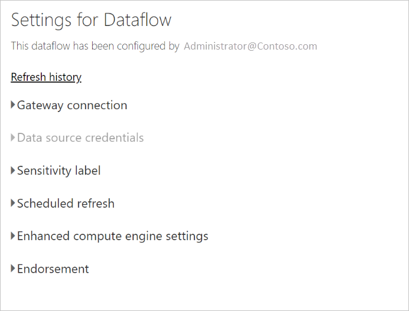

# Configure and consume a dataflow

With dataflows, you can unify data from multiple sources and prepare that unified data for modeling. Whenever you create a dataflow, you're prompted to refresh the data for the dataflow. Refreshing a dataflow is required before it can be consumed in a dataset inside Power BI Desktop, or referenced as a linked or computed table.

## Configuring a dataflow

To configure the refresh of a dataflow, select the **More** menu (the ellipsis) and select **Settings**.

The **Settings** options provide many options for your dataflow, as the following sections describe.

* **Take ownership:** If you're not the owner of the dataflow, many of these settings are disabled. To take ownership of the dataflow, select **Take over** to take control. You are prompted to provide credentials to ensure you have the necessary access level.

* **Gateway Connection:** In this section, you can choose whether the dataflow uses a gateway, and select which gateway is used. 

* **Data Source Credentials:** In this section you choose which credentials are being used, and can change how you authenticate to the data source.

* **Sensitivity Label:** Here you can define the sensitivity of the data in the dataflow. To learn more about sensitivity labels, see [how to apply sensitivity labels in Power BI](../../admin/service-security-apply-data-sensitivity-labels.md).

* **Scheduled Refresh:** Here you can define the times of day the selected dataflow refreshes. A dataflow can be refreshed at the same frequency as a dataset.

* **Enhanced Compute Engine settings:** Here you can define whether the dataflow is stored inside the compute engine. The compute engine allows subsequent dataflows, which reference this dataflow, to perform merges and joins and other transformations much faster than you would otherwise. It also allows DirectQuery to be performed over the dataflow. Selecting **On** ensures the dataflow is always supported in DirectQuery mode, and any references benefit from the engine. Selecting **Optimized** means the engine is only used if there is a reference to this dataflow. Selecting **Off** disables the compute engine and DirectQuery capability for this dataflow.

* **Endorsements:** You can define whether the dataflow is certified or promoted. 

> [!NOTE]
> Dataflows can be created by user in a Premium workspace, users with a Pro license, and users with a Premium Per User (PPU) license.

## Refreshing a dataflow
Dataflows act as building blocks on top of one another. Suppose you have a dataflow called *Raw Data* and a linked table called *Transformed Data* which contains a linked table to the *Raw Data* dataflow. When the schedule refresh for the dataflow *Raw Data* triggers, it will trigger any dataflow that references it upon completion. This functionality creates a chain effect of refreshes, allowing you to avoid having to schedule dataflows manually. There are a few nuances to be aware of when dealing with linked tables refreshes:

* A linked table will be triggered by a refresh only if it exists in the same workspace

* A linked table will be locked for editing if a source table is being refreshed. If any of the dataflows in a reference chain fail to refresh, all the dataflows will roll back to the old data (dataflow refreshes are transactional within a workspace).

* Only referenced tables are refreshed when triggered by a source refresh completion. To schedule all the tables, you should set a schedule refresh on the linked table as well. Avoid setting a refresh schedule on linked dataflows to avoid double refresh.

**Cancel Refresh**
Dataflows support the ability to cancel a refresh, unlike datasets. If a refresh is running a long time, you can select the dataflow options (the ellipses next to the dataflow) and then select **Cancel refresh**.

**Incremental Refresh (Premium only)**
Dataflows can be also set to refresh incrementally. To do so, select the dataflow you wish to set up for incremental refresh, and then select the incremental refresh icon.

Setting incremental refresh adds parameters to the dataflow to specify the date range. For detailed information on how to set up incremental refresh, see the [incremental refresh in Power Query](/power-query/dataflows/incremental-refresh) article.

There are some circumstances under which you should not set incremental refresh:

* Linked tables should not use incremental refresh if they reference a dataflow. Dataflows do not support query folding (even if the table is Direct Query enabled). 

* Datasets referencing dataflows should not use incremental refresh. Refreshes to dataflows are  generally performant, so incremental refreshes shouldn't be necessary. If refreshes take too long, consider using the compute engine, or DirectQuery mode.

## Consuming a dataflow

A dataflow can be consumed in the following three ways:

* Create a linked table from the dataflow to allow another dataflow author to use the data

* Create a dataset from the dataflow to allow a user to utilize the data to create reports

* Create a connection from external tools that can read from the CDM format

**Consuming from Power BI Desktop**
To consume a dataflow, run Power BI Desktop and select the **Power BI dataflows connector** in the **Get Data** dialog.

> [!NOTE]
> The Power BI dataflows connector uses a different set of credentials than the current logged in user. This is by design, to support multi-tenant users.

Select the dataflow and tables to which you want to connect. 

> [!NOTE]
> You can connect to any dataflow or table regardless of which workspace it resides in, and whether or not it was defined in a Premium or non-Premium workspace.

If DirectQuery is available, you're prompted to choose whether you want to connect to the tables through DirectQuery or Import. 

In DirectQuery mode, you can quickly interrogate large-scale datasets locally. However, you cannot perform any additional transformations. 

Using Import brings the data into Power BI, and requires the dataset to be refreshed independently of the dataflow.

## Next steps
The following articles provide more information about dataflows and Power BI:

* [Introduction to dataflows and self-service data prep](dataflows-introduction-self-service.md)
* [Creating a dataflow](dataflows-create.md)
* [Configuring Dataflow storage to use Azure Data Lake Gen 2](dataflows-azure-data-lake-storage-integration.md)
* [Premium features of dataflows](dataflows-premium-features.md)
* [AI with dataflows](dataflows-machine-learning-integration.md)
* [Dataflows limitations and considerations](dataflows-features-limitations.md)
* [Dataflows best practices](dataflows-best-practices.md)
