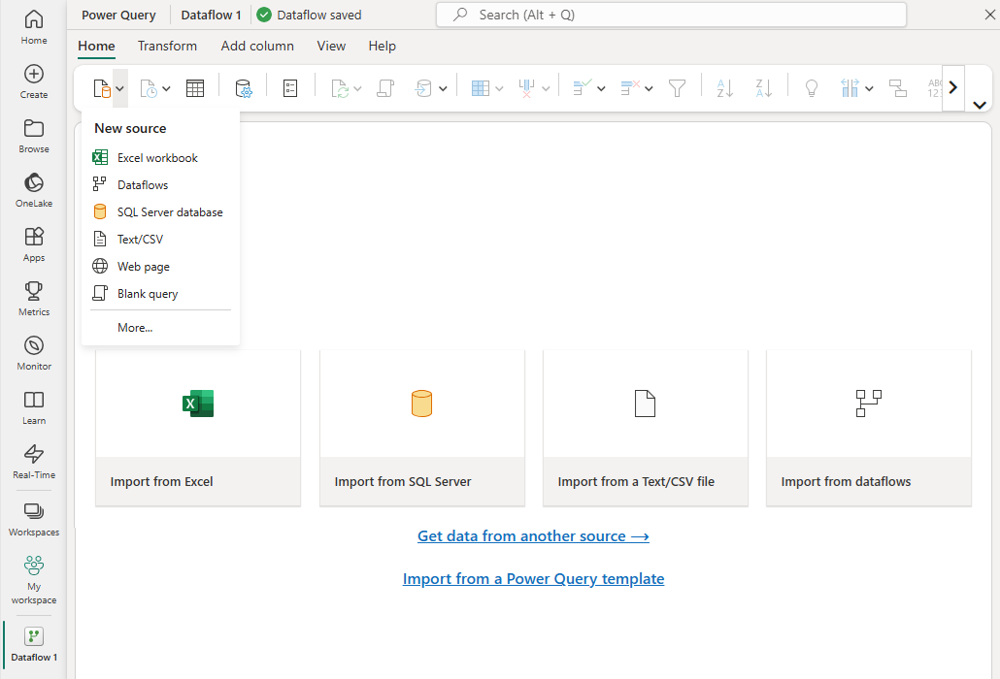

# Creating a dataflow
A **dataflow** is a collection of tables that are created and managed in workspaces in the Power BI service. A **table** is a set of columns that are used to store data, much like a table within a database. You can add and edit tables in your dataflow, as well as manage data refresh schedules, directly from the workspace in which your dataflow was created.

To create a dataflow, launch the Power BI service in a browser then select a **workspace** (dataflows are not available in *my-workspace* in the Power BI service) from the nav pane on the left, as shown in the following screen. You can also create a new workspace in which to create your new dataflow.

There are multiple ways to create or build on top of a new dataflow:

* [Create a dataflow using define new tables](#create-a-dataflow-using-define-new-tables)
* [Create a dataflow using linked tables](#create-a-dataflow-using-linked-tables)
* [Create a dataflow using a computed table](#create-a-dataflow-using-a-computed-table)
* [Create a dataflow using import/export](#create-a-dataflow-using-importexport)

The following sections explore each of these ways to create a dataflow in detail.

> [!NOTE]
> Dataflows can be created by user in a Premium workspace, users with a Pro license, and users with a Premium Per User (PPU) license.

## Create a dataflow using define new tables

Using the Define new tables option lets you define a new table and connect to a new data source.

When you select a data source, you're prompted to provide the connection settings, including the account to use when connecting to the data source, as shown in the following image.

Once connected, you can select which data to use for your table. When you choose data and a source, Power BI reconnects to the data source in order to keep the data in your dataflow refreshed, at the frequency you select later in the setup process.

Once you select the data for use in the table, you can use dataflow editor to shape or transform that data into the format necessary for use in your dataflow. 

## Create a dataflow using linked tables

Creating a dataflow using linked tables enables you to reference an existing table, defined in another dataflow, in a read-only fashion. The following list describes some of the reasons you may choose this approach:

* If you want to reuse a table across multiple dataflows, such as a date table or a static lookup table, you should create a table once and then reference it across the other dataflows.

* If you want to avoid creating multiple refreshes to a data source, it's better to use linked tables to store the data and act as a cache. Doing so allows every subsequent consumer to leverage that table, reducing the load to the underlying data source.

* If you need to perform a merge between two tables.

> [!NOTE]
> Linked tables are available only with Power BI Premium.

## Create a dataflow using a computed table

Creating a dataflow using a computed table allows you to reference a linked table and perform operations on top of it in a write-only fashion. The result is a new table, which is part of the dataflow. To convert a linked table into a computed table, you can either create a new query from a merge operation, or if you want to edit or transform the table, create a reference or duplicate of the table.

### How to create computed tables

Once you have a dataflow with a list of tables, you can perform calculations on those tables.
In the dataflow authoring tool in the Power BI service, select **Edit tables**, then right-click on the table you want to use as the basis for your computed table and on which you want to perform calculations. In the context menu, choose **Reference**.
For the table to be eligible as a computed table, the **Enable load** selection must be checked, as shown in the following image. Right-click on the table to display this context menu.

By selecting **Enable load**, you create a new table for which its source is the referenced table. The icon changes, and shows the **computed** icon, as shown in the following image.

Any transformation you perform on this newly created table is run on the data that already resides in Power BI dataflow storage. That means that the query will not run against the external data source from which the data was imported (for example, the SQL database from which the data was pulled), but rather, is performed on the data that resides in the dataflow storage.

**Example use cases**
What kind of transformations can be performed with computed tables? Any transformation that you usually specify using the transformation user interface in Power BI, or the M editor, are all supported when performing in-storage computation.

Consider the following example: you have an *Account* table that contains the raw data for all the customers from your Dynamics 365 subscription. You also have *ServiceCalls* raw data from the Service Center, with data from the support calls that were performed from the different account in each day of the year.

Imagine you want to enrich the *Account* table with data from the *ServiceCalls*.
First you would need to aggregate the data from the *ServiceCalls* to calculate the number of support calls that were done for each account in the last year.

Next, you would want to merge the *Account* table with the *ServiceCallsAggregated* table to calculate the enriched *Account* table.

And then you can see the results, shown as *EnrichedAccount* in the following image.

And that's it - the transformation is performed on the data in the dataflow that resides in your Power BI Premium subscription, not on the source data.

> [!NOTE]
> Computed tables are a premium only feature

## Create a dataflow using a CDM folder

Creating a dataflow from a CDM folder allows you to reference an table that has been written by another application in the Common Data Model (CDM) format. You are prompted to provide the complete path to the CDM format file stored in ADLS Gen 2.

 

There are a few requirements for creating dataflows from CDM folders, as the following list describes:

* The ADLS Gen 2 account must have the appropriate permissions set up in order for PBI to access the file

* The ADLS Gen 2 account must be accessible by the user trying to create the dataflow

* Creating dataflows from CDM folders is only available in the new workspace experience

* The URL must be a direct file path to the JSON file and use the ADLS Gen 2 endpoint; blob.core is not supported

## Create a dataflow using import/export

Creating a dataflow using import/export lets you import a dataflow from a file. This is useful if you want to save a dataflow copy offline, or move a dataflow from one workspace to another. 

To export a dataflow, select the dataflow you created and select the **More** menu item (the ellipsis) to expand the options, and then select **Export .json**. You are prompted to begin the download of the dataflow represented in CDM format.

To import a dataflow, select the import box and upload the file. Power BI creates the dataflow for you, and allows you to save the dataflow as is, or to perform additional transformations.

## Next steps

Once you create a dataflow, you can use Power BI Desktop and the Power BI service to create datasets, reports, dashboards, and apps that are based on the data you put into Power BI dataflows, and thereby gain insights into your business activities. The following articles go into more detail about common usage scenarios for dataflows:

* [Introduction to dataflows and self-service data prep](dataflows-introduction-self-service.md)
* [Configure and consume a dataflow](dataflows-configure-consume.md)
* [Configuring Dataflow storage to use Azure Data Lake Gen 2](dataflows-azure-data-lake-storage-integration.md)
* [Premium features of dataflows](dataflows-premium-features.md)
* [AI with dataflows](dataflows-machine-learning-integration.md)
* [Dataflows limitations and considerations](dataflows-features-limitations.md)
* [Dataflows best practices](dataflows-best-practices.md)
