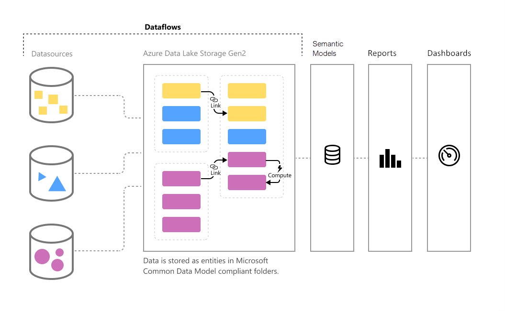

# Introduction to dataflows and self-service data prep

As data volume continues to grow, so does the challenge of wrangling that data into well-formed, actionable information. We want data that’s ready for analytics, to populate visuals, reports, and dashboards, so we can quickly turn our volumes of data into actionable insights. With self-service data prep for big data in Power BI, you can go from data to Power BI insights with just a few clicks.

## When to use dataflows

Dataflows are designed to support the following scenarios:

* Create reusable transformation logic that can be shared by many datasets and reports inside Power BI. Dataflows promote reusability of the underlying data elements, preventing the need to create separate connections with your cloud or on-premise data sources.

* Expose the data in your own Azure Data Lake Gen 2 storage, enabling you to connect other Azure services to the raw underlying data.

* Create a single source of the truth by forcing analysts to connect to the dataflows, rather than connecting to the underlying systems, providing you with control over which data is accessed, and how data is exposed to report creators. You can also map the data to industry standard definitions, enabling you to create tidy curated views, which can work with other services and products in the Power Platform.

* If you want to work with large data volumes and perform ETL at scale, dataflows with Power BI Premium scales more efficiently and gives you more flexibility. Dataflows supports a wide range of cloud and on-premise sources. 

* Prevent analysts from having direct access to the underlying data source. Since report creators can build on top of dataflows, it may be more convenient for you to allow access to underlying data sources only to a few individuals, and then provide access to the dataflows for analysts to build on top of. This approach reduces the load to the underlying systems, and gives administrators finer control of when the systems get loaded from refreshes.

Once you’ve created a dataflow, you can use Power BI Desktop and the Power BI service to create datasets, reports, dashboards, and apps that leverage the Common Data Model to drive deep insights into your business activities. Dataflow refresh scheduling is managed directly from the workspace in which your dataflow was created, just like your datasets.

## Next steps
This article provided an overview of self-service data prep for big data in Power BI, and the many ways you can use it. 

The following articles provide more information about dataflows and Power BI:

* [Creating a dataflow](dataflows-create.md)
* [Configure and consume a dataflow](dataflows-configure-consume.md)
* [Configuring Dataflow storage to use Azure Data Lake Gen 2](dataflows-azure-data-lake-storage-integration.md)
* [Premium features of dataflows](dataflows-premium-features.md)
* [AI with dataflows](dataflows-machine-learning-integration.md)
* [Dataflows considerations and limitations](dataflows-features-limitations.md)
* [Dataflows best practices](dataflows-best-practices.md)

For more information about the Common Data Model, you can read its overview article:
* [Common Data Model - overview](/powerapps/common-data-model/overview)