# AI with dataflows

In this article we discuss ways you can use artificial intelligence (AI) with dataflows. The areas described in this article are the following:

* Cognitive Services
* Automated Machine Learning
* Azure Machine Learning Integration

## Cognitive Services in Power BI

With  Cognitive Services in Power BI, you can apply different algorithms from [Azure Cognitive Services](https://azure.microsoft.com/services/cognitive-services/) to enrich your data in the self-service data prep for Dataflows.

The services that are supported today are [Sentiment Analysis](/azure/cognitive-services/text-analytics/how-tos/text-analytics-how-to-sentiment-analysis), [Key Phrase Extraction](/azure/cognitive-services/text-analytics/how-tos/text-analytics-how-to-keyword-extraction), [Language Detection](/azure/cognitive-services/text-analytics/how-tos/text-analytics-how-to-language-detection), and [Image Tagging](/azure/cognitive-services/computer-vision/concept-tagging-images). The transformations are executed on the Power BI Service and do not require an Azure Cognitive Services subscription. This feature requires Power BI Premium.

### **Enabling AI features**

Cognitive services are supported for Premium capacity nodes EM2, A2, or P1 and above. Cognitive services are also available with a Premium Per User (PPU) license. A separate AI workload on the capacity is used to run cognitive services. Before using cognitive services in Power BI, the AI workload needs to be enabled in the capacity settings of the admin portal. You can turn on the AI workload in the workloads section, and define the maximum amount of memory you would like this workload to consume. The recommended memory limit is 20%. Exceeding this limit causes the query to slow down.

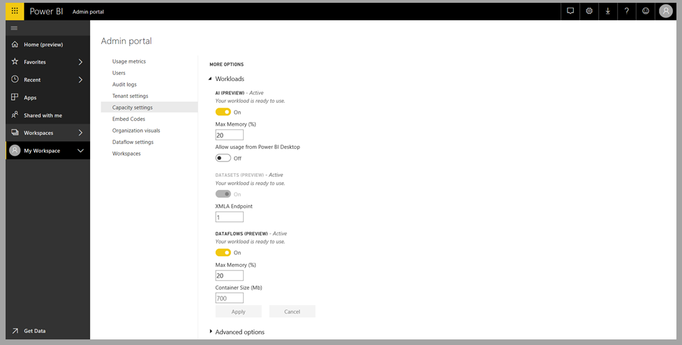

### **Getting started with Cognitive Services in Power BI**

Cognitive Services transforms are part of the [Self-Service Data Prep for dataflows](https://powerbi.microsoft.com/blog/introducing-power-bi-data-prep-wtih-dataflows/). To enrich your data with Cognitive Services, start by editing a dataflow.

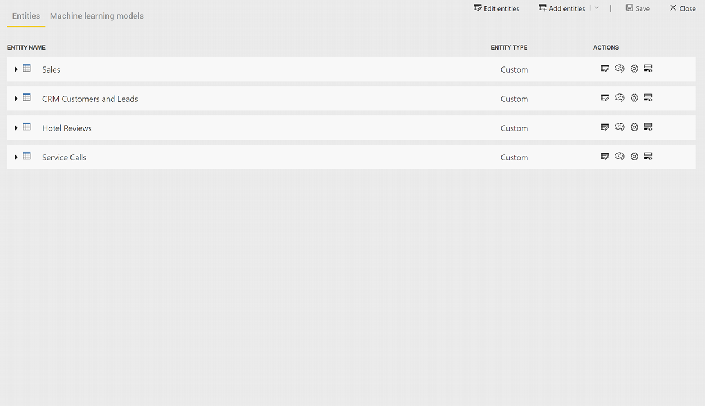

Select the **AI Insights** button in the top ribbon of Power Query Editor.

In the pop-up window, select the function you want to use and the data you want to transform. In this example, I'm scoring the sentiment of a column that contains review text.

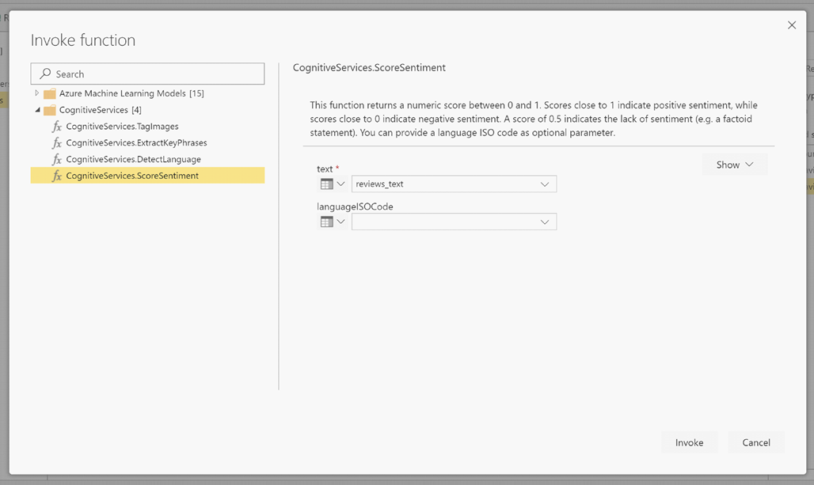

**Cultureinfo** is an optional input to specify the language of the text. This column is expecting an ISO code. You can use a column as input for Cultureinfo, or a static column. In this example, the language is specified as English (en) for the whole column. If you leave this column blank, Power BI automatically detects the language before applying the function. Next, select **Invoke.**

After invoking the function, the result is added as a new column to the table. The transformation is also added as an applied step in the query.

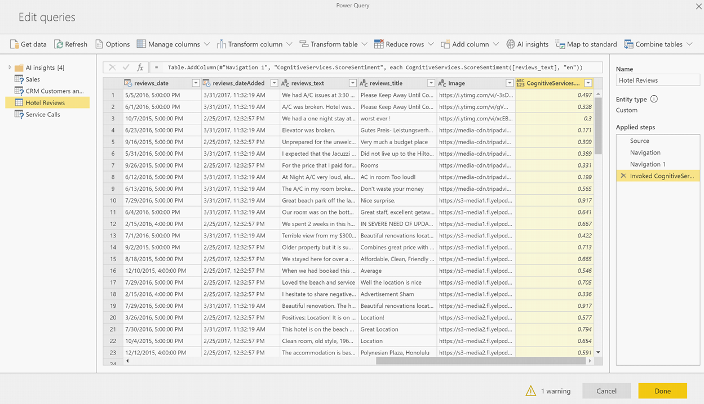

If the function returns multiple output columns, invoking the function adds a new column with a row of the multiple output columns.

Use the expand option to add one or both values as columns to your data.

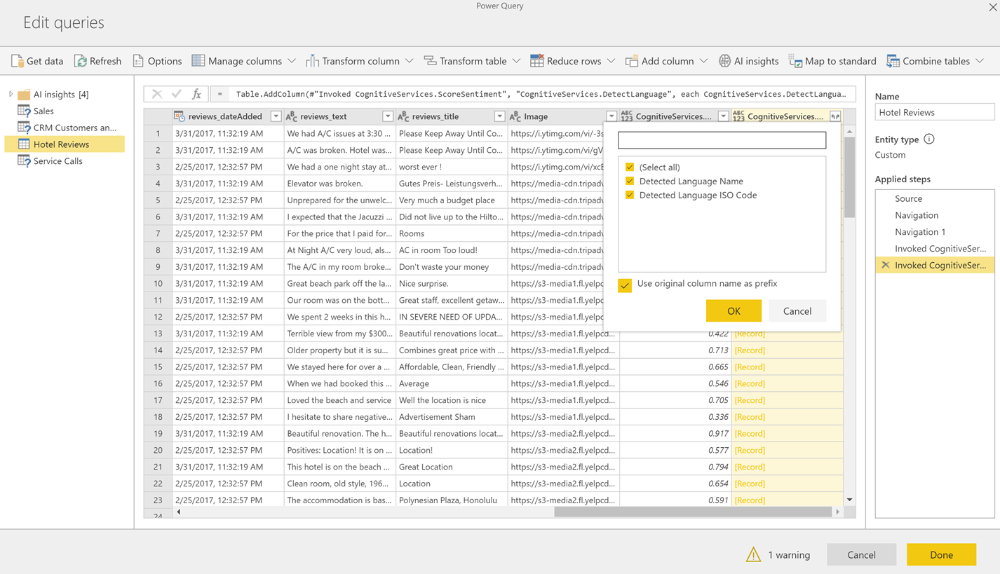

### **Available functions**

This section describes the available functions in Cognitive Services in Power BI.

#### **Detect Language**

The language detection function evaluates text input, and for each column, returns the language name and ISO identifier. This function is useful for data columns that collect arbitrary text, where language is unknown. The function expects data in text format as input.

Text Analytics recognizes up to 120 languages. For more information, see [supported languages](/azure/cognitive-services/text-analytics/text-analytics-supported-languages).

#### **Extract Key Phrases**

The **Key Phrase Extraction** function evaluates unstructured text, and for each text column, returns a list of key phrases. The function requires a text column as input, and accepts an optional input for **Cultureinfo**. (See the **Getting Started** section earlier in this article).

Key phrase extraction works best when you give it bigger chunks of text to work on. This is opposite from sentiment analysis, which performs better on smaller blocks of text. To get the best results from both operations, consider restructuring the inputs accordingly.

#### **Score Sentiment**

The **Score Sentiment** function evaluates text input and returns a sentiment score for each document, ranging from 0 (negative) to 1 (positive). This function is useful for detecting positive and negative sentiment in social media, customer reviews, and discussion forums.

Text Analytics uses a machine learning classification algorithm to generate a sentiment score between 0 and 1. Scores closer to 1 indicate positive sentiment, scores closer to 0 indicate negative sentiment. The model is pre-trained with an extensive body of text with sentiment associations. Currently, it's not possible to provide your own training data. The model uses a combination of techniques during text analysis, including text processing, part-of-speech analysis, word placement, and word associations. For more information about the algorithm, see [Introducing Text Analytics](/archive/blogs/machinelearning/machine-learning-and-text-analytics).

Sentiment analysis is performed on the entire input column, as opposed to extracting sentiment for a particular table in the text. In practice, there's a tendency for scoring accuracy to improve when documents contain one or two sentences rather than a large block of text. During an objectivity assessment phase, the model determines whether an input column as a whole is objective or contains sentiment. An input column that is mostly objective does not progress to the sentiment detection phrase, resulting in a .50 score, with no further processing. For input columns continuing in the pipeline, the next phase generates a score above or below .50, depending on the degree of sentiment detected in the input column.

Currently, Sentiment Analysis supports English, German, Spanish, and French. Other languages are in preview. For more information, see [Supported languages](/azure/cognitive-services/text-analytics/text-analytics-supported-languages).

#### **Tag Images**

The **Tag Images** function returns tags based on more than 2,000 recognizable objects, living beings, scenery, and actions. When tags are ambiguous or not common knowledge, the output provides 'hints' to clarify the meaning of the tag in context of a known setting. Tags are not organized as a taxonomy and no inheritance hierarchies exist. A collection of content tags forms the foundation for an image 'description' displayed as human readable language formatted in complete sentences.

After uploading an image or specifying an image URL, Computer Vision algorithms output tags based on the objects, living beings, and actions identified in the image. Tagging is not limited to the main subject, such as a person in the foreground, but also includes the setting (indoor or outdoor), furniture, tools, plants, animals, accessories, gadgets, and so on.

This function requires an image URL or abase-64 column as input. At this time, image tagging supports English, Spanish, Japanese, Portuguese, and Simplified Chinese. For more information, see [Supported languages](/java/api/com.microsoft.azure.cognitiveservices.vision.computervision.computervision.tagimage#azure-java-stable).

## Automated Machine Learning in Power BI

Automated machine learning (AutoML) for dataflows enables business analysts to train, validate, and invoke Machine Learning (ML) models directly in Power BI. It includes a simple experience for creating a new ML model where analysts can use their dataflows to specify the input data for training the model. The service automatically extracts the most relevant features, selects an appropriate algorithm, and tunes and validates the ML model. After a model is trained, Power BI automatically generates a performance report that includes the results of the validation. The model can then be invoked on any new or updated data within the dataflow.

Automated machine learning is available for dataflows that are hosted on Power BI Premium and Embedded capacities only.

### Working with AutoML

Dataflows offer self-serve data prep for big data. AutoML is integrated into dataflows and enables you to leverage your data prep effort for building machine learning models, right within Power BI.

AutoML in Power BI enables data analysts to use dataflows to build machine learning models with a simplified experience, using just Power BI skills. Most of the data science behind the creation of the ML models is automated by Power BI. It has guardrails to ensure that the model produced has good quality and provides visibility into the process used to create your ML model.

AutoML supports the creation of **Binary Prediction**, **Classification**, and **Regression Models** for dataflows. These are types of supervised machine learning techniques, which means that they learn from the known outcomes of past observations to predict the outcomes of other observations. The input dataset for training an AutoML model is a set of rows that are **labeled** with the known outcomes.

AutoML in Power BI integrates [automated ML](/azure/machine-learning/service/concept-automated-ml) from [Azure Machine Learning](/azure/machine-learning/overview-what-is-azure-machine-learning) to create your ML models. However, you don't need an Azure subscription to use AutoML in Power BI. The process of training and hosting the ML models is managed entirely by the Power BI service.

After an ML model is trained, AutoML automatically generates a Power BI report that explains the likely performance of your ML model. AutoML emphasizes explainability by highlighting the key influencers among your inputs that influence the predictions returned by your model. The report also includes key metrics for the model.

Other pages of the generated report show the statistical summary of the model and the training details. The statistical summary is of interest to users who would like to see the standard data science measures of model performance. The training details summarize all the iterations that were run to create your model, with the associated modeling parameters. It also describes how each input was used to create the ML model.

You can then apply your ML model to your data for scoring. When the dataflow is refreshed, your data is updated with predictions from your ML model. Power BI also includes an individualized explanation for each specific prediction that the ML model produces.

### Creating a machine learning model

This section describes how to create an AutoML model.

#### Data prep for creating an ML model

To create a machine learning model in Power BI, you must first create a dataflow for the data containing the historical outcome information, which is used for training the ML model. You should also add calculated columns for any business metrics that may be strong predictors for the outcome you're trying to predict. For details on configuring your dataflow, see [configure and consume a dataflow](dataflows-configure-consume.md).

AutoML has specific data requirements for training a machine learning model. These requirements are described in sections below, based on respective model types.

#### Configuring the ML model inputs

To create an AutoML model, select the ML icon in the **Actions** column of the dataflow table, and select **Add a machine learning model**.

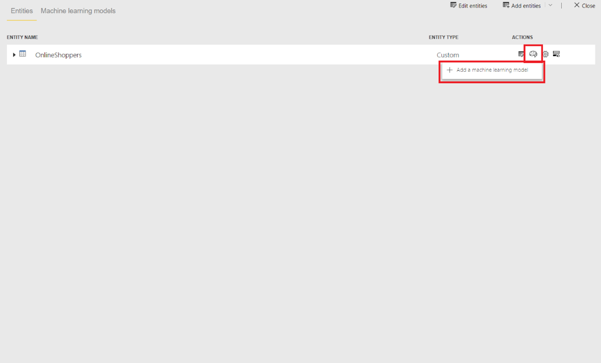

A simplified experience is launched, consisting of a wizard that guides you through the process of creating the ML model. The wizard includes the following simple steps.

**1. Select the table with the historical data, and the outcome column for which you want a prediction**

The outcome column identifies the label attribute for training the ML model, shown in the following image.

**2. Choose a model type**

When you specify the outcome column, AutoML analyzes the label data to recommend the most likely ML model type that can be trained. You can pick a different model type as shown below by clicking on “Select a different model”.

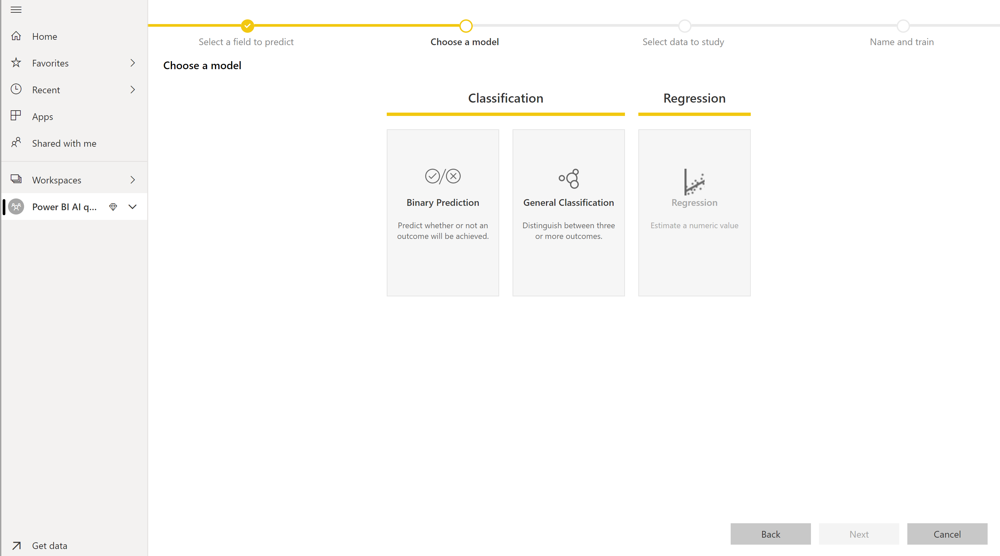

> [!NOTE]
> Some model types may not be supported for the data that you have selected and hence would be disabled. In the above example, Regression is disabled, as a text column is selected as outcome column.

**3. Select the inputs you want the model to use as predictive signals**

AutoML analyzes a sample of the selected table to suggest the inputs that can be used for training the ML model. Explanations would be provided next to columns that are not selected. If a particular column has too many distinct values or only one value, or low or high correlation with the output column, it would not be recommended.

Any inputs that are dependent on the outcome column (or the label column) should not be used for training the ML model, since they will affect its performance. Such columns would be flagged as having “suspiciously high correlation with output column”. Introducing these columns into the training data causes label leakage, where the model performs well on the validation or test data but cannot match that performance when used in production for scoring. Label leakage could be a possible concern in AutoML models, when training model performance is too good to be true.

This feature recommendation is based on a sample of a data, so you should review the inputs used. You have the option to change the selections to include only the columns you want the model to study. You can also select all the columns by selecting the checkbox next to the table name.

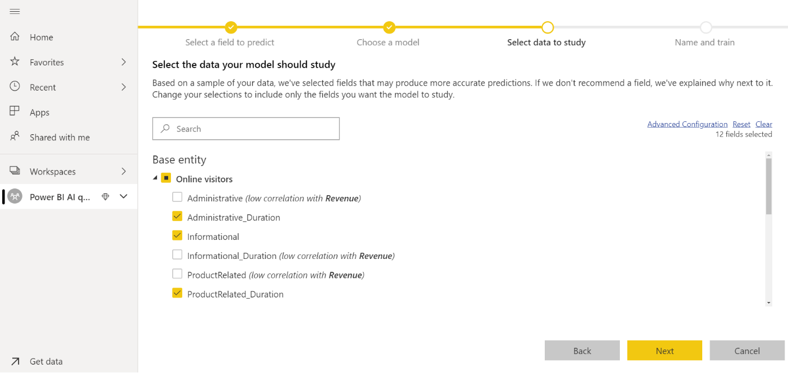

**4. Name your model and save your configuration**

In the final step, you can name the model and select Save and train which begins training the ML model. You can choose to reduce the training time to see quick results or increase the amount of time spent in training to get the best model.

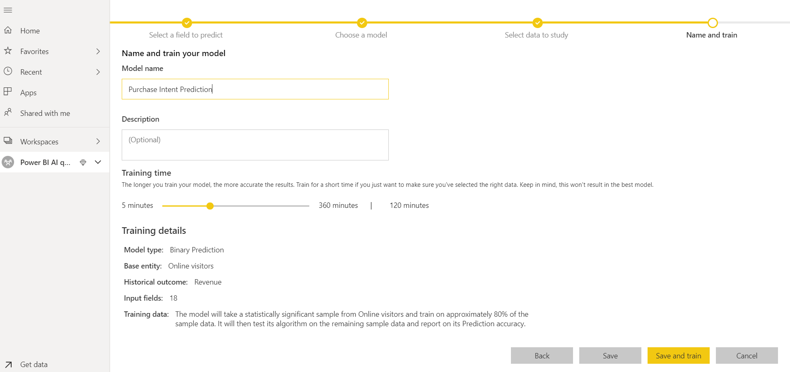

#### ML model training

Training of AutoML models is a part of the dataflow refresh. AutoML first prepares your data for training.
AutoML splits the historical data you provide into training and testing datasets. The test dataset is a holdout set that is used for validating the model performance after training. These are realized as **Training and Testing** tables in the dataflow. AutoML uses cross-validation for the model validation.

Next, each input column is analyzed and imputation is applied, which replaces any missing values with substituted values. A couple of different imputation strategies are used by AutoML. For input attributes treated as numeric features, the mean of the column values is used for imputation. For input attributes treated as categorical features, AutoML uses the mode of the column values for imputation. The mean and mode of values used for imputation are calculated by the AutoML framework on the subsampled training dataset.

Then, sampling and normalization are applied to your data as required. For classification models, AutoML runs the input data through stratified sampling and balances the classes to ensure the row counts are equal for all.

AutoML applies several transformations on each selected input column based on its data type, and its statistical properties. AutoML uses these transformations to extract features for use in training your ML model.

The training process for AutoML models consists of up to 50 iterations with different modeling algorithms and hyperparameter settings to find the model with the best performance. Training can end early with lesser iterations if AutoML notices that there is no performance improvement being observed. The performance of each of these models is assessed by validation with the holdout test dataset. During this training step, AutoML creates several pipelines for training and validation of these iterations. The process of assessing the performance of the models can take time, anywhere from several minutes to a couple of hours up-to the training time configured in the wizard, depending on the size of your dataset and the capacity resources available.

In some cases, the final model generated may use ensemble learning, where multiple models are used to deliver better predictive performance.

#### AutoML model explainability

After the model has been trained, AutoML analyzes the relationship between the input features and the model output. It assesses the magnitude of change to the model output for the holdout test dataset for each input feature. This is known as the _feature importance_. This happens as a part of the refresh once training is complete. Hence your refresh may take longer than the training time configured in the wizard.

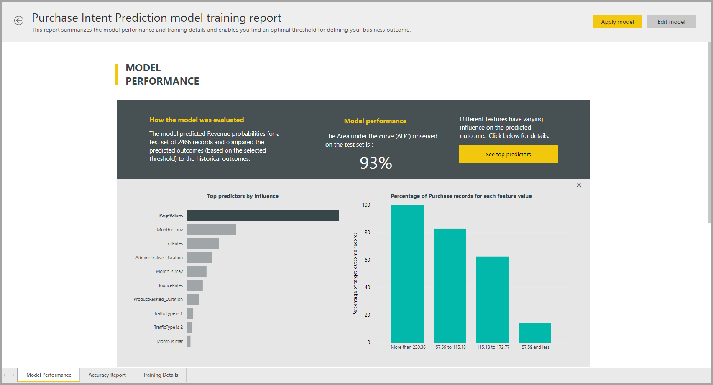

#### AutoML model report

AutoML generates a Power BI report that summarizes the performance of the model during validation, along with the global feature importance. This report can be accessed from the Machine Learning Model tab once the dataflow refresh is successful. The report summarizes the results from applying the ML model to the holdout test data and comparing the predictions with the known outcome values.

You can review the model report to understand its performance. You can also validate that the key influencers of the model align with the business insights about the known outcomes.

The charts and measures used to describe the model performance in the report depend on the model type. These performance charts and measures are described in the following sections.

Additional pages in the report may describe statistical measures about the model from a data science perspective. For instance, the **Binary Prediction** report includes a gain chart and the ROC curve for the model.

The reports also include a **Training Details** page that includes a description of how the model was trained, and a chart describing the model performance over each of the iterations run.

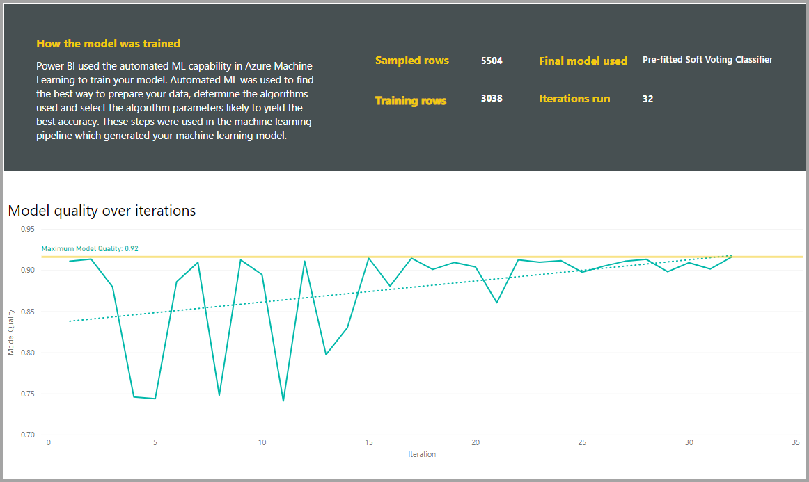

Another section on this page describes the detected type of the input column and imputation method used for filling missing values. It also includes the parameters used by the final model.

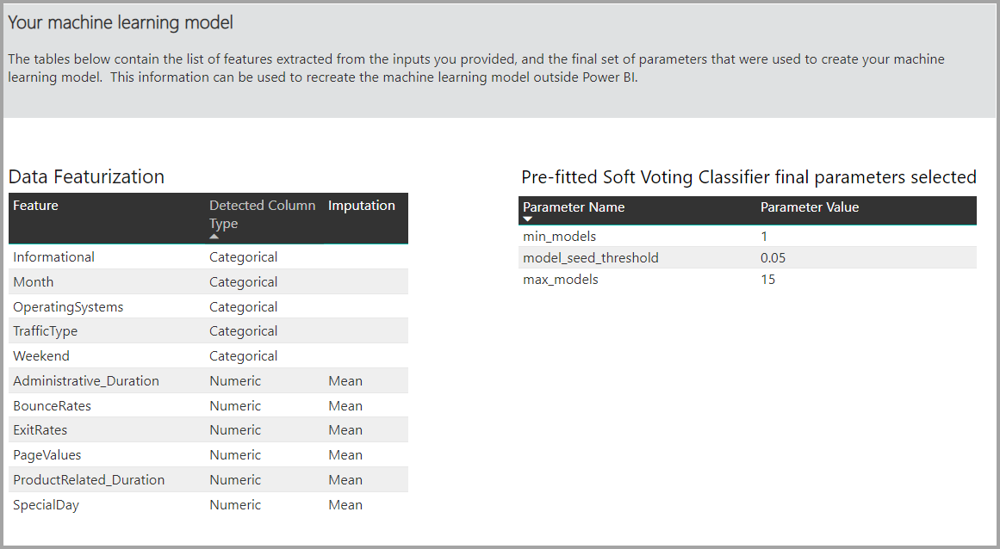

If the model produced uses ensemble learning, then the **Training Details** page also includes a chart showing the weight of each constituent model in the ensemble, as well as its parameters.

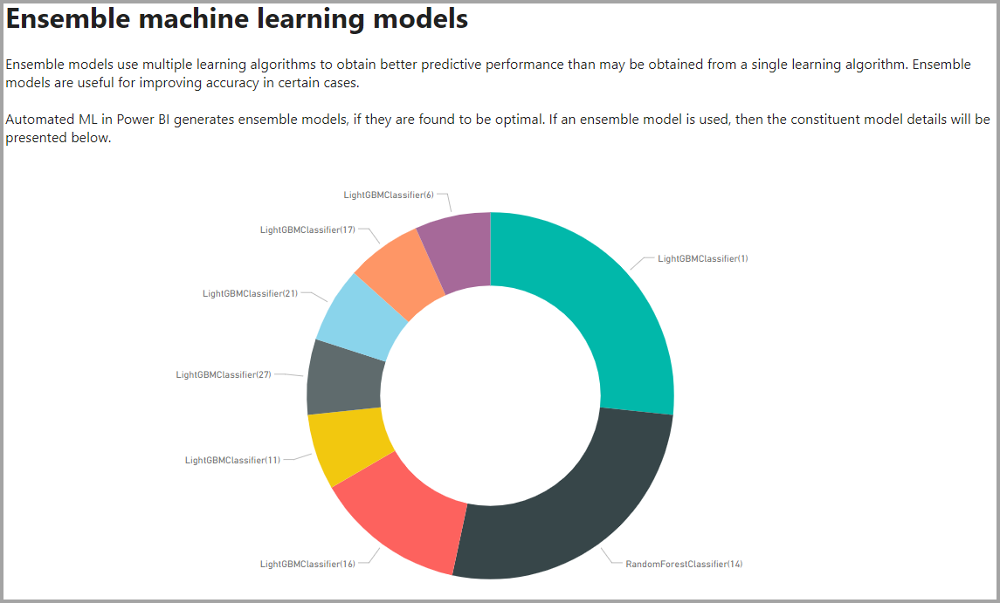

### Applying the AutoML model

If you're satisfied with the performance of the ML model created, you can apply it to new or updated data when your dataflow is refreshed. You can do this from the model report, by selecting the **Apply** button in the top-right corner or the Apply ML Model button under actions in the Machine Learning Models tab.

To apply the ML model, you must specify the name of the table to which it must be applied, and a prefix for the columns that will be added to this table for the model output. The default prefix for the column names is the model name. The _Apply_ function may include additional parameters specific to the model type.

Applying the ML model creates two new dataflow tables which contains the predictions and individualized explanations for each row that it scores in the output table. For instance, if you apply the _PurchaseIntent_ model to the _OnlineShoppers_ table, the output will generate the **OnlineShoppers enriched PurchaseIntent** and **OnlineShoppers enriched PurchaseIntent explanations** tables. For each row in the enriched table, The **Explanations** is broken down into multiple rows in the enriched explanations table based on the input feature. An **ExplanationIndex** helps map the rows from the enriched explanations table to the row in enriched table.

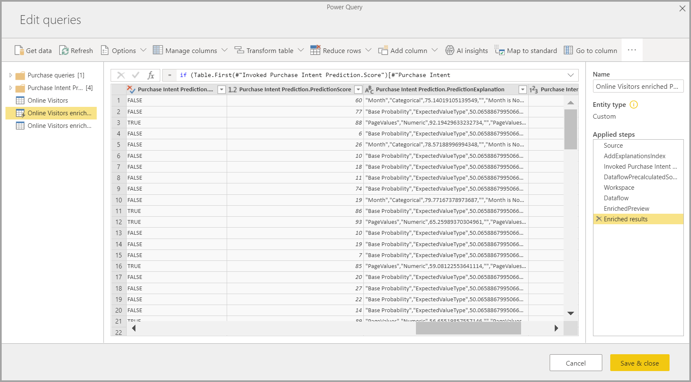

You can also apply any Power BI AutoML model to tables in any dataflow in the same workspace using AI Insights in PQO function browser. This way, you can use models created by others in the same workspace without necessarily being an owner of the dataflow that has the model. Power Query discovers all the Power BI ML models in the workspace and exposes them as dynamic Power Query functions. You can invoke those functions by accessing them from the ribbon in Power Query Editor, or by invoking the M function directly. This functionality is currently only supported for Power BI dataflows, and for Power Query Online in the Power BI service. Note that this is very different from applying ML models within a dataflow using the AutoML wizard. There is no explanations table created using this method and unless you are the owner of the dataflow, you cannot access model training reports or retrain the model. If the source model is edited (adding or removing  input columns) or, the model or source dataflow is deleted, then this dependent dataflow would break.

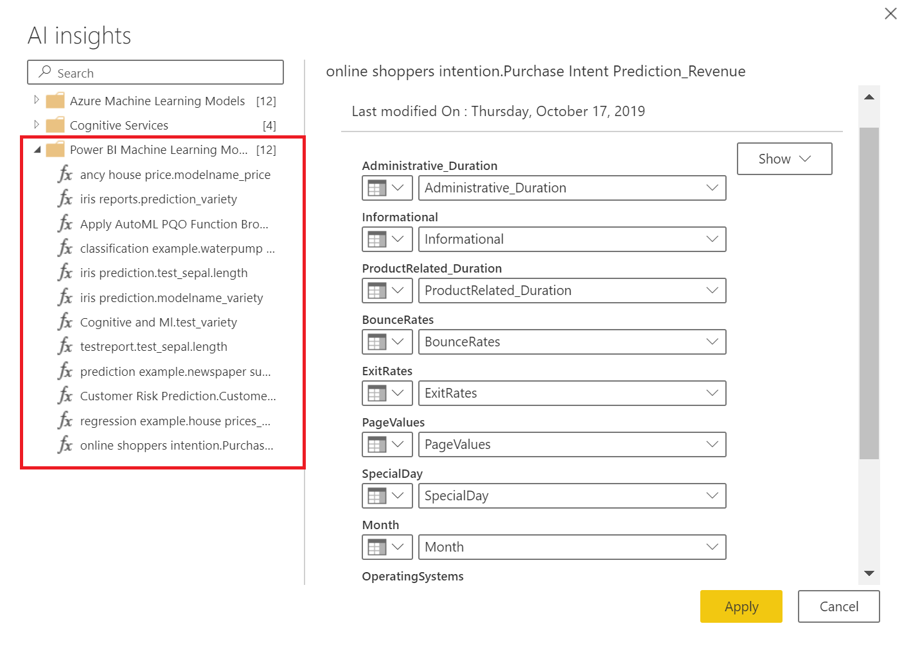

After you apply the model, AutoML always keeps your predictions up-to-date whenever the dataflow is refreshed.

To use the insights and predictions from the ML model in a Power BI report, you can connect to the output table from Power BI Desktop using the **dataflows** connector.

### Binary Prediction models

Binary Prediction models, more formally known as **binary classification models**, are used to classify a dataset into two groups. They're used to predict events that can have a binary outcome. For instance, whether a sales opportunity will convert, whether an account will churn, whether an invoice will be paid on time, whether a transaction is fraudulent, and so on.

The output of a Binary Prediction model is a probability score, which identifies the likelihood that the target outcome will be achieved.

#### Training a Binary Prediction model

Pre-requisites:

- A minimum of 20 rows of historical data is required for each class of outcomes

The process of creation for a Binary Prediction model follows the same steps as other AutoML models, described in the section **Configuring the ML model inputs** above. The only difference is in the “Choose a model” step where you can select the target outcome value that you’re most interested in. You can also provide friendly labels for the outcomes to be used in the automatically generated report that will summarize the results of the model validation.

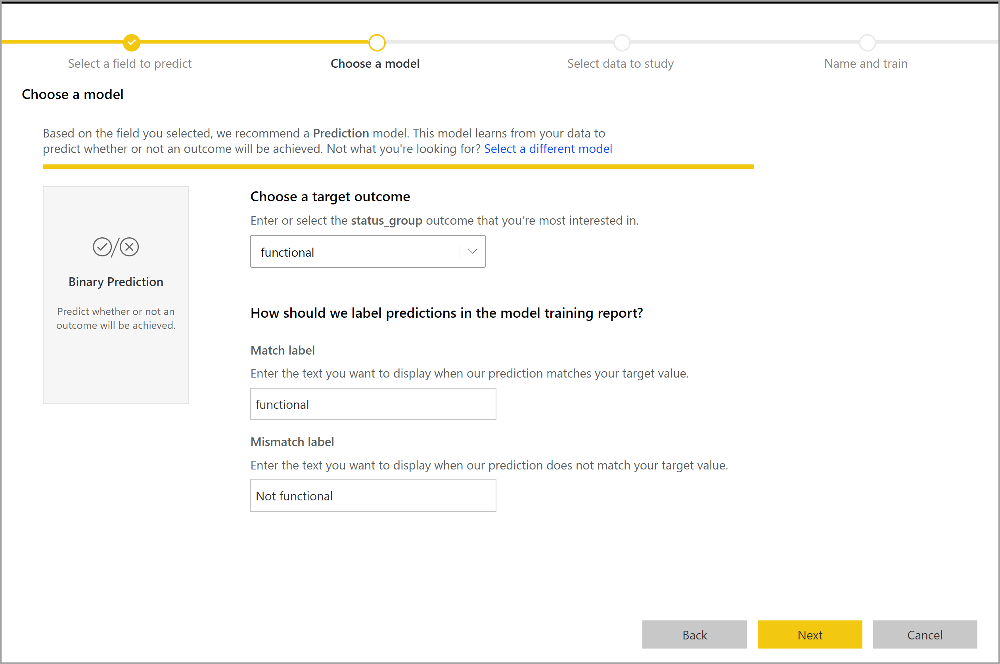

#### Binary Prediction model report

The Binary Prediction model produces as an output a probability that a row will achieve the target outcome. The report includes a slicer for the probability threshold, which influences how the scores above and below the probability threshold are interpreted.

The report describes the performance of the model in terms of _True Positives, False Positives, True Negatives, and False Negatives_. True Positives and True Negatives are correctly predicted outcomes for the two classes in the outcome data. False Positives are rows that were predicted to have Target outcome but actually did not. Conversely, False Negatives are rows that had Target outcome but were predicted as not having it.

Measures, such as Precision and Recall, describe the effect of the probability threshold on the predicted outcomes. You can use the probability threshold slicer to select a threshold that achieves a balanced compromise between Precision and Recall.

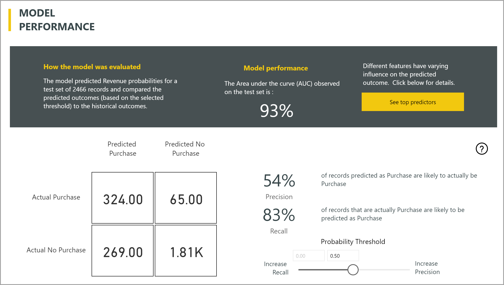

The report also includes a Cost-Benefit analysis tool to help identify the subset of the population that should be targeted to yield the highest profit. Given an estimated unit cost of targeting and a unit benefit from achieving a target outcome, Cost-Benefit analysis attempts to maximize profit. You can use this tool to pick your probability threshold based on the maximum point in the graph to maximize profit. You can also use the graph to compute the profit or cost for your choice of probability threshold.

The **Accuracy Report** page of the model report includes the _Cumulative Gains_ chart and the ROC curve for the model. These are statistical measures of model performance. The reports include descriptions of the charts shown.

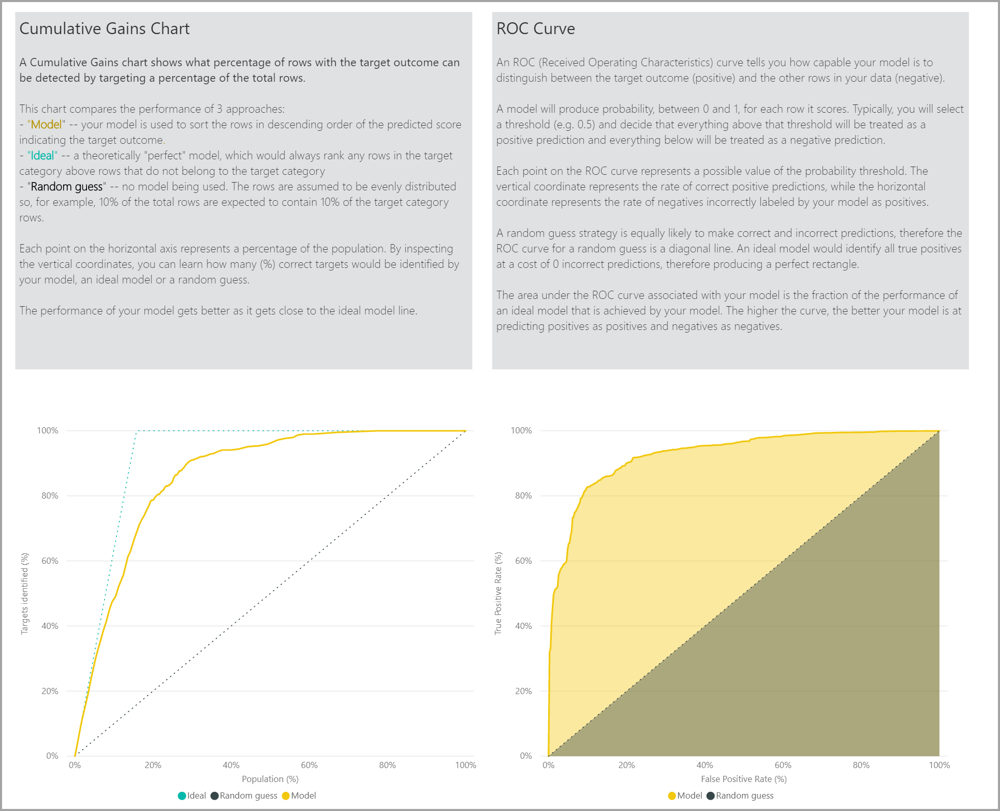

#### Applying a Binary Prediction model

To apply a Binary Prediction model, you must specify the table with the data to which you want to apply the predictions from the ML model. Other parameters include the output column name prefix and the probability threshold for classifying the predicted outcome.

When a Binary Prediction model is applied, it adds four output columns to the enriched output table: **Outcome**, **PredictionScore**, **PredictionExplanation**, and **ExplanationIndex**. The column names in the table have the prefix specified when the model is applied.

**PredictionScore** is a percentage probability, which identifies the likelihood that the target outcome will be achieved.

The **Outcome** column contains the predicted outcome label. Records with probabilities exceeding the threshold are predicted as likely to achieve the target outcome and are labeled as True. Records below the threshold are predicted as unlikely to achieve the outcome and are labeled as False.

The **PredictionExplanation** column contains an explanation with the specific influence that the input features had on the **PredictionScore**.

### Classification models

Classification models are used to classify a dataset into multiple groups or classes. They're used to predict events that can have one of the multiple possible outcomes. For instance, whether a customer is likely to have a very high, high, medium, or low Lifetime Value, whether the risk of default is High, Moderate, Low, or Very Low; and so on.

The output of a Classification model is a probability score, which identifies the likelihood that a row will achieve the criteria for a given class.

#### Training a Classification model

The input table containing your training data for a Classification model must have a string or whole number column as the outcome column, which identifies the past known outcomes.

Pre-requisites:

- A minimum of 20 rows of historical data is required for each class of outcomes

The process of creation for a Classification model follows the same steps as other AutoML models, described in the section **Configuring the ML model inputs** above.

#### Classification model report

The Classification model report is produced by applying the ML model to the holdout test data and comparing the predicted class for a row with the actual known class.

The model report includes a chart that includes the breakdown of the correctly and incorrectly classified rows for each known class.

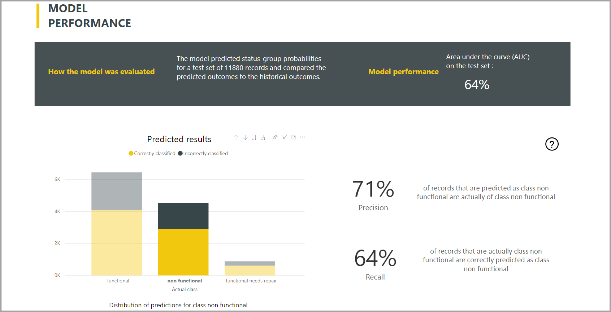

A further class-specific drill-down action enables an analysis of how the predictions for a known class are distributed. This shows the other classes in which rows of that known class are likely to be misclassified.

The model explanation in the report also includes the top predictors for each class.

The Classification model report also includes a Training Details page similar to the pages for other model types, as described in the section **AutoML model report** earlier in this article.

#### Applying a classification model

To apply a Classification ML model, you must specify the table with the input data and the output column name prefix.

When a Classification model is applied, it adds five output columns to the enriched output table: **ClassificationScore**, **ClassificationResult**, **ClassificationExplanation**, **ClassProbabilities**, and **ExplanationIndex**. The column names in the table have the prefix specified when the model is applied.

The **ClassProbabilities** column contains the list of probability scores for the row for each possible class.

The **ClassificationScore** is the percentage probability, which identifies the likelihood that a row will achieve the criteria for a given class.

The **ClassificationResult** column contains the most likely predicted class for the row.

The **ClassificationExplanation** column contains an explanation with the specific influence that the input features had on the **ClassificationScore**.

### Regression models

Regression models are used to predict a numeric value. For instance: the revenue likely to be realized from a sales deal, the lifetime value of an account, the amount of a receivable invoice that is likely to be paid, the date on which an invoice may be paid, and so on.

The output of a Regression model is the predicted value.

#### Training a Regression model

The input table containing the training data for a Regression model must have a numeric column as the outcome column, which identifies the known outcome values.

Pre-requisites:

- A minimum of 100 rows of historical data is required for a Regression model

The process of creation for a Regression model follows the same steps as other AutoML models, described in the section **Configuring the ML model inputs** above.

#### Regression model report

Like the other AutoML model reports, the Regression report is based on the results from applying the model to the holdout test data.

The model report includes a chart that compares the predicted values to the actual values. In this chart, the distance from the diagonal indicates the error in the prediction.

The residual error chart shows the distribution of the percentage of average error for different values in the holdout test dataset. The horizontal axis represents the mean of the actual value for the group, with the size of the bubble showing the frequency or count of values in that range. The vertical axis is the average residual error.

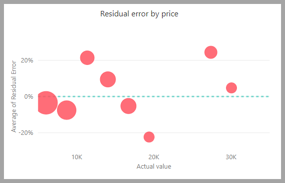

The Regression model report also includes a Training Details page like the reports for other model types, as described in the section **AutoML model report** above.

#### Applying a regression model

To apply a Regression ML model, you must specify the table with the input data and the output column name prefix.

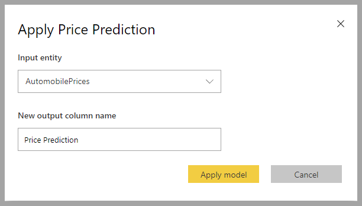

When a Regression model is applied, it adds three output columns to the enriched output table: **RegressionResult**, **RegressionExplanation**, and **ExplanationIndex**. The column names in the table have the prefix specified when the model is applied.

The **RegressionResult** column contains the predicted value for the row based on the input columns. The **RegressionExplanation** column contains an explanation with the specific influence that the input features had on the **RegressionResult**.

## Azure Machine Learning integration in Power BI

Numerous organizations use **Machine Learning** models for better insights and predictions about their business. The ability to visualize and invoke insights from these models, in your reports and dashboards and other analytics, can help disseminate these insights to the business users who need it the most.  Power BI now makes it simple to incorporate the insights from models hosted on Azure Machine Learning, using straightforward point-and-click gestures.

To use this capability, a data scientist can simply grant access to the Azure ML model to the BI analyst using the Azure portal.  Then, at the start of each session, Power Query discovers all the Azure ML models to which the user has access and exposes them as dynamic Power Query functions.  The user can then invoke those functions by accessing them from the ribbon in Power Query Editor, or by invoking the M function directly. Power BI also automatically batches the access requests when invoking the Azure ML model for a set of rows to achieve better performance.

This functionality is currently only supported for Power BI dataflows, and for Power Query online in the Power BI service.

To learn more about dataflows, see [Introduction to dataflows and self-service data prep](dataflows-introduction-self-service.md).

To learn more about Azure Machine Learning, please see:

- Overview:  [What is Azure Machine Learning?](/azure/machine-learning/overview-what-is-azure-machine-learning)
- Quick Starts and Tutorials for Azure Machine Learning:  [Azure Machine Learning Documentation](/azure/machine-learning/)

### Granting access to the Azure ML model to a Power BI user

To access an Azure ML model from Power BI, the user must have **Read** access to the Azure subscription.  In addition:

- For Machine Learning Studio (classic) models, **Read** access to Machine Learning Studio (classic) web service
- For Machine Learning models, **Read** access to the Machine Learning workspace

The steps in this article describe how to grant a Power BI user access to a model hosted on the Azure ML service, so they can access this model as a Power Query function.  For further details, please see [Manage access using RBAC and the Azure portal](/azure/role-based-access-control/role-assignments-portal).

1. Sign in to the [Azure portal](https://portal.azure.com).

2. Go to the **Subscriptions** page. You can find the **Subscriptions** page through the **All Services** list in the nav pane menu of the Azure portal.

    

3. Select your subscription.

    [ 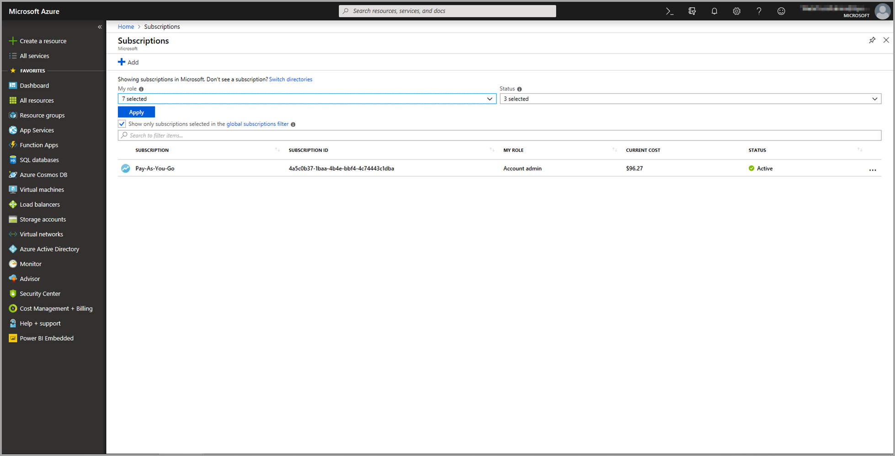 ](media/service-machine-learning-integration/machine-learning-integration-02.png#lightbox)

4. Select **Access Control (IAM)**, and then select the **Add** button.

    [ 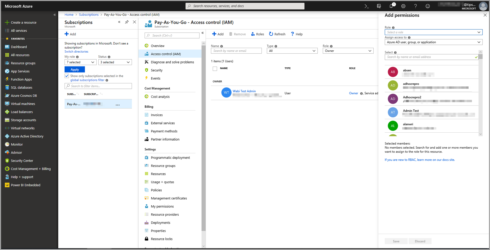 ](media/service-machine-learning-integration/machine-learning-integration-03.png#lightbox)

5. Select **Reader** as the Role. Select the Power BI user to whom you wish to grant access to the Azure ML model.

    [ 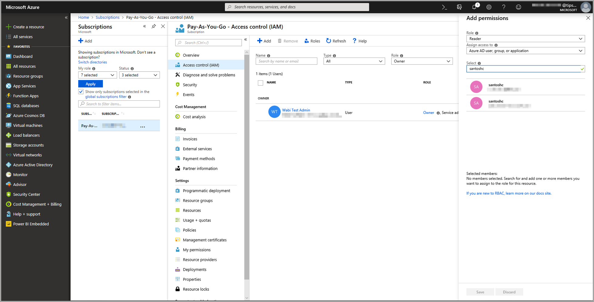 ](media/service-machine-learning-integration/machine-learning-integration-04.png#lightbox)

6. Select **Save**.

7. Repeat steps three through six to grant **Reader** access to the user for the specific Machine Learning Studio (classic) web service, *or* the Machine Learning workspace hosting the model.

### Schema discovery for Machine Learning models

Data scientists primarily use Python to develop, and even deploy, their machine learning models for Machine Learning.  Unlike the Machine Learning Studio (classic), which helps automate the task of creating a schema file for the model, in the case of Machine Learning, the data scientist must explicitly generate the schema file using Python.

This schema file must be included in the deployed web service for Machine Learning models. To automatically generate the schema for web service, you must provide a sample of the input/output in the entry script for the deployed model. Please see the subsection on [(Optional) Automatic Swagger schema generation in the Deploy models with the Azure Machine Learning](/azure/machine-learning/how-to-deploy-and-where#optional-define-model-web-service-schema) service documentation. The link includes the example entry script with the statements for the schema generation. 

Specifically, the *\@input_schema* and *\@output_schema* functions in the entry script reference the input and output sample formats in the *input_sample* and *output_sample* variables, and use these samples to generate an OpenAPI (Swagger) specification for the web service during deployment.

These instructions for schema generation by updating the entry script must also be applied to models created using automated machine learning experiments using the Azure Machine Learning SDK.

> [!NOTE]
> Models created using the Azure Machine Learning visual interface do not currently support schema generation, but will in subsequent releases. 

### Invoking the Azure ML model in Power BI

You can invoke any Azure ML model to which you have been granted access, directly from the Power Query Editor in your dataflow. To access the Azure ML models, select the **Edit** button for the table that you want to enrich with insights from your Azure ML model, as shown in the following image.

[ 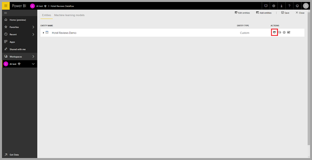 ](media/service-machine-learning-integration/machine-learning-integration-05.png#lightbox)

Selecting the **Edit** button opens the Power Query Editor for the tables in your dataflow.

[ 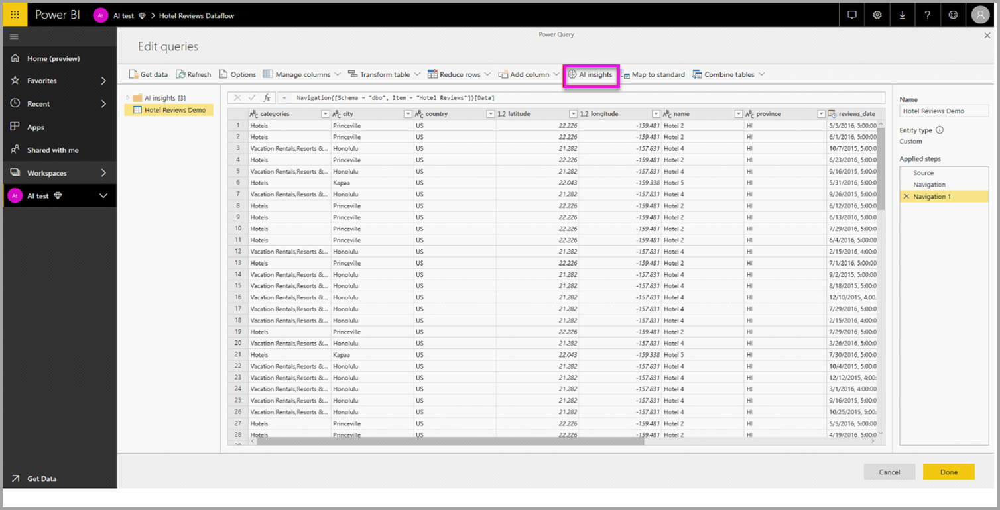 ](media/service-machine-learning-integration/machine-learning-integration-06.png#lightbox)

Select the **AI Insights** button in the ribbon, and then select the _Azure Machine Learning Models_ folder from the nav pane menu. All the Azure ML models to which you have access are listed here as Power Query functions. Also, the input parameters for the Azure ML model are automatically mapped as parameters of the corresponding Power Query function.

To invoke an Azure ML model, you can specify any of the selected table's columns as an input from the drop-down. You can also specify a constant value to be used as an input by toggling the column icon to the left of the input dialog.

[ 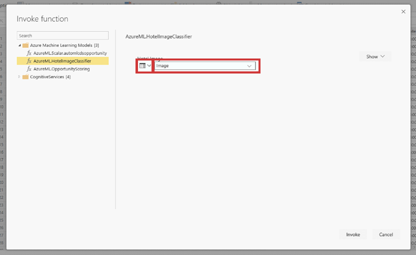 ](media/service-machine-learning-integration/machine-learning-integration-07.png#lightbox)

Select **Invoke** to view the preview of the Azure ML model's output as a new column in the table table. You will also see the model invocation as an applied step for the query.

[ 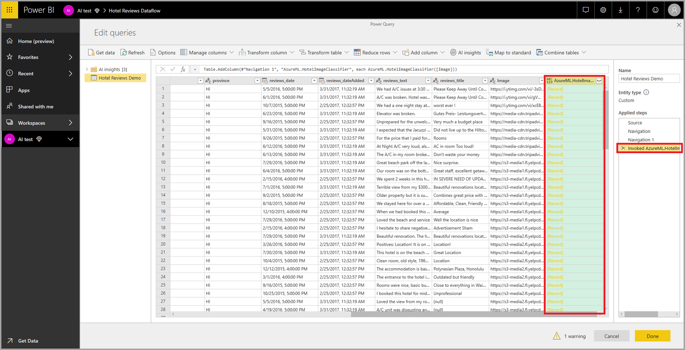 ](media/service-machine-learning-integration/machine-learning-integration-08.png#lightbox)

If the model returns multiple output parameters, they are grouped together as a row in the output column. You can expand the column to produce individual output parameters in separate columns.

Once you save your dataflow, the model is automatically invoked when the dataflow is refreshed, for any new or updated rows in the table table.

##Limitations

- AI insights (Cognitive Services and Azure ML models) are not supported on machines with proxy authentication setup.
- AzureML models are not supported for Guest users.

## Next steps

This article provided an overview of Automated Machine Learning for Dataflows in the Power BI service. The following articles may also be useful.

- [Tutorial: Build a Machine Learning model in Power BI](../../connect-data/service-tutorial-build-machine-learning-model.md)
- [Tutorial: Using Cognitive Services in Power BI](../../connect-data/service-tutorial-use-cognitive-services.md)
- [Tutorial: Consume Azure Machine Learning models in Power BI](../../connect-data/service-aml-integrate.md)

The following articles provide more information about dataflows and Power BI:

* [Introduction to dataflows and self-service data prep](dataflows-introduction-self-service.md)
* [Creating a dataflow](dataflows-create.md)
* [Configure and consume a dataflow](dataflows-configure-consume.md)
* [Configuring Dataflow storage to use Azure Data Lake Gen 2](dataflows-azure-data-lake-storage-integration.md)
* [Premium features of dataflows](dataflows-premium-features.md)
* [Dataflows limitations and considerations](dataflows-features-limitations.md)
* [Dataflows best practices](dataflows-best-practices.md)
