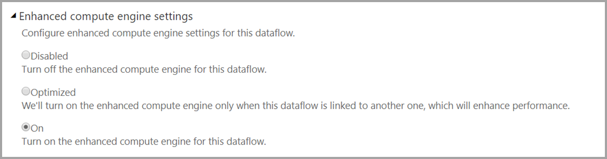
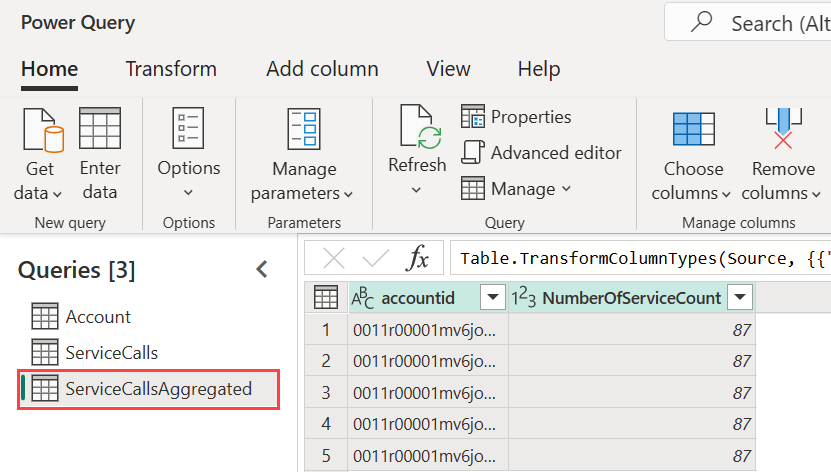

# Premium features of dataflows

Dataflows are supported for Power BI Pro, Premium Per User (PPU), and Power BI Premium users. Some features are only available with a Power BI Premium subscription or Premium Per User (PPU) license. This article describes and details the Premium Per User (PPU) and Premium-only features and their uses. 

The following features are available only with Power BI Premium:

* Enhanced compute engine
* Direct Query
* Computed entities
* Linked Entities
* Incremental refresh

The following sections described each of these features in detail.

## The enhanced compute engine

The enhanced compute engine in Power BI enables Power BI Premium subscribers to use their capacity to optimize the use of dataflows. Using the enhanced compute engine provides the following advantages:

* Drastically reduces the refresh time required for long-running ETL steps over computed entities, such as performing *joins*, *distinct*, *filters,* and *group by*
* Performs DirectQuery queries over entities

> [!NOTE]
> * The validation and refresh processes inform dataflows of the model schema. To set the schema of the tables yourself, use the PowerQuery Editor and set data types. 
> * This feature is available on all Power BI clusters except WABI-INDIA-CENTRAL-A-PRIMARY

By default, the enhanced compute engine is **On**. If the enhanced compute engine is not on, enabling the enhanced compute engine is described in the next section, along with answers to common questions.

### Using the enhanced compute engine

The enhanced compute engine is enabled from the **Capacity Settings** page in the Power BI service, in the **dataflows** section. By default, the enhanced compute engine is **On**. If it is set to **Off**, enable the enhanced compute engine by switching the toggle to **On** and save your settings. 

> [!IMPORTANT]
> The enhanced compute engine works only for Power BI capacities of A3 and larger.

Once the enhanced compute engine is on, return to **dataflows** and you should see a performance improvement in any computed table that performs complex operations, such as *joins* or *group by* operations for dataflows created from existing linked entities on the same capacity. 

To make best use of the compute engine, split the ETL stage into two separate dataflows, in the following way:

* **Dataflow 1** - this dataflow should only be ingesting all of the required from a data source, and placing it into dataflow 2.
* **Dataflow 2** - perform all ETL operations in this second dataflow, but ensure you're referencing Dataflow 1, which should be on the same capacity. Also ensure you perform operations that can fold (filter, group by, distinct, join) first, before any other operation, to ensure the compute engine is utilized.

### Common questions and answers

**Question:** I've enabled the enhanced compute engine, but my refreshes are slower. Why?

**Answer:** If you enable the enhanced compute engine, there are two possible explanations that could lead to slower refresh times:

 * When the enhanced compute engine is enabled, it requires some memory to function properly. As such, memory available to perform a refresh is reduced and therefore increases the likelihood of refreshes to be queued, which in turn reduces the number of dataflows that can refresh concurrently. To address this, when enabling enhanced compute, increase the memory assigned for dataflows to ensure the memory available for concurrent dataflow refreshes remains the same.

 * Another reason you may encounter slower refreshes is that the compute engine only works on top of existing entities. If your dataflow references a data source that's not a dataflow, you won't see an improvement. There will be no performance increase, since in some big data scenarios, the initial read from a data source would be slower because the data needs to be passed to the enhanced compute engine.  

**Question:** I cannot see the enhanced compute engine toggle. Why?

**Answer:** The enhanced compute engine is being released in stages to regions around the world, but is not yet available in every region.

**Question:** What are the supported data types for the compute engine?

**Answer:** The enhanced compute engine and dataflows currently support the following data types. If your dataflow doesn't use one of the following data types, an error occurs during refresh:

* Date/Time
* Decimal Number
* Text
* Whole number
* Date/Time/Zone
* True/False
* Date
* Time

## Use DirectQuery with dataflows in Power BI

You can use DirectQuery to connect directly to dataflows, and thereby connect directly to your dataflow without having to import its data. 

Using DirectQuery with dataflows enables the following enhancements to your Power BI and dataflows processes:

* **Avoid separate refresh schedules** - DirectQuery connects directly to a dataflow, removing the need to create an imported dataset. As such, using DirectQuery with your dataflows means you no longer need separate refresh schedules for the dataflow and the dataset to ensure your data is synchronized.

* **Filtering data** - DirectQuery is useful for working on a filtered view of data inside a dataflow. If you want to filter data, and thereby work with a smaller subset of the data in your dataflow, you can use DirectQuery (and the compute engine) to filter dataflow data and work with the filtered subset you need.

### Using DirectQuery for dataflows

Using DirectQuery with dataflows is available in Power BI Desktop. 

There are also prerequisites for using DirectQuery with dataflows:

* Your dataflow must reside within a Power BI Premium enabled workspace
* The **compute engine** must be turned on

You can learn more about DirectQuery with dataflows in the [using DirectQuery with dataflows](dataflows-directquery.md) article.

### Enable DirectQuery for dataflows

To ensure your dataflow is available for DirectQuery access, the enhanced compute engine must be in its optimized state. To enable DirectQuery for dataflows, set the new **Enhanced compute engine settings** option to **On**. The following image shows the setting properly selected.

Once you've applied that setting, refresh the dataflow for the optimization to take effect.

### Considerations and limitations for DirectQuery

There are a few known limitations with DirectQuery and dataflows:

* Composite/mixed models that have import and DirectQuery data sources are currently not supported.

* Large dataflows may have trouble with timeout issues when viewing visualizations. Large dataflows that run into trouble with timeout issues should use Import mode.

* Under data source settings, the dataflow connector will show invalid credentials if you are using DirectQuery. This does not affect the behavior, and the dataset will work properly. 

## Computed entities

You can perform **in-storage computations** when using **dataflows** with a Power BI Premium subscription. This lets you perform calculations on your existing dataflows, and return results that enable you to focus on report creation and analytics.

To perform in-storage computations, you first must create the dataflow and bring data into that Power BI dataflow storage. Once you have a dataflow that contains data, you can create computed entities, which are entities that perform in-storage computations.

### Considerations and limitations of computed entities

* When working with dataflows created in an organization's Azure Data Lake Storage Gen2 account, linked entities and computed entities only work properly when the entities reside in the same storage account. 

As a best practice, when doing computations on data joined by on-premises and cloud data, create a new dataflow for each source (one for on-premises and one for cloud) and then create a third dataflow to merge/compute over these two data sources.

## Linked entities

You can reference existing dataflows when using with a Power BI Premium subscription, which lets you either perform calculation on these entities using computed entities or allows you to create a "single source of the truth" table that you can reuse within multiple dataflows.

## Incremental refresh

Dataflows can be set to refresh incrementally to avoid having to pull all the data on every refresh. To do so, select the dataflow then select the incremental refresh icon.

Setting incremental refresh adds parameters to the dataflow to specify the date range. For detailed information on how to set up incremental refresh, see the [incremental refresh](/power-query/dataflows/incremental-refresh) article.

### Considerations for when not to set incremental refresh

Do not set a dataflow to incremental refresh in the following situations:

* Linked entities should not use incremental refresh if they reference a dataflow. Dataflows does not support query folding (even if the table is DirectQuery enabled). 

## Next steps
The following articles provide more information about dataflows and Power BI:

* [Dataflows best practices](dataflows-best-practices.md)
* [Configure Power BI Premium dataflow workloads](dataflows-premium-workload-configuration.md)
* [Introduction to dataflows and self-service data prep](dataflows-introduction-self-service.md)
* [Creating a dataflow](dataflows-create.md)
* [Configure and consume a dataflow](dataflows-configure-consume.md)
* [Configuring Dataflow storage to use Azure Data Lake Gen 2](dataflows-azure-data-lake-storage-integration.md)
* [AI with dataflows](dataflows-machine-learning-integration.md)
* [Dataflows considerations and limitations](dataflows-features-limitations.md)
