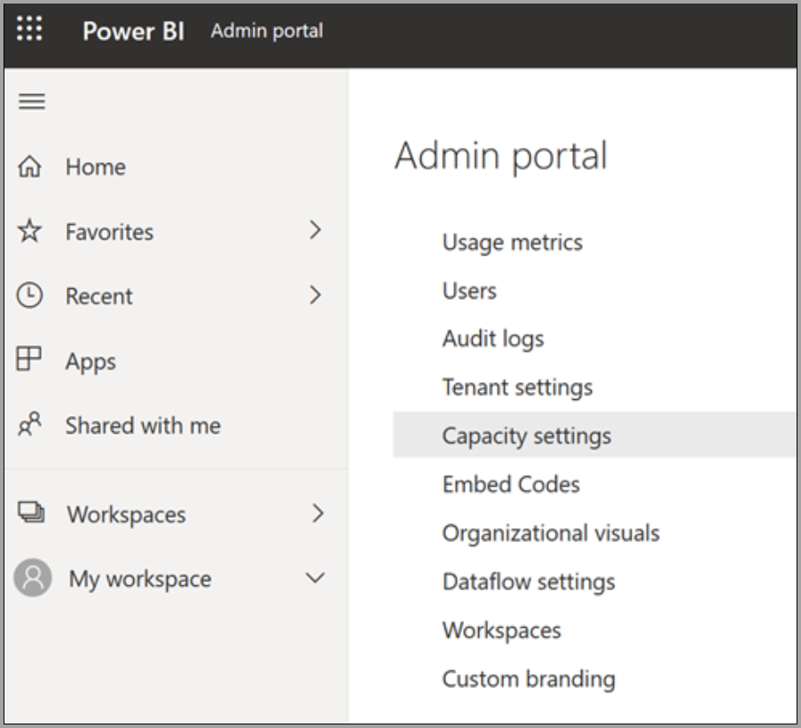
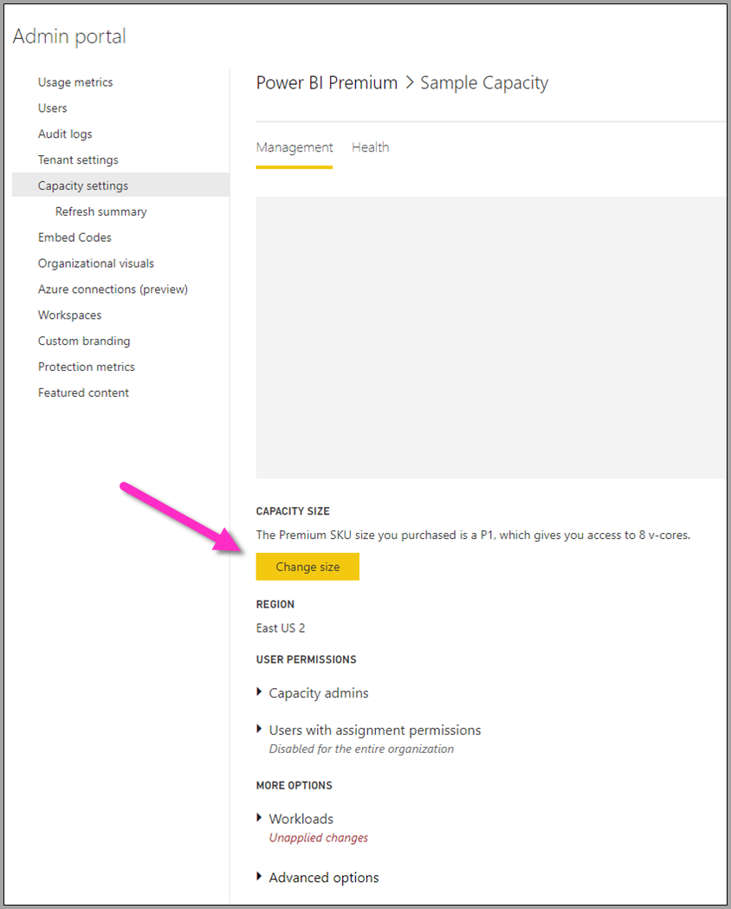

# Configure Power BI Premium dataflow workloads

You can create dataflow workloads in your Power BI Premium subscription. Power BI uses the concept of *workloads* to describe Premium content. Workloads include datasets, paginated reports, dataflows, and AI. The *dataflows* workload lets you use dataflows self-service data preparation to ingest, transform, integrate, and enrich data. Power BI Premium dataflows are managed in the **Admin portal**.

The following sections describe how to enable dataflows in your organization, how to refine their settings in your Premium capacity, and guidance for common usage.

## Enabling dataflows in Power BI Premium

The first requirement for using dataflows in your Power BI premium subscription is to enable the creation and use of dataflows for your organization. In the **Admin portal**, select **Tenant Settings** and switch the slider under **Dataflow settings** to **Enabled**, as shown in the following image.

After enabling the dataflows workload, it is configured with default settings. You might want to tweak these settings as you see fit. Next, we'll describe where these settings live, describe each, and help you understand when you might want to change the values to optimize your dataflow performance.

## Refining dataflow settings in Premium

Once dataflows are enabled, you can use the **Admin portal** to change, or refine, how dataflows are created and how they use resources in your Power BI Premium subscription. Power BI Premium doesn't require memory settings to be changed. Memory in Power BI Premium is automatically managed by the underlying system. The following steps show how to adjust your dataflow settings.

1. In the **Admin portal**, select **Tenant settings** to list all capacities that have been created. Select a capacity to manage its settings.

    

2. Your Power BI Premium capacity reflects the resources available for your dataflows. You can change your capacity's size by selecting the **Change size** button, as shown in the following image.

    

#### Premium capacity SKUs - scale up the hardware

Power BI Premium workloads use v-cores to serve fast queries across the various workload types. [Capacities and SKUs](../../enterprise/service-premium-what-is.md#capacities-and-skus) includes a chart that illustrates the current specifications across each of the available workload offerings. Capacities of A3 and greater can take advantage of the compute engine, so when you want to use the enhanced compute engine, start there.

#### Enhanced compute engine - an opportunity to improve performance

The [enhanced compute engine](dataflows-premium-features.md#the-enhanced-compute-engine) is an engine that can accelerate your queries. Power BI uses a compute engine to process your queries and refresh operations. The enhanced compute engine is an improvement over the standard engine, and works by loading data to a SQL Cache and uses SQL to accelerate table transformation, refresh operations and enables DirectQuery connectivity. When configured to **On** or **Optimized** for computed entities, if your business logic allows for it, Power BI uses SQL speed up the performance. Having the engine **On** also provides for DirectQuery connectivity. Make sure your dataflow usage is leveraging the enhanced compute engine properly. Users can configure the enhanced compute engine to be on, optimized, or off on a per-dataflow basis.

> [!NOTE]
> The enhanced compute engine is not yet available in all regions.

## Guidance for common scenarios

This section provides guidance for common scenarios when using dataflow workloads with Power BI Premium.

### Slow refresh times

Slow refresh times are usually a parallelism issue. You should review the following options, in order:

1. A key concept for slow refresh times is the nature of your data preparation. Whenever you can optimize your slow refresh times by taking advantage of your data source actually doing the preparation and performing upfront query logic, you should do so. Specifically, when using a relational database such as SQL as your source, see if the initial query can be run on the source, and use that source query for your initial extraction dataflow for the data source. If you cannot use a native query in the source system, perform operations that the dataflows [engine can fold to the data source](/power-query/power-query-folding).

2. Evaluate spreading out refresh times on the same capacity. Refresh operations are a process that requires significant compute. Using our restaurant analogy, spreading out refresh times is akin to limiting the number of guests in your restaurant. Just as restaurants will schedule guests and plan for capacity, you also want to consider refresh operations during times when usage is not at its full peak. This can go a long way toward alleviating strain on the capacity.

If the steps in this section don't provide the desired degree of parallelism, consider upgrading your capacity to a higher SKU. Then follow the previous steps in this sequence again.

### Using the compute engine to improve performance

Take the following steps to enable workloads to trigger the compute engine, and always improve performance:

**For computed and linked entities in the same workspace:**

1. For *ingestion* focus on getting the data into the storage as fast as possible, using filters only if they reduce the overall dataset size. It's best practice to keep your transformation logic separate from this step, and allow the engine to focus on the initial gathering of ingredients. Next, separate your transformation and business logic into a separate dataflow in the same workspace, using linked or computed entities; doing so allows for the engine to activate and accelerate your computations. Your logic needs to be prepared separately before it can take advantage of the compute engine.

2. Ensure you perform the operations that fold, such as merges, joins, conversion, and [others](/power-query/power-query-folding#transformations-that-can-achieve-folding).

3. Building dataflows [within published guidelines and limitations](dataflows-features-limitations.md#dataflows-in-premium).

You can also use DirectQuery.

### Compute engine is on but performance is slow

Take the following steps when investigating scenarios where the Compute engine is on, but you're seeing slower performance:

1. Limit computed and linked entities that exist across workspace.

2. When you perform your initial refresh with the compute engine turned on, then data gets written in the lake and in the cache. This double write means these refreshes will be slower.

3. If you have a dataflow linking to multiple dataflows, make sure you schedule refreshes of the source dataflows so that they do not all refresh at the same time.

## Related content
The following articles provide more information about dataflows and Power BI:

* [Introduction to dataflows and self-service data prep](dataflows-introduction-self-service.md)
* [Creating a dataflow](dataflows-create.md)
* [Configure and consume a dataflow](dataflows-configure-consume.md)
* [Configuring Dataflow storage to use Azure Data Lake Gen 2](dataflows-azure-data-lake-storage-integration.md)
* [AI with dataflows](dataflows-machine-learning-integration.md)
* [Dataflows considerations and limitations](dataflows-features-limitations.md)
