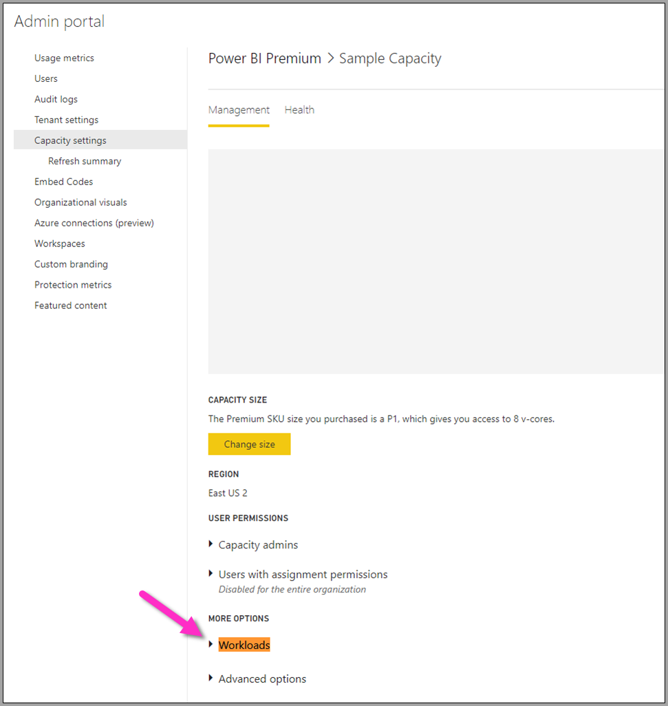
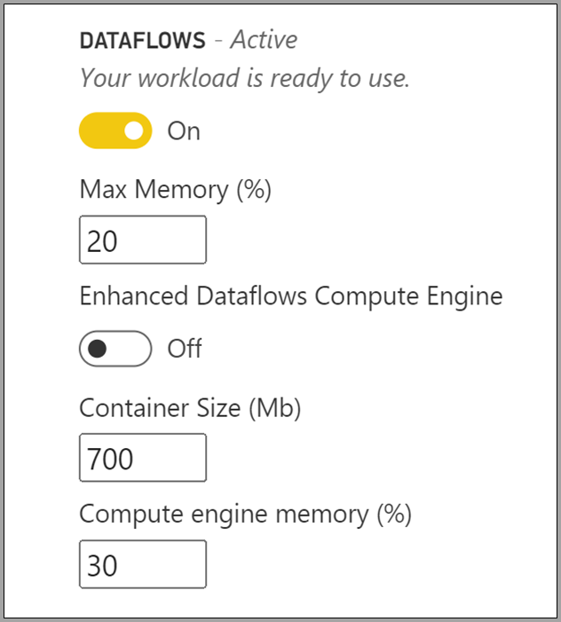

# Configure Power BI Premium dataflow workloads

You can create dataflow workloads in your Power BI Premium subscription. Power BI uses the concept of *workloads* to describe Premium content. Workloads include datasets, paginated reports, dataflows, and AI. The *dataflows* workload lets you use dataflows self-service data preparation to ingest, transform, integrate, and enrich data. Power BI Premium dataflows are managed in the **Admin portal**.

The following sections describe how to enable dataflows in your organization, how to refine their settings in your Premium capacity, and guidance for common usage.

## Enabling dataflows in Power BI premium

The first requirement for using dataflows in your Power BI premium subscription is to enable the creation and use of dataflows for your organization. In the **Admin portal**, select **Tenant Settings** and switch the slider under **Dataflow settings** to **Enabled**, as shown in the following image.

After enabling the dataflows workload, it is configured with default settings. You might want to tweak these settings as you see fit. Next, we'll describe where these settings live, describe each, and help you understand when you might want to change the values to optimize your dataflow performance.

## Refining dataflow settings

Once dataflows are enabled, you can use the **Admin portal** to change, or refine, how dataflows are created and how they use resources in your Power BI Premium subscription. The following steps show how to adjust your dataflow settings.

1. In the **Admin portal**, select **Tenant settings** to list all capacities that have been created. Select a capacity to manage its settings.

    

2. Your Power BI Premium capacity reflects the resources available for your dataflows. You can change your capacity's size by selecting the **Change size** button, as shown in the following image.

    

3. In Capacity settings, you can configure dataflow settings by expanding **Workloads**.

    

4. In the **Workloads** section, scroll to the **Dataflows** area. The following image shows the settings you can use to control or refine the dataflow workload's behavior for your capacity.

    

The following table provides a basic description of the dataflows settings.

| **Admin section** | **Setting name** | **Description** |
|---------|---------|---------|
| **Capacity Size** | **Change Size** | The current selected capacity is listed, with options to change the capacity. Changing this setting allows for scale up or scale down of the capacity. |
| **Workload** | **Max Memory (%)** | The maximum percentage of available memory that dataflows can use in a capacity. |
| **Workload** | **Enhanced Dataflows Compute Engine** | Enable this option for up to 20x faster calculation of computed entities when working with large-scale data volumes.  **You must restart the capacity to activate the new engine.**  For more information, see [Enhanced dataflows compute engine](../../admin/service-admin-premium-workloads.md#enhanced-dataflows-compute-engine). |
| **Workload** | **Container Size** | The maximum size of the container that dataflows use for each table in the dataflow. The default value is 700 MB. For more information, see [Container size](../../admin/service-admin-premium-workloads.md#container-size). |
| **Workload** | **Compute engine memory (%)** | The maximum percentage of memory allocated to the compute engine. The default value is 30%. |

In the following sections, we go into detail about each of the settings and how they affect your dataflow workload.

### Understanding dataflow workload options

A simple way to think about dataflow workload options is to use an analogy. The *capacity size*, or the type of Power BI Premium Instance you have, can be thought of as your *restaurant*. Within your restaurant, you have your *workload memory*, which is your *kitchen*. The *compute engine* is your *oven*. And lastly, the *container* is the quality of your *chef*. To evaluate your dataflow workload options, imagine preparing a meal for a large, or very significant dinner. You have important guests coming over and you must have dinner ready to be served by the time they arrive.

We'll use this restaurant analogy as we explain and provide guidance on each of the setting. We'll start at the top level - your Premium capacity - as this is the first choice you make when using Power BI Premium.

#### Premium capacity SKUs - scale up the hardware

Power BI Premium workloads use a combination of front-end and backend cores to serve fast queries across the various workload types. The [capacity nodes](../../admin/service-premium-what-is.md#capacity-nodes) article includes a chart that illustrates the current specifications across each of the available workload offerings. Capacities of A3 and greater can take advantage of the compute engine, so when you want to use the enhanced compute engine, start there – [Capacity nodes](../../admin/service-premium-what-is.md#capacity-nodes). 

In our restaurant analogy, choosing a capacity is like choosing a higher-quality restaurant. Though a higher cost, you can expect a higher level of performance due to the increase in front-end cores, backend cores, and more memory. When you go to a bigger restaurant, you get a bigger kitchen, and better chefs, which are akin to upgrading to a higher SKU in Power BI Premium, giving you the benefit of increasing CPU speed, increasing memory per operation, and adding more parallelism.

#### Max memory - dedicating a capacity for dataflows 

The **Max Memory %** setting is the percentage of memory, out of the physical memory available to the Premium capacity, provided for dataflows workloads. You can effectively dedicate up to the full capacity for a dataflows workload, and the capacity will scale up dynamically as needed to the allocation you set. In our analogy, if you make your kitchen bigger you can cook more meals – similarly, you can increase your capacity's workload size for dataflows and allow more dataflows. While there is dynamic resource governance in place, the *Max Memory %* configuration option lets you dedicate 100% of the memory for the dataflows workload. This is for the rare situation when you want to ensure the capacity's memory is available for your dataflow workload, rather than relying on the Resource Governance. Using our analogy, this would be like making sure your kitchen is focusing on preparing a specific meal for a guest, dedicating the full kitchen to the task(s). Of course, the ability to dedicate more doesn't mean better food, or faster time to table – as the next section explains.

#### Container size - refresh or out of memory issues

Next let's discuss the **Container Size (Mb)** setting. Internally, dataflows use a process called *mashup containers* to evaluate your ETL processes. The engine splits your query logic into these containers and they can process in parallel. The number of containers effectively provides concurrent processing and increases performance. These containers are constrained by the **Capacity** first, the **Max Memory %** setting second, and then the amount of memory you specifically allocate to them in the container setting, which by default is 700Mb. So it's possible to increase the amount of hardware memory, and increase the container size, but doing so will decrease the parallel operations while dedicating more memory for specific ETL process within your containers. The number of containers is capped at three times the number of backend cores, which is important because you can't make the container very small, and have a lot of parallel containers beyond that point. The minimum size you can make a container is 200Mb. The container size is also scoped to a query level, which means each query gets executed in its own container except when queries are referencing other queries, in which case they are refreshed as part of the same container.

Going back to our analogy, having fewer but more focused cooks in the kitchen enables you to cook a meal much faster, depending on the types of orders that are placed and the complexity of the meal. The tradeoff here is having fewer chefs, but more focused time for preparation. Similarly, increasing the container size measure to 1200-1500 MB can mean that a smaller number of more complex ETL jobs – activities such as aggregations, joins, pivots, row or column manipulations - can see a performance increase as we provide more memory for each container, but in doing so, reduce the number of containers. Just as the analogy implies, too many orders can actually slow down the kitchen output, which is how you can think about container size – use this when you need complex table operations to complete, and you're willing to trade parallelism for performance, since increasing this resource divides the memory allocated to fewer containers.

To summarize, you want to optimize your container size based on the queries being used. For example, simply loading data from a source into an table does not need to pull in data and perform any operations and just loads the data to storage. You want as much parallelism as possible for this situation, as you want to increase the speed of the load and refresh operations. Conversely, when you add more transformation operations – complex filters, joins, aggregations, the memory may be much higher as we may need to process some of these transformation operations in memory. Be aware that if you have other dataflow operations running on the capacity, it can slow those operations and force them to queue up to have an execution slot. To this end, monitoring and management of dataflows, refresh performance, and the entire capacity is aided by the **Power BI Premium Capacity Metrics** app. You can use the [Power BI Premium Capacity Metrics](../../admin/service-premium-capacity-optimize.md#what-content-is-using-up-my-capacity) app to filter by capacity, and review performance metrics for workspace content. It's possible to review the performance metrics and resource usage by hour, for the past seven days, for all content stored within a Premium capacity – so for investigating dataflow performance, it's recommended to start with the app.

#### Enhanced compute engine - an opportunity to improve performance

In our analogy, the [enhanced compute engine](dataflows-premium-features.md#the-enhanced-compute-engine) is like an oven. Power BI uses a compute engine to process your queries and refresh operations. The enhanced compute engine is an improvement over the standard engine, and works by loading data to a SQL Cache and uses SQL to accelerate table transformation, refresh operations and enables DirectQuery connectivity. If we compare the engines to ovens, as you leverage the enhanced oven, you may be able to cook meals faster and more effectively. When configured to **On** or **Optimized** for computed entities, if your business logic allows for it, Power BI uses SQL speed up the performance. Having the engine **On** also provides for DirectQuery connectivity. As the analogy suggests – certain meals might not need an oven, nor take advantage of the oven. The enhanced compute engine can be thought of in a similar manner – make sure your dataflow usage is leveraging the enhanced compute engine properly. Users can configure the enhanced compute engine to be on, optimized, or off on a per-dataflow basis.

> [!NOTE]
> The enhanced compute engine is not yet available in all regions.

## Guidance for common scenarios

This section provides guidance for common scenarios when using dataflow workloads with Power BI Premium.

### Slow refresh times

Slow refresh times are usually a parallelism issue. You should review the following options, in order:

1. A key concept for slow refresh times is the nature of your data preparation. In our restaurant analogy explained earlier in this article, imagine having prepared food already, waiting to be used. In this scenario, the food can be cooked much faster due to minimal prep time. Similarly, whenever you can optimize your slow refresh times by taking advantage of your data source actually doing the preparation and performing upfront query logic, you should do so. Specifically, when using a relational database such as SQL as your source, see if the initial query can be run on the source, and use that source query for your initial extraction dataflow for the data source. If you cannot use a native query in the source system, perform operations that the dataflows [engine can fold to the data source](/power-query/power-query-folding).

2. Evaluate spreading out refresh times on the same capacity. Refresh operations are a process that requires significant compute. Using our restaurant analogy, spreading out refresh times is akin to limiting the number of guests in your restaurant. Just as restaurants will schedule guests and plan for capacity, you also want to consider refresh operations during times when usage is not at its full peak. This can go a long way toward alleviating strain on the capacity.

3. Increase the overall amount of memory given to the workload. Think of this as the size of kitchen. Refining this resource is similar to adjusting how many chefs can you fit in the kitchen. This is done by adjusting the **Max Memory %** setting, and increasing it up to 100%.

4. Decrease the amount of memory to the container, which allows for more containers. You can think of this as: instead of hiring a famously capable chef like Gordon Ramsey, hire many competent but less expensive chefs. So you have more cooks in the kitchen, but those chefs can only perform smaller tasks. Then you have more containers, but less memory.

5. Do both of the previous steps, allowing for an even higher degree of parallelism, because you get more cooks and a bigger kitchen.
    
6. If the steps in this section don't provide the desired degree of parallelism, consider upgrading your capacity to a higher SKU. <!--It is not clear what the following sentence means.-->Then follow steps the previous steps in this section again.

### Out of memory exceptions

When you experience **out of memory exceptions**, you need to increase performance of the containers and memory. Take the following steps:

1. Increase memory on the container. This is similar to having one star chef versus many chefs, as described in the previous section.

2. Increase memory to workload and more memory to container. In our analogy, it creates a bigger kitchen and higher-quality chefs.

3. If these changes don't give you the desired degree of parallelism, consider a higher Power BI Premium SKU.

### Using the compute engine to improve performance

Take the following steps to enable workloads trigger the compute engine, and always improve performance:

**For computed and linked entities in the same workspace:**

1. For *ingestion* focus on getting the data into the storage as fast as possible, using filters only if they reduce the overall dataset size. It's best practice to keep your transformation logic separate from this step, and allow the engine to focus on the initial gathering of ingredients. Next, separate your transformation and business logic into a separate dataflow in the same workspace, using linked or computed entities; doing so allows for the engine to activate and accelerate your computations. In our analogy, it's like food preparation in the kitchen: food preparation is typically a separate and distinct step from gathering your raw ingredients, and a pre-requisite for putting the food in the oven. Similarly, your logic needs to be prepared separately before it can take advantage of the compute engine.

2. Ensure you perform the operations that fold, such as merges, joins, conversion, and [others](/power-query/power-query-folding#transformations-that-can-achieve-folding).

3. Building dataflows [within published guidelines and limitations](dataflows-features-limitations.md#dataflows-in-premium).

You can also use DirectQuery.

### Compute engine is on but performance is slow

Take the following steps when investigating scenarios where the Compute engine is on, but you're seeing slower performance:

1. Limit computed and linked entities that exist across workspace.

2. When you perform your initial refresh with the compute engine turned on, then data gets written in the lake and in the cache. This double write means these refreshes will be slower.

3. If you have a dataflow linking to multiple dataflows, make sure you schedule refreshes of the source dataflows so that they do not all refresh at the same time.

## Next steps
The following articles provide more information about dataflows and Power BI:

* [Introduction to dataflows and self-service data prep](dataflows-introduction-self-service.md)
* [Creating a dataflow](dataflows-create.md)
* [Configure and consume a dataflow](dataflows-configure-consume.md)
* [Configuring Dataflow storage to use Azure Data Lake Gen 2](dataflows-azure-data-lake-storage-integration.md)
* [AI with dataflows](dataflows-machine-learning-integration.md)
* [Dataflows limitations and considerations](dataflows-features-limitations.md)
