# Streaming dataflows (preview)

Organizations want to work with data as it comes in, and not days or weeks later. The vision of Power BI is simple: the distinctions between batch, real-time, and streaming data today will disappear. Users should be able to work with all data as soon as it's available.

Analysts usually need technical help to deal with streaming data sources, data preparation, complex time-based operations, and real-time data visualization. IT departments must often rely on custom-built systems, and a combination of technologies from various vendors, to perform analyses on the data in a timely manner. Without this, they can't provide decision makers with information in near real time.

*Streaming dataflows* allow authors to connect to, ingest, mashup, model, and build reports based on streaming, near real-time data directly in the Power BI service. The service enables drag-and-drop, no-code experiences.  

Users can mix and match streaming data with batch data if they need to. This is done through a UI that includes a *diagram view* for easy data mashup. The final artifact produced is a dataflow, which can be consumed in real time to create highly interactive, near real-time reporting. All of the data visualization capabilities in Power BI work with streaming data, just as it does with batch data.

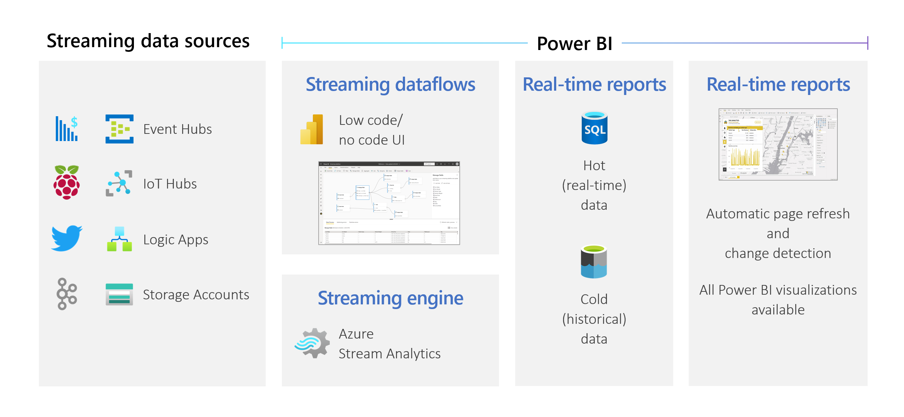

Users can perform data preparation operations like joins and filters. They can also perform time windowing aggregations (such as tumbling, hopping, and session windows) for group-by operations.

Streaming dataflows in Power BI empower organizations to:

* Make confident decisions in near real time. Be more agile and take meaningful actions based on the most up-to-date insights.
* Democratize streaming data. Make data more accessible and easier to interpret with a no-code solution and reduce IT resources.
* Accelerate time to insight. Use an end-to-end streaming analytics solution with integrated data storage and BI.

Streaming dataflows support DirectQuery and [automatic page refresh/change detection](../../create-reports/desktop-automatic-page-refresh.md). This support allows users to build reports that update in near real time, up to every second, by using any visual available in Power BI.

## Requirements

Before you create your first streaming dataflow, make sure that you meet all the following requirements:

- To create and run a streaming dataflow, you need a workspace that's part of a *Premium capacity* or *Premium Per User (PPU)* license.

  > [!IMPORTANT]
  > If you're using a PPU license and you want other users to consume reports created with streaming dataflows that are updated in real time, they'll also need a PPU license. They can then consume the report with the same refresh frequency that you set up, if that refresh is faster than every 30 minutes.

- Enable dataflows for your tenant. For more information, see [Enabling dataflows in Power BI Premium](dataflows-premium-workload-configuration.md#enabling-dataflows-in-power-bi-premium).

- To make sure streaming dataflows work in your Premium capacity, the [enhanced compute engine](dataflows-premium-features.md#the-enhanced-compute-engine) needs to be turned on. The engine is turned on by default, but Power BI capacity admins have the ability to turn it off. If this is the case, contact your admin to turn it on.

  The [enhanced compute engine](dataflows-premium-features.md#the-enhanced-compute-engine) is available in only A3 and larger Premium capacities. To use streaming dataflows, you need either PPU or an A3 or larger capacity. You can find more details about Premium SKUs and their specifications in [this article](../../developer/embedded/embedded-capacity.md#capacity-and-skus).

- To create reports that are updated in real time, make sure that your admin (capacity and/or Power BI for PPU) has enabled automatic page refresh. Also make sure that they've allowed a minimum refresh interval that matches your needs. For more information, see [Automatic page refresh in Power BI](../../create-reports/desktop-automatic-page-refresh.md).

## Create a streaming dataflow

A streaming dataflow, like its dataflow relative, is a collection of entities (tables) created and managed in workspaces in the Power BI service. An entity is a set of fields that are used to store data, much like a table within a database. 

You can add and edit entities in your streaming dataflow directly from the workspace in which your dataflow was created. The main difference with regular dataflows is that you don't need to worry about refreshes or frequency. Because of the nature of streaming data, there's a continuous stream coming in. The refresh is constant or infinite unless you stop it.

> [!WARNING]
> You can have only one type of dataflow per workspace. If you already have a regular dataflow in your Premium workspace, you won't be able to create a streaming dataflow (and vice versa).

To create a streaming dataflow:

1. Open the Power BI service in a browser, and then select a Premium-enabled workspace. (Streaming dataflows, like regular dataflows, are not available in **My Workspace**.)
1. Select the **New** dropdown menu, and the select **Streaming dataflow**.

   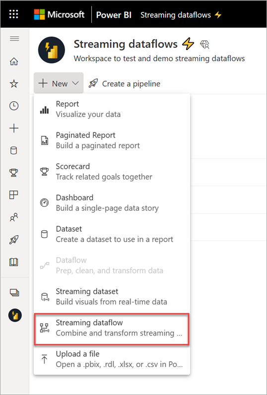

1. On the side pane that opens, you must name your streaming dataflow. Enter a name in the **Name** box (1), and then select **Create** (2).

   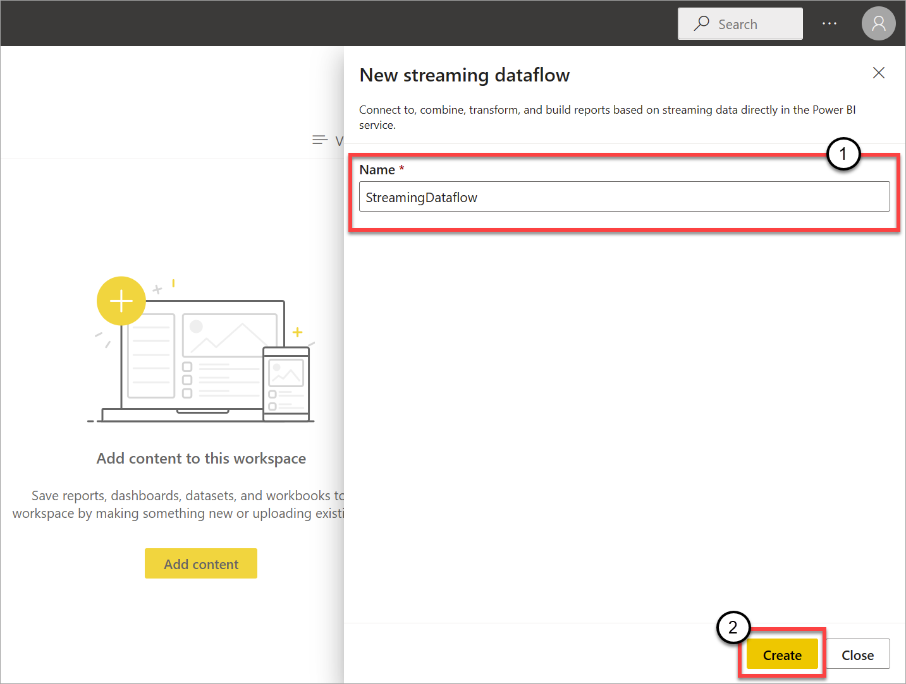

   The empty diagram view for streaming dataflows appears. 

This screenshot shows a finished dataflow that highlights all the sections available to you for authoring in the streaming dataflow UI.

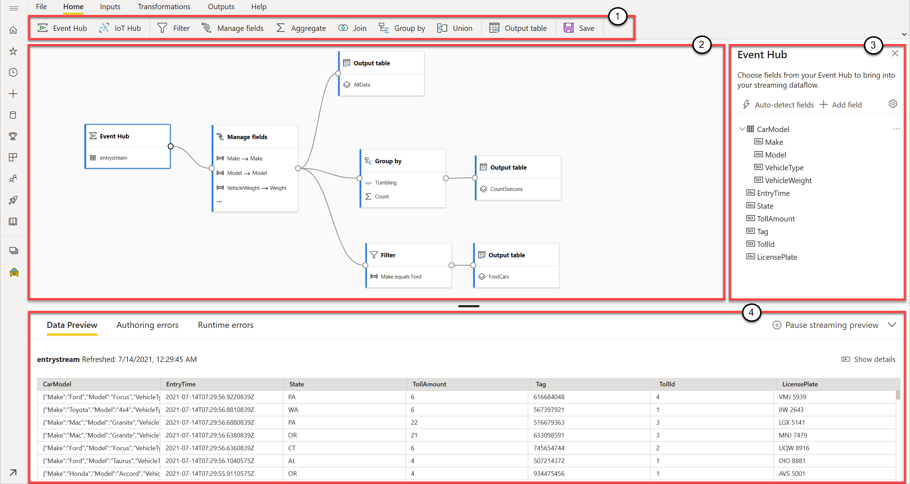

1. **Ribbon**: On the ribbon, sections follow the order of a "classic" analytics process: inputs (also known as data sources), transformations (streaming ETL operations), outputs, and a button to save your progress.
2. **Diagram view**: This is a graphical representation of your dataflow, from inputs to operations to outputs.
3. **Side pane**: depending on which component you selected in the diagram view, you'll have settings to modify each input, transformation, or output.
4. **Tabs for data preview, authoring errors, and runtime errors**: For each card shown, the data preview will show you results for that step (live for inputs and on-demand for transformations and outputs). 

   This section also summarizes any authoring errors or warnings that you might have in your dataflows. Selecting each error or warning will select that transform. In addition, you have access to runtime errors after the dataflow is running, such as dropped messages. 
   
   You can always minimize this section of streaming dataflows by selecting the arrow in the upper-right corner of the preview pane.

A streaming dataflow is built on three main components: *streaming inputs*, *transformations*, and *outputs*. You can have as many components as you want, including multiple inputs, parallel branches with multiple transformations, and multiple outputs.

## Add a streaming input

To add a streaming input, select the icon on the ribbon and provide the information needed in the side pane to set it up. As of July 2021, the streaming dataflows preview supports [Azure Event Hubs](/azure/event-hubs/) and [Azure IoT Hub](/azure/iot-hub/) as inputs.

Azure Event Hubs and Azure IoT Hub are streaming and big data services built on a common architecture to facilitate the fast and scalable ingestion and consumption of events. IoT Hub in particular is tailored as a central message hub for communications in both directions between an IoT application and its attached devices.

### Azure Event Hubs

Azure Event Hubs is a big data streaming platform and event ingestion service. It can receive and process millions of events per second. Data sent to an event hub can be transformed and stored by using any real-time analytics provider or batching/storage adapters.

To configure an event hub as an input for streaming dataflows, select the **Event Hub** icon. A card appears in the diagram view, including a pane for its configuration.

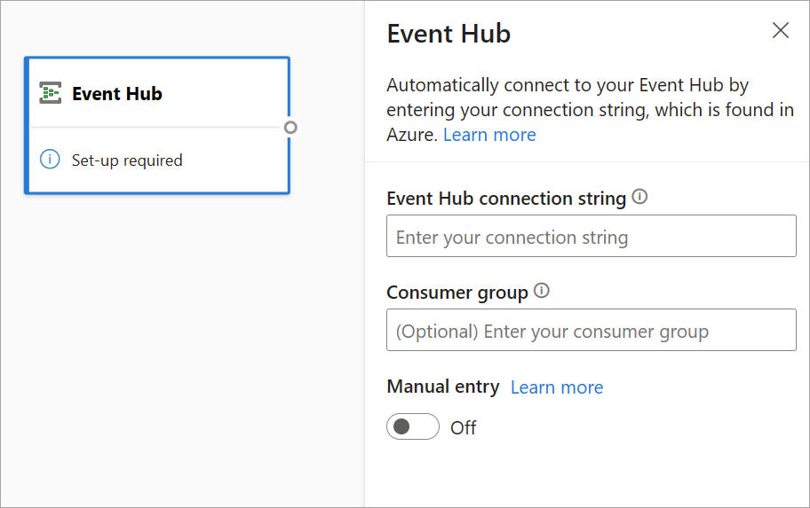

You have the option of pasting the Event Hubs connection string. Streaming dataflows will fill out all the necessary information, including the optional consumer group (which by default is **$Default**). If you want to enter all fields manually, you can enable the manual entry toggle to expose them. You can learn more about Event Hubs connection strings in [this article](/azure/event-hubs/event-hubs-get-connection-string).

After you set up your Event Hubs credentials and select **Connect**, you can add fields manually by using **+ Add field** if you know the field names. To instead detect fields and data types automatically based on a sample of the incoming messages, select **Autodetect fields**. Selecting the gear icon allows you to edit the credentials if needed.

When streaming dataflows detect the fields, you'll see them in the list. You'll also see a live preview of the incoming messages in the **Data Preview** table under the diagram view.

You can always edit the field names, or remove or change the data type, by selecting the three dots (**...**) next to each field. You can also expand, select, and edit any nested fields from the incoming messages, as shown in the following image.

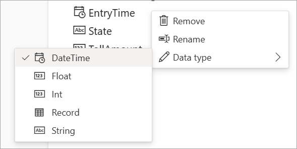

### Azure IoT Hub

IoT Hub is a managed service hosted in the cloud. It acts as a central message hub for communications in both directions between an IoT application and its attached devices. You can connect millions of devices and their back-end solutions reliably and securely. Almost any device can be connected to an IoT hub.

IoT Hub configuration is similar to Event Hubs configuration because of their common architecture. But there are some differences, including where to find the Event Hubs-compatible built-in endpoint connection string. You can learn more about the IoT Hub built-in endpoint in [this article](/azure/iot-hub/iot-hub-devguide-messages-read-builtin).

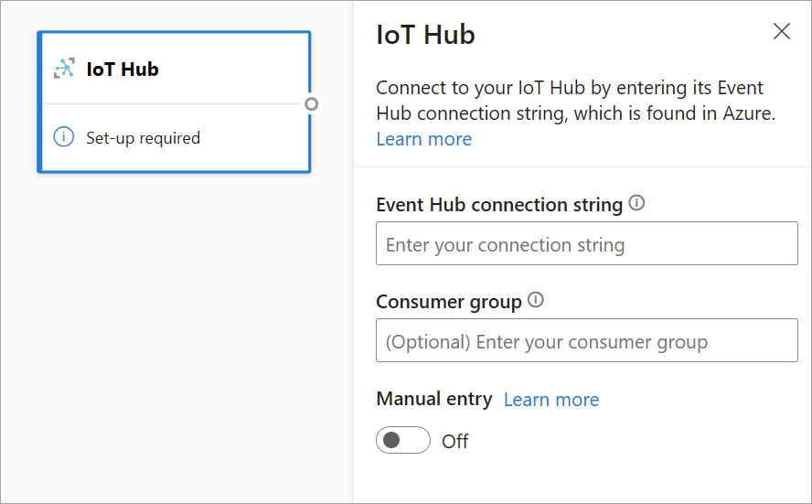

After you paste the built-in endpoint connection string, all functionality for selecting, adding, autodetecting, and editing fields coming in from IoT Hub are the same as in Event Hubs. You can also edit the credentials by selecting the gear icon.

> [!TIP]
> If you have access to Event Hubs or IoT Hub in your organization's Azure portal and you want to use it as an input for your streaming dataflow, you can find the connection strings in the following locations:
>
> For Event Hub: 
> 1. In the **Analytics** section, select **All Services** > **Event Hubs**. 
> 1. Select **Event Hubs Namespace** > **Entities/Event Hubs**, and then select the event hub name. 
> 1. In the **Shared Access Policies** list, select a shared access policy. 
> 1. Select the **Copy to clipboard** button next to the **Connection string-primary key** field.
>
>For IoT Hub: 
> 1. In the **Internet of Things** section, select **All Services** > **IoT Hubs**.
> 1. Select the IoT hub that you want to connect to, and then select **Built-in endpoints**.
> 1. Select the **Copy to clipboard** button next to the Event Hubs-compatible endpoint.

When you use stream data from Event Hubs or IoT Hub, you have access to the following metadata time fields in your streaming dataflow:

* **EventProcessedUtcTime**: The date and time that the event was processed.
* **EventEnqueuedUtcTime**: The date and time that the event was received.

Neither of these will show up in the input preview and need to be added manually.

### Data types

The available data types for streaming dataflows fields are:

* **DateTime**: Date and time field in ISO format.
* **Float**: Decimal number.
* **Int**: Integer number.
* **Record**: Nested object with multiple records.
* **String**: Text.

> [!IMPORTANT]
> The data types selected for a streaming input have important implications downstream your streaming dataflow. Select the data type as early as you can in your dataflow, to avoid having to stop it later for edits.

## Add a streaming data transformation

Streaming data transformations are inherently different from batch data transformations. Almost all streaming data has a time component, which affects any data preparation tasks involved.

To add a streaming data transformation to your dataflow, select the transformation icon in the ribbon for that transformation. The respective card will be dropped in the diagram view. After you select it, you'll see the pane for that transformation to configure it.

As of July 2021, streaming dataflows support the following streaming transformations.

### Filter

Use the **Filter** transformation to filter events based on the value of a field in the input. Depending on the data type (number or text), the transformation will keep the values that match the selected condition.

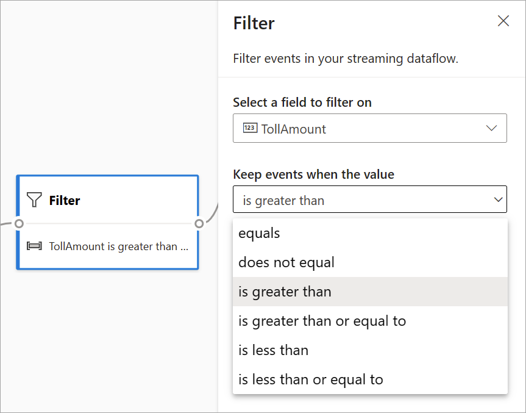

> [!NOTE]
> Inside every card, you'll see information about what else is needed for the transformation to be ready. For example, when you're adding a new card, you'll see a "Set-up required" message. If you're missing a node connector, you'll see either an "Error" or "Warning" message.

### Manage fields

The **Manage fields** transformation allows you to add, remove, or rename fields coming in from an input or another transformation. The pane settings give you the option of adding a new one by selecting **Add field** or adding all fields at once.

> [!TIP]
> After you configure a card, in the diagram view you'll get a glimpse of the settings within the card itself. For example, in the **Manage fields** image, you can see the first three fields being managed and the new names assigned to them. Each card will have information relevant to it.

### Aggregate

You can use the **Aggregate** transformation to calculate an aggregation (**Sum**, **Minimum**, **Maximum**, or **Average**) every time a new event occurs over a period of time. This operation also allows you to filter or slice the aggregation based on other dimensions in your data. You can have one or more aggregations in the same transformation.

To add an aggregation, select the transformation icon. Then connect an input, select the aggregations, add any filter or slice dimensions, and select the period of time over which the aggregation will be calculates. In this example, we're calculating the sum of the toll value by the state where the vehicle is from over the last 10 seconds.

To add another aggregation to the same transformation, select **Add aggregate function**. Keep in mind the filter or slice will apply to all aggregations in the transformation.

### Join

Use the **Join** transformation to combine events from two inputs based on the field pairs that you select. If you don't select a field pair, the join will be based on time by default. The default is what makes this transformation different from a batch one.

As with regular joins, you have different options for your join logic:

- **Inner join**: Include only records from both tables where the pair matches. In this example, that's where the license plate matches both inputs.
- **Left outer join**: Include all records from the left (first) table and only the records from the second one that match the pair of fields. If there's no match, the fields from the second input will be blank.

To select the type of join, select the icon for the preferred type in the pane.

Finally, select over what period of time you want the join to be calculated. In this example, the join looks at the last 10 seconds. Keep in mind that longer the period, the less frequent the output, and the more processing resources are used for the transformation.

By default, all fields from both tables are included. Prefixes left (first node) and right (second node) in the output help you differentiate the source.

### Group by

Use the **Group by** transformation to calculate aggregations across all events within a certain time window. You have the option to group by the values in one or more fields. It's similar to the **Aggregate** transformation but provides more options for aggregations. It also includes more complex time windowing options. Also similar to **Aggregate**, you can add more than one aggregation per transformation.

The aggregations available in this transformation are: **Average**, **Count**, **Maximum**, **Minimum**, **Percentile** (continuous and discrete), **Standard Deviation**, **Sum**, and **Variance**.

To configure this transformation:

1. Select your preferred aggregation.
1. Select the field that you want to aggregate on.
1. Select an optional group-by field if you want to get the aggregate calculation over another dimension or category (for example, **State**).
1. Select your time windowing function. 

To add another aggregation to the same transformation, select **Add aggregate function**n. Keep in mind that the **Group by** field and the windowing function will apply to all aggregations in the transformation.

A time stamp for the end of the time window is provided as part of the transformation output for reference.

A section later in this article explains each type of time window available for this transformation.

### Union

Use the **Union** transformation to connect two or more inputs to add events with shared fields (with the same name and data type) into one table. Fields that don't match will be dropped and not included in the output.

## Set up time window functions

Time windowing is one of the most complex concepts in streaming data. It sits at the core of streaming analytics.

With streaming dataflows, we've tried to make it as easy as possible to set up this complex transformation when you're aggregating data as an option for the **Group by** transformation.

> [!NOTE]
> Keep in mind that all the output results for windowing operations are calculated at the end of the time window. The output of the window will be a single event that's based on the aggregate function. This event will have the time stamp of the end of the window, and all window functions are defined with a fixed length.

There are five kinds of time windows to choose from: tumbling, hopping, sliding, session, and snapshot.

### Tumbling window

Tumbling is the most common type of time window. The key characteristics of tumbling windows are that they repeat, have the same time length, and don't overlap. An event can't belong to more than one tumbling window.

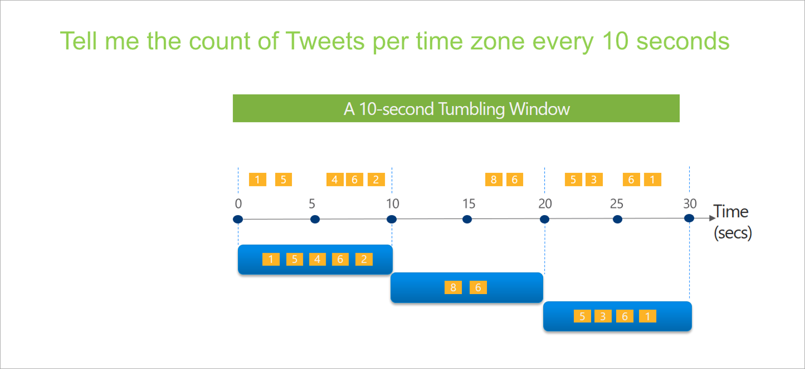

When you're setting up a tumbling window in streaming dataflows, you need to provide the duration of the window (same for all windows in this case).
You also can provide an optional offset: by default, tumbling windows include the end of window and exclude the beginning. You can use this parameter to change this behavior and include the events in the beginning of the window and exclude the ones in the end.

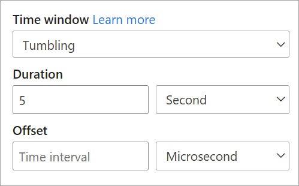

### Hopping window

Hopping windows "hop" forward in time by a fixed period. You can think of them as tumbling windows that can overlap and be emitted more often than the window size. Events can belong to more than one result set for a hopping window. To make a hopping window the same as a tumbling window, you can specify the hop size to be the same as the window size.

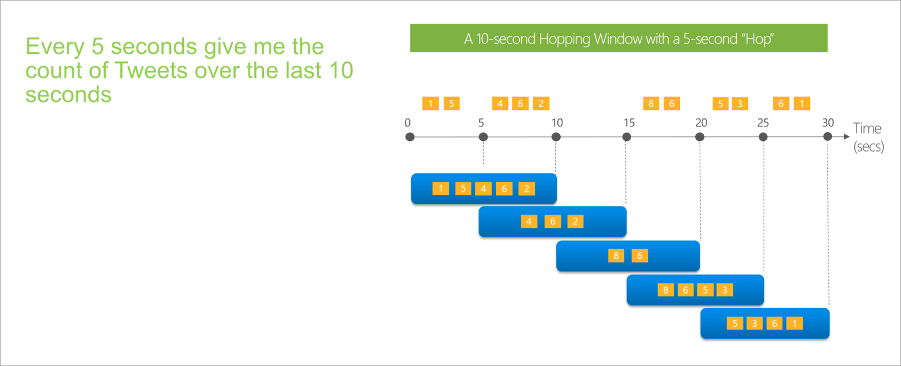

When you're setting up a hopping window in streaming dataflows, you need to provide the duration of the window (same as with tumbling windows).
You also need to provide the hop size, which tells streaming dataflows how often you want the aggregation to be calculated for the defined duration.

The offset parameter is also available in hopping windows for the same reason as in tumbling windows: to define the logic for including and excluding events for the beginning and end of the hopping window.

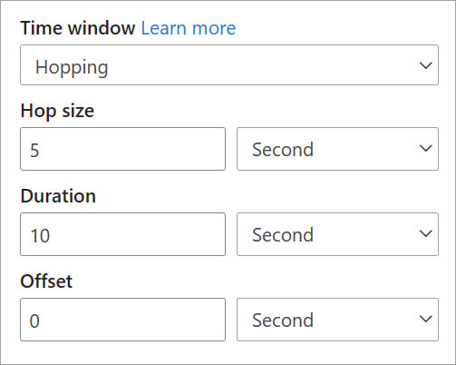

### Sliding window

Sliding windows, unlike tumbling or hopping windows, calculate the aggregation only for points in time when the content of the window actually changes. When an event enters or exits the window, the aggregation is calculated. So, every window has at least one event. Similar to hopping windows, events can belong to more than one sliding window.

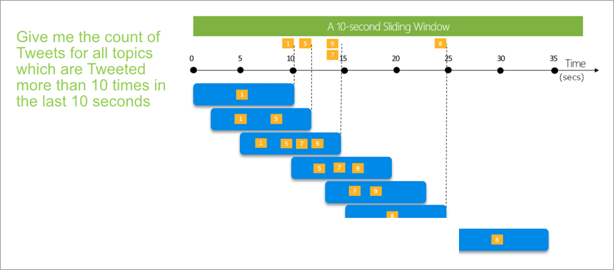

The only parameter needed for a sliding window is the duration, because events themselves define when the window starts. No offset logic is necessary.

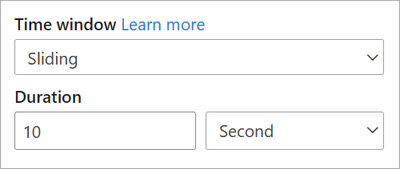

### Session window

Session windows are the most complex type. They group events that arrive at similar times, filtering out periods of time where there's no data. For this, it's necessary to provide:

- A timeout: How long to wait if there's no new data.
- A maximum duration: The longest time that the aggregation will be calculated if data keeps coming.

You can also define a partition, if you want.

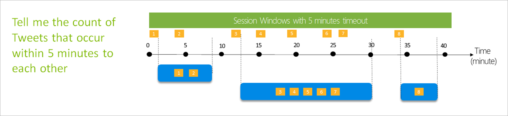

You set up a session window directly in the pane for the transformation. If you provide a partition, the aggregation will only group events together for the same key.

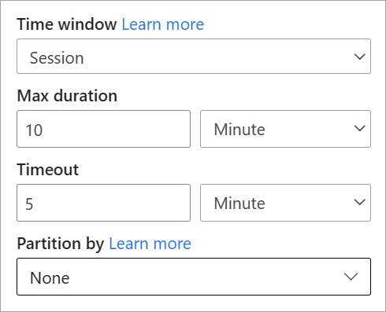

### Snapshot window

Snapshot windows groups events that have the same timestamp. Unlike other window, a snapshot doesn't require any parameters because it uses the time from the system.

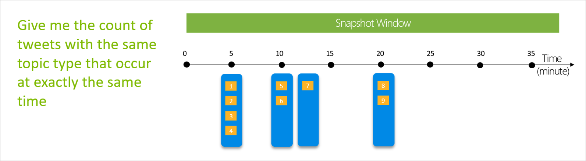

## Define outputs

After you're ready with inputs and transformations, it's time to define one or more outputs. As of July of 2021, we support only one type of output: a Power BI table.

This output will be your dataflow table (that is, an entity) that can be used to create reports in Power BI Desktop. You need to join the nodes of the previous step with the output that you're creating to make it work. After that, all you need to do is name the table.

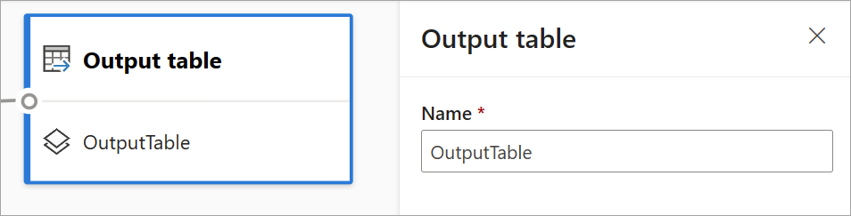

After you connect to your dataflow, this table will be available for you to create visuals that are updated in real time for your reports.

## Data preview and errors

Streaming dataflows provides tools to help you author, troubleshoot, and evaluate the performance of your analytics pipleline for streaming data.

Let's start with the data preview.

### Live data preview for inputs

When you're connecting to an event hub or IoT hub and selecting its card in the diagram view, you'll get a live preview of data coming in if:

- Data is being pushed.
- The input is configured correctly.
- Fields have been added.

If you want to see or drill down into something specific, you can pause the preview (1) or start it again if you're done.

You can also see the details of a specific record (a "cell" in the table) by selecting it and then selecting **Show/Hide details** (2). The following screenshot shows the detailed view of a nested object in a record.

### Static preview for transformations and outputs

After you add and set up any steps in the diagram view, you can test its behavior selecting the static data button :::image type="icon" source="media/dataflows-streaming/dataflows-streaming-26.png":::.

After you do, streaming dataflows evaluate all transformation and outputs that are configured correctly. Streaming dataflows then display the results in the static data preview, as shown in the following image.

You can refresh the preview by selecting **Refresh static preview** (1). When you do this, streaming dataflows take new data from the input and evaluate all transformations and outputs again with any updates that you might have performed. The **Show/Hide details** option is also available (2).

### Authoring errors

If you have any authoring errors or warnings, the authoring errors pivot/table (1) will list them providing details of the error/warning, the type of card (input, transformation, or output), the error level, and a description of the error/warning (2). When you select any of the errors or warnings, the respective card will be selected and the configuration side pane will open for you to make the changes needed.

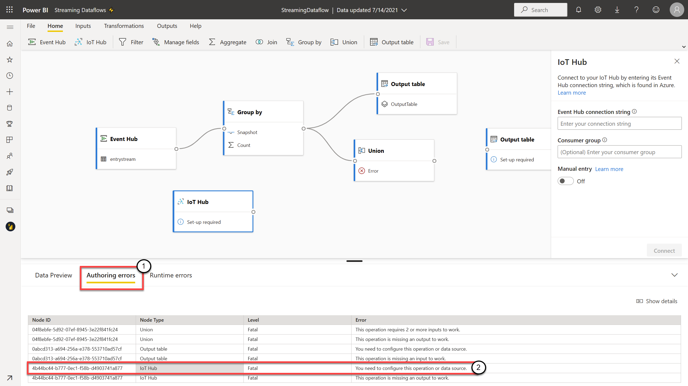

### Runtime errors

The last available table in the preview is Runtime errors (1). This table will provide you with any errors in the process of ingesting and analyzing the streaming dataflow after you start it (for example if a message came in corrupted and the dataflow could not ingest it and perform the defined transformations).

Since dataflows could run for a long period of time, this table offers the option to filter by time span and also to download the list of errors and refresh it needed (2).

## Modify settings for streaming dataflows

Same as with regular dataflows, streaming dataflows settings can be modified depending on the needs of owners and authors.
In this section, we will cover the settings that are unique to streaming dataflows. For the rest, because of the share infrastructure between the two types of dataflows, you can assume the use is the same.

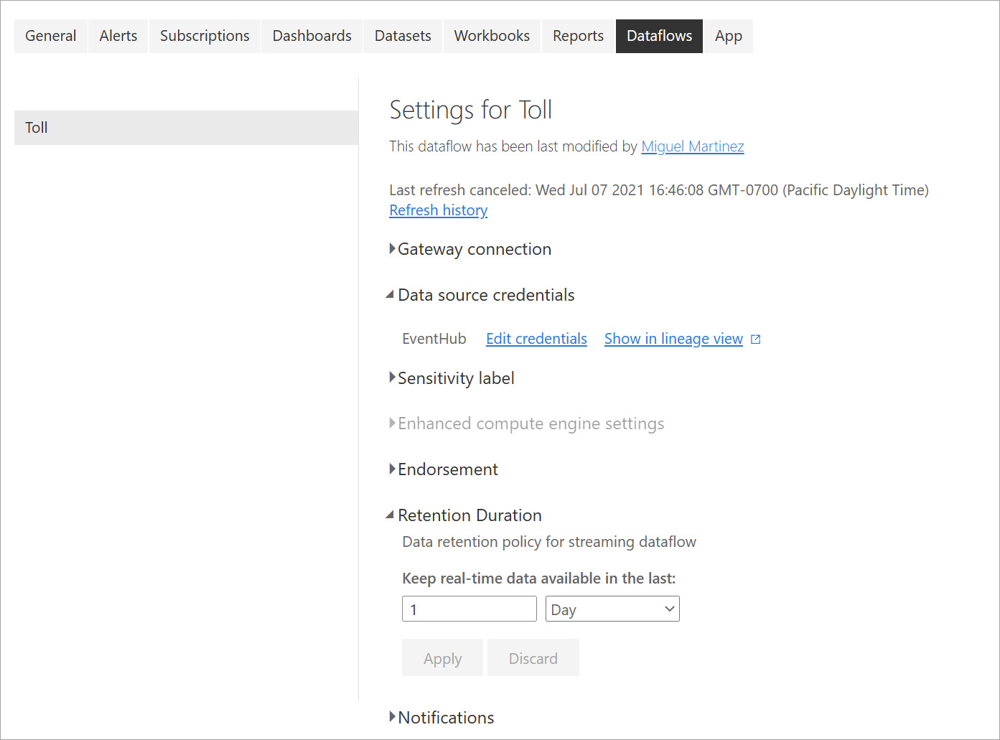

* **Refresh history**: since streaming dataflows run continuously, refresh history will only show information regarding when the dataflow was started, canceled, or when it failed with details and error codes when it applies, similar to regular dataflows. This information can be used to troubleshoot issues or to provide Power BI support with more information if requested or needed.

* **Data source credentials**: it will show the inputs that have configured for the specific streaming dataflow.

* **Enhanced compute engine settings**: streaming dataflows needs the enhanced compute engine to provide real-time visuals so this setting is grayed out and on by default.

* **Retention duration**: this setting is specific to streaming dataflows. Here you can define for how long you want to keep real time to visualize in reports. Historical data is saved by default in blob storage: this setting is specific to the real-time side of your data (hot storage). The minimum value here is 1 day or 24 hours.

> [!IMPORTANT]
> The amount of hot data stored by this retention duration directly influences the performance of your real time visuals when creating reports on top of this data. Keep in mind that the more retention you have here, the more your real-time visuals in reports can be affected by low performance. If you need to perform historical analysis, we recommend you use the cold storage provided for streaming dataflows.

## Run and edit a streaming dataflow

### Run your streaming dataflow

After saving and configuring your streaming dataflow, now everything is ready for you to run it and start ingesting data into Power BI with the streaming analytics logic you have defined.

To do this, save your dataflow and head to the workspace where it was created. Hover your mouse over your streaming dataflow. You will see a play button appear. To start your streaming dataflow, select the play button. You will see a pop-up message telling you that the streaming dataflow is being started.

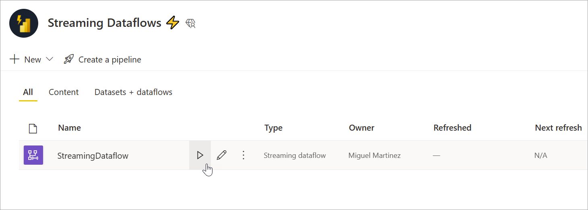

> [!NOTE]
> It might take up to five minutes for your streaming dataflow to start (this means for data to start being ingested and for you to see data coming in to create reports and dashboards in Power BI Desktop).

### Edit your streaming dataflow

While a streaming dataflow is running, it **cannot be edited**. Having said that, we have allowed users going into a streaming dataflow in a running state and be able to see the logic created by author as a way to help users understand the analytics logic that a running streaming dataflow is built on.

When you go into a running streaming dataflow, you will see that all edit options are disabled and a message is displayed: "The dataflow cannot be edited while it is running. Stop the dataflow if you wish to continue." You will also see that the data preview is disabled too.

**To edit your streaming dataflow, you will have to stop it, resulting in data being missed while the dataflow is not running.**

The only experience available while a streaming dataflow is running is "Runtime errors", where users can monitor the behavior of their dataflow for any dropped messages and other similar situations.

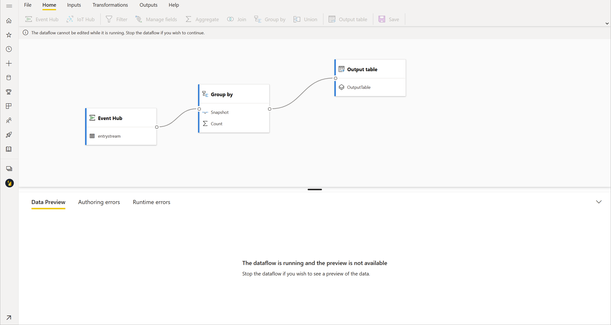

### Data storage when editing your dataflow

When editing a dataflow, there other considerations that need to be accounted for. Similar to any changes in schema made in regular dataflows, if you make changes to an output table, it will result in loss of data that has already been pushed and saved to Power BI. To provide clear information about the consequences of any of these changes in your streaming dataflow, we have created an experience that provides clear information about the impact and some choices when changes are made before saving.

This is better shown with an example. The following screenshot shows the message you would get after adding a column to one table, changing a name for second one, and leaving the third one the same it was before:

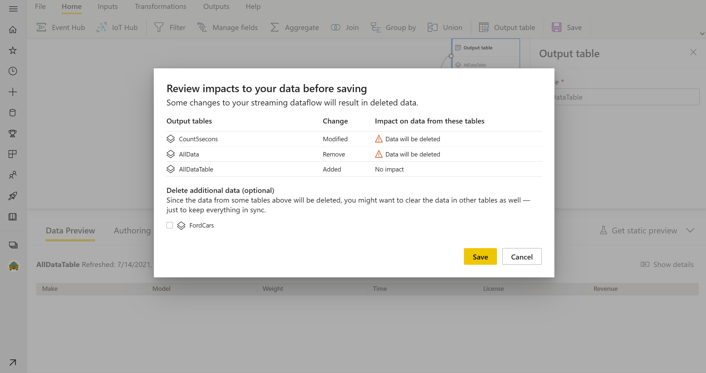

As you can see the data already saved in both tables that had schema and name changes will be deleted if we save the changes. For the table that stayed the same, we get the option to delete any old data and start from scratch or saving it for later analysis together with new data that would come in.

Keep in mind these nuances when editing your streaming dataflow, especially if you need historical data available later for further analysis.

## Consume a streaming dataflow

After your streaming dataflow is running, you are ready to start creating content on top of your streaming data. There are no structural changes compared to what you have to currently do to create reports that update in real time but there are some nuances and updates that need to be considered to take advantage of this new type of data preparation for streaming data.

### Set up data storage

As we have mentioned before, streaming dataflows saves data in two locations. The use of these two sources depends on what type of analysis you're trying to do:

- **Hot storage (real-time analysis)**: as data comes into Power BI from streaming dataflows, data is stored in a hot location for you to access with real-time visuals. How much data is saved in this storage depends on the settings of your "Retention Duration" defined in the streaming dataflow settings. The default (and minimum) is 24 hours but this can be changed.
- **Cold storage (historical analysis)**: Anytime period that does not fall in the period defined in your "Retention Duration" is saved on cold storage (blob) in Power BI for you to consume if needed.

> [!NOTE]
> There will be overlap between these two data storage locations, so please be aware that if you need to use both in conjunction (for example day over day percentage change) you might have to de-duplicate your records depending on the time intelligence calculations you are making and the retention policy.

### Connect to streaming dataflows from Power BI Desktop

With the July 2021 release of Power BI Desktop, there is a new Power Platform dataflow (Beta) connector available for you to use. As part of this new connector, for streaming dataflow you will see two tables available that match the data storage previously described.

To connect to your streaming dataflows data: 

1. Go to Get Data and search for the Power Platform dataflows (Beta) connector.

   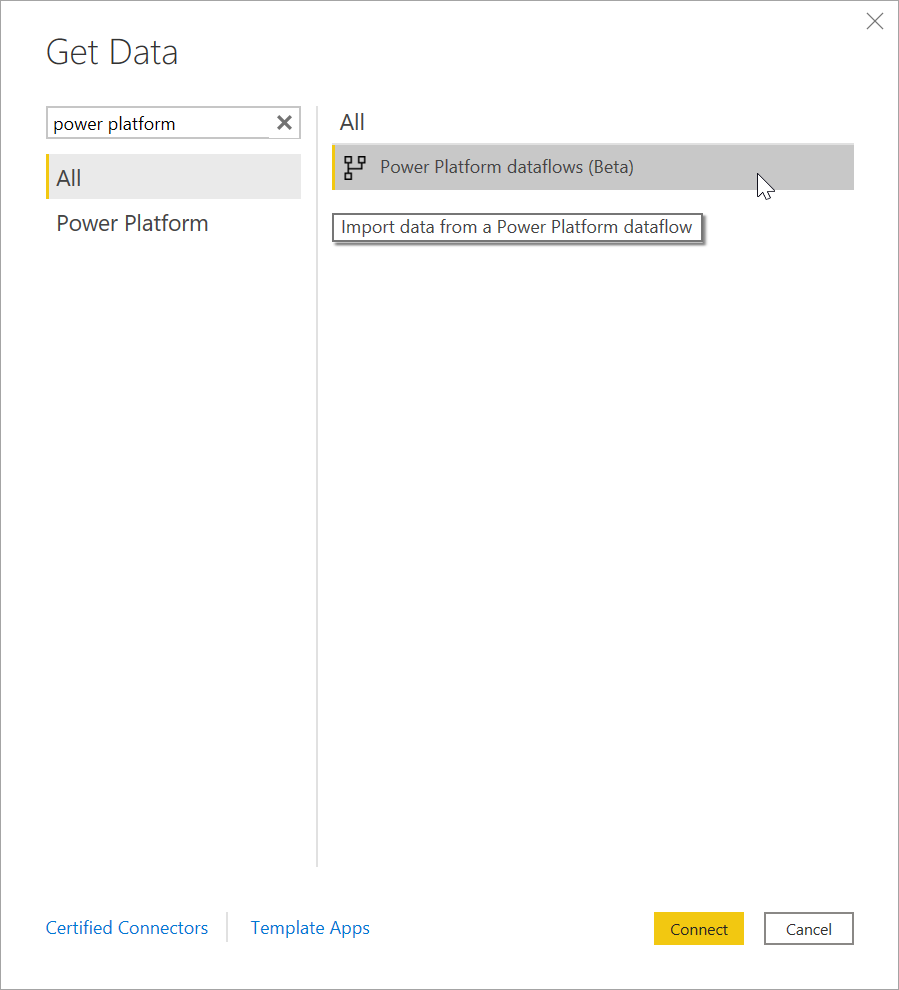

2. Log in with your Power BI credentials
3. Select workspaces and look for the one where your streaming dataflow is located and select your streaming dataflow (in our case called Toll)
4. You will see all your output tables twice: one for streaming data (hot) and one for archived data (cold). You can differentiate them by the labels added after the table names and the different icons.

   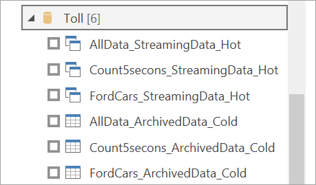

5. Here we will show how to connect to streaming data. The Archived data case is the same only available in Import mode. Select the tables with the labels Streaming/Hot and select "Load"

   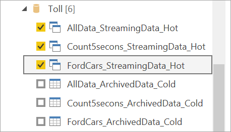

6. When asked to choose a Storage Mode, select DirectQuery if your goal is to create real-time visuals.

   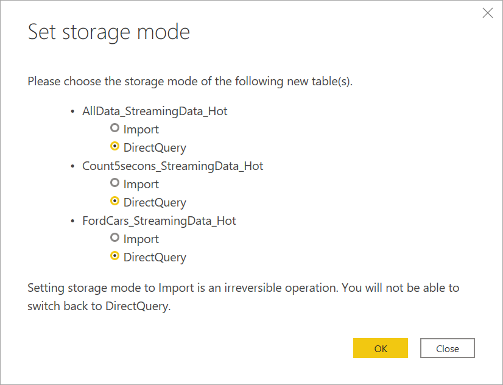

As of now you're good to create visuals, measures, etc. using any of the features available for you in Power BI Desktop.

> [!NOTE]
> The regular Power BI dataflows connector is still available and will work with streaming dataflows with two caveats:
>* It only allows you to connect to hot storage.
>* The data preview in the connector does not work with streaming dataflows.

### Turn on automatic page refresh for real-time visuals

After your report is ready and you have added all the content you want to share, the only step left is to make your visuals update in real time. For this, we will be using another feature the streaming dataflows team created called automatic page refresh, which allows you to refresh visuals from a DirectQuery source as often as one second. You can find more details about [automatic page refresh here](../../create-reports/desktop-automatic-page-refresh.md) (how to use, how to set it up, how to contact your admin if you are having trouble, etc.) but here we will go over the basics on how to set it up:

1. Go to the report page where you want the visuals to update in real time.
2. De-select any visual in the page and, if possible, select the background of the page.
3. Head to the format pane (1) and set the toggle to on in the last section called automatic page refresh.

   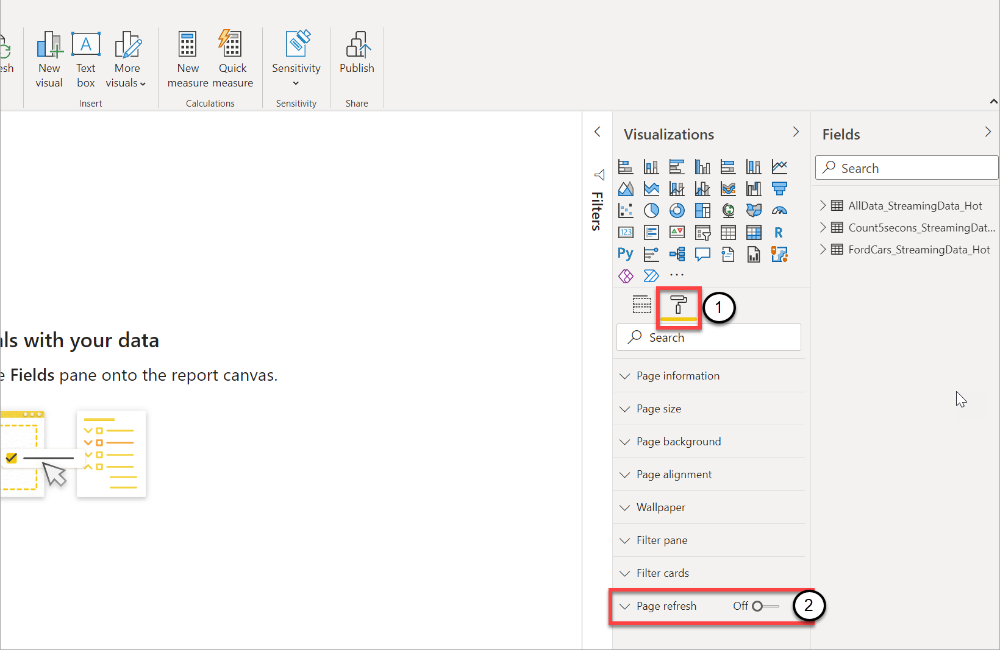

4. Set up your desired frequency (up to every second if your admin has allowed it) and enjoy your visuals updating in real time.

   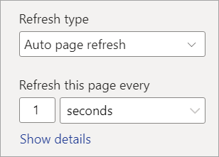

5. To share your real-time report, publish back to Power BI service, set up your dataflows credentials for the dataset and share.

> [!TIP]
> If you are not seeing your report update as fast as you need it to or in real-time, check the [automatic page refresh documentation](../../create-reports/desktop-automatic-page-refresh.md) and follow the FAQ and troubleshoot instructions to figure out why this could be happening.

## Limitations and considerations

### General limitations

* A Power BI Premium subscription (capacity or PPU) is required in order to create and run streaming dataflows.
* Only one type of dataflow is allowed per workspace.
* Linking regular and streaming dataflows is not possible.
* Capacities smaller than A3 create or run use streaming dataflows.
* If dataflows or the enhanced calculation engine is not enabled in a tenant, users will not be able to create or run streaming dataflows.
* Workspaces connected to a storage account are not supported.
* Each streaming dataflow can provide up to 1 MB / second of throughput.

### Availability

The streaming dataflows preview is not available in the following regions:

* Central India
* Germany North
* Norway East
* Norway West
* UAE Central
* South Africa North
* South Africa West
* Switzerland North
* Switzerland West
* Brazil Southeast

### Licensing

The number of streaming dataflows allowed per tenant depends on the license being used

* Regular capacities: the maximum number of streaming dataflows allowed in a capacity can be calculated bu the following formula: 

  > Maximum number of streaming dataflows per capacity = vCores in the capacity x 5

  > Example: P1 has 8 vCores > 8 * 5 = 40 streaming dataflows

* Premium Per User: One streaming dataflow is allowed per user. If another user wants to consume a streaming dataflow in a PPU workspace, they will need a PPU license too.

### Dataflow authoring

When authoring streaming dataflows, users should be mindful of the following considerations:

* Streaming dataflows can only be modified by their owners and if they are not running.
* Streaming dataflows are not available in *My Workspace*.

### Connecting from Desktop

* Cold storage can only be accessed using the Power Platform dataflows connector available starting in the July 2021 Desktop update in Beta.
* If using the existing Power BI dataflows connector only allows connection to streaming data (hot) storage. Connector data preview doesn't work.

## Next steps

This article provided an overview of self-service streaming data prep using streaming dataflows. 

The following articles provide further information for how to test this capability and use of other streaming data features in Power BI.

* [Build a sample IoT solution to test streaming dataflows with one click](/azure/stream-analytics/stream-analytics-build-an-iot-solution-using-stream-analytics)
* [Use the Azure Raspberry Pi simulator and the Free tier of IoT Hub to test streaming dataflows](/azure/iot-hub/iot-hub-raspberry-pi-web-simulator-get-started)
* [PUSH and streaming datasets in Power BI](../../connect-data/service-real-time-streaming.md)
* [Learn more about automatic page refresh](../../create-reports/desktop-automatic-page-refresh.md)
