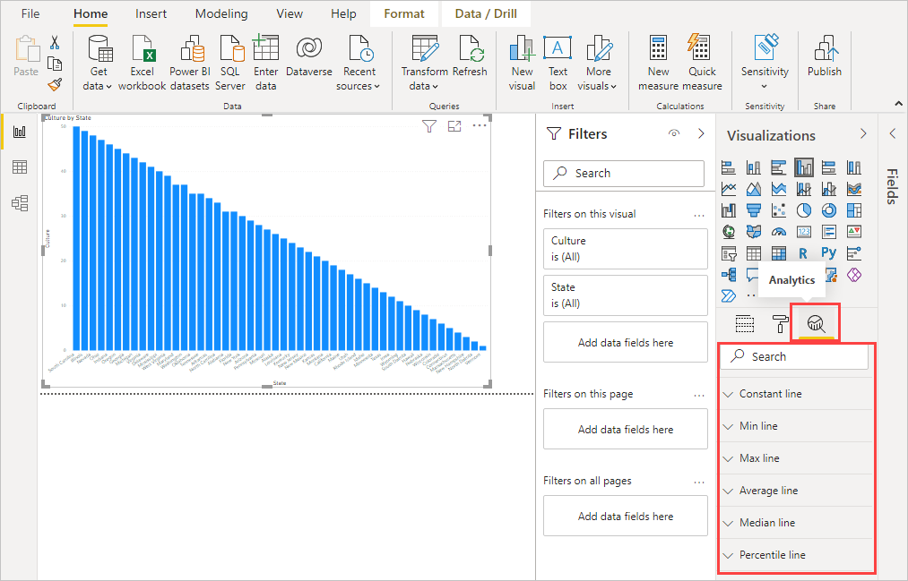
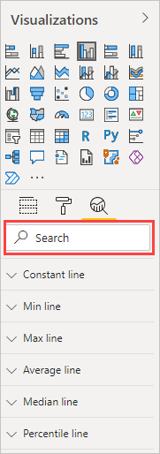
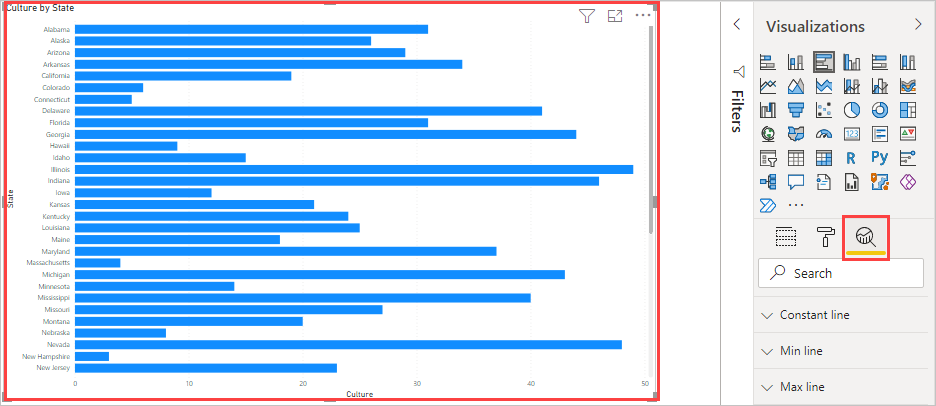
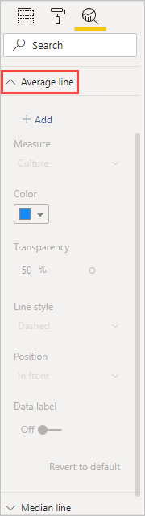
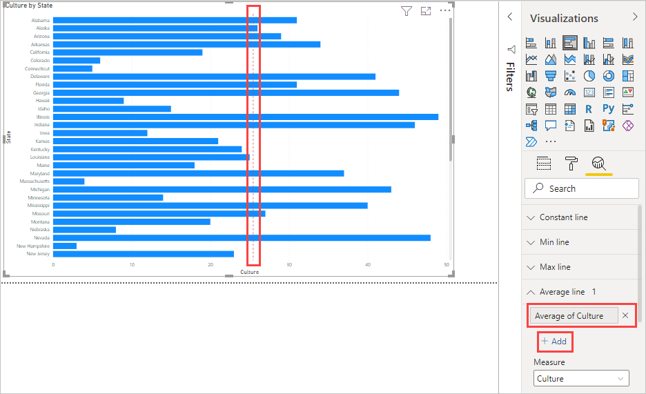
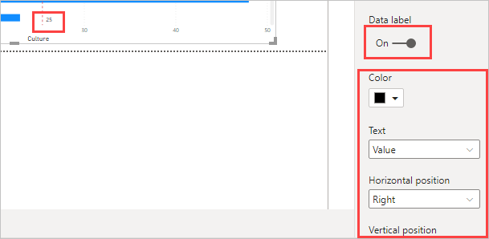
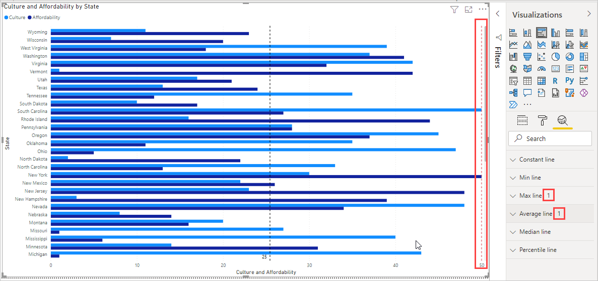
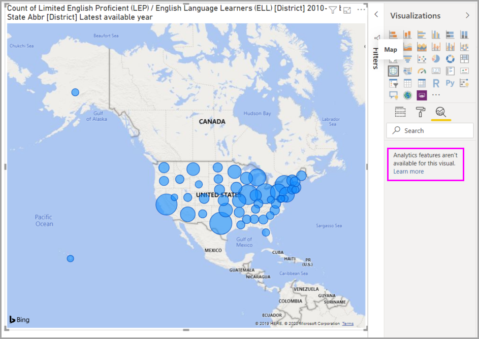
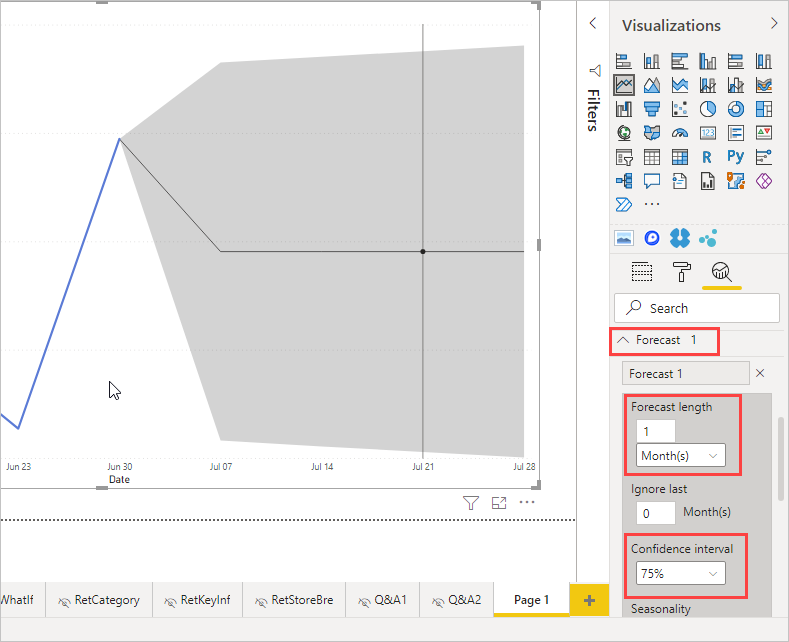

# Use the Analytics pane in Power BI Desktop

With the **Analytics** pane in Power BI Desktop, you can add dynamic *reference lines* to visuals, and provide focus for important trends or insights. The **Analytics** icon and pane is found in the **Visualizations** area of Power BI Desktop.

> [!NOTE]
> The **Analytics** pane only appears when you select a visual on the Power BI Desktop canvas.

## Search within the Analytics pane

You can search within the **Analytics** pane, which is a subsection of the **Visualizations** pane. The search box appears when you select the **Analytics** icon.

## Use the Analytics pane

With the **Analytics** pane, you can create the following types of dynamic reference lines:

* X-Axis constant line
* Y-Axis constant line
* Min line
* Max line
* Average line
* Median line
* Percentile line
* Symmetry shading

> [!NOTE]
> Not all lines are available for all visual types.

The following sections show how you can use the **Analytics** pane and dynamic reference lines in your visualizations.

To view the available dynamic reference lines for a visual, follow these steps:

1. Select or create a visual, then select the **Analytics** icon from the **Visualizations** section.

    

2. Select the type of line you want to create to expand its options. In this case, we'll select **Average line**.

    

3. To create a new line, select **+&nbsp;Add**. Then you can name the line. Double-click the text box and enter your name.

    Now you have all sorts of options for your line. You can specify its **Color**, **Transparency** percentage, **Line style**, and **Position** (compared to the visual's data elements). You may also choose whether to include the **Data label**. To specify the visual measure to base your line upon, select the **Measure** dropdown list, which is automatically populated with data elements from the visual. Here we'll select **Culture** as the measure, label it *Average of Culture*, and customize a few of the other options.

    

4. If you want to have a data label appear, change **Data label** from **Off** to **On**. When you do so, you get a whole host of additional options for your data label.

    

5. Notice the number that appears next to the **Average line** item in the **Analytics** pane. That tells you how many dynamic lines you currently have on your visual, and of which type. If we add a **Max line** for **Affordability**, the **Analytics** pane shows that we now also have a **Max line** dynamic reference line applied to this visual.

    

If the visual you've selected can't have dynamic reference lines applied to it (in this case, a **Map** visual), you'll see the following message when you select the **Analytics** pane.

You can highlight many interesting insights by creating dynamic reference lines with the **Analytics** pane.

We're planning more features and capabilities, including expanding which visuals can have dynamic reference lines applied to them. Check back often to see what's new.

## Apply forecasting

If you have time data in your data source, you can use the *forecasting* feature. Just select a visual, then expand the **Forecast** section of the **Analytics** pane. You may specify many inputs to modify the forecast, such as the **Forecast length** or the **Confidence interval**. The following image shows a basic line visual with forecasting applied. Use your imagination (and play around with forecasting) to see how it may apply to your models.

> [!NOTE]
> The forecasting feature is only available for line chart visuals.

For an example of how forecasting can be applied, see the (somewhat dated, but still relevant) article about [forecasting capabilities](https://powerbi.microsoft.com/blog/introducing-new-forecasting-capabilities-in-power-view-for-office-365/). 

## Considerations and limitations

The ability to use dynamic reference lines is based on the type of visual being used. The following lists describe these limitations more specifically.

You may use *x-axis constant line*, *y-axis constant line*, and *symmetry shading* on the following visual:

* Scatter chart

Use of *constant line*, *min line*, *max line*, *average line*, *median line*, and *percentile line* is available on these visuals:

* Area chart
* Clustered bar chart
* Clustered column chart
* Line chart
* Scatter chart

The following visuals can use only a *constant line* from the **Analytics** pane:

* Stacked area chart
* Stacked bar chart
* Stacked column chart
* Waterfall chart
* 100% Stacked bar chart
* 100% Stacked column chart

The following visuals can use a *trend line* if there's time data:

* Area chart
* Clustered column chart
* Line chart
* Line and clustered column chart
* Scatter chart

Lastly, you can't currently apply any dynamic lines to many visuals, including (but not limited to):

* Funnel
* Line and clustered column chart
* Line and stacked column chart
* Ribbon chart
* Non-Cartesian visuals, such as Donut chart, Gauge, Matrix, Pie chart, and Table

The *percentile line* is only available when using imported data in Power BI Desktop or when connected live to a model on a server that's running **Analysis Service 2016** or later, **Azure Analysis Services**, or a dataset on the Power BI service.

## Next steps

You can do all sorts of things with Power BI Desktop. For more information on its capabilities, check out the following resources:

* [What's new in Power BI?](../fundamentals/desktop-latest-update.md)
* [Get Power BI Desktop](../fundamentals/desktop-get-the-desktop.md)
* [What is Power BI Desktop?](../fundamentals/desktop-what-is-desktop.md)
* [Query overview with Power BI Desktop](desktop-query-overview.md)
* [Data types in Power BI Desktop](../connect-data/desktop-data-types.md)
* [Shape and combine data with Power BI Desktop](../connect-data/desktop-shape-and-combine-data.md)
* [Perform common tasks in Power BI Desktop](desktop-common-query-tasks.md)
