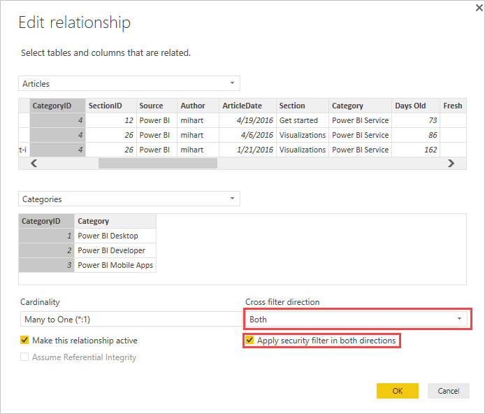

# Enable bidirectional cross-filtering for DirectQuery in Power BI Desktop

When filtering tables to create the appropriate view of data, report creators and data modelers face challenges determining how to apply filters to a report. Previously, the table's filter context was held on one side of the relationship, but not the other. This arrangement often required complex DAX formula to get the wanted results.

With bidirectional cross-filtering, report creators and data modelers now have more control over how they can apply filters when working with related tables. Bidirectional cross-filtering enables them to apply filters on *both* sides of a table relationship. You can apply the filters by propagating the filter context to a second related table on the other side of a table relationship.

## Enable bidirectional cross-filtering for DirectQuery

You can enable cross-filtering in the **Edit relationship** dialog box. To enable cross-filtering for a relationship, you must configure the following options:

* Set **Cross filter direction** to **Both**.
* Select **Apply security filter in both directions**.

  

> [!NOTE]
> When creating cross filtering DAX formulas in Power BI Desktop, use *UserPrincipalName*. This field is often the same as a user's login, for example <em>joe@contoso.com</em>, instead of *UserName*. As such, you may need to create a related table that maps *UserName* or *EmployeeID* to *UserPrincipalName*.

For more information and for examples of how bidirectional cross-filtering works, check out the [Bidirectional cross-filtering for Power BI Desktop whitepaper](https://download.microsoft.com/download/2/7/8/2782DF95-3E0D-40CD-BFC8-749A2882E109/Bidirectional%20cross-filtering%20in%20Analysis%20Services%202016%20and%20Power%20BI.docx).

