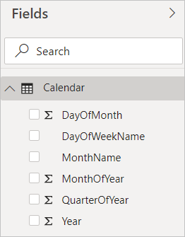
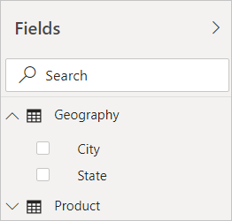
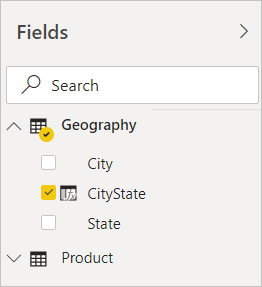
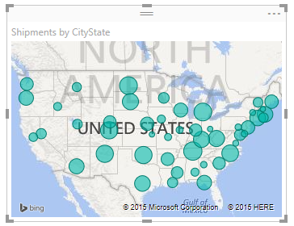

# Create calculated columns in Power BI Desktop
With calculated columns, you can add new data to a table already in your model. But instead of querying and loading values into your new column from a data source, you create a Data Analysis Expressions (DAX) formula that defines the column's values. In Power BI Desktop, calculated columns are created by using the new column feature in **Report** view.

Unlike custom columns that are created as part of a query by using **Add Custom Column** in Power Query Editor, calculated columns that are created in **Report** view or **Data** view are based on data you've already loaded into the model. For example, you might choose to concatenate values from two different columns in two different but related tables, do addition, or extract substrings.

Calculated columns you create appear in the **Fields** list just like any other field, but they'll have a special icon showing its values are the result of a formula. You can name your columns whatever you want, and add them to a report visualization just like other fields.

 
Calculated columns calculate results by using DAX, a formula language meant to work with relational data like in Power BI Desktop. DAX includes a library of over 200 functions, operators, and constructs. It provides immense flexibility in creating formulas to calculate results for just about any data analysis need. To learn more about DAX, see [DAX basics in Power BI Desktop](desktop-quickstart-learn-dax-basics.md).

DAX formulas are similar to Excel formulas. In fact, DAX has many of the same functions as Excel. DAX functions, however, are meant to work over data interactively sliced or filtered in a report, like in Power BI Desktop. In Excel, you can have a different formula for each row in a table. In Power BI, when you create a DAX formula for a new column, it will calculate a result for every row in the table. Column values are recalculated as necessary, like when the underlying data is refreshed and values have changed.

## Let's look at an example
Jeff is a shipping manager at Contoso, and wants to create a report showing the number of shipments to different cities. Jeff has a **Geography** table with separate fields for city and state. But, Jeff wants their reports to show the city and state values as a single value on the same row. Right now, Jeff's **Geography** table doesn't have the wanted field.

But with a calculated column, Jeff can put together the cities from the **City** column with the states from the **State** column.

Jeff right clicks on the **Geography** table and then selects **New Column**. Jeff then enters the following DAX formula into the formula bar:

This formula simply creates a new column named **CityState**. For each row in the **Geography** table, it takes values from the **City** column, adds a comma and a space, and then concatenates values from the **State** column.

Now Jeff has the wanted field.

Jeff can now add it to the report canvas along with the number of shipments. With minimal effort, Jeff now has a **CityState** field that can be added to just about any type of visualization. When Jeff creates a new map, Power BI Desktop already knows how to read the city and state values in the new column.

## Next steps
We've only provided a quick introduction to calculated columns here. For more information, check out the following resources:

* To download a sample file and get step-by-step lessons on how to create more columns, see [Tutorial: Create calculated columns in Power BI Desktop](desktop-tutorial-create-calculated-columns.md)

* To learn more about DAX, see [DAX basics in Power BI Desktop](desktop-quickstart-learn-dax-basics.md).

* To learn more about columns you create as part of a query, see the **Create custom columns** section in [Common query tasks in Power BI Desktop.](desktop-common-query-tasks.md)  

