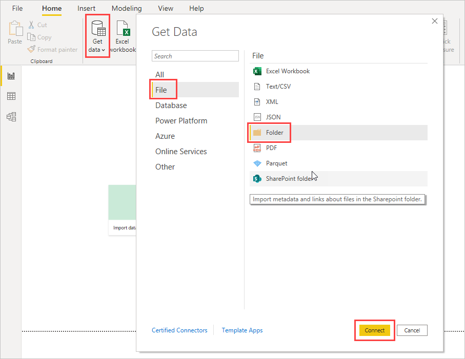
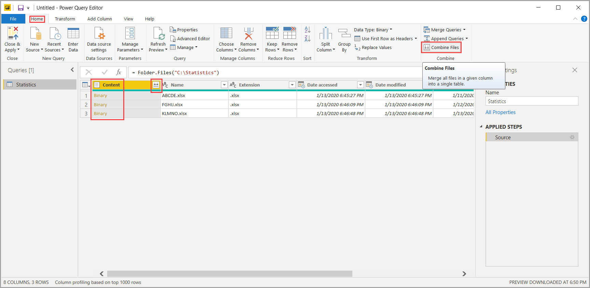

# Combine files (binaries) in Power BI Desktop

Here's a powerful approach to importing data into **Power BI Desktop**: If you have multiple files that have the same schema, combine them into a single logical table. This popular technique has been made more convenient and more expansive.

To start the process of combining files from the same folder, select **Get data**, choose **File** > **Folder**, and then select **Connect**.

Enter the folder path, select **OK**, and then select **Transform data** to see the folder's files in Power Query Editor.

## Combine files behavior

To combine binary files in Power Query Editor, select **Content** (the first column label) and select **Home** > **Combine Files**. Or you can just select the **Combine Files** icon next to **Content**.

The *combine files* transform behaves as follows:

* The combine files transform analyzes each input file to determine the correct file format to use, such as *text*, *Excel workbook*, or *JSON file*.
* The transform allows you to select a specific object from the first file, such as an Excel workbook, to extract.
  
  
* The combine files transform then automatically takes these actions:
  
  * Creates an example query that performs all the required extraction steps in a single file.
  * Creates a *function query* that parameterizes the file/binary input to the *exemplar query*. The exemplar query and the function query are linked, so that changes to the exemplar query are reflected in the function query.
  * Applies the *function query* to the original query with input binaries, such as the *Folder* query. It applies the function query for binary inputs on each row, then expands the resulting data extraction as top-level columns.

    

> [!NOTE]
> The scope of your selection in an Excel workbook will affect the behavior of combine binaries. For example, you can select a specific worksheet to combine that worksheet, or select the root to combine the full file. Selecting a folder combines the files found in that folder. 

With the behavior of combine files, you can easily combine all files within a given folder if they have the same file type and structure (such as the same columns).

In addition, you can easily apply additional transformation or extraction steps by modifying the automatically created exemplar query, without having to worry about modifying or creating additional function query steps. Any changes to the exemplar query are automatically generated in the linked function query.

## Next steps

You can connect to all sorts of data using Power BI Desktop. For more information on data sources, see the following resources:

* [What is Power BI Desktop?](../fundamentals/desktop-what-is-desktop.md)
* [Data sources in Power BI Desktop](../connect-data/desktop-data-sources.md)
* [Shape and combine data with Power BI Desktop](../connect-data/desktop-shape-and-combine-data.md)
* [Connect to CSV files in Power BI Desktop](../connect-data/desktop-connect-csv.md)
* [Enter data directly into Power BI Desktop](../connect-data/desktop-enter-data-directly-into-desktop.md)
