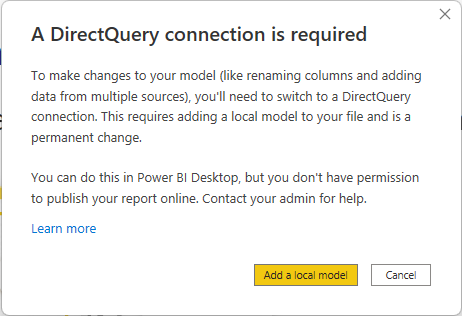
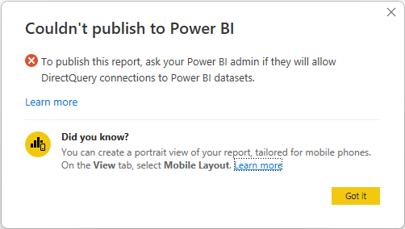
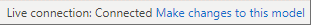
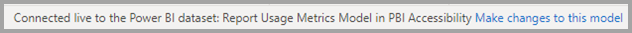
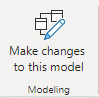
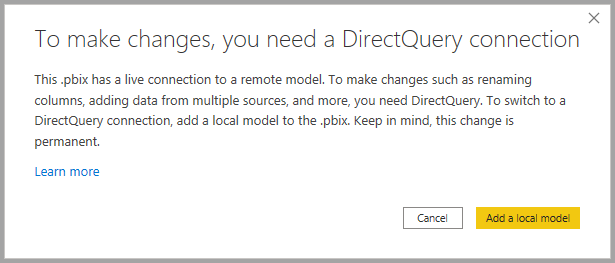
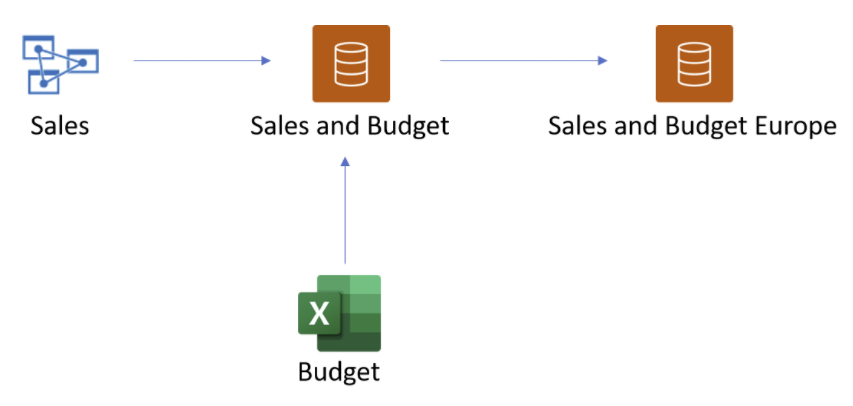
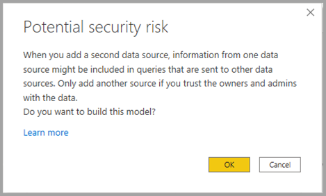

# Use composite models in Power BI Desktop

Previously in Power BI Desktop, when you used a DirectQuery in a report, no other data connections, whether DirectQuery or import, were allowed for that report. With composite models, that restriction is removed. A report can seamlessly include data connections from more than one DirectQuery or import data connection, in any combination you choose.

The composite models capability in Power BI Desktop consists of three related features:

* **Composite models**: Allows a report to have two or more data connections from different source groups. These source groups can be one or more DirectQuery connections and an import connection, two or more DirectQuery connections, or any combination thereof. This article describes composite models in detail.

* **Many-to-many relationships**: With composite models, you can establish *many-to-many relationships* between tables. This approach removes requirements for unique values in tables. It also removes previous workarounds, such as introducing new tables only to establish relationships. For more information, see [Apply many-many relationships in Power BI Desktop](desktop-many-to-many-relationships.md).

* **Storage mode**: You can now specify which visuals query back-end data sources. This feature helps improve performance and reduce back-end load. Previously, even simple visuals, such as slicers, initiated queries to back-end sources. For more information, see [Manage storage mode in Power BI Desktop](desktop-storage-mode.md).

## Use composite models

With composite models, you can connect to different kinds of data sources when you use Power BI Desktop or the Power BI service. You can make those data connections in a couple of ways:

* By importing data to Power BI, which is the most common way to get data.
* By connecting directly to data in its original source repository by using DirectQuery. To learn more about DirectQuery, see [DirectQuery in Power BI](../connect-data/desktop-directquery-about.md).

When you use DirectQuery, composite models make it possible to create a Power BI model, such as a single *.pbix* Power BI Desktop file that does either or both of the following actions:

* Combines data from one or more DirectQuery sources.
* Combines data from DirectQuery sources and import data.

For example, by using composite models, you can build a model that combines the following types of data:

* Sales data from an enterprise data warehouse.
* Sales-target data from a departmental SQL Server database.
* Data imported from a spreadsheet.

A model that combines data from more than one DirectQuery source or that combines DirectQuery with import data is called a composite model.

You can create relationships between tables as you always have, even when those tables come from different sources. Any relationships that are cross-source are created with a cardinality of many-to-many, regardless of their actual cardinality. You can change them to one-to-many, many-to-one, or one-to-one. Whichever cardinality you set, cross-source relationships have different behavior. You can't use Data Analysis Expressions (DAX) functions to retrieve values on the `one` side from the `many` side. You might also see a performance impact versus many-to-many relationships within the same source.

> [!NOTE]
> Within the context of composite models, all imported tables are effectively a single source, regardless of the actual underlying data sources.

## Example of a composite model

For an example of a composite model, consider a report that connects to a corporate data warehouse in SQL Server by using DirectQuery. In this instance, the data warehouse contains **Sales by Country**, **Quarter**, and **Bike (Product)** data, as shown in the following image:

:::image type="content" source="media/desktop-composite-models/composite-models_04.png" alt-text="Screenshot of an example with composite models in Relationship view.":::

At this point, you could build simple visuals by using fields from this source. The following image shows total sales by *ProductName*, for a selected quarter.

:::image type="content" source="media/desktop-composite-models/composite-models_05.png" alt-text="Screenshot of a visual based on data from the previous example.":::

But what if you have data in an Excel spreadsheet about the product manager assigned to each product, along with the marketing priority? If you want to view **Sales Amount** by **Product Manager**, it might not be possible to add this local data to the corporate data warehouse. Or it might take months at best.

It might be possible to import that sales data from the data warehouse, instead of using DirectQuery. And the sales data could then be combined with the data that you imported from the spreadsheet. However, that approach is unreasonable, for the reasons that led to using DirectQuery in the first place. The reasons could include:

* Some combination of the security rules enforced in the underlying source.
* The need to be able to view the latest data.
* The sheer scale of the data.

Here's where composite models come in. Composite models let you connect to the data warehouse by using DirectQuery and then use **Get data** for more sources. In this example, we first establish the DirectQuery connection to the corporate data warehouse. We use **Get data**, choose **Excel**, and then navigate to the spreadsheet that contains our local data. Finally, we import the spreadsheet that contains the *Product Names*, the assigned **Sales Manager**, and the **Priority**.  

:::image type="content" source="media/desktop-composite-models/composite-models_06.png" alt-text="Screenshot of the navigator window after selecting an excel file as a source.":::

In the **Fields** list, you can see two tables: the original **Bike** table from SQL Server and a new **ProductManagers** table. The new table contains the data imported from Excel.

:::image type="content" source="media/desktop-composite-models/composite-models_07.png" alt-text="Screenshot of the Fields pane with the Bike and ProductManagers fields selected.":::

Similarly, in the **Relationship** view in Power BI Desktop, we now see another table called **ProductManagers**.

:::image type="content" source="media/desktop-composite-models/composite-models_08.png" alt-text="Screenshot of the tables in Relationship view.":::

We now need to relate these tables to the other tables in the model. As always, we create a relationship between the **Bike** table from SQL Server and the imported **ProductManagers** table. That is, the relationship is between **Bike[ProductName]** and **ProductManagers[ProductName]**. As discussed earlier, all relationships that go across source default to many-to-many cardinality.

:::image type="content" source="media/desktop-composite-models/composite-models_09.png" alt-text="Screenshot of the Create relationship window.":::

Now that we've established this relationship, it's displayed in the **Relationship** view in Power BI Desktop, as we would expect.

:::image type="content" source="media/desktop-composite-models/composite-models_10.png" alt-text="Screenshot of the Create relationship window after new relationships are created.":::

We can now create visuals by using any of the fields in the **Fields** list. This approach seamlessly blends data from multiple sources. For example, the total *SalesAmount* for each *Product Manager* is displayed in the following image:

:::image type="content" source="media/desktop-composite-models/composite-models_11.png" alt-text="Screenshot of the Fields pane with SalesAmount highlighted and the visual shown.":::

The following example displays a common case of a *dimension* table, such as **Product** or **Customer**, that's extended with some extra data imported from somewhere else. It's also possible to have tables use DirectQuery to connect to various sources. To continue with our example, imagine that **Sales Targets** per **Country** and **Period** are stored in a separate departmental database. As usual, you can use **Get data** to connect to that data, as shown in the following image:

:::image type="content" source="media/desktop-composite-models/composite-models_12.png" alt-text=" Screenshot of the Navigator window with sales targets selected.":::

As we did earlier, we can create relationships between the new table and other tables in the model. Then we can create visuals that combine the table data. Let's look again at the **Relationships** view, where we've established the new relationships:

:::image type="content" source="media/desktop-composite-models/composite-models_13.png" alt-text="Screenshot of the Relationship view with many tables.":::

The next image is based on the new data and relationships we created. The visual at the lower left shows total *Sales Amount* versus *Target*, and the variance calculation shows the difference. The **Sales Amount** and **Target** data come from two different SQL Server databases.

:::image type="content" source="media/desktop-composite-models/composite-models_14.png" alt-text="Screenshot of the Report view with more data.":::

## Set the storage mode

Each table in a composite model has a storage mode that indicates whether the table is based on DirectQuery or import. The storage mode can be viewed and modified in the **Property** pane. To display the storage mode, right-click a table in the **Fields** list, and then select **Properties**. The following image shows the storage mode for the **SalesTargets** table.

The storage mode can also be viewed on the tooltip for each table.

:::image type="content" source="media/desktop-composite-models/composite-models_16.png" alt-text="Screenshot of a tooltip displaying the storage mode.":::

For any Power BI Desktop file (a *.pbix* file) that contains some tables from DirectQuery and some import tables, the status bar displays a storage mode called **Mixed**. You can select that term in the status bar and easily switch all tables to import.

For more information about storage mode, see [Manage storage mode in Power BI Desktop](desktop-storage-mode.md).  

> [!NOTE]
> You can use *Mixed* storage mode in Power BI Desktop and in the Power BI service.

## Calculated tables

You can add calculated tables to a model in Power BI Desktop that uses DirectQuery. The Data Analysis Expressions (DAX) that define the calculated table can reference either imported or DirectQuery tables or a combination of the two.

Calculated tables are always imported, and their data is refreshed when you refresh the tables. If a calculated table refers to a DirectQuery table, visuals that refer to the DirectQuery table always show the latest values in the underlying source. Alternatively, visuals that refer to the calculated table show the values at the time when the calculated table was last refreshed.

> [!IMPORTANT]
> Calculated tables aren't supported in the Power BI service using this feature unless you meet specific requirements. For more information about this, see the [Working with a composite model based on a semantic model](#working-with-a-composite-model-based-on-a-semantic-model) section in this article. 

## Security implications

Composite models have some security implications. A query sent to one data source can include data values that have been retrieved from another source. In the earlier example, the visual that shows **(Sales Amount)** by **Product Manager** sends an SQL query to the Sales relational database. That SQL query might contain the names of Product Managers and their associated Products.

:::image type="content" source="media/desktop-composite-models/composite-models_17.png" alt-text="Screenshot of a script showing security implications.":::

So, information stored in the spreadsheet is now included in a query sent to the relational database. If this information is confidential, you should consider the security implications. In particular, consider the following points:

* Any administrator of the database who can view traces or audit logs could view this information, even without permissions to the data in its original source. In this example, the administrator would need permissions to the Excel file.

* The encryption settings for each source should be considered. You want to avoid retrieving information from one source by an encrypted connection and then inadvertently including it in a query sent to another source by an unencrypted connection.

To allow confirmation that you've considered any security implications, Power BI Desktop displays a warning message when you create a composite model.  

Additionally, if an author adds *Table1* from *Model A* to a Composite Model (let's call it *Model C* for reference), then a user viewing a report built on *Model C* could query **any table** in *Model A* that isn't protected by row-level security RLS.

For similar reasons, be careful when you open a Power BI Desktop file sent from an untrusted source. If the file contains composite models, information that someone retrieves from one source, by using the credentials of the user who opens the file, would be sent to another data source as part of the query. The information could be viewed by the malicious author of the Power BI Desktop file. When you initially open a Power BI Desktop file that contains multiple sources, Power BI Desktop displays a warning. The warning is similar to the one displayed when you open a file that contains native SQL queries.  

## Performance implications  

When you use DirectQuery, you should always consider performance, primarily to ensure that the back-end source has sufficient resources to provide a good experience for users. A good experience means that the visuals refresh in five seconds or less. For more performance advice, see [DirectQuery in Power BI](../connect-data/desktop-directquery-about.md).

Using composite models adds other performance considerations. A single visual can result in sending queries to multiple sources, which often pass the results from one query across to a second source. This situation can result in the following forms of execution:

* **A source query that includes a large number of literal values**: For example, a visual that requests total **Sales Amount** for a set of selected **Product Managers** would first need to find which **Products** were managed by those product managers. This sequence must happen before the visual sends an SQL query that includes all of the product IDs in a `WHERE` clause.

* **A source query that queries at a lower level of granularity, with the data later being aggregated locally**: As the number of **Products** that meet the filter criteria on **Product Manager** grows large, it can become inefficient or unfeasible to include all products in a `WHERE` clause. Instead, you can query the relational source at the lower level of **Products** and then aggregate the results locally. If the cardinality of **Products** exceeds a limit of 1 million, the query fails.

* **Multiple source queries, one per group by value**: When the aggregation uses **DistinctCount** and is grouped by a column from another source, and if the external source doesn't support efficient passing of many literal values that define the grouping, it's necessary to send one SQL query per group by value.

   A visual that requests a distinct count of **CustomerAccountNumber** from the SQL Server table by **Product Managers** imported from the spreadsheet would need to pass in the details from the **Product Managers** table in the query sent to SQL Server. Over other sources, Redshift, for example, this action is unfeasible. Instead, there would be one SQL query sent per **Sales Manager**, up to some practical limit, at which point the query would fail.

Each of these cases has its own implications on performance, and the exact details vary for each data source. Although the cardinality of the columns used in the relationship that joins the two sources remains low, a few thousand, performance shouldn't be affected. As this cardinality grows, you should pay more attention to the impact on the resulting performance.

Additionally, the use of many-to-many relationships means that separate queries must be sent to the underlying source for each total or subtotal level, rather than aggregating the detailed values locally. A simple table visual with totals would send two source queries, rather than one.

## Source groups

A source group is a collection of items, such as tables and relationships, from a DirectQuery source or all import sources involved in a data model. A composite model is made of one or more source groups. Consider the following examples:

* A composite model that connects to a Power BI semantic model called **Sales** and enriches the semantic model by adding a **Sales YTD** measure, which isn't available in the original semantic model. This model consists of one source group.
* A composite model that combines data by importing a table from an Excel sheet called **Targets** and a CSV file called **Regions**, and making a DirectQuery connection to a Power BI semantic model called **Sales**. In this case, there are two source groups as shown in the following image:
  * The first source group contains the tables from the **Targets** Excel sheet, and the **Regions** CSV file.
  * The second source group contains the items from the **Sales** Power BI semantic model.

:::image type="content" source="media/desktop-composite-models/composite-models-source-groups.png" alt-text="Diagram showing the Import and Sales source groups containing the tables from the respective sources.":::

If you added another DirectQuery connection to another source, such as a DirectQuery connection to a SQL Server database called **Inventory**, the items from that source are added another source group:

:::image type="content" source="media/desktop-composite-models/composite-models-source-groups-2.png" alt-text="Diagram showing the Import, Sales, and Inventory source groups containing the tables from the respective sources.":::

> [!NOTE]
> Importing data from another source will **not** add another source group, because all items from all imported sources are in one source group.

### Source groups and relationships

There are two types of relationships in a composite model:

* **Intra source group relationships.** These relationships relate items within a source group together. These relationships are always regular relationships unless they're many-to-many, in which case they're limited.
* **Cross source group relationships.** These relationships start in one source group and end in a different source group. These relationships are always limited relationships.

[Read more about the distinction between regular and limited relationships and their impact.](desktop-relationships-understand.md#relationship-evaluation)

For example, in the following image we added three cross source group relationships, relating tables across the various source groups together:

:::image type="content" source="media/desktop-composite-models/composite-models-source-groups-3.png" alt-text="Diagram showing the Import, Sales, and Inventory source groups containing the tables from the respective sources and relationships between the source groups as described previously.":::

### Local and remote

Any item that is in a source group that is a DirectQuery source group is considered **remote**, unless the item was defined locally as part of an extension or enrichment to the DirectQuery source and isn't part of the remote source, such as a measure or a calculated table. A calculated table based on a table from the DirectQuery source group belongs to the "Import" source group and is considered **local**.
Any item that is in the "Import" source group is considered local.
For example, if you define the following measure in a composite model that uses a DirectQuery connection to the Inventory source, the measure is considered local:

```dax
[Average Inventory Count] = Average(Inventory[Inventory Count])
```

### Calculation groups, query, and measure evaluation

[Calculation groups](/analysis-services/tabular-models/calculation-groups) provide a way to reduce the number of redundant measures and grouping common measure expressions together. Typical use cases are time-intelligence calculations where you want to be able to switch from actuals to month-to-date, quarter-to-date, or year-to-date calculations.
When working with composite models, it's important to be aware of the interaction between calculation groups and whether a measure only refers to items from a single remote source group. If a measure only refers to items from a single remote source group and the remote model defines a calculation group that impacts the measure, that calculation group is applied, even if the measure was defined in the remote model or in the local model.
However, if a measure doesn't refer to items from a single remote source group exclusively but refers to items from a remote source group on which a remote calculation group is applied, the results of the measure might still be impacted by the remote calculation group. Consider the following example:

* Reseller Sales is a measure defined in the remote model.
* The remote model contains a calculation group that changes the result of Reseller Sales
* Internet Sales is a measure defined in the local model.
* Total Sales is a measure defined in the local model, and has the following definition:

```dax
[Total Sales] = [Internet Sales] + [Reseller Sales]
```

In this scenario, the **Internet Sales measure** isn't impacted by the calculation group defined in the remote model because they aren't part of the same model. However, the calculation group can change the result of the **Reseller Sales** measure, because they are in the same model. This fact means that the results returned by the **Total Sales** measure must be evaluated carefully. Imagine we use the calculation group in the remote model to return year-to-date results. The result returned by **Reseller Sales** is now a year-to-date value, while the result returned by **Internet Sales** is still an actual. The result of **Total Sales** is now likely unexpected, as it adds an actual to a year-to-date result.

## Composite models on Power BI semantic models and Analysis Services

Using composite models with Power BI semantic models and Analysis Services, you can build a composite model using a DirectQuery connection to connect to Power BI semantic models, Azure Analysis Services (AAS), and SQL Server 2022 Analysis Services. Using a composite model, you can combine the data in these sources with other DirectQuery and imported data. Report authors who want to combine the data from their enterprise semantic model with other data they own, such as an Excel spreadsheet, or want to personalize or enrich the metadata from their enterprise semantic model, will find this functionality especially useful. 

### Managing composite models on Power BI semantic models

To enable the creation and consumption of composite models on Power BI semantic models, your tenant needs to have the following switches enabled:

- [Allow XMLA Endpoints and Analyze in Excel with on-premises semantic models](/fabric/admin/service-admin-portal-integration#allow-xmla-endpoints-and-analyze-in-excel-with-on-premises-datasets). If this switch is disabled a DirectQuery connection to a Power BI semantic model can't be made.
- [Users can work with Power BI semantic models in Excel using a live connection](/fabric/admin/service-admin-portal-export-sharing#users-can-work-with-power-bi-datasets-in-excel-using-a-live-connection). If this switch is disabled, users can't make live connections to Power BI semantic models so the **Make changes to this model** button can't be reached.
- [Allow DirectQuery connection to Power BI semantic models](/fabric/admin/service-admin-portal-export-sharing#allow-directquery-connections-to-power-bi-datasets). See the following paragraphs for more information on this switch and the effect of disabling it.

Additionally, for Premium capacities and Premium Per User the ["XMLA endpoint" setting should be enabled and set to to either "Read Only" or "Read/Write"](../enterprise/service-premium-connect-tools.md#enable-xmla-read-write).

Tenant administrators can enable or disable DirectQuery connections to Power BI semantic models in the admin portal. While this is enabled by default, disabling it stops users from publishing new composite models on Power BI semantic models to the service.

:::image type="content" source="media/desktop-composite-models/directquery-connections-datasets-admin-setting.png" alt-text="Admin setting to enable or disable DirectQuery connections to Power BI semantic models.":::

Existing reports that use a composite model on a Power BI semantic model continue to work and users can still create the composite model in using Desktop but can't publish to the service. Instead, when you create a DirectQuery connection to the Power BI semantic model by selecting **Make changes to this model** you'll see the following warning message:



This way you can still explore the semantic model in your local Power BI Desktop environment and create the composite model. However, you aren't able to publish the report to the Service. When you publish the report and model, you'll see the following error message and publication is blocked:



Live connections to Power BI semantic models aren't influenced by the switch, nor are live or DirectQuery connections to Analysis Services. These continue to work regardless of if the switch has been turned off. Also, any published reports that use a composite model on a Power BI semantic model will continue to work even if the switch has been turned off after they were published.


### Building a composite model on a semantic model or model

Building a composite model on a Power BI semantic model or Analysis Services model requires your report to have a local model. You can start from a live connection and add or upgrade to a local model, or start with a DirectQuery connection or imported data, which automatically creates a local model in your report.

To see which connections are being used in your model, check the status bar in the bottom right corner of Power BI Desktop. If you're only connected to an Analysis Services source, you see a message like the following image:



If you're connected to a Power BI semantic model, you see a message telling you which Power BI semantic model you're connected to:



If you want to customize the metadata of fields in your live connected semantic model, select **Make changes to this model** in the status bar. Alternatively, you can select the **Make changes to this model** button in the ribbon, as shown in the following image. In **Report View** the **Make changes to this model** button in the **Modeling** tab. In Model View, the button is in the **Home** tab.



Selecting the button displays a dialog confirming addition of a local model. Select **Add a local model** to enable creating new columns or modifying the metadata, for fields from Power BI semantic models or Analysis Services. The following image shows the dialog shown. 



When you're connected live to an Analysis Services source, there's no local model. To use DirectQuery for live connected sources, such as Power BI semantic models and Analysis Services, you must add a local model to your report. When you publish a report with a local model to the Power BI service, a semantic model for that local model is published a well.

### Chaining

Semantic models and the semantic models on which they're based form a *chain*. This process, called *chaining*, lets you publish a report and semantic model based on other Power BI semantic models, a feature that previously wasn't possible.

For example, imagine your colleague publishes a Power BI semantic model called *Sales and Budget* based on an Analysis Services model called *Sales*, and combines it with an Excel sheet called *Budget*.

When you publish a new report (and semantic model) called *Sales and Budget Europe* based on the *Sales and Budget* Power BI semantic model published by your colleague, making some further modifications or extensions as you do so, you're effectively adding a report and semantic model to a chain of length three, which started with the *Sales* Analysis Services model, and ends with your *Sales and Budget Europe* Power BI semantic model. The following image visualizes this chaining process.



The chain in the previous image is of length three, which is the maximum length. Extending beyond a chain length of three isn't supported and results in errors.

### Permissions and licensing

Users accessing reports using a composite model need to have proper permissions to [all semantic models and models in the chain](#chaining).

The owner of the composite model requires **Build** permission on the semantic models used as sources so that other users can access those models on behalf of the owner. As a result, creating the composite model connection in Power BI Desktop or authoring the report in Power BI require **Build** permissions on the semantic models used as sources.

Users who view reports using the composite model will generally require **Read** permissions on the composite model itself and the semantic models used as sources. **Build** permissions might be required if the reports are in a Pro workspace. [These tenant switches](#managing-composite-models-on-power-bi-semantic-models) should be enabled for the user.

The required permissions can be illustrated with the following example:

* **Composite Model A** (owned by **Owner A**)
  - Data source A1: **Semantic Model B**.<br/>**Owner A** must have **Build** permission on **Semantic Model B** for users to view the report using **Composite Model A**.

* **Composite Model C** (owned by **Owner C**)
  - Data source C1: **Semantic Model D**<br/>**Owner C** must have **Build** permission on **Semantic Model D** for users to view the report using **Composite Model C**.
  - Data source C2: **Composite Model A**<br/>**Owner C** must have **Build** permission on **Composite Model A** and **Read** permission on **Semantic Model B**.

A user viewing reports using **Composite Model A** must have **Read** permissions to both **Composite Model A** and **Semantic Model B**, while a user viewing reports using **Composite Model C** must have **Read** permissions on **Composite Model C**, **Semantic Model D**, **Composite Model A** and **Semantic Model B**.

> [!NOTE]
> Refer to this blogpost for important information about [permissions required for composite models on Power BI semantic models and Analysis Services models](https://powerbi.microsoft.com/blog/announcing-general-availability-for-composite-models-on-power-bi-datasets-and-analysis-services-models/).

If any dataset in the chain is in a Premium Per User workspace, the user accessing it needs a [Premium Per User license](../fundamentals/service-features-license-type.md#premium-per-user-ppu-license). If any dataset in the chain is in a Pro workspace, the user accessing it needs a [Pro license](../fundamentals/service-features-license-type.md#pro-license). If all the datasets in the chain are on [Premium capacities](../fundamentals/service-features-license-type.md#premium-capacity) or [Fabric F64 or greater capacity](/fabric/enterprise/licenses#capacity-and-skus), a user can access it using a [Free license](../fundamentals/service-features-license-type.md#free-per-user-license).

### Security warning

Using the **Composite models on Power BI semantic models and Analysis Services models** feature presents you with a security warning dialog, shown in the following image.



Data may be pushed from one data source to another, which is the same security warning for combining DirectQuery and import sources in a data model. To learn more about this behavior, see [using composite models in Power BI Desktop](../transform-model/desktop-composite-models.md).

### Supported scenarios

You can build composite models using data from Power BI semantic models or Analysis Services models to service the following scenarios: 

- Connecting to data from various sources: Import (such as files), Power BI semantic models, Analysis Services models
- Creating relationships between different data sources
- Writing measures that use fields from different data sources
- Creating new columns for tables from Power BI semantic models or Analysis Services models
- Creating visuals that use columns from different data sources
- You can remove a table from your model using the field list, to keep models as concise, and lean as possible (if you connect to a perspective, you can't remove tables from the model) 
- You can specify which tables to load, rather than having to load all tables when you only want a specific subset of tables. See Loading a subset of tables later in this document. 
- You can specify whether to add any tables that are later added to the semantic model after you make the connection in your model. 

### Working with a composite model based on a semantic model

When working with DirectQuery for Power BI semantic models and Analysis Services, consider the following information: 

* If you refresh your data sources, and there are errors with conflicting field or table names, Power BI resolves the errors for you. 
* You can't edit, delete, or create new relationships in the same Power BI semantic model or Analysis Services source. If you have edit access to these sources, you can make the changes directly in the data source instead. 
* You can't change data types of columns that are loaded from a Power BI semantic model or Analysis Services source. If you need to change the data type, either change it in the source or use a calculated column. 
* To build reports in the Power BI service on a composite model based on another semantic model, all credentials must be set.  
* Connections to a SQL Server 2022 and later Analysis Services server on-premises or IAAS require an On-premises data gateway (Standard mode). 
* All connections to remote Power BI semantic models are made using single sign-on. Authenticating with a service principal isn't currently supported. 
* RLS rules are applied on the source on which they're defined, but aren't applied to any other semantic models in the model. RLS defined in the report aren't applied to remote sources, and RLS set on remote sources aren't applied to other data sources. Also, you can't define RLS on a table loaded from a remote source, and RLS defined on local tables do not filter any tables loaded from a remote source. 
* KPIs, row level security, and translations aren't imported from the source. 
* You might see some unexpected behavior when using a date hierarchy. To resolve this issue, use a date column instead. After adding a date hierarchy to a visual, you can switch to a date column by clicking on the down arrow in the field name, and then clicking on the name of that field instead of using Date Hierarchy: 

    :::image type="content" source="media/desktop-composite-models/directquery-composite-models-01.png" alt-text="Screen shot of date hierarchy setting.":::

    For more information on using date columns versus date hierarchies, see [apply auto date or time in Power BI Desktop](desktop-auto-date-time.md).

* The maximum length of a chain of models is three. Extending beyond the chain length of three isn't supported and results in errors.
* A discourage chaining flag can be set on a model to prevent a chain from being created or extended. For more information, see [Manage DirectQuery connections to a published semantic model](../connect-data/desktop-discourage-directquery-connections-to-dataset.md).
* The connection to a Power BI semantic model or Analysis Services model isn't shown in Power Query.

The following **limitations** apply when working with DirectQuery for Power BI semantic models and Analysis Services:

* Parameters for database and server names are currently disabled.
* Defining RLS on tables from a remote source isn't supported.
* Using any of the following sources as a DirectQuery source isn't supported:
    * SQL Server Analysis Services (SSAS) Tabular models before version 2022
    * SSAS Multidimensional models
    * SAP HANA
    * SAP Business Warehouse
    * Real-time semantic models
    * Sample semantic models
    * Excel Online Refresh
    * Data imported from Excel or CSV files on the Service
    * Usage metrics
    * Semantic models stored in “My workspace”
* Using Power BI Embedded with semantic models that include a DirectQuery connection to an Analysis Services model isn't currently supported.
* Publishing a report to web using the publish to web feature isn't supported.
* Calculation groups on remote sources aren't supported, with undefined query results.
- Calculated tables and calculated columns that reference a DirectQuery table from a data source with single sign-on (SSO) authentication are supported in the Power BI service with an assigned [shareable cloud connection](../connect-data/service-create-share-cloud-data-sources.md) and / or [granular access control](../connect-data/service-create-share-cloud-data-sources.md#granular-access-control).
* If you rename a workspace after the DirectQuery connection has been set up you need to update the data source in Power BI Desktop for the report to continue working.
* Automatic page refresh (APR) is only supported for some scenarios, depending on the data source type. For more information, see [Automatic page refresh in Power BI](../create-reports/desktop-automatic-page-refresh.md).
* Take over of a semantic model that is using the **DirectQuery to other semantic models** feature isn't currently supported.
* As with any DirectQuery data source, hierarchies defined in an Analysis Services model or Power BI semantic model aren't shown when connecting to the model or semantic model in DirectQuery mode using Excel.

There are a few other things to **consider** when working with DirectQuery for Power BI semantic models and Analysis Services:

* **Use low-cardinality columns in cross source group relationships:** When you create a relationship across two different source groups, the columns participating in the relationship (also called the join columns) should have low cardinality, ideally 50,000 or less. This consideration applies to nonstring key columns; for string key columns, see the following consideration.
* **Avoid using large strings key columns in cross source group relationships:** When creating a cross source group relationship, avoid using large string columns as the relationship columns, especially for columns that have larger cardinality. When you must use strings columns as the relationship column, calculate the expected string length for the filter by multiplying cardinality (C) by the average length of the string column (A). Make sure the expected string length is below 250,000, such that *A ∗ C < 250,000*.

For more considerations and guidance, refer to [composite model guidance](../guidance/composite-model-guidance.md).

### Tenant considerations

Any model with a DirectQuery connection to a Power BI semantic model or to Analysis Services must be published in the same tenant, which is especially important when accessing a Power BI semantic model or an Analysis Services model using B2B guest identities, as depicted in the following diagram. See Guest users who can edit and manage content to find the tenant URL for publishing.

Consider the following diagram. The numbered steps in the diagram are described in paragraphs that follow.

:::image type="content" source="media/desktop-composite-models/directquery-composite-models-02.png" alt-text="Diagram of numbered steps for tenant considerations.":::

In the diagram, Ash works with Contoso and is accessing data provided by Fabrikam. With Power BI Desktop, Ash creates a DirectQuery connection to an Analysis Services model that is hosted in Fabrikam’s tenant.

To authenticate, Ash uses a B2B Guest user identity (step 1 in the diagram).

If the report is published to Contoso’s Power BI service (step 2), the semantic model published in the Contoso tenant can't successfully authenticate against Fabrikam’s Analysis Services model (step 3). As a result, the report doesn't work.

In this scenario, since the Analysis Services model used is hosted in Fabrikam’s tenant, the report also must be published in Fabrikam's tenant. After successful publication in Fabrikam’s tenant (step 4), the semantic model can successfully access the Analysis Services model (step 5) and the report works properly.

### Working with object-level security
When a composite model gets data from a Power BI semantic model or Analysis Services via DirectQuery, and that source model is secured by object-level security, consumers of the composite model might notice unexpected results. The following section explains how these results might come about.

Object-level security (OLS) enables model authors to hide objects that make up the model schema (that is, tables, columns, metadata, etc.) from model consumers (for example, a report builder or a composite model author). In configuring OLS for an object, the model author creates a role, and then removes access to the object for users who are assigned to that role. From the standpoint of those users, the hidden object simply doesn't exist.

OLS is defined for and applied on the source model. It can't be defined for a composite model built on the source model.

When a composite model is built on top of an OLS-protected Power BI semantic model or Analysis Services model via DirectQuery connection, the model schema from the source model is copied over into the composite model. What gets copied depends on what the composite model author is permitted see in the source model according to the OLS rules that apply there. The data isn't copied over to the composite model – rather, it's always retrieved via DirectQuery from the source model when needed. In other words, data retrieval always gets back to the source model, where OLS rules apply.

Since the composite model isn't secured by OLS rules, the objects that consumers of the composite model see are those that the composite model author could see in the source model rather than what they themselves might have access to. This might result in the following situations:

* Someone looking at the composite model might see objects that are hidden from them in the source model by OLS.
* Conversely, they might NOT see an object in the composite model that they CAN see in the source model, because that object was hidden from the composite model author by the OLS rules controlling access to the source model.

An important point is that in spite of the case described in the first bullet, consumers of the composite model never see actual data they aren't supposed to see, because the data isn't located in the composite model. Rather, because of DirectQuery, it's retrieved as needed from the source semantic model, where OLS blocks unauthorized access.

With this background in mind, consider the following scenario:

:::image type="content" source="media/desktop-composite-models/directquery-composite-models-03.png" alt-text="Diagram showing what happens when a composite model connects to a source model protected by object-level security.":::

1. Admin_user published an enterprise semantic model using a Power BI semantic model or an Analysis Services model that has a Customer table and a Territory table. Admin_user publishes the semantic model to the Power BI service and sets OLS rules that have the following effect:
    * Finance users can't see the Customer table
    * Marketing users can't see the Territory table

1. Finance_user publishes a semantic model called "Finance semantic model" and a report called "Finance report" that connects via DirectQuery to the enterprise semantic model published in step 1. The Finance report includes a visual that uses a column from the Territory table.

1. Marketing_user opens the Finance report. The visual that uses the Territory table is displayed, but returns an error, because when the report is opened, DirectQuery tries to retrieve the data from the source model using the credentials of the Marketing_user, who is blocked from seeing the Territory table as per the OLS rules set on the enterprise semantic model.

1. Marketing_user creates a new report called "Marketing Report" that uses the Finance semantic model as its source. The field list shows the tables and columns that Finance_user has access to. Hence, the Territory table is shown in the fields list, but the Customer table isn't. However, when the Marketing_user tries to create a visual that uses a column from the Territory table, an error is returned, because at that point DirectQuery tries to retrieve data from the source model using Marketing_user's credentials, and OLS rules once again kick in and block access. The same thing happens when Marketing_user creates a new semantic model and report that connect to the Finance semantic model with a DirectQuery connection – they see the Territory table in the fields list, since that is what Finance_user could see, but when they try to create a visual that uses that table, they are blocked by the OLS rules on the enterprise semantic model.

1. Now let's say that Admin_user updates the OLS rules on the enterprise semantic model to stop Finance from seeing the Territory table.

1. The updated OLS rules are only reflected in the Finance semantic model when it's refreshed. Thus, when the Finance_user refreshes the Finance semantic model, the Territory table is no longer shown in the fields list, and the visual in the Finance report that uses a column from the Territory table returns an error for Finance_user, because they're now not allowed to access the Territory table.

To summarize:

* Consumers of a composite model see the results of the OLS rules that were applicable to the author of the composite model when they created the model. Thus, when a new report is created based on the composite model, the field list shows the tables that the author of the composite model had access to when they created the model, regardless of what the current user has access to in the source model.
* OLS rules can't be defined on the composite model itself.
* A consumer of a composite model will never see actual data they aren't supposed to see, because relevant OLS rules on the source model block them when DirectQuery tries to retrieve the data using their credentials.
* If the source model updates its OLS rules, those changes only affect the composite model when it's refreshed.  

### Loading a subset of tables from a Power BI semantic model or Analysis Services model
When connecting to a Power BI semantic model or Analysis Services model using a DirectQuery connection, you can decide which tables to connect to. You can also choose to automatically add any table that might get added to the semantic model or model after you make the connection to your model. When you connect to a perspective, your model contains all tables in the semantic model and any tables not included in the perspective are hidden. Moreover, any table that might get added to the perspective is added automatically. In the **Settings** menu, you can decide to automatically connect to tables that are added to the semantic model after you first set up the connection.

This dialog isn't shown for live connections.

>[!NOTE]
>This dialog will only show if you add a DirectQuery connection to a Power BI semantic model or Analysis Services model to an existing model. You can also open this dialog by changing the DirectQuery connection to the Power BI semantic model or Analysis Services model in the Data source settings after you created it.

:::image type="content" source="media/desktop-composite-models/directquery-datasets-subset.png" alt-text="Dialog that allows specifying what tables to load from a Power BI semantic model or Analysis Services model.":::

### Setting up deduplication rules
You can specify deduplication rules to keep measure and table names unique in a composite model by using the **Settings** option in the dialog shown previously:

:::image type="content" source="media/desktop-composite-models/directquery-datasets-deduplication-rules.png" alt-text="Dialog that allows specifying deduplication rules to apply when loading from a semantic model.":::

In the previous example, we added ' (marketing)' as a suffix to any table or measure name that is in conflict with another source in the composite model. You can: 
- enter a text to be added to the name of conflicting tables or measures
- specify whether you want the text to be added to the table or measure name as a prefix or a suffix 
- apply the deduplication rule to tables, measures or both 
- Choose to apply the deduplication rule only when a name conflict occurs or apply it all the time. The default is to apply the rule only when duplication occurs. In our example, any table or measure from the marketing source that doesn't have a duplicate in the sales source won't get a name change. 

After you make the connections and set up the deduplication rule, your field list will show both 'Customer' and 'Customer (marketing)' according to the deduplication rule set up in our example:

:::image type="content" source="media/desktop-composite-models/directquery-datasets-name-deduplication-rules-effect.png" alt-text="Dialog that allows specifying deduplication rules to apply when loading from a Power BI semantic model or Analysis Services model.":::


If you don't specify a deduplication rule, or the deduplication rules you specified don't resolve the name conflict, the standard deduplication rules  are still applied. The standard deduplication rules add a number to the name of the conflicting item. If there is a name conflict on the 'Customer' table one of the 'Customer' tables is renamed 'Customer 2'.


## XMLA modifications and composite models

When changing a semantic model using XMLA, you must update the *ChangedProperties* and *PBI_RemovedChildren* collection for the changed object to include any modified or removed properties. If you don't perform that update, Power BI modeling tools might overwrite any changes the next time the schema is synchronized with its associated Lakehouse.

The supported models for changing a semantic model using XMLA are the following:

* Table/Column rename (*ChangeProperty* = name)
* Remove table (add table to *PBI_RemovedChildren* annotation in the query expression)


## Considerations and limitations

Composite models present a few considerations and limitations:

**Mixed-mode connections** - When using a mixed mode connection that contains online data (such as a Power BI semantic model) and an on-premises semantic model (such as an Excel workbook), you must have gateway mapping established for visuals to properly appear.

Currently, [incremental refresh](../connect-data/incremental-refresh-overview.md) is supported for composite models connecting to SQL, Oracle, and Teradata data sources only.

The following Live Connect tabular sources can't be used with composite models:

* SAP HANA
* SAP Business Warehouse
* SQL Server Analysis Services earlier than version 2022
* [Usage metrics (My workspace)](../collaborate-share/service-usage-metrics.md)

Using streaming semantic models in composite models isn't supported.

The existing limitations of DirectQuery still apply when you use composite models. Many of these limitations are now per table, depending upon the storage mode of the table. For example, a calculated column on an import table can refer to other tables that aren't in DirectQuery, but a calculated column on a DirectQuery table can still refer only to columns on the same table. Other limitations apply to the model as a whole, if any of the tables within the model are DirectQuery. For example, the QuickInsights feature isn't available on a model if any of the tables within it has a storage mode of DirectQuery.

If you are using row-level security in a composite model with some of the tables in DirectQuery mode, you must refresh the model to apply new updates from the DirectQuery tables. For example, if a Users table in  DirectQuery mode has new user records at the source, the new records will only be included after the next  model refresh. Power BI Service caches the Users query to improve performance and doesn’t reload the data from the source until the next manual or scheduled refresh.

## Related content

For more information about composite models and DirectQuery, see the following articles:

* [Apply many-to-many relationships in Power BI Desktop](desktop-many-to-many-relationships.md)
* [Manage storage mode in Power BI Desktop](desktop-storage-mode.md)
* [DirectQuery in Power BI](../connect-data/desktop-directquery-about.md)
* [Power BI data sources](../connect-data/power-bi-data-sources.md)
* [Model relationships in Power BI Desktop](desktop-relationships-understand.md)
