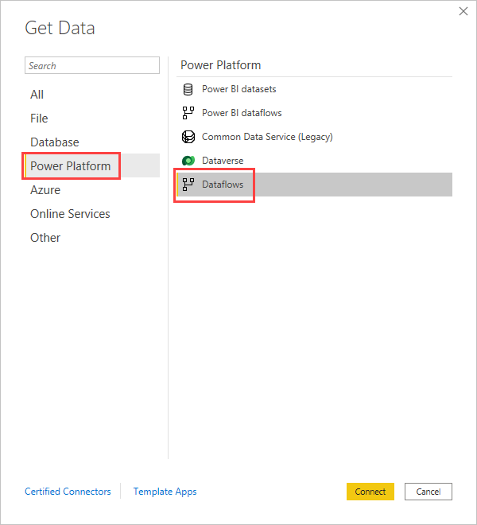

# Connect to data created by Power Platform dataflows in Power BI Desktop
In **Power BI Desktop**, you can connect to data created by Power Platform dataflows just like any other data source in Power BI Desktop. Select **Power Platform** > **Dataflows**.

The Power Platform dataflows connector lets you connect to entities created by dataflows in the Power BI service. 

## Considerations and limitations

To use the Power Platform dataflows connector, you must be running a recent version of **Power BI Desktop**. You can always [download Power BI Desktop](../fundamentals/desktop-get-the-desktop.md) and install it on your computer to ensure you have the most recent version.  

> [!NOTE]
> The previous version of the Power Platform dataflows connector required that you download a .MEZ file and place it in a folder. Current versions of **Power BI Desktop** include the Power Platform dataflows connector, so that file is no longer required and can cause conflicts with the included version of the connector. If you manually placed that .MEZ file into the folder, you *must* delete that downloaded .MEZ file from your **Documents > Power BI Desktop > Custom connectors** folder to avoid conflicts. 

## Desktop performance
**Power BI Desktop** runs locally on the computer on which it is installed. Ingestion performance of dataflows is determined by a variety of factors. Those factors include the size of the data, your computer's CPU and RAM, network bandwidth, distance form the data center, and other factors.

You can improve data ingestion performance for dataflows. For example, if the ingested data size is too large for **Power BI Desktop** to manage on your computer, you can use linked and computed entities in dataflows to aggregate the data (within dataflows) and ingest only the pre-prepared, aggregated data. 

In that manner, the processing of large data is performed online in dataflows, rather than being performed locally in your running instance of **Power BI Desktop**. That approach lets Power BI Desktop ingest smaller amounts of data, and keeps the experience with dataflows responsive and quick.

## Additional considerations

Most dataflows reside in the Power BI service tenant. However, **Power BI Desktop** users cannot access dataflows that are stored in Azure Data Lake Storage Gen2 account, unless they are the owner of the dataflow, or they have been explicitly authorized to the dataflow’s CDM folder. Consider the following situation:

1.	Anna creates a new workspace and configures it to store dataflows in the organization’s data lake.
2.	Ben, who is also a member of the workspace Anna created, wants to use Power BI Desktop and the dataflow connector to get data from the dataflow Anna created.
3.	Ben receives an error caused by not being added as an authorized user to the dataflow’s CDM folder in the data lake.

To resolve this issue, Ben must be granted reader permissions to the CDM Folder and its files. You can learn more about how to grant access to the CDM Folder in [configure and consume a dataflow](dataflows/dataflows-configure-consume.md).

## Next steps
There are all sorts of interesting things you can do with dataflows. For more information, check out the following resources:

* [Introduction to dataflows and self-service data prep](dataflows/dataflows-introduction-self-service.md)
* [Creating a dataflow](dataflows/dataflows-create.md)
* [Configure and consume a dataflow](dataflows/dataflows-configure-consume.md)
* [Configuring Dataflow storage to use Azure Data Lake Gen 2](dataflows/dataflows-azure-data-lake-storage-integration.md)
* [Premium features of dataflows](dataflows/dataflows-premium-features.md)
* [AI with dataflows](dataflows/dataflows-machine-learning-integration.md)

There are also articles about **Power BI Desktop** that you might find useful:

* [Data Sources in Power BI Desktop](../connect-data/desktop-data-sources.md)
* [Shape and Combine Data with Power BI Desktop](../connect-data/desktop-shape-and-combine-data.md)
* [Enter data directly into Power BI Desktop](../connect-data/desktop-enter-data-directly-into-desktop.md)