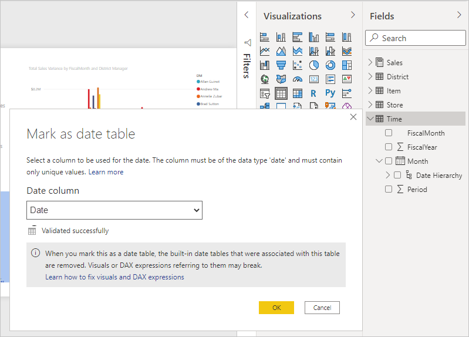
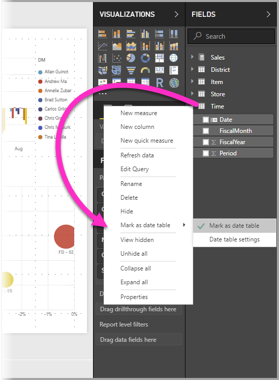
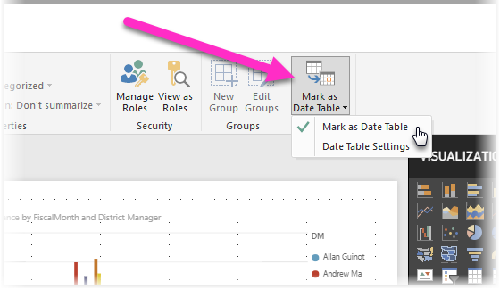
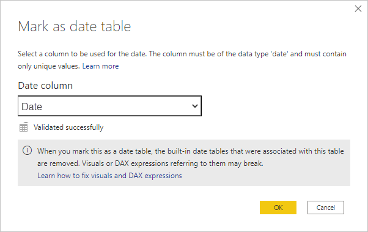
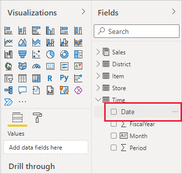
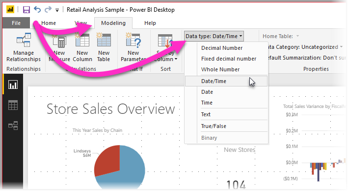

# Set and use date tables in Power BI Desktop

**Power BI Desktop** works behind the scenes to automatically identify columns that represent dates, and then creates date hierarchies and other enabling metadata for your model, on your behalf. You can then use those built-in hierarchies when creating report features like visuals, tables, quick measures, slicers, and so on. Power BI Desktop does this by creating hidden tables on your behalf, which you can then use for your reports and DAX expressions.

For more information about this automatic behavior, read the [Auto date/time in Power BI Desktop](desktop-auto-date-time.md) article.

Many data analysts prefer to create their own date tables, which is fine. In **Power BI Desktop**, you can specify the table you want your model to use as its **date table**, and subsequently create date-related visuals, tables, quick measures, and so on, using that table's date data. When you specify your own date table, you control the date hierarchies created in your model, and use them in **quick measures** and other operations that use your model's date table.

## Setting your own date table

To set a **date table** select the table you want to use as a date table in the **Fields** pane, then right-click the table and select **Mark as date table > Mark as date table** in the menu that appears, as shown in the following image.

You can also select the table and then select **Mark as Date Table** from the **Table tools** ribbon, shown here.

When you specify your own **date table**, Power BI Desktop performs the following validations of that column and its data, to ensure that the data:

* contains unique values
* contains no null values
* contains contiguous date values (from beginning to end)
* if it is a **Date/Time** data type, it has the same timestamp across each value

There are two likely scenarios for creating your own date table, either of which is a reasonable approach:

* The first scenario is when you use a canonical, or basic date table and hierarchy. This is a table in your data that meets the previously described validation criteria for a date table. 

* The second scenario is where you use a table from Analysis Services, for example, with a *dim date* field that you want to use as your date table. 

Once you specify a date table, you can select which column in that table is the date column. You can specify which column to use by selecting the table in the **Fields** pane, then right-click the table and select **Mark as date table > Date table settings**. The following window appears, where you can select the column to use as the date table from the drop-down box.

It's important to note that when you specify your own date table, **Power BI Desktop** does not auto-create the hierarchies that it would otherwise build into your model on your behalf. If you later deselect your date table (and no longer have a manually set date table), Power BI Desktop recreates the automatically created built-in date tables for you, for the date columns in the table.

Also important to note is that when you mark a table as a date table, the built-in (automatically created) date table that Power BI Desktop created is removed, and any visuals or DAX expressions you previously created based on those built-in tables will no longer work properly. 

## Marking your date table as the appropriate data type

When you specify your own **date table**, you need to make sure the data type is properly set. You want to set the **Data type** to **Date/Time** or **Date**. Take the following steps to do so:

1. Select your **date table** from the **Fields** pane, expand it if necessary, and then select the column to be used as the date.
   
     

2. On the **Column tools** tab, select **Data type** and then click the drop-down arrow to show available data types.

    

3. Specify the data type for your column. 

## Next steps

For more information related to this article, check out the following resources:

* [Auto date/time in Power BI Desktop](desktop-auto-date-time.md)
* [Create date tables in Power BI Desktop](../guidance/model-date-tables.md)
* [Data types in Power BI Desktop](../connect-data/desktop-data-types.md)
* Questions? [Try asking the Power BI Community](https://community.powerbi.com/)
* Suggestions? [Contribute ideas to improve Power BI](https://ideas.powerbi.com/)
