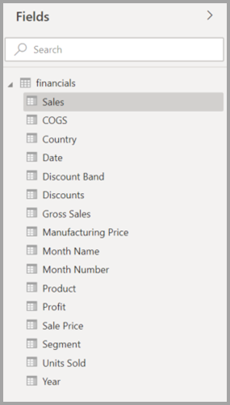
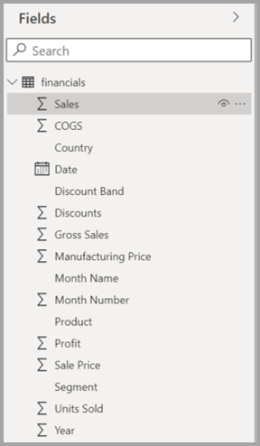
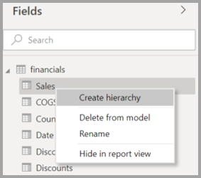
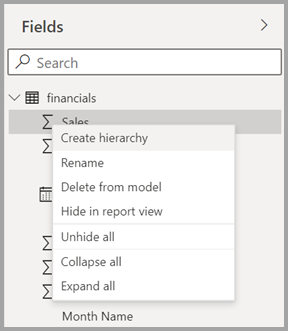
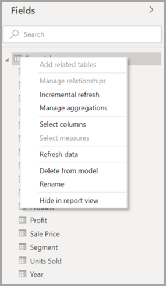
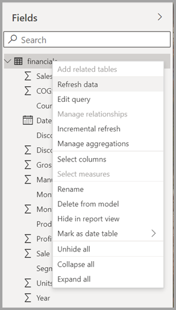
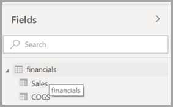
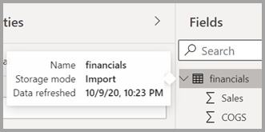

# Using the Field list in Power BI Desktop 

The **Field** lists are being unified across Model view, Data view and Report view in Power BI Desktop. Unifying these views will create consistency for functionality and the user interface (UI) across views, and addresses customer feedback.

Changes you’ll notice across views include the following:

* Iconography
* Search functionality
* Context menu items
* Similar drag-drop behavior
* Tooltips
* Accessibility improvements

The intent is to improve Power BI Desktop usability. The changes should have minimal impact on your typical data workflow.

## Field list changes

The following tables show the field list updates. 

|**Original field list (Model view)**  | **New field list (Model view)**  |
|:---------:|:---------:|
|**Original** |**New** |
|**Icons and UI**       ||
|     |    |
|**Context menu - Field**       ||
|     |    |
|**Context menu - Table**       ||
|     |    |
|**Tooltips**       ||
|     |    |

## Field list icons

There are new Field list icons as well. The following table shows the original icons and their new equivalent, and provides a brief description of each. 

|Original icon  |New icon  |Description  |
|:---------:|:---------:|:---------|
|     |           |Folder in the Fields list         |
|     |         |Numeric field: Numeric fields are aggregates that can be summed or averaged, for example. Aggregates are imported with the data and defined in the data model your report is based on. For more information, see [Aggregates in Power BI reports](../create-reports/service-aggregates.md).         |
|     |         |Calculated column with a non-numeric data type: A new non-numeric column you create with a Data Analysis Expressions (DAX) formula that defines the column’s values. Read more about [calculated columns](desktop-calculated-columns.md).        |
|     |          |Numeric calculated column: A new column you create with a Data Analysis Expressions (DAX) formula that defines the column’s values. Read more about [calculated columns](desktop-calculated-columns.md).         |
|     |          |Measure: A measure has its own hard-coded formula. Report viewers can’t change the calculation, for example, if it’s a sum, it can only be a sum. The values aren't stored in a column. They're calculated on the fly, depending solely on their location in a visual. For more information, read [Understanding measures](desktop-measures.md).         |
|     |         |Measure group.         |
|     |         |KPI: A visual cue that communicates the amount of progress made toward a measurable goal. Read more about [Key Performance Indicator (KPI)](../visuals/power-bi-visualization-kpi.md) visuals.         |
|     |           |Hierarchy of fields: Select the arrow to see the fields that make up the hierarchy. Watch this Power BI video on YouTube about [Creating and working with hierarchies](https://www.youtube.com/watch?v=q8WDUAiTGeU) for more information.         |
|     |         |Geo data: These location fields can be used to create map visualizations.         |
|     |          |Identity field: Fields with this icon are unique fields, set to show all values, even if they have duplicates. For example, your data might have records for two different people named 'Robin Smith', and each will be treated as unique. They won't be summed.         |
|     |          |Parameter: Set parameters to make parts of your reports and data models (such as a query filter, a data source reference, a measure definition, etc.) depend on one or more parameter values. See this Power BI blog post about [query parameters](https://powerbi.microsoft.com/blog/deep-dive-into-query-parameters-and-power-bi-templates/) for more information.         |
|     |         |Calendar date field with a built-in date table.         |
|     |          |Calculated table: A table created with a Data Analysis Expressions (DAX) formula based on data already loaded into the model. These are best used for intermediate calculations and you want to store as part of the model.         |
|     |         |Warning: A calculated field with an error. For example, the syntax of the DAX expression might be incorrect.         |
|     |         |Group: Values in this column are based on grouping values from another column, by using the groups and bins feature. You can read how to [Use grouping and binning](../create-reports/desktop-grouping-and-binning.md).         |
| no original icon    |          |Change detection measure: When you configure a page for automatic page refresh, you can configure a [change detection measure](../create-reports/desktop-grouping-and-binning.md) that is queried to determine if the rest of a page’s visuals should be updated.         |

## Next steps

You might also be interested in the following articles:

* [Create calculated columns in Power BI Desktop](desktop-calculated-columns.md)
* [Use grouping and binning in Power BI Desktop](../create-reports/desktop-grouping-and-binning.md)
* [Use gridlines and snap-to-grid in Power BI Desktop reports](../create-reports/desktop-gridlines-snap-to-grid.md)

