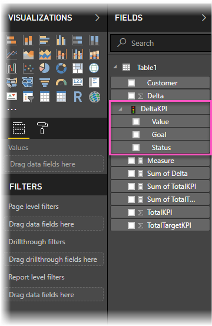
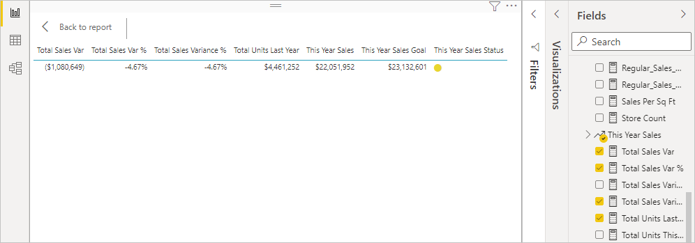

# Import and display KPIs in Power BI
With **Power BI Desktop**, you can import and display KPIs in tables, matrices, and cards.

Follow these steps to import and display KPIs.

1. Start with an Excel workbook that has a Power Pivot model and KPIs.

1. Import the Excel workbook into Power BI, using **File -> Import -> Excel workbook contents**. You can also [learn how to import workbooks](../connect-data/desktop-import-excel-workbooks.md). 

1. After import into Power BI, your KPI will appear in the **Fields** pane, marked with the  icon. To use a KPI in your report, be sure to expand its contents, exposing the **Value**, **Goal**, and **Status** fields.

    
 
1. Imported KPIs are best used in standard visualization types, such as the **Table** type. Power BI also includes the **KPI** visualization type, which should only be used to create new KPIs.
   
    

That's all there is to it. You can use KPIs to highlight trends, progress, or other important indicators.
