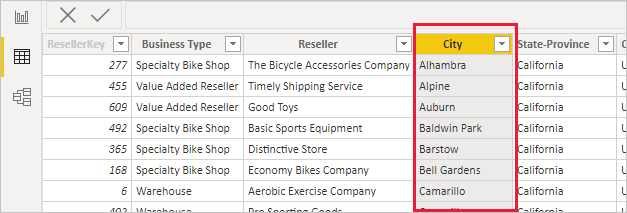
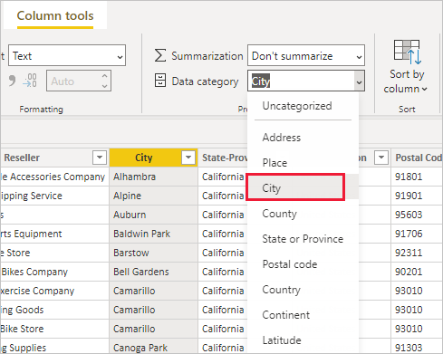
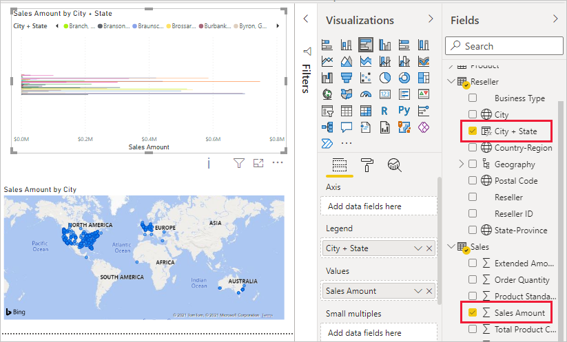
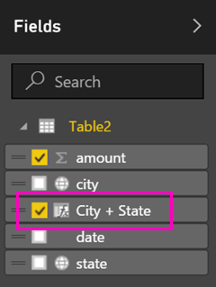
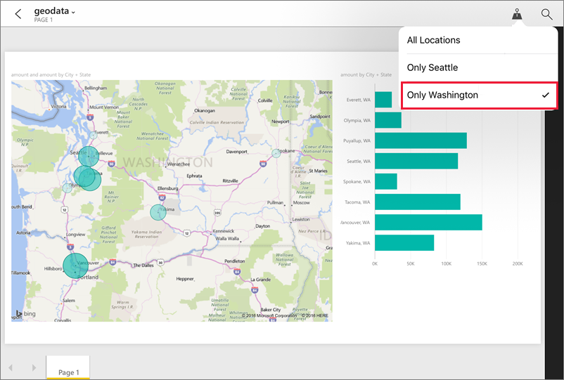

# Set geographic filters in Power BI Desktop for use in the mobile app
In Power BI Desktop, you can [categorize geographical data](desktop-data-categorization.md) for a column, so Power BI Desktop knows how to treat values in visuals in a report. As an added benefit, when you or your colleagues view that report in the Power BI mobile apps, Power BI automatically provides geographical filters that match where you are. 

For example, say you're a sales manager traveling to meet customers, and you'd like to quickly filter the total sales and revenue for the specific customer you're planning to visit. You want to break out the data for your current location, whether by state, city, or an actual address. Later, if you have time left, you'd like to visit other customers located nearby. You can [filter the report by your location to find those customers](../consumer/mobile/mobile-apps-geographic-filtering.md).

> [!NOTE]
> You can only filter by location in the mobile app if the geographic names in the report are in English &#150; for example, "New York City" or "Germany".
> 
> 

## Identify geographic data in your report
1. In Power BI Desktop, switch to Data View .
2. Select a column with geographic data &#151; for example, a City column.
   
    
3. On the **Modeling** tab, select **Data Category**, then the correct category &#151; in this example, **City**.
   
    
4. Continue setting geographic data categories for any other fields in the model. 
   
   > [!NOTE]
   > You can set multiple columns for each data category in a model, but if you do the model can't filter for geography in the Power BI mobile app. To use geographic filtering in the mobile apps, set only one column for each data category &#151; for example, only one **City** column, one **State or Province** column, and one **Country** column. 
   > 
   > 

## Create visuals with your geographic data
1. Switch to Report view , and create visuals that use the geographic fields in your data. 
   
    
   
    In this example, the model also contains a calculated column that brings city and state together in one column. Read about [creating calculated columns in Power BI Desktop](desktop-calculated-columns.md).
   
    
2. Publish the report to the Power BI service.

## View the report in Power BI mobile app
1. Open the report in any of the [Power BI mobile apps](../consumer/mobile/mobile-apps-for-mobile-devices.md).
2. If you're in a geographic location with data in the report, you can filter it automatically to your location.
   
    

Read more about [filtering a report by location in the Power BI mobile apps](../consumer/mobile/mobile-apps-geographic-filtering.md).

## Next steps
* [Data categorization in Power BI Desktop](desktop-data-categorization.md)  
* Questions? [Try asking the Power BI Community](https://community.powerbi.com/)
