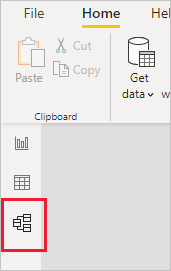
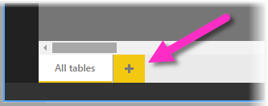
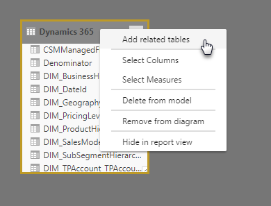
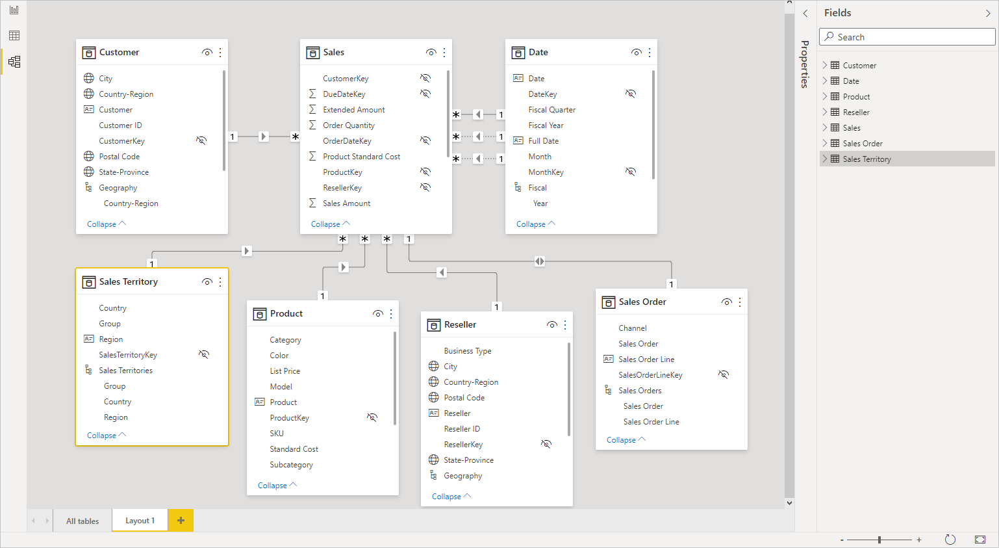
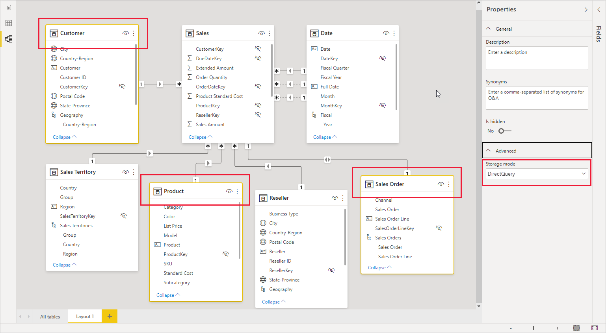

# Work with Modeling view in Power BI Desktop

With **Modeling view** in **Power BI Desktop**, you can view and work with complex datasets that contain many tables.

## Using Modeling view

To access Modeling view, select the Model icon found on the left side of **Power BI Desktop**, as shown in the following image.

## Creating separate diagrams

With Modeling view, you can create diagrams of your model that contain only a subset of the tables in your model. This can help provide a clearer view into the tables you want to work with, and make working with complex datasets easier. To create a new diagram with only a subset of the tables, click the **+** sign next to the **All tables** tab along the bottom of the Power BI Desktop window.

You can then drag a table from the **Fields** list onto the diagram surface. Right click the table, and then select **Add related tables** from the menu that appears.

When you do, tables that are related to the original table are displayed in the new diagram. The following image shows how related tables are displayed after selecting the **Add related tables** menu option.

## Setting common properties

You can select multiple objects at once in Modeling view by holding down the **Ctrl** key and clicking multiple tables. When you select multiple tables they become highlighted in Modeling view. When multiple tables are highlighted, changes applied in the **Properties** pane apply to all selected tables.

For example, you could change the [storage mode](desktop-storage-mode.md) for multiple tables in your diagram view by holding down the **Ctrl** key, selecting tables, then changing the storage mode setting in the **Properties** pane.

## Next steps

The following articles describe more about data models, and also describe DirectQuery in detail.

* [Aggregations in Power BI Desktop (Preview)](desktop-aggregations.md)
* [Composite models in Power BI Desktop](desktop-composite-models.md)
* [Storage Mode in Power BI Desktop (Preview)](desktop-storage-mode.md)
* [Many-to-many relationships in Power BI Desktop](desktop-many-to-many-relationships.md)

DirectQuery articles:

* [Using DirectQuery in Power BI](../connect-data/desktop-directquery-about.md)
* [Data sources supported by DirectQuery in Power BI](../connect-data/power-bi-data-sources.md)
